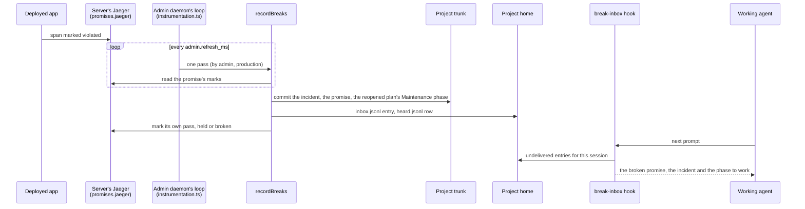

# Incident recording — recording never waits for a person

**Decided 2026-10-08.** Full record: [the ADR in the archive](https://github.com/infinitedusky/indusk/tree/main/.indusk/planning/archive/incident-recording/adr.md).

## What was decided

A promise broken in production becomes a committed incident and reopens the plan that owns it, with nobody running a command.

- **One writer.** `recordBreaks` (`lib/promises/record.ts`) is `watch`'s pass plus what recording unprompted needs: it commits what it wrote, by path, in the repository that holds each file; it holds one lock per project, in the project's home, so two callers at once make one incident; and it marks its own pass, held or broken with the reason, under the promise `a-production-break-is-recorded-unasked`. The admin's loop, catchup's `record_breaks` tool and `indusk promises watch` are its three callers. `watch` by hand therefore commits too. It commits on a trunk branch only, and what it could not commit waits in the project's home for the next pass, which commits it first; until then each pass is marked broken. What the machine keeps for the agent is written before the commit, so a failed commit never leaves the agent untold.
- **The admin records.** The local admin daemon runs the writer for every registered project that names a production source (`promises.jaeger`), on its refresh interval (`admin.refresh_ms`, five seconds by default). A project with only a local source is never recorded unprompted: a local break is work in progress.
- **The admin asks; nothing pushes.** A laptop has no address the server can call, and Jaeger answers questions rather than announcing, so the server's own pass is polling too. A subscription from the server is the upgrade when seconds matter or several machines subscribe.
- **No database.** Jaeger holds what happened; the incident files and Maintenance phases, in the repository, hold what was decided about it; JSON lines in the project's home hold what this machine heard and what it has told the agent.

## How a break reaches the agent

The loop runs inside the admin's Node process, started by Next's `register()` when the daemon starts and ended when `indusk ui stop` ends the process. It runs a pass for a project only when the project names a production source, never overlaps one pass with the next, and logs a pass that throws and keeps going. Projects registered while it runs are picked up within a minute.

## Rejected

- **The server recording by pull request**: it needs a GitHub connection the instance does not have yet; it is workbench-watch-provisioning's, and will reuse the same writer.
- **A separate recorder daemon**: one more process to start and stop, where the admin is already always on.
- **A hook on every tool call, or only at session start**, for telling the agent: noisy, or deaf for a session already running. Once per prompt was chosen.

## Tradeoffs accepted

Recording depends on a running admin, and catchup records whatever it missed. One more hook runs on every prompt. The admin daemon now does work with no page open.
