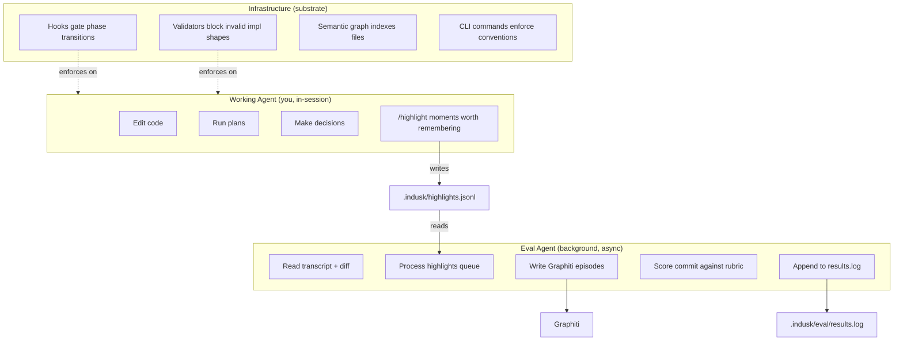
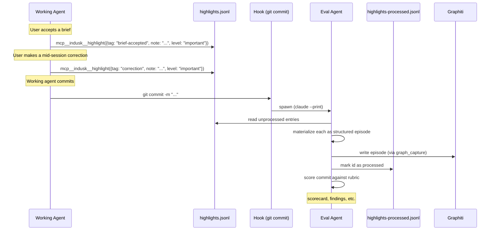

# Agent Roles — How InDusk's Agents Work Together

InDusk runs work across **three tiers**. Each tier has a distinct responsibility, a bounded set of tools, and a different cadence. If you're an agent working in an InDusk project — or you're trying to understand why your agent behaves the way it does — this is the model to internalize.

The single most important thing: **the working agent does not write directly to Graphiti.** Insights flow through a queue. The eval agent is the sole structured Graphiti writer at trigger points. This boundary is what keeps the working agent in flow and the knowledge graph clean.

## The three tiers



| Tier | Role | Writes to | Cadence |
|---|---|---|---|
| **Working agent** | Does the task — code, plans, tests, docs, handoffs. Flags moments worth remembering via `mcp__indusk__highlight`. | Code, plan files, `.indusk/highlights.jsonl` | Real-time, in-flow |
| **Eval agent** | Background judge that fires on every `git commit` and at session end via `/handoff`. Reads unprocessed highlights, writes structured Graphiti episodes with level-weighted edges, scores the commit, writes unresolved findings. | Graphiti episodes (via `graph_capture`), `.indusk/highlights-processed.jsonl`, `.indusk/eval/results.log` | Asynchronous, per-commit + session-end |
| **Infrastructure** | The container, hooks, CLI, validators that enforce invariants. Reindexes the semantic graph, validates impl structure, blocks phase transitions with incomplete gates. | Semantic graph event log, FalkorDB projections, validator error messages | On trigger (git hooks, Claude Code PreToolUse/PostToolUse, `indusk graph sync`) |

## What each tier does (and does NOT do)

### Working agent

**You are the working agent** in a Claude Code session. Your job is to do the task the user asked for — code, plans, tests, docs, decisions, handoffs.

**Do:**
- Edit code, write plans, run tests, follow the planner / work / verify / falsify / retrospective lifecycle
- Call `mcp__indusk__highlight` at trigger points to flag moments worth remembering (brief acceptance, ADR acceptance, mid-session correction, retrospective lesson)
- Call `mcp__graphiti__search_nodes` to **read** Graphiti during catchup or research
- Use the planner / work / verify / falsify / retrospective skills via their slash commands

**Do NOT:**
- Call `mcp__graphiti__add_memory` or `mcp__indusk__graph_capture` directly in process skills. The working agent is not the structured-writer to Graphiti. Use `mcp__indusk__highlight` to flag the moment; the eval agent materializes it.
- Hand-edit `.indusk/highlights-processed.jsonl` or `.indusk/eval/results.log`. Those are eval-agent outputs.

**Why this boundary**: direct Graphiti writes from in-flow code require the working agent to pick a group, phrase the episode as a Y-statement or correction, swallow Graphiti's network failures, and stop what it was doing to do all that. Highlights flip the model: write a one-line note, keep going. The eval agent does the heavier shaping on its own cadence.

### Eval agent

The **eval agent** is a background process spawned by a PostToolUse hook on every `git commit` (and at session end via `/handoff`). It runs as a separate `claude --print` invocation with its own context, fed a structured prompt that includes the working agent's session transcript and the just-committed diff.

**Does:**
- Reads `.indusk/highlights.jsonl`, filters to unprocessed entries, materializes each as a structured Graphiti episode with level-weighted edges
- Marks each highlight as processed in `.indusk/highlights-processed.jsonl`
- Scores the commit against a 4-question rubric, writes a scorecard to `.indusk/eval/results.log`
- Surfaces unresolved findings to the next session (`indusk eval findings` shows the queue)

**Does NOT:**
- Edit code (read-only against the working tree)
- Make plan decisions or write plan documents
- Run as a slash command — it's only spawned by hooks

**You are not the eval agent during normal sessions.** The eval agent has its own session, its own context, its own model invocation. You may encounter its scorecards (`.indusk/eval/results.log`) and findings (`indusk eval findings`) as input to your `/catchup`, but you don't run as it.

### Infrastructure

The **infrastructure** tier is the substrate — the Claude Code hooks, validators, container, CLI commands, and semantic graph runtime. It enforces invariants the working agent and eval agent both depend on.

**Does:**
- Indexes the semantic graph on `indusk graph sync` (file-linkage between code and Graphiti episodes)
- Blocks phase transitions with incomplete gates (`check-gates.js`)
- Refuses impl.md writes that violate trajectory structure (`validate-impl-structure.js`)
- Reminds the working agent when gates exist but haven't been touched (`gate-reminder.js`)
- Spawns the eval agent on `git commit` (`eval-trigger.js`)
- Runs the indusk-infra container (FalkorDB + Graphiti) so the agent surfaces resolve

**Does NOT:**
- Make architectural decisions or score quality
- Author or edit plans

**You are not the infrastructure.** It runs in response to your actions; you don't run as it.

## The highlights → Graphiti pipeline, end-to-end

The boundary's clearest expression: a working-agent observation becomes a Graphiti episode through one specific pipeline.



The pipeline has three guarantees worth knowing:

1. **Idempotency** — duplicate `highlight` writes don't produce duplicate Graphiti episodes. The eval agent reads both `.jsonl` files, computes the unprocessed set by ID-difference, and processes only what's new. `markProcessed` rejects duplicates at write time (1.31.2+).
2. **Resilience** — if Graphiti is down when the eval agent fires, the highlight stays unprocessed and the next eval-agent run picks it up. Working agents never have to handle Graphiti failures.
3. **Cross-session integrity** — `/handoff` triggers the eval agent at session end so highlights written without a subsequent commit still get materialized before the session closes.

## Concrete example — agent walkthrough

A user invokes `/planner accept-brief code-reviewer-agent`. What happens:

1. **Working agent** (you, in-session) reads the brief, decides to accept, and calls:

   ```
   mcp__indusk__highlight({
     tag: "brief-accepted",
     note: "code-reviewer-agent brief accepted on 2026-06-28",
     level: "important"
   })
   ```

2. **Working agent** continues — edits the brief frontmatter to set `status: accepted`, drafts an ADR, runs `/work`.

3. **Working agent** finishes a phase and runs `git commit -m "code-reviewer-agent Phase 1 complete"`.

4. **Infrastructure** (the `eval-trigger.js` hook) sees the commit, checks the trigger regex `/\bgit commit(?=$|\s|;|&|\|)/`, reads the `tool_response.exit_code` (must be 0), then spawns the eval agent as `claude --print` in the background. The working agent's session continues unblocked.

5. **Eval agent** wakes up, runs its own `/catchup`, reads the working agent's session transcript and the just-committed diff. Reads `.indusk/highlights.jsonl`, finds the `brief-accepted` highlight unprocessed, calls `mcp__graphiti__add_memory` to write a structured episode (typed entity, level-weighted edge, project group), and writes the ID to `.indusk/highlights-processed.jsonl`.

6. **Eval agent** scores the commit against the rubric, writes a scorecard to `.indusk/eval/results.log`, and any `no` or `partial` answers become unresolved findings.

7. **Next session's working agent** runs `/catchup`, which calls `mcp__graphiti__search_nodes` and surfaces the brief-accepted episode along with other recent decisions. The working agent now has structured memory of what was accepted last session, written by the eval agent, retrievable across sessions.

The user never sees the boundary. The working agent never had to phrase a Y-statement, pick a group, or check Graphiti's status. The eval agent did the structured-writer work asynchronously.

## Common confusions

**"Should I call `mcp__graphiti__add_memory` from within the planner skill?"**
**No.** That's the working agent crossing into eval-agent territory. Call `mcp__indusk__highlight` instead. The eval agent will materialize it.

**"The eval agent's prompt looks like it has the rubric in it — does it also call `/catchup`?"**
**Yes.** The eval agent's first action is its own `/catchup`. It builds the same context the working agent would — lessons, plans, current.md, Graphiti recall — then scores against that context.

**"What if Graphiti is down when I want to write a highlight?"**
**Doesn't matter.** Highlights write to a local jsonl file, not to Graphiti. The eval agent handles the actual Graphiti write (and retries gracefully if Graphiti is unreachable).

**"What if I want to query Graphiti during a session?"**
**Call `mcp__graphiti__search_nodes` directly.** Reading from Graphiti is a working-agent activity — only structured *writes* are the eval agent's exclusive territory.

**"What if the working agent skips `/highlight` and just calls `mcp__graphiti__add_memory` anyway?"**
**Several things break.** First, the episode lands without the eval agent's typing discipline (the agent-roles plan defines the structured shapes the eval agent uses; ad-hoc writes don't match). Second, the highlight doesn't appear in `.indusk/highlights.jsonl` so other agents can't see what was flagged. Third, you can't `indusk eval review` it later because the cross-agent visibility queue is bypassed. **Use `/highlight`.**

**"When does `/handoff` matter for the pipeline?"**
**At session end.** Highlights written during the session but not followed by a `git commit` would otherwise wait until the next session's first commit. `/handoff`'s Step 4 fires the eval-trigger explicitly so the queue drains before the session closes.

## How the discipline shows up in each skill

The three-tier model is reinforced in the skill content the working agent loads:

- **`catchup`** — reads Graphiti via `mcp__graphiti__search_nodes` (read is allowed). Doesn't write.
- **`planner`** — writes plan documents in `.indusk/planning/`. Calls `mcp__indusk__highlight` at brief/ADR acceptance trigger points.
- **`work`** — writes code and updates trajectory state. Calls `mcp__indusk__highlight` on mid-session corrections (`context learn`).
- **`falsify`** — writes hypotheses into the impl.md as a Falsification Phase. No direct Graphiti writes.
- **`retrospective`** — writes the retrospective document. Calls `mcp__indusk__highlight` on each "What We Learned" and "What We'd Do Differently" item with the `retro-lesson` / `retro-hindsight` tag. Calls `add_lesson` for cross-project applicable insights (writes to `.claude/lessons/`).
- **`handoff`** — writes the operational state via `mcp__indusk__update_current_section`. Fires the eval-trigger explicitly at session end.

If you're authoring a new skill, the rule is: **flag moments worth remembering with `mcp__indusk__highlight`; let the eval agent handle the structured episode**.

## References

- [Highlights — the working agent's write path to Graphiti](/reference/tools/highlights) — definitive doc on the queue
- [Eval system overview](/reference/eval/overview) — the eval agent's pipeline including rubric, findings, OTel
- [Graphiti — temporal knowledge graph](/reference/tools/graphiti) — what gets stored and how to query it
- [Catchup skill](/reference/skills/catchup) — how to read the three tiers at session start
- [Handoff skill](/reference/skills/handoff) — how to drain the queue at session end
- Original architectural decision: archived at [`agent-roles`](https://github.com/infinitedusky/dusk/tree/main/.indusk/planning/archive/agent-roles)
