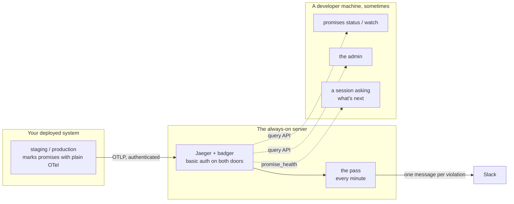

# Always on

The [promise loop](/guide/promises) works on a laptop: a run marks a promise,
`indusk promises status` reads it back from the local telemetry daemon, and
`indusk promises watch` reopens the owning plan when something breaks.

It has one problem. Your laptop is not on at three in the morning, and neither
is the daemon. A promise broken by a deployed system at three in the morning
is broken whether or not anyone is watching — and nothing was.

This is the same loop with the watching part moved somewhere that stays on.

## What runs where



Three things are true of this picture, and they are the design:

**Nothing InDusk runs inside your application.** The mark is plain
OpenTelemetry — two span attributes and an event. Your application already
has an OTel SDK, or it does not have promises. There is no InDusk import, no
agent, no sidecar.

**The server detects and notifies. It never writes back.** It does not open
incidents, does not touch your plans, does not reopen anything. Those are
writes to a git repository, and a server that writes to your planning
documents behind your back is a server you cannot trust. Recording happens on
a developer machine, deliberately, when someone runs `promises watch`.

**The solid arrows happen with nobody watching.** The dotted ones happen when
a person shows up. That split is the whole point: by the time you open your
laptop, the violation is already stored and already announced.

## The server

It is the Jaeger InDusk already ships, run as a long-lived process rather than
a developer-machine daemon — see
[`indusk telemetry serve`](/reference/cli/telemetry-server) for every setting.
Two differences from the daemon, and only two:

- **Badger on a volume** instead of memory, so a restart does not forget.
- **Basic auth on both doors** — the OTLP receiver and the query API. Without
  credentials each answers `401`, and nothing unauthenticated is stored.

Basic auth sends the credential on every request, so anything off localhost
needs TLS in front of it.

### The image

```bash
docker build -f docker/Dockerfile.always-on -t indusk-always-on .
```

It installs the published `@infinitedusky/indusk-mcp` — what runs in your
deployment is what a consumer gets, not an unreleased working tree — and its
entrypoint is `indusk telemetry serve` in the foreground, as process 1. Mount
a volume at whatever `INDUSK_SERVER_VOLUME` names; without one the server
forgets every violation it was told about the moment it restarts.

## Adopting it in an application

**1. Mark the promise.** Wherever the behaviour happens, on the span that does
the work:

```ts
span.setAttribute("indusk.promise", "seat-never-double-booked");
span.setAttribute("indusk.promise.outcome", ok ? "upheld" : "violated");
if (!ok) {
  span.addEvent("indusk.promise.violated", {
    "indusk.promise.symptom": "seat 4 held by two players",
  });
}
```

**2. Point the exporter at the server**, the ordinary way:

```bash
OTEL_EXPORTER_OTLP_ENDPOINT=https://your-server/
OTEL_EXPORTER_OTLP_HEADERS=Authorization=Basic <base64 of user:password>
```

**3. Set `deployment.environment`** on the resource — `staging`,
`production`. One server holds both, and it is the only thing that can tell
them apart. A violation whose span did not carry it reads *environment
unknown* everywhere it appears, which is honest but not useful at three in the
morning.

**4. Name the server in the project that owns the promises**, in
`.indusk/config.json`:

```json
{
  "promises": {
    "domains": ["seating"],
    "jaeger": {
      "url": "https://your-server",
      "credential_env": "SEATS_JAEGER_CREDENTIAL"
    }
  }
}
```

`credential_env` is the **name of an environment variable**, never the
credential — that file is committed. A project that names nothing keeps
reading its local daemon, exactly as before.

## What you see, and when

**In Slack, immediately.** One message per violation, naming the promise, the
symptom, the environment, the service and a link to the trace. Once: the
server records what it has announced on its volume, *after* Slack accepts it,
so a failed post leaves the violation unannounced for the next pass rather
than swallowing it.

**In the admin, live.** The Promises page refreshes itself, so a violation
arriving while the page is open turns its chip red without a reload. A red row
names the environment it came from.

**When you ask what is next.** `/catchup` calls `promise_health`, and an
unrecorded violation outranks the roadmap — you are told about it by name,
first, before any plan. A promise is a commitment the system made and is now
breaking; the next feature can wait a sentence.

**When you record it.** `indusk promises watch --source deployed` opens an
incident carrying the environment and the traces, and reopens the owning plan
with a Maintenance phase. That is the moment the violation becomes work.

## Smoke-testing a deployment

Run this once against a new server, before trusting it. It takes about half an
hour, most of which is waiting on purpose.

**1. Deploy and check both doors refuse.** Every step below sends credentials;
these two must not work without them.

```bash
curl -s -o /dev/null -w '%{http_code}\n' https://your-server/v1/traces -X POST
# 401
curl -s -o /dev/null -w '%{http_code}\n' https://your-server:16687/api/services
# 401
```

**2. Break a promise from outside.** From a machine that is not the server,
run your application (or a throwaway script) with the exporter pointed at it,
marking a real promise violated with `deployment.environment=staging`.

**3. Watch Slack.** Within one pass interval — a minute by default — a message
naming the promise, the symptom, `staging`, the service and a trace link. If
it does not arrive, read the machine's logs: the pass says `could not
announce …` with the reason, and leaves the violation for the next pass.

**4. Restart the machine and query the trace.** This is what the volume is
for.

```bash
fly machine restart <id>
curl -u indusk:<password> https://your-server:16687/api/traces/<traceId>
# the trace is still there
```

**5. Leave it alone for an hour, then send another.** This is the step people
skip, and it is the one that catches a provider quietly stopping an idle
machine. A machine that was asleep runs no pass, so the second violation would
be stored and never announced — and the request that delivers it is what wakes
the machine, *after* the pass would have run. If the second Slack message
arrives, auto-stop is genuinely off.

**6. Read it from a developer machine.** Name the server in a project's
`promises.jaeger`, set the credential variable, and run
`indusk promises status`. It should report the violations you just caused and
name the server it read.

## What this does not do

It does not alert on thresholds, page anyone, or track error rates. It is not
an observability product and it does not want to be. It watches the specific
things a plan promised, and it sends them back to the plan that promised them.
Everything else your existing monitoring already does better.

It also does not decide anything is fine. A server that cannot be reached
reports *health unknown*, naming where it looked, and never reports zero
violations instead — "nothing is broken" and "nobody could look" are different
answers, and only one of them is reassuring.
