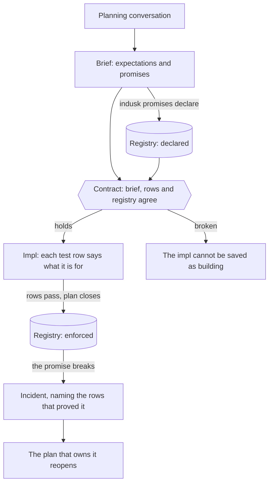

# Briefs

A brief is what a planning conversation produced. You say what you want; the
agent asks, reads the promises already in force, and reads back what it
understood. What you agree on is written down in two parts:

- **Expectations**: why you are doing this, each with how you would know and
  when to look.
- **Promises**: what will be true once it is built, each one sentence, each a
  file in the [registry](/guide/promises).

Everything else that came up on the way (what exists today, what was tried,
what was decided and why) is [research](/guide/plan-lifecycle). How the
promises get kept is the ADR's.



## The shape

```markdown
## Expectations

1. **People seat themselves without calling the desk.**
   - Measure: seats taken per day through the app, against calls logged.
   - Look: two weeks after release.

## Promises

### This plan makes

1. **`seat-released-on-timeout`** (state). A held seat is released when its
   hold runs out.

### Existing promises

**Must not break**

- **`seat-never-double-booked`**. The hold is rewritten.

**Changes**

None.

**Replaces**

None.

### Not promised

- Waiting lists. A later plan.
```

A brief with no expectations says so, with the reason: `None — a bugfix; the
promise holding again is the point`.

Prose between the parts is fine and is not read. What is read is strict: each
label on its own line, each promise named as `` **`name`** `` at the start of
its entry. A line that looks like part of the contract and cannot be read as
one is refused by name. The alternative is a list read as empty and a check
that passes having checked nothing.

A brief written before this shape existed has no `## Promises` heading, and
none of the lists apply to it. A brief written in the new parts without that
heading is out of shape, not exempt. A measure or a time to look left as the
template's `{placeholder}` is refused, like one that is missing.

## Expectations

An expectation is what you think will follow: more people finish signing up, a
broken promise gets fixed sooner, the demo runs without a hand-typed file.
Each one says:

- **Measure**: how you would know.
- **Look**: when to check.

An expectation that does not happen is information, not a defect. It blocks
nothing and reopens nothing. What is required is only that it can be checked:
one with no measure or no time to look is refused before the plan builds.

Most expectations can only be measured in production, so writing them down is
also how a plan decides what telemetry it needs.

## Promises

### This plan makes

Each promise is one plain sentence about what will be true, with a name and a
kind (`behaviour`, `state` or `structure`). The agent writes each to the
registry with `indusk promises declare` when you accept the brief; nobody
types a registry file. One you then drop or rename is taken back with
`indusk promises withdraw`. A promise starts `declared` and becomes `enforced` when the
plan closes with a passing test that names it.

### Existing promises

Before a plan's promises are saved, the agent reads every promise in force and
goes through the related ones with you. Each lands in one of three lists:

| List | Means | What happens to it |
|---|---|---|
| **Must not break** | Still true as written. This plan works near it. | Nothing. Its own tests keep vouching for it. |
| **Changes** | The same commitment, its sentence improved. | It keeps its name, its incidents and the marks in code that name it. This plan takes it over, and its History keeps the old sentence, the reason and the plan that owned it before (`indusk promises change`). |
| **Replaces** | Its name no longer describes it. | A new promise is declared recording which it replaces; the old one is retired when this plan closes (`indusk promises replace`). |

A promise this plan partly invalidates is usually a **change**, not a
replacement: you want the old promise improved, not gone, and its history kept
in one place.

### Not promised

What you chose not to promise, and where it goes instead. It is not read by
any check; it is there so the next person does not assume it was forgotten.

## The contract

A plan's brief, its test rows and the registry have to agree before the plan
builds. `indusk promises contract <plan>` is the one check, and it refuses,
naming the promise, the expectation or the row, when:

- a promise the brief makes is not in the registry, is owned by another plan,
  or reads differently there (its sentence or its kind);
- a promise the brief keeps, changes or replaces does not exist or is already
  retired;
- an expectation has no measure or no time to look;
- a test row names a promise the registry does not hold, a retired promise, or
  a lesson with no file;
- a test row names a promise another plan owns that the brief does not list.
  A plan that tests another plan's promise says so in its brief.

Three things run it:

1. You, with [`indusk promises contract`](/reference/cli/promises#promises-contract).
2. The impl hook, on every write to an impl that sets `test_purpose: required`
   and is past `draft`. So an impl cannot be saved as `approved` or
   `in-progress` while the contract is broken. If the hook cannot run the
   check, it refuses the write and says why: a gate that cannot run is never a
   pass.
3. [`indusk promises check`](/reference/cli/promises#promises-check), for every
   open plan, so the everyday test run includes it.

## What a test row says

Each row of the impl's [Test Trajectory](/guide/test-trajectory) has a `For`
cell: the promise it proves (`promise: <name>`), the lesson it guards
(`lesson: <name>`), or the reason it needs neither. That is the link the rest
depends on. Closing the plan confirms each promise from the rows that name it,
and when a promise breaks later, its incident starts from those rows.
