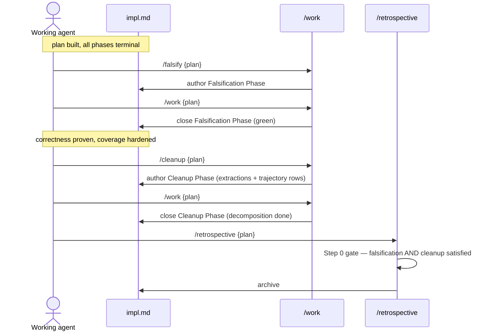

# Cleanup Ritual

The Cleanup Ritual runs between `/falsify` and `/retrospective`. Its job: take the code a plan produced — now correct and coverage-hardened — and make it **well-shaped**. It flips the agent's goal from "does this work?" to "what cohesive unit here should be lifted into its own file, and what do best practices say to do about it?" — then authors a Cleanup Phase capturing the decomposition, which `/work` later executes.

Invoke via `/cleanup {plan-name}`. The ritual is required before `/retrospective`.

It is the structural twin of the [Falsification Ritual](/guide/falsification-ritual). Where `/falsify` hunts failures that shouldn't be producible if success is real, `/cleanup` hunts accretion that no delta-scoped checkpoint ever sees. Same agent, same phase-authoring shape, same retrospective gate — inverse purpose.

## Which check answers which question

Three checks review a plan's code, and each is placed where its question becomes answerable — the phase's delta, or the finished whole.

| Check | When | Question | Needs |
|---|---|---|---|
| [Shape](/guide/shape) | Every phase, during `/work` | Is this unit well-formed *as written*? | The code that phase just wrote |
| [Falsification](/guide/falsification-ritual) | Once, before cleanup | What failure should be producible if this is not really done? | The whole system |
| **Cleanup** (this page) | Once, after falsification | What should the finished output decompose into? | The whole plan's output |

**Cleanup's scope is inter-file.** Intra-unit craft — an inline block that wanted a name, a function doing two jobs, a unit with no testable seam — was already reviewed by Shape in the phase that wrote it. Spend your attention here on what only the finished whole reveals: duplication across files, the rule of three, settled module boundaries.

The division is operational, not taste. A phase-scoped review structurally *cannot* catch cross-file duplication, because the second copy usually does not exist until a later phase writes it. And Shape leaves no marker that shrinks cleanup's input — the changed-file scan still returns every file Shape reviewed, deliberately, so that "Shape looked at it" never comes to mean nobody looks again.

## Why this exists

Every existing quality layer inspects something *local*. Tests inspect behavior. Gates inspect process (docs, context, verification). The eval agent inspects the per-commit delta. **None of them inspect the accumulated shape of the code a plan produced.**

File bloat is an accretion failure. Each edit adds a locally-reasonable 40 lines; every checkpoint sees a locally-reasonable diff; nobody ever sees the 1,400-line result. The delta is always fine. The whole is a monolith.

Numero lived this exactly. In a project that *had* a documented ≤200-LOC convention, `page.tsx` reached **1,439 LOC** and `BratPokerTable.tsx` reached **1,135 LOC** with zero decomposed components. The convention was advisory, and advisory conventions demonstrably do not hold — the same lesson this project keeps relearning: rituals that author reviewable, enforced artifacts hold; nudges do not.

`/cleanup` operationalizes decomposition as a structural step every plan runs before archival, exactly as `/falsify` did for adversarial testing.

## The principle

This is **best-practice-guided decomposition, not blanket extraction.** The distinction is load-bearing.

Extraction is not universally good. Forcing it produces 8-line "components," prop-drilling, and the wrong abstraction — which, per Sandi Metz, costs more than the duplication it removes. A ritual that mechanically shrinks files would optimize for the wrong thing.

So `/cleanup` recommends only what best practices actually warrant. And **"leave as-is" is a first-class outcome** — when a file is cohesive, the touch was tiny, or extracting would scatter tightly-coupled logic, the ritual records that decision *with its reasoning* as a checklist item, not a silent skip. A recorded "left it, here's why" is reviewable and eval-scored; a manufactured extraction is a liability.

**There is no LOC gate anywhere.** The line threshold (the `cleanup` config block in `.indusk/config.json`) is *attention-focus* — it tells the ritual which changed files to scrutinize, nothing more. A flagged file means "look here," not "this fails." A genuine in-place refactor that simplifies 80 lines to 20 with no new file is a perfectly valid recommendation, because there is no number to satisfy.

## Same agent, flipped goal

`/cleanup` runs with the **same working agent** that built the plan. No persona switch, no separate model, no adversarial identity. What changes is the goal: from "make this work" to "make this well-shaped."

The same brain, asked a different question, looks at different things. Under "prove success" the agent's attention is on correctness; under "how do I decompose this well?" it surfaces cohesion boundaries, repeated markup, and tangled responsibilities it skipped while building. Goal-flipping is the mechanism — the identical one that powers falsification.

## Runs after falsification

The close-out sequence is deliberate:

<FullscreenDiagram>



</FullscreenDiagram>

Cleanup comes **after** falsification because you refactor under the maximal green coverage falsification just hardened. Restructuring code whose correctness hasn't been proven risks moving a bug behind a new boundary; restructuring under freshly-authored regression tests is safe. Never invert the order.

## The ritual

The ritual **authors** work — it does not refactor. Performing the decomposition is `/work`'s job after the ritual appends a phase. This separation makes cleanup *visible* (phases render in the admin UI; sidecar logs don't), *deferrable* (capture recommendations now, execute later without inline refactor under time pressure), and *traceable* (the plan's phase sequence tells the full story: work → falsify → fix → cleanup → close).

1. **Find the changed files that deserve scrutiny.** Call `listOversizedChangedFiles(planRoot, baseRef)` from `@infinitedusky/indusk-mcp/cleanup/oversized`. It diffs the plan's branch against its merge-base and returns changed files over their resolved cap as `{ path, loc, cap, scope, isNew }`. Caps come from the `cleanup` config block (`max_file_loc` default 400 + per-scope overrides). Flagged means "look here," not "this fails." **Workbench caveat:** run it against the git repo/worktree where the code lives — a workbench root (where `.indusk/` lives) is not a git repo, and the lib throws there rather than silently reporting nothing.
2. **Apply the enabled domain extensions' best practices.** What counts as a cohesive unit is domain-specific and comes from the extensions the project has on — not from this skill. On `nextjs`: "minimize `use client` boundaries, push them as deep as possible" — the concrete move is often pulling an interactive island out of a big server component into its own file. On `react`: "one component per file for non-trivial components." On a library or CLI with neither extension, the move degrades to "extract a function or module."
3. **Form specific recommendations.** For each flagged file (and any duplication surfaced via `find_code`), name the exact unit to extract and the best-practice basis — or conclude, with reasoning, that the file is cohesive and should be left as-is.
4. **Author the phase, or skip.** Append a `### Phase N: Cleanup — {summary}` to the plan's `impl.md`, one checklist item per extraction/refactor (or reasoned leave-as-is), with a Test Trajectory row per newly-extracted public unit and the standard Verification / Context / Document gates. If nothing warrants action, set `cleanup: skipped` + `cleanup_reason` in the frontmatter instead.
5. **Terminate (hybrid exit).** Continue until you genuinely cannot name another warranted extraction — every remaining changed file is under threshold or cohesive-and-correctly-shaped. Present the user a summary: files flagged + recommended, files reviewed-and-left-as-is (with reasons), files under threshold. The user confirms termination or points at a file you under-scrutinized.

When the ritual ends, `impl.md` contains a new Cleanup Phase — unchecked, with trajectory rows in `planned` state. The plan's impl status stays `in-progress`. The next `/work {plan}` picks up the phase normally: authors the writable-at-phase tests, does the decomposition, closes the phase.

## What you do not do in the ritual

- **You do not perform the refactor.** The ritual's output is the modified `impl.md`. `/work` does the decomposition when it picks up the phase.
- **You do not run tests.** No test execution happens in the ritual.
- **You do not extract to hit a number.** There is no LOC gate; the threshold is attention-focus. Recommend what best practices warrant and leave the rest, with reasons.
- **You do not manufacture an empty Cleanup Phase.** If there is genuinely nothing to decompose, take the skip path — do not author a phase with no items.

## The Cleanup Phase

The authored phase is the reviewable artifact. A human reads `### Phase N: Cleanup` in the admin UI and can accept, edit, or reject the recommendations before `/work` runs them. Its shape mirrors any other phase:

```markdown
### Phase N: Cleanup — split the poker table into per-seat components

**Goal**: decompose BratPokerTable.tsx per react's one-component-per-file
and nextjs's push-client-boundaries-deep. Each item is a concrete
extraction (or a reasoned leave-as-is); each new unit gets a trajectory row.

- [ ] Extract the Seat markup (lines 210–360) into components/table/Seat.tsx — react one-component-per-file; repeated 9×
- [ ] Pull the "use client" betting island out of page.tsx into BettingPanel.tsx — nextjs push-boundaries-deep
- [ ] (reviewed useTableState.ts — left as-is: 180 lines of one cohesive hook; splitting would scatter coupled state)

#### Phase N Verification
- [ ] T31: Seat renders identical markup for a given seat prop (behavior-parity)

#### Phase N Context
- [ ] CLAUDE.md note on the new components/table/ structure

#### Phase N Document
- [ ] (none — internal decomposition) with proof
```

The phase title **must start with "Cleanup"** (`### Phase N: Cleanup — {summary}`) — the retrospective gate's `isCleanupComplete` detects the ritual phase by a title *beginning* with "cleanup" (case-insensitive), not a substring anywhere. A substring match would misdetect a topic-named phase like "The /cleanup skill" as the ritual phase — found and fixed by this plan's own falsification. The phase must also contain at least one checklist item; a bare heading is not terminal.

## When to skip

If after investigation there is genuinely nothing worth decomposing — every changed file under threshold or cohesive — do not author an empty phase. Add both fields to the impl frontmatter:

```yaml
cleanup: skipped
cleanup_reason: "reviewed changed files X, Y, Z; all under threshold or cohesive; nothing warrants extraction"
```

This is a confession, not a bypass. It is visible in the retrospective audit and records what you reviewed. Use it when there is truly nothing to do, or for trivial plans (typo, changelog) where the ritual cost exceeds the value. If you find yourself skipping frequently, the discipline is slipping.

## The retrospective gate

The retrospective skill's **Step 0** — renamed the *Ritual Gate — Falsification + Cleanup* — refuses to proceed unless **both** rituals are satisfied. For cleanup specifically, one of these must be true:

- **A terminal Cleanup Phase exists** — `isCleanupComplete(planRoot)` is true. `/cleanup` authored the phase and `/work` closed it.
- **The skip is set** — `isCleanupSkipped(implContent)` is true (`cleanup: skipped` + a non-empty `cleanup_reason`).

The two conditions are composed with the falsification requirement by `checkRetrospectiveReadiness(planRoot, implContent)` in `apps/indusk-mcp/src/lib/cleanup/gate.js` — the plan archives only when falsification AND cleanup are each satisfied. Without one, `/retrospective` surfaces a refusal pointing you at `/cleanup`.

This is skill-level enforcement, not a PreToolUse hook — the same residual risk falsification carries. A determined agent can write a lazy `cleanup: skipped`. The mitigations are the same: the skip is a visible confession in the retrospective audit, and the eval agent scores the authored phase's quality, so a rubber-stamp "everything's fine" surfaces as a finding rather than passing silently.

## See also

- [Falsification Ritual guide](/guide/falsification-ritual) — the twin ritual this one mirrors, running immediately before it
- [Cleanup Ritual decision](/decisions/cleanup-ritual) — the full ADR: Y-statement, rejected alternatives, consequences
- [Test Trajectory guide](/guide/test-trajectory) — where new-unit trajectory rows land
- [Work skill reference](/reference/skills/work) — how `/work` executes the authored Cleanup Phase
- `.indusk/planning/cleanup-ritual/adr.md` in the repo — the authoritative design record
