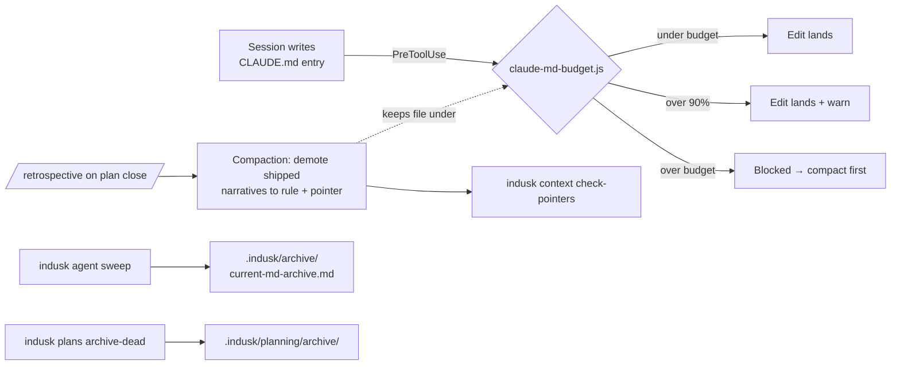

# The Context Budget

Every Claude Code session on an InDusk project starts by ingesting CLAUDE.md — and pays for it again on every turn as cached context. Fixed context size is the multiplier on **all** session cost: a 480 KB CLAUDE.md consumes roughly half a 200k-token window before any work happens, forces earlier compactions, and burns quota proportionally.

The context budget is InDusk's answer, shipped by the [indusk-makeover decision](/decisions/indusk-makeover): a hard size budget on CLAUDE.md, enforced at write time, paired with decay rituals that keep the file inside it.

## Why enforcement, not discipline

Discipline was tried first. The `context-budget` plan shipped a skill-level convention ("retrospectives emit one-line Current State entries") — and the file regrew to ~120 KB anyway. Append-only growth is the natural failure mode of a living memory document: every entry is individually justified, and nothing ever owns deletion. A write-time gate changes the default: growth past the budget requires a deliberate act instead of happening one paragraph at a time.

## The budget hook

`claude-md-budget.js` is a PreToolUse hook (installed by `indusk init` / `indusk update` alongside the gate-enforcement hooks) that intercepts every Edit/Write targeting a file named `CLAUDE.md`:

- **Over budget** → the edit is **blocked**, with a message naming the compaction ritual as the way to make room.
- **Over 90% of budget** → the edit lands, with a **warning** to compact soon.

The budget lives in `.indusk/config.json`:

```json
{
  "context": {
    "claude_md_budget_bytes": 61440
  }
}
```

Default is 60 KB. Raising it is legitimate — but it's a recorded config edit, not a silent accretion.

## The entry shape: rule + pointer

The budget works because compressed entries keep their **operative rule** and delegate their **body** to a pointer — the same titles-hot/bodies-cold pattern the lessons registry uses:

```markdown
- **Never use String.includes for shell-trigger detection** — anchored regex
  with boundary + lookahead. — see /lessons/git-or-jj-substrate
```

The rule sentence is what a working session needs in context; the narrative (how it was discovered, what it cost, the alternatives) lives in the docs site or the archived plan, one pointer away.

A dead pointer under this regime is a **lost rule body** — so pointer integrity is a first-class check:

```bash
indusk context check-pointers   # exit 1 + list of dead pointers
```

## The decay loop

The budget hook stops growth; the decay rituals produce shrinkage. Together they form a loop that runs as part of the normal plan lifecycle:



- **Compaction** (retrospective step + periodic pass): shipped plans' Current State narratives become one line + pointer; Conventions entries compress to 1–3 lines.
- **[`indusk agent sweep`](/reference/cli/agent#agent-sweep)**: session sections in `.indusk/current.md` older than 7 days move to an archive file.
- **[`indusk plans archive-dead`](/reference/cli/plans)**: all-draft plans untouched for 30 days move to `planning/archive/`.

Everything decays by **archiving, never deleting** — recovery is always a file away.

## Measured results (dusk, 2026-07-23)

| Metric | Before | After |
|--------|--------|-------|
| CLAUDE.md on disk | 144,127 B (~35k tokens) | 22,663 B (~5.5k tokens) |
| `/catchup` tool-result cost | ~55k tokens | ~8.2k tokens |
| Dead pointers in CLAUDE.md | 38 | 0 |
| Dead-draft plans outside archive | 7 | 0 |

A 15-entry random sample of pre-compression entries verified every operative rule survived compression (one drop was caught and restored by the sample gate itself).

## Running compaction on an over-budget file

The budget hook blocks growth but cannot retroactively shrink a file that was already over budget when the hook was installed (the common case on projects that adopted the makeover late, or on a CLAUDE.md copied from an older workbench). For that, run **`/compact-context`** — the on-demand bulk companion to the retrospective's incremental step. It reports first (what it would demote, where each pointer targets), and on `--apply` lands the file under budget in one pass with every pointer resolving. The retrospective step keeps the file from re-accruing; `/compact-context` pays down debt that already exists.
