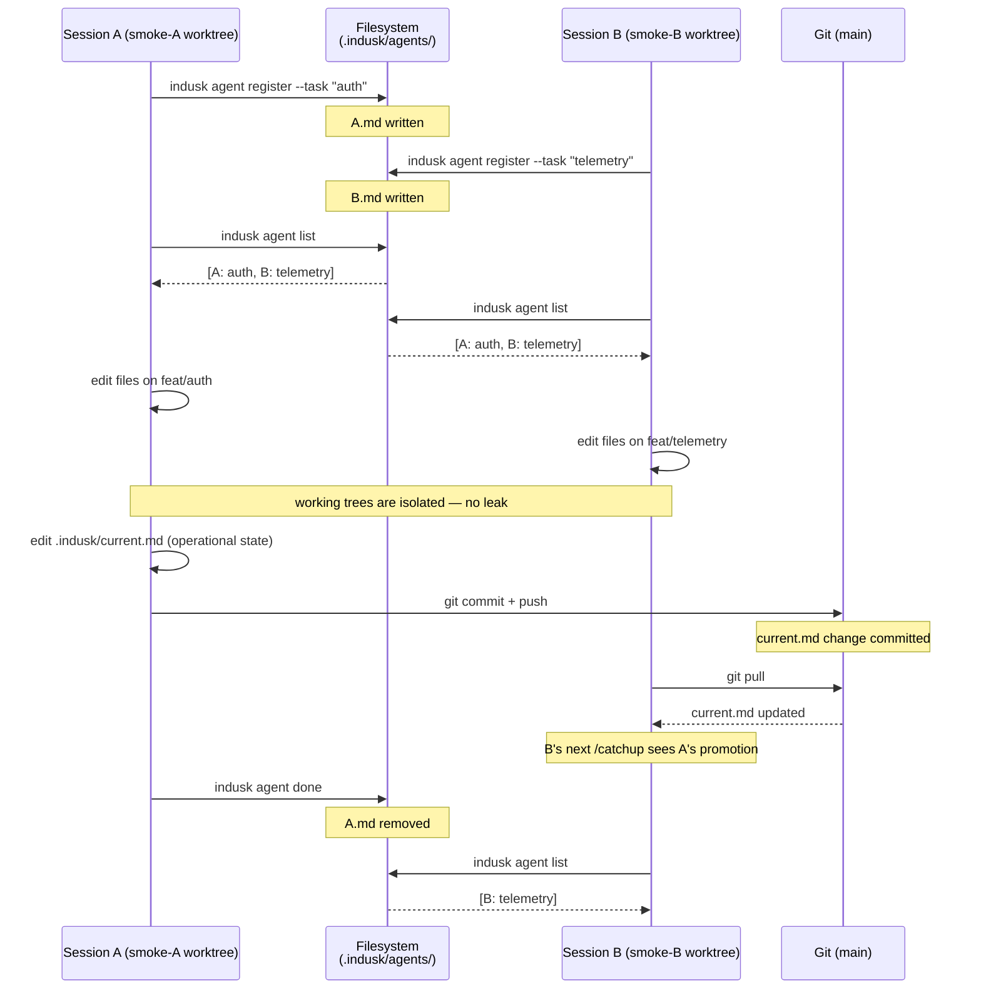
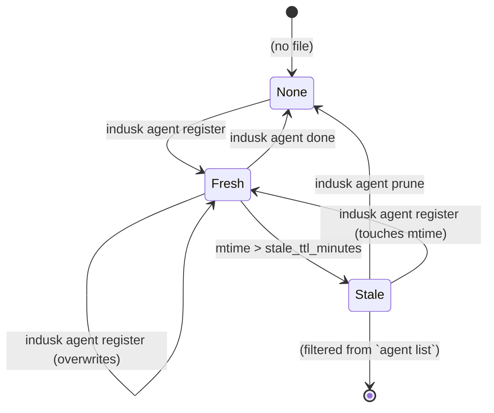

# Multi-Agent Coordination

InDusk supports running two or more Claude Code sessions on the same project at the same time. This guide describes the convention and the surfaces you use.

For the architectural rationale (what was rejected and why), see the [ADR](/decisions/multi-agent-coordination).

## The shape

Three primitives compose to make concurrent agents safe:

1. **Worktrees per agent** — each Claude Code session works in its own `git worktree`, on its own branch, at its own filesystem path. The worktree extension is the substrate. Two agents can't physically collide on file edits because they're in different filesystems.
2. **`.indusk/current.md`** — the durable shared operational state for the project. Edited freely by working agents during sessions, committed like any other file. Other agents only see committed state.
3. **`.indusk/agents/<sessionId>.md`** — a per-session presence file. Written by `indusk agent register`, removed by `indusk agent done`. Other agents glob the directory via `indusk agent list` to see who's around.

`/catchup` is pure-read for everything other than the agent's own presence file. `/handoff` is deprecated — the old singleton file is gone.

## Operational vs architectural state

| | `.indusk/current.md` | `CLAUDE.md` |
|---|---------------------|-------------|
| Answers | "What is happening NOW?" | "What is this project?" |
| Cadence | Edited continuously during sessions | Edited on real triggers (post-retrospective, post-ADR, corrections) |
| Sections | In Flight / Open Questions / Cursor | Architecture / Conventions / Key Decisions / Known Gotchas / Current State |
| Authored by | Working agent during work | Working agent via the `context` skill |
| Distillation | `/retrospective` folds it into CLAUDE.md on plan close | (terminal) |

If you find yourself promoting something to CLAUDE.md mid-session, that's a signal it might belong in `current.md` first — let `/retrospective` decide whether it's architectural enough for the durable layer.

## Day-in-the-life flows

### Starting a new session

```bash
/catchup
```

Catchup will:

1. Register your presence via `indusk agent register --task "<one-line description>"`. The task is free-text; if you don't know yet what the session is about, the agent picks a placeholder and re-registers once the conversation makes it clear.
2. Show you who else is currently working on the project (output of `indusk agent list`).
3. Read `.indusk/current.md` for operational state.
4. Pull lessons, infrastructure health, CLAUDE.md, Graphiti recall, active plans, and installed skills.
5. Summarize.

You can run `/catchup` at the same time as another agent on the same project — neither will block or corrupt the other.

### Working alongside other agents

Look at the `indusk agent list` output in your catchup summary. If you see another agent working on the auth module and you were about to refactor auth too, surface that to the user before proceeding. The bulletin is just visibility — it doesn't enforce coordination; that's the working agent's job.

For genuinely independent work (different subdirectories, different plans), just keep going. The worktree extension ensures your mid-session file edits don't bleed into the other agent's working tree.

### Promoting state mid-session

When something solidifies that the next agent (or future-you) will want, edit `.indusk/current.md`:

- **`## In Flight`** — what's actively being worked on. "handoff-multi-agent Phase 4 — wiring init/update". "investigating slow Graphiti queries (no plan yet)".
- **`## Open Questions`** — hypotheses to confirm, design decisions mid-conversation, things to think about before continuing.
- **`## Cursor`** — exactly where you stopped, in enough detail that re-entering doesn't require rediscovery. File paths + line numbers + the next concrete step.

Then commit normally. The change is visible to other agents on the next pull (or to a future session of yourself on the next `/catchup`).

### Ending a session

```bash
indusk agent done
node .claude/hooks/eval-trigger.js --source handoff
```

That's the whole ritual. No file to write, no shared state machine to advance.

`indusk agent done` removes your presence file so other agents stop seeing you within seconds. The eval trigger flushes any unprocessed highlights so the eval agent picks them up before the session closes.

If you have operational state worth carrying forward, edit `.indusk/current.md` first and commit before running `indusk agent done`. That's it.

## Configuration

`.indusk/config.json` carries one field for this system:

```json
{
  "agents": {
    "stale_ttl_minutes": 60
  }
}
```

A presence file with mtime older than `stale_ttl_minutes` is filtered from `indusk agent list` output. Default 60 minutes; increase if your sessions routinely run longer; decrease if you want crashed agents to disappear from the bulletin sooner. `indusk agent prune` removes stale files unconditionally.

## Where the bulletin lives

`indusk agent register` writes to `<inDuskRoot>/.indusk/agents/<sessionId>.md`, where `inDuskRoot` is the nearest ancestor directory containing `.indusk/config.json`. In single-repo projects that's the project root. In workbench-shaped projects (worktree extension enabled), that's the workbench root — the same `.indusk/agents/` directory is naturally shared across every worktree, which is what makes the bulletin visible across concurrent agents on different branches.

## What's out of scope (v1)

- **Cross-machine coordination.** If you have Claude Code on a laptop and a desktop both working on the same project, `current.md` syncs via the normal git push/pull cadence, but presence bulletins are local-only. A future plan may add a tiny push-on-register hook.
- **Inter-agent messaging.** The bulletin is read-only signal. Agents see each other but don't talk to each other. If coordination beyond visibility is needed, that's a separate plan.
- **Auto-coordination.** The system tells agents what other agents are doing; it does not prevent two agents from editing the same file. That's the working agent's job to notice and route around.

## Diagrams

### Two concurrent agents — full lifecycle



### Presence-file state machine



`Fresh` is the only state where `indusk agent list` reports the agent. `Stale` files still exist on disk but are filtered from output until either (a) the agent re-registers and refreshes the mtime, or (b) someone runs `indusk agent prune`.

## See also

- [Multi-Agent Coordination ADR](/decisions/multi-agent-coordination) — the architectural rationale and rejected alternatives
- [`indusk agent` CLI reference](/reference/cli/agent) — the four subcommands
- [Catchup skill reference](/reference/skills/catchup) — the pure-read invariant
- [Handoff skill reference](/reference/skills/handoff) — the deprecation page
