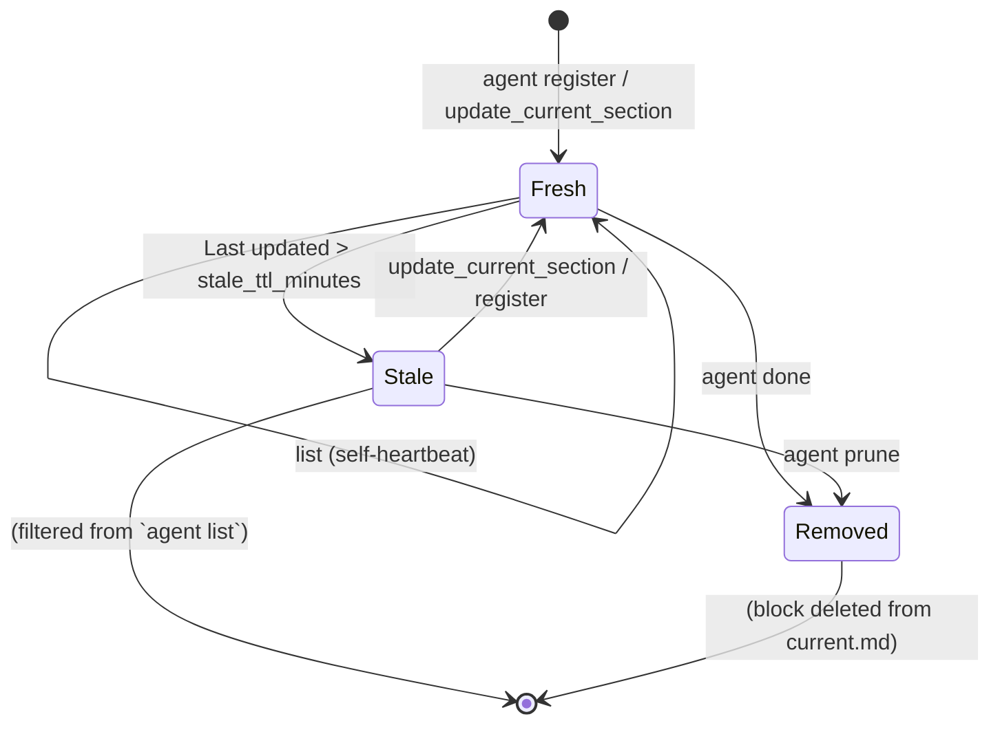

# Multi-Agent Coordination

InDusk supports running two or more Claude Code sessions on the same project at the same time. This guide describes the convention and the surfaces you use.

For the architectural rationale (what was rejected and why), see the [ADR](/decisions/multi-agent-coordination).

## The shape

Three primitives compose to make concurrent agents safe:

1. **Worktrees per agent** — each Claude Code session works in its own `git worktree`, on its own branch, at its own filesystem path. Two agents can't physically collide on file edits because they're in different filesystems.
2. **`.indusk/current.md` with per-agent sections** — a single durable file representing the operational state for the whole project. The file has a `## Project (shared)` anchor section (any agent edits) and one `## Session <short> — <task>` block per active session. Each session owns its own block; nobody else's writes touch it.
3. **The `mcp__indusk__update_current_section` MCP tool** — the explicit write surface for the agent's own section. Atomic read-modify-write of `.indusk/current.md`.

`/catchup` is pure-read for shared content. `/handoff` is a four-step session-end ritual that calls the MCP tool.

## File shape

`.indusk/current.md` carries:

```markdown
# Operational State

{preamble explaining the file}

## Project (shared)

{cross-cutting state any agent can edit}

---

## Session 2c87e7b6 — auth refactor

**Session ID**: 2c87e7b6-702a-4dcd-876f-a31820e0df3e
**Last updated**: 2026-06-26T14:30:00Z

### In Flight
working on middleware refactor

### Open Questions
jwt vs session cookies?

### Cursor
apps/backend/src/auth/middleware.ts:42

---

## Session f0a99b21 — telemetry spike

...
```

Sections are matched by **full session ID** (the `**Session ID**:` line). The short 8-character prefix in the heading is for human readability; collisions on the prefix are tolerated because the full ID disambiguates.

## Operational vs architectural state

| | `.indusk/current.md` | `CLAUDE.md` |
|---|---------------------|-------------|
| Answers | "What is happening NOW?" | "What is this project?" |
| Cadence | Sections updated at `/handoff` or any moment something solidifies | Edited on real triggers (post-retrospective, post-ADR, corrections) |
| Sections | Project (shared) + per-agent Session blocks (In Flight / Open Questions / Cursor inside each) | Architecture / Conventions / Key Decisions / Known Gotchas / Current State |
| Write surface | `mcp__indusk__update_current_section` (per-agent section) + direct edit (Project shared) | `context` skill triggers |
| Distillation | `/retrospective` folds session state into CLAUDE.md's Key Decisions / Current State | (terminal) |

## Day-in-the-life flows

### Starting a new session

```bash
/catchup
```

Catchup will:

1. Register your presence via `indusk agent register --task "<description>"`. A section block lands in `.indusk/current.md` for your session (empty body initially).
2. Read the bulletin via `indusk agent list`. Surfaces other agents currently working on the project (their sessions in `current.md`). Also self-heartbeats your own section's `Last updated`.
3. Read `.indusk/current.md` — both the `## Project (shared)` anchor and per-agent sections from other working agents.
4. Pull lessons, infrastructure health, CLAUDE.md, Graphiti recall, active plans, installed skills.
5. Summarize.

You can run `/catchup` at the same time as another agent on the same project — neither will block or corrupt the other.

### Working alongside other agents

Look at the `indusk agent list` output and the per-agent sections in `current.md` in your catchup summary. If you see another agent working on the auth module and you were about to refactor auth too, surface that to the user before proceeding. The bulletin is visibility; the working agent owns the "avoid stepping on each other" judgment.

For genuinely independent work (different subdirectories, different plans), just keep going. The worktree extension ensures your mid-session file edits don't bleed into the other agent's working tree.

### Promoting state mid-session — `/handoff`

When you reach a moment where the next session (or a hypothetical next agent) would want context — phase boundary, end of session, blocker hit — call `/handoff`. The skill walks you through the four-step ritual:

1. Call `mcp__indusk__update_current_section` with the three section bodies:
   - **`in_flight`** — what's actively in progress
   - **`open_questions`** — hypotheses to confirm, design decisions mid-conversation
   - **`cursor`** — where you stopped (file paths + line numbers + next concrete step)

   Atomic read-modify-write. Only your section changes; other agents' sections are byte-untouched.

2. Commit the change. Other agents only see committed state — your uncommitted edit is invisible to them.

3. (Optional) `indusk agent done` — removes your section from `current.md`. Otherwise the section ages out via `Last updated` TTL.

4. Fire the eval trigger so the eval agent processes any unprocessed highlights:
   ```bash
   node .claude/hooks/eval-trigger.js --source handoff
   ```

If your session produced nothing worth promoting (shipped a feature and closed a plan), skip step 1 entirely. The MCP tool is for state that *should* survive.

### Editing Project (shared)

The `## Project (shared)` anchor section is editable by any agent. Use it for cross-cutting state that's project-wide and short-lived ("merge freeze through Thursday", "telemetry endpoint changed last week"). Don't bundle these edits into your handoff write — they're not your session's state.

## Configuration

`.indusk/config.json` carries one field for this system:

```json
{
  "agents": {
    "stale_ttl_minutes": 60
  }
}
```

A section with `Last updated` older than `stale_ttl_minutes` is filtered from `indusk agent list` output. Default 60 minutes. **Active sessions stay visible without manual TTL tuning** — `indusk agent list` is also an implicit heartbeat for the caller (refreshes the calling session's own section's `Last updated`). Only sessions that go truly idle (no `agent` CLI activity for > TTL) age out. `indusk agent prune` removes stale sections from the file unconditionally.

## Where current.md lives

`indusk agent register` writes to `<inDuskRoot>/.indusk/current.md`, where `inDuskRoot` is the nearest ancestor directory containing `.indusk/config.json`. In single-repo projects that's the project root. In workbench-shaped projects (worktree extension enabled), that's the workbench root — the same `current.md` is naturally shared across every worktree, which is what makes the bulletin visible across concurrent agents on different branches.

## What's out of scope (v1)

- **Cross-machine coordination.** If you have Claude Code on a laptop and a desktop both working on the same project, `current.md` syncs via the normal git push/pull cadence, but presence bulletins are local-only.
- **Inter-agent messaging.** The bulletin is read-only signal. Agents see each other but don't talk to each other.
- **Auto-coordination.** The system tells agents what other agents are doing; it does not prevent two agents from editing the same file. That's the working agent's job to notice and route around.
- **Auto-trigger discipline.** Nothing forces the agent to call `mcp__indusk__update_current_section` at the right moments. The `/handoff` skill prompts it on session end; mid-session updates are agent judgment.

## Diagrams

### Two concurrent agents — full lifecycle

```mermaid
sequenceDiagram
    participant A as Session A (smoke-A worktree)
    participant FS as .indusk/current.md
    participant B as Session B (smoke-B worktree)
    participant G as Git (main)

    A->>FS: indusk agent register --task "auth"
    Note over FS: Session A block created
    B->>FS: indusk agent register --task "telemetry"
    Note over FS: Session B block created

    A->>FS: indusk agent list
    FS-->>A: [A: auth, B: telemetry]
    Note over A,FS: A's section's Last updated refreshed (self-heartbeat)
    B->>FS: indusk agent list
    FS-->>B: [A: auth, B: telemetry]

    A->>A: edit files on feat/auth
    B->>B: edit files on feat/telemetry
    Note over A,B: working trees are isolated — no leak

    A->>FS: mcp__indusk__update_current_section { sessionId: A, sections: {...} }
    Note over FS: only Session A block changes; B's untouched
    A->>G: git commit + push
    Note over G: current.md change committed

    B->>G: git pull
    G-->>B: current.md updated
    Note over B: B's next /catchup sees A's promoted state

    A->>FS: indusk agent done
    Note over FS: Session A block removed
    B->>FS: indusk agent list
    FS-->>B: [B: telemetry]
```

### Per-section staleness



Only `Fresh` sections show up in `indusk agent list`. `Stale` sections still exist in the file until prune removes them or the session re-registers.

## See also

- [Multi-Agent Coordination ADR](/decisions/multi-agent-coordination) — architectural rationale and rejected alternatives
- [`indusk agent` CLI reference](/reference/cli/agent) — the four subcommands
- [`mcp__indusk__update_current_section`](/reference/tools/indusk-mcp#agent-tools) — the explicit write surface
- [Catchup skill reference](/reference/skills/catchup) — the pure-read invariant
- [Handoff skill reference](/reference/skills/handoff) — the four-step session-end ritual
