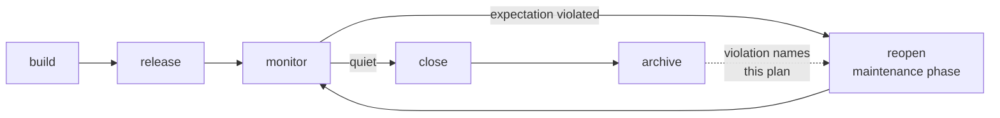

# The plan lifecycle

::: warning PROPOSED — not yet implemented
This page makes the case for a lifecycle change. Today plans close once and archive; there is no `monitor` state and nothing reopens a plan. Decided 2026-08-11; no code implements it yet. Read it as an argument, not a description.
:::

## Plans close. Systems don't.

InDusk's plan lifecycle is a straight line: brief → research → ADR → impl → falsify → cleanup → retrospective → **archive**. It ends. The plan is filed and the agent moves on.

That works for a unit of *work*. It fails for a unit of *responsibility*, and the archive shows exactly where:

> `bulletproof-state` · `bulletproof-state-machine` · `bulletproof-state-finishout` · `bulletproof-pregame-ui`

**Four plans. One concern.** Each time state persistence needed attention, the lifecycle offered only one move — start a new plan — because the old one was closed. The knowledge from round one sits in an archive that round four never reads, and the sequence is only legible to someone who already knows the story.

The linear lifecycle assumes work finishes. Software doesn't finish; it gets released, and then reality has opinions.

## The proposed shape

<FullscreenDiagram>



</FullscreenDiagram>

One new state and one new edge. Everything else is what already happens.

| State | Meaning |
|---|---|
| **build** | Phases execute. What `/work` does today. |
| **release** | The change is live. Not currently a state at all — plans close before this. |
| **monitor** | Live, watched, not yet finished. Exits when the signal is quiet. |
| **reopen** | A maintenance phase appended to the *existing* plan, not a new plan. |
| **close → archive** | Unchanged. The resting state. |

## The lifecycle, as defined

*(admin-ui-phase-progress, 2026-09-16)*

The shape above is a direction. The definition the code reads is
`apps/indusk-mcp/src/lib/lifecycle.ts`, one module, published as the
`@infinitedusky/indusk-mcp/lifecycle` subpath, and pinned single-definition:
`parsePlan`, the retrospective readiness gate and the admin UI all read it,
and a test fails if a second copy of any of its constants appears anywhere.

It keeps two vocabularies apart, deliberately.

**Positions are nouns.** Where a plan stands — facts about which documents
exist and what their status says. Nothing is happening in a position.

```
research → brief → test-plan → adr → impl-approved → executing
        → falsify → cleanup → retrospective → archived   (→ monitor)
```

`monitor` is listed and never derived: it is Midnight's, and it sits in the
list so the admin renders the segment the moment Midnight defines it. The
document positions (`research` … `impl`, `retrospective`) are also the plan
parser's stage order — `test-plan` joined it here; the old private order
walked past it as if it were not a stage.

**Activities are verbs.** What is happening now, inside exactly one position,
`executing` — the only stretch of the lifecycle that leaves observable traces
on disk every few minutes (checkboxes, boundary records). Before the impl the
work is conversation and disk records only its outcomes; after archive nothing
moves.

```
Test Phase N:   authoring → verifying → capturing-context → documenting → closed
Build Phase N:  implementing → [instrumenting] → verifying → capturing-context → documenting → closed
ritual phases:  falsifying / cleaning-up, then the same gates
```

The gate stages are `GATE_STAGES` — Verification, OTel, Context, Document, in
the order `/work` completes them — and the rituals are `RITUAL_ORDER`, the
words a ritual phase's title must start with. A plan can therefore never
render as "archived" and "verifying" at once: the vocabularies do not overlap.

```mermaid
stateDiagram-v2
    direction LR
    research --> brief
    brief --> test_plan: test-plan
    test_plan --> adr
    adr --> impl_approved: impl-approved
    impl_approved --> executing
    executing --> falsify
    falsify --> cleanup
    cleanup --> retrospective
    retrospective --> archived
    archived --> monitor: (Midnight)
    state executing {
        direction LR
        implementing --> verifying
        implementing --> instrumenting: OTel projects
        instrumenting --> verifying
        verifying --> capturing_context: capturing-context
        capturing_context --> documenting
        documenting --> closed
    }
```

<FullscreenDiagram>



</FullscreenDiagram>

**A plan that adds a position, an activity or a gate kind also adds its
rendering in the admin UI, in the same plan** — as a Document gate item in
the phase that adds the member, so the gate machinery holds it. What the pin
does when a plan does not: the admin's label maps
(`apps/indusk-admin/src/components/bars/labels.ts`) are declared `satisfies
Record<PlanPosition, …>` / `Record<PhaseActivity, …>` / `Record<GateKind, …>`,
so a union with a new member no longer type-checks, and the admin's
type-check is itself a test (`typecheck.test.ts`); on top of that,
`lifecycle-render-parity.test.ts` renders every member of every union and
fails naming the one with no label. The failure therefore says *which*
stage is unrendered, not merely that something is. Midnight's `monitor` is
the first case: listed, labelled, and drawn as pending until Midnight
derives it. That is what keeps the UI from drifting behind the system the
way its phase parser once did — for a month, silently, while every impl
written since August rendered wrong.

## `monitor` is the load-bearing addition

It is the state that says *the work is done and we don't know yet whether it worked.* Today that state exists in practice and has no name, so it collapses into "closed" the moment the checklist is ticked.

**And it cannot be real without telemetry.** "Fix it, watch for a while, close it" is a feeling unless something can answer:

> *Has expectation E-9 been violated in the last 14 days?*

with a number. That is what turns `monitor` from a waiting room into a state with a door. A plan sits in monitor until its expectations have been quiet for a defined window — and if they haven't, it doesn't close, which is the correct outcome and one nothing currently expresses.

## What reopens a plan

A production failure that violates a named expectation — and the expectation knows which plan owns it.

That is the operational payoff, and it is more concrete than "history is preserved": **a failure arrives and you already know where the fix goes.** No judgment call, no archaeology through four archived plans, no fifth plan.

```
telemetry violation → names E-9 → E-9 belongs to plan P
                                → P reopens with a maintenance phase
```

## Two authorities, one test suite

This lifecycle only makes sense alongside a claim about where tests come from. There are two legitimate sources, and they arrive at different times:

| | Written | Authority | Answers |
|---|---|---|---|
| **Trajectory test** | before the code | **specification** | did we build what the plan claimed? |
| **Expectation test** | after a failure | **failure** | does the system still uphold what it must? |

A specification test is not speculative — it derives from a commitment made in the test plan, and it constrains the implementation from an angle the implementation didn't choose. Enough such tests and the implementation is *over-determined*: you are fitting a line through fixed points rather than inventing one.

A failure test is not redundant — production knows things the specification could not.

**What neither authority sanctions is the third case:** a unit test written after the code, mirroring it, asserting nothing anyone claimed or observed. That test catches typing.

### Telemetry grades the specification

The most valuable object this produces is not a new test. It is **a test that passed while production broke.**

Every other signal tells you the code failed. This one tells you **your assertion was wrong** — and names it. That is a more expensive class of error, because it is the one that makes you confident while you are exposed. Nothing in InDusk currently surfaces it.

| Production violates E-9, and… | What it means |
|---|---|
| a test claimed E-9 and passed | the test was **insufficient** — widen it |
| no test claims E-9 | the expectation is unguarded — write one |
| there is no E-9 | an invariant nobody named — open it, then guard it |

The first row is the one you cannot get any other way.

### Why behavioral assertions matter more than they look

The test plan requires assertions to be behavioral — *"User can sign in with Google"* — not functional — *"`googleAuth()` returns a JWT"*. The stated reason is legibility.

The unstated one is that **a behavioral assertion is the shape of something observable in a trace.** "User can sign in with Google" has an external signature; "`googleAuth()` returns a JWT" does not. The assertions the test plan already forces you to write are exactly the ones that can become expectations with trace patterns.

Not every span needs a test. A span *opts in* by naming an expectation, and most never will — latency, queries, analytics carry no invariant. The coupling is on expectations, not on telemetry.

## Rejected: a separate `subsystem` primitive

The alternative was a new durable unit — a subsystem that accumulates phases forever while plans continue to archive. It solves the same problem and has a real argument behind it: **subsystems are bounded by the architecture** (a dozen or so), while **plans are unbounded** (52 and counting). If plans never close, the active surface grows without limit — which is the exact problem `indusk-makeover` introduced the 60 KB budget and the decay layer to fight.

It was rejected because **closed remains the resting state.** A plan reopens on a specific trigger, sits in monitor, and closes again. The active set stays small without inventing a noun.

**What would change this:** an expectation that genuinely belongs to no plan — or one created by plan A and violated by code from plan B, where "which plan reopens?" has no clean answer. If that appears twice, build subsystems then, with evidence rather than a prediction.

## What this needs that does not exist yet

Honest inventory, so nobody reads this page as a description of working software:

- **Promises** — what this page calls expectations: named commitments with owning plans, code sites and tests. **Built** as Day step 4a — the registry, `indusk promises check` and the admin's Promises page; see [Promises](./promises). The span link and the violation query below are Day step 4b.
- **Span ↔ expectation linkage** — `expectations.enforced` / `expectations.violated` attributes. Unbuilt.
- **A violation query** — "has E-9 been violated in the last N days?" against Dash0 and local telemetry. This is what gives `monitor` its exit condition. Unbuilt.
- **Reopen as a lifecycle operation** — `/retrospective` archives today and has no inverse.
- **A monitor window policy** — how quiet, for how long, before a plan may close.

Until the violation query exists, `monitor` is a state with no exit condition, which is worse than no state at all. **Telemetry is the prerequisite, not an enhancement.**

## See also

- [The Shape check](/guide/shape) — the per-phase craft review
- [Test Trajectory](/guide/test-trajectory) — where specification tests are declared and scheduled
- [Falsification ritual](/guide/falsification-ritual) — the close-out check that needs the whole system
