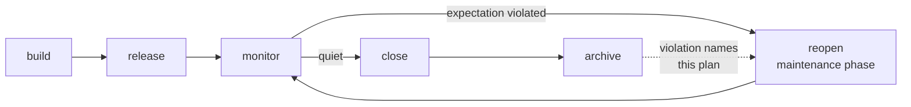
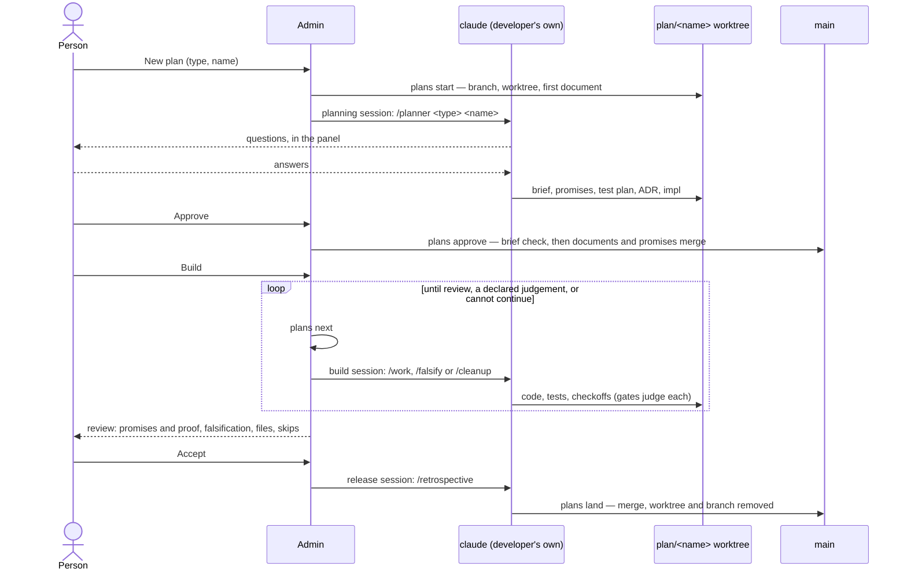

# The plan lifecycle

::: tip Argued 2026-08-11, built in Day step 4b
This page began as the case for a lifecycle change, and most of it now describes working software: a closed plan holding a behaviour promise waits in `monitor`, and a violation seen in telemetry reopens it with a Maintenance phase. [`monitor`, as built](#monitor-as-built) says exactly what exists; the argument above it is kept as the reasoning.
:::

## Plans close. Systems don't.

InDusk's plan lifecycle is a straight line: brief → research → ADR → impl → falsify → cleanup → audit → retrospective → **archive**. It ends. The plan is filed and the agent moves on.

That works for a unit of *work*. It fails for a unit of *responsibility*, and the archive shows exactly where:

> `bulletproof-state` · `bulletproof-state-machine` · `bulletproof-state-finishout` · `bulletproof-pregame-ui`

**Four plans. One concern.** Each time state persistence needed attention, the lifecycle offered only one move — start a new plan — because the old one was closed. The knowledge from round one sits in an archive that round four never reads, and the sequence is only legible to someone who already knows the story.

The linear lifecycle assumes work finishes. Software doesn't finish; it gets released, and then reality has opinions.

## The proposed shape

<FullscreenDiagram>


```mermaid
flowchart LR
    Build["build"] --> Release["release"]
    Release --> Monitor["monitor"]
    Monitor -->|quiet| Close["close"]
    Close --> Archive["archive"]
    Monitor -->|expectation violated| Reopen["reopen<br/>maintenance phase"]
    Reopen --> Monitor
    Archive -.->|violation names<br/>this plan| Reopen
```

</FullscreenDiagram>

One new state and one new edge. Everything else is what already happens.

| State | Meaning |
|---|---|
| **build** | Phases execute. What `/work` does today. |
| **release** | The change is live. Not currently a state at all — plans close before this. |
| **monitor** | Live, watched, not yet finished. Exits when the signal is quiet. |
| **reopen** | A maintenance phase appended to the *existing* plan, not a new plan. |
| **close → archive** | Unchanged. The resting state. |

## The lifecycle, as defined

*(admin-ui-phase-progress, 2026-09-16)*

The shape above is a direction. The definition the code reads is
`apps/indusk-mcp/src/lib/lifecycle.ts`, one module, published as the
`@infinitedusky/indusk-mcp/lifecycle` subpath, and pinned single-definition:
`parsePlan`, the retrospective readiness gate and the admin UI all read it,
and a test fails if a second copy of any of its constants appears anywhere.

It keeps two vocabularies apart, deliberately.

**Positions are nouns.** Where a plan stands — facts about which documents
exist and what their status says. Nothing is happening in a position.

```
research → brief → test-plan → adr → impl-approved → executing
        → falsify → cleanup → audit → retrospective → archived   (→ monitor)
```

`monitor` follows `archived`: a closed plan holding a behaviour promise sits
there until its promises have been quiet for a window (see
[`monitor`, as built](#monitor-as-built)). It is derived from files, never
from telemetry. The
document positions (`research` … `impl`, `retrospective`) are also the plan
parser's stage order — `test-plan` joined it here; the old private order
walked past it as if it were not a stage.

**Activities are verbs.** What is happening now, inside exactly one position,
`executing` — the only stretch of the lifecycle that leaves observable traces
on disk every few minutes (checkboxes, boundary records). Before the impl the
work is conversation and disk records only its outcomes; after archive nothing
moves.

```
Test Phase N:   authoring → verifying → capturing-context → documenting → closed
Build Phase N:  implementing → [instrumenting] → verifying → capturing-context → documenting → closed
ritual phases:  falsifying / cleaning-up, then the same gates
```

The gate stages are `GATE_STAGES` — Verification, OTel, Context, Document, in
the order `/work` completes them — and the rituals are `RITUAL_ORDER`, the
words a ritual phase's title must start with. A plan can therefore never
render as "archived" and "verifying" at once: the vocabularies do not overlap.

<FullscreenDiagram>


```mermaid
stateDiagram-v2
    direction LR
    research --> brief
    brief --> test_plan: test-plan
    test_plan --> adr
    adr --> impl_approved: impl-approved
    impl_approved --> executing
    executing --> falsify
    falsify --> cleanup
    cleanup --> audit
    audit --> retrospective
    retrospective --> archived
    archived --> monitor: holds a behaviour promise, inside the quiet window
    monitor --> executing: a violation reopens it (Maintenance phase)
    state executing {
        direction LR
        implementing --> verifying
        implementing --> instrumenting: OTel projects
        instrumenting --> verifying
        verifying --> capturing_context: capturing-context
        capturing_context --> documenting
        documenting --> closed
    }
```

</FullscreenDiagram>

**A plan that adds a position, an activity or a gate kind also adds its
rendering in the admin UI, in the same plan** — as a Document gate item in
the phase that adds the member, so the gate machinery holds it. What the pin
does when a plan does not: the admin's label maps
(`apps/indusk-admin/src/components/bars/labels.ts`) are declared `satisfies
Record<PlanPosition, …>` / `Record<PhaseActivity, …>` / `Record<GateKind, …>`,
so a union with a new member no longer type-checks, and the admin's
type-check is itself a test (`typecheck.test.ts`); on top of that,
`lifecycle-render-parity.test.ts` renders every member of every union and
fails naming the one with no label. The failure therefore says *which*
stage is unrendered, not merely that something is. `monitor` was the first
case: listed, labelled and drawn as pending for a month before Day step 4b
derived it. That is what keeps the UI from drifting behind the system the
way its phase parser once did — for a month, silently, while every impl
written since August rendered wrong.

### What an absent document reads as

*(admin-plan-type, 2026-10-01)*

Not every plan has every document. A bugfix has no research and no ADR; a
spike has only research. Until this plan the lifecycle called *any* document
position whose file was absent, once the plan had moved past it, `skipped` —
so a bugfix that never needed research and a bugfix that closed without its
test plan drew the same dashed segment. The bar asserted a judgment nothing
had made.

The judgment is now the plan's **type**: `workflow:` in its brief (or in its
research document, for a plan that is research only), one of `feature`,
`bugfix`, `refactor`, `spike`. What each type requires is defined once, in
`apps/indusk-mcp/src/lib/workflow-types.ts` (the
`@infinitedusky/indusk-mcp/workflow-types` subpath), and the planner skill's
table and the workflow templates are pinned equal to it.

| The document is absent and… | It reads |
|---|---|
| the plan's type does not require it | **skipped** — by design, behind the plan's position or ahead of it |
| the type requires it and the plan has moved past it | **missing** — a gap, and it stays one after the plan closes |
| the type requires it and the plan has not reached it | **pending** — an ordinary step ahead |
| the plan declares no type and has moved past it | **unknown** — whether the absence matters cannot be judged |

A plan with no declared type therefore never reads *skipped*: that word is a
claim about intent, and only a declared type can make it. The type is never
inferred from which documents happen to exist — that would be the bar
grading the plan against the plan.

The type speaks for more than documents. Three positions exist only because
a plan has an impl — executing, falsify, cleanup — so for a type that has
none, a spike, they read **skipped** as well, while the plan is in progress
and after it closes. Before the falsification of this plan they read pending
forever: the bar told a research-only plan it was waiting to execute.

And everything that says *what comes next* asks the type. The bar's label,
the plan list's next step and `advance_plan` each used to name the next
document in lifecycle order, whatever the plan was — a bugfix with an
accepted test plan was told to create the ADR its own type skips, by a tool
standing next to a bar that drew the ADR as skipped. All three now read one
function, `nextRequiredDocument` in the lifecycle module. A bugfix with an
accepted test plan is told to create the impl. A spike whose research is
finished is told nothing further: its label reads *research finished — a
spike ends here* and its next step is *Done*.

Which status words mean a document is finished is one definition too,
`isFinishedDocumentStatus`: `accepted`, `complete`, `completed`. Research
documents say `complete`, and the plan list once did not know the word.

What keeps each of these one definition is not discipline. A source-tree
scan (`lifecycle-single-definition.test.ts`) asserts that exactly one file
defines `nextRequiredDocument`, `isFinishedDocumentStatus` and the document
labels (`DOCUMENT_LABELS`), and that no other file spells the finished words,
indexes the next document position by hand, or writes a document's label
inline. It reads the package's `src/tools` as well as `src/lib`: two of the
three copies this plan's falsification found were in the tools directory,
which the scan had never read.

A `workflow:` value that is not a plain word is never read as a type.
`workflow: [bugfix]` is a YAML list, not a bugfix; it is reported as an
unrecognised declaration, shown as it was written on the line, and the
sentence under the bar names it rather than saying the plan declares no
type.

The segment states are `SEGMENT_STATES` in the lifecycle module, a runtime
list like the positions and activities, so the same render-parity pin walks
them: a state without a drawing and a word in the admin fails by name.

## Where a plan lives while it executes

*(admin-plan-worktrees, 2026-09-18)*

A plan is planned on the trunk: research through impl are plan documents,
allowed there. Its first phase opens its own worktree with
`indusk worktree create <plan>`, and from then until it lands, the plan's
live copy is in that worktree. The command records the assignment, so the
admin's live bars and the plan tools read the plan from its worktree, from
any checkout of the project, while the trunk's copy stays at "impl approved".
The retrospective's landing step merges the branch, then
`indusk worktree release <plan>`, then removes the worktree; from there the
plan reads from the trunk, which now holds the merged work. The record is
never inferred from a folder or branch name — see
[`indusk worktree`](/reference/cli/worktree).

## `monitor` is the load-bearing addition

It is the state that says *the work is done and we don't know yet whether it worked.* Today that state exists in practice and has no name, so it collapses into "closed" the moment the checklist is ticked.

**And it cannot be real without telemetry.** "Fix it, watch for a while, close it" is a feeling unless something can answer:

> *Has expectation E-9 been violated in the last 14 days?*

with a number. That is what turns `monitor` from a waiting room into a state with a door. A plan sits in monitor until its expectations have been quiet for a defined window — and if they haven't, it doesn't close, which is the correct outcome and one nothing currently expresses.

## What reopens a plan

A production failure that violates a named expectation — and the expectation knows which plan owns it.

That is the operational payoff, and it is more concrete than "history is preserved": **a failure arrives and you already know where the fix goes.** No judgment call, no archaeology through four archived plans, no fifth plan.

```
telemetry violation → names E-9 → E-9 belongs to plan P
                                → P reopens with a maintenance phase
```

## Two authorities, one test suite

This lifecycle only makes sense alongside a claim about where tests come from. There are two legitimate sources, and they arrive at different times:

| | Written | Authority | Answers |
|---|---|---|---|
| **Trajectory test** | before the code | **specification** | did we build what the plan claimed? |
| **Expectation test** | after a failure | **failure** | does the system still uphold what it must? |

A specification test is not speculative — it derives from a commitment made in the test plan, and it constrains the implementation from an angle the implementation didn't choose. Enough such tests and the implementation is *over-determined*: you are fitting a line through fixed points rather than inventing one.

A failure test is not redundant — production knows things the specification could not.

**What neither authority sanctions is the third case:** a unit test written after the code, mirroring it, asserting nothing anyone claimed or observed. That test catches typing.

### Telemetry grades the specification

The most valuable object this produces is not a new test. It is **a test that passed while production broke.**

Every other signal tells you the code failed. This one tells you **your assertion was wrong** — and names it. That is a more expensive class of error, because it is the one that makes you confident while you are exposed. Nothing in InDusk currently surfaces it.

| Production violates E-9, and… | What it means |
|---|---|
| a test claimed E-9 and passed | the test was **insufficient** — widen it |
| no test claims E-9 | the expectation is unguarded — write one |
| there is no E-9 | an invariant nobody named — open it, then guard it |

The first row is the one you cannot get any other way.

### Why behavioral assertions matter more than they look

The test plan requires assertions to be behavioral — *"User can sign in with Google"* — not functional — *"`googleAuth()` returns a JWT"*. The stated reason is legibility.

The unstated one is that **a behavioral assertion is the shape of something observable in a trace.** "User can sign in with Google" has an external signature; "`googleAuth()` returns a JWT" does not. The assertions the test plan already forces you to write are exactly the ones that can become expectations with trace patterns.

Not every span needs a test. A span *opts in* by naming an expectation, and most never will — latency, queries, analytics carry no invariant. The coupling is on expectations, not on telemetry.

## Rejected: a separate `subsystem` primitive

The alternative was a new durable unit — a subsystem that accumulates phases forever while plans continue to archive. It solves the same problem and has a real argument behind it: **subsystems are bounded by the architecture** (a dozen or so), while **plans are unbounded** (52 and counting). If plans never close, the active surface grows without limit — which is the exact problem `indusk-makeover` introduced the 60 KB budget and the decay layer to fight.

It was rejected because **closed remains the resting state.** A plan reopens on a specific trigger, sits in monitor, and closes again. The active set stays small without inventing a noun.

**What would change this:** an expectation that genuinely belongs to no plan — or one created by plan A and violated by code from plan B, where "which plan reopens?" has no clean answer. If that appears twice, build subsystems then, with evidence rather than a prediction.

## What this needs that does not exist yet

Honest inventory, so nobody reads this page as a description of working software:

- **Promises** — what this page calls expectations: named commitments with owning plans, code sites and tests. **Built** as Day step 4a — the registry, `indusk promises check` and the admin's Promises page; see [Promises](./promises). The span link and the violation query below are Day step 4b.
- **Span ↔ promise linkage** — **built** (Day step 4b) as two attributes and an event, `indusk.promise`, `indusk.promise.outcome` and `indusk.promise.violated`; see [Marking a behaviour promise](./promises#marking-a-behaviour-promise).
- **A violation query** — **built**: `indusk promises status` asks the local telemetry daemon's Jaeger. No hosted backend is involved; Dash0 is an optional place to look, never a source for the loop.
- **Reopen as a lifecycle operation** — **built**: `indusk promises watch` opens an incident and appends a Maintenance phase to the owner, in place.
- **A monitor window policy** — **built**: `promises.quiet_window_days`, default 7.
- **Watching without a person** — `watch` is one pass someone runs. Running it on a schedule, and reading deployed systems, is `day-always-on`.

**Telemetry is the prerequisite, not an enhancement** — which is why the loop runs on the local daemon InDusk ships, not on a subscription.

## `monitor`, as built

*(day-monitor, 2026-09-19)*

An archived plan that holds at least one behaviour promise is in `monitor`
while

```
now − max(closed, lastViolation) < window
```

- **closed** is the date on its retrospective's "Landed on main at …" line,
  else the retrospective's `date`. A plan with no retrospective never enters
  `monitor`.
- **lastViolation** is the latest `last_seen` among its promises' incidents,
  open or fixed. A violation inside the window **restarts** it, and the plan
  bar says so: "window restarted 2026-09-18 — 0 of 7 days quiet".
- **window** is `promises.quiet_window_days` in `.indusk/config.json`,
  default 7.

It is derived from files on every read — `lib/promises/after-close.ts` for
the plan tools, the same function for the admin — and never opens a socket.
`monitor` therefore lags telemetry until `indusk promises watch` records a
violation as an incident; the Promises page's health chips carry the live
view. A plan holding no behaviour promise closes exactly as before.

`list_plans` lists a `monitor` plan as active, with
`monitor: { windowDays, elapsedDays, restartedAt }`. When an incident
appends a Maintenance phase to an archived plan and the phase has an
unchecked item, the plan is **reopened** instead: listed active, and
`executing` that phase. Ticking the phase off returns it to `monitor` — the
incident's `last_seen` restarted the window — and then to `archived`.

## Plan, approve, build, review, accept, release

Added by admin-plan-authoring. A plan can now go the whole way from the admin, or from the editor or a terminal through the same commands, and a build behaves the same wherever it starts.

1. **Plan.** `indusk plans start <type> <name>` gives the plan its own branch and worktree; its documents and declared promises are written there and nowhere on `main`. From the admin, New plan does this and starts a planning session; the person answers its questions in the panel.
2. **Approve.** `indusk plans approve <name>` runs the brief check, then merges the plan's documents and promises to `main` — promises reach `main` before any code, so every other plan sees them. The build continues on the same branch.
3. **Build.** Unattended: after each step `indusk plans next` decides what comes next — work an open phase, author the falsification, author the cleanup — and a fresh session does it. A build stops only at review, at a judgement the plan declared, or when it cannot continue. It may skip a gate item only with its reason. It never starts the retrospective, and `plans accept` and `plans land` refuse inside one of its steps.
4. **Review.** `indusk plans review <name>` shows each promise with the tests that prove it, what falsification found and fixed, the files changed, every skip, and any uncommitted work on `main` where the plan will land.
5. **Accept.** `indusk plans accept <name>` (or Accept in the panel; or the project's workflow, with `release.auto_accept`).
6. **Release.** The retrospective runs and lands the plan with `indusk plans land <name>`, which refuses a plan that was not accepted. Publishing stays the operator's.


```mermaid
sequenceDiagram
    actor P as Person
    participant A as Admin
    participant C as claude (developer's own)
    participant B as plan/<name> worktree
    participant M as main
    P->>A: New plan (type, name)
    A->>B: plans start — branch, worktree, first document
    A->>C: planning session: /planner <type> <name>
    C-->>P: questions, in the panel
    P-->>C: answers
    C->>B: brief, promises, test plan, ADR, impl
    P->>A: Approve
    A->>M: plans approve — brief check, then documents and promises merge
    P->>A: Build
    loop until review, a declared judgement, or cannot continue
        A->>A: plans next
        A->>C: build session: /work, /falsify or /cleanup
        C->>B: code, tests, checkoffs (gates judge each)
    end
    A-->>P: review: promises and proof, falsification, files, skips
    P->>A: Accept
    A->>C: release session: /retrospective
    C->>M: plans land — merge, worktree and branch removed
```

A plan written on `main` instead of its own branch is not refused: that path is a convention, and the commit is recorded as a violation of `a-plan-is-written-on-its-own-branch` so whether it holds can be seen. See [`indusk plans`](/reference/cli/plans) and [sessions](/reference/admin-ui/sessions).

## See also

- [The Shape check](/guide/shape) — the per-phase craft review
- [Test Trajectory](/guide/test-trajectory) — where specification tests are declared and scheduled
- [Falsification ritual](/guide/falsification-ritual) — the close-out check that needs the whole system
