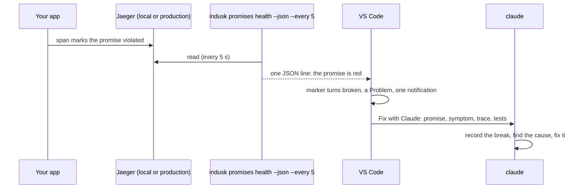

# Promises in your editor

The InDusk extension for VS Code (and Cursor) shows every promise at the line
that keeps it, with its health, and turns a break into Claude working on the
fix in one click. It only shows: nothing in your project is written by it.

## What you see

**A marker at the end of every line that carries a promise's token.** A
promise is kept where code says so in a comment, `// promise: seat-never-double-booked`.
That line ends with the promise's name and its state:

| Marker | Meaning |
|---|---|
| `seat-never-double-booked · holding` | Seen upheld. |
| `seat-never-double-booked · broken (production)` | A live break in that source. |
| `… · holding, broken (local)` | Production holds; a change on your machine breaks it. |
| `… · fixed` | Every break in the window has a fixed incident. |
| `… · not seen` | No run marked it in the window. |
| `… · watched by the tests` | A state or structure promise: the tests watch it, not telemetry. |
| `… · proved here` | This file is one of the promise's tests. |
| `… · not in this project` | The token names a promise the project does not have. |
| `… · production unreadable` / `watcher blind` | That source could not be read, or did not hear its probe. Never shown as holding. |
| `… · not reading` | No health has arrived for two reads. |

**Hover a marked line** for the promise's sentence, its state in each source,
and when it last broke or was last seen.

**A break** also appears in the Problems list, and as one notification the
first time it is read. Fixed, it clears from both.

The states are the admin's: the editor reads `indusk promises health --json`,
the line built by the same rule the admin's chips use, every five seconds. A
break shows within two reads of being readable from its source.

## Fix with Claude

On a broken promise, the light bulb offers **Fix with Claude**. It opens a
terminal in the project running your own `claude`, its first message carrying
the promise, the symptom, a link to the trace, and the tests that prove it. It
asks Claude to record the break first (the `record_breaks` tool, or
`indusk promises watch`) and fix it under the plan that owns the promise.

Without Claude Code installed, it says how to install it and opens nothing.

