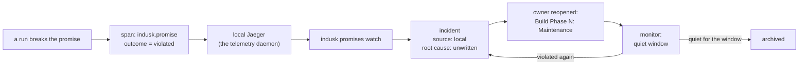

# Promises

What the system commits to, written down, checked, and owned.

## Why it exists

A test that went green stays green until someone edits the code it tests. A commitment the system keeps — *a seat is never double-booked*, *every shared rule has exactly one definition* — can be broken months later by a change that never mentioned it. That difference is why a commitment needs three things a test row does not: an **owner** that outlives the plan that made it, a **state** rather than a verdict, and a **link** into whatever can observe it being broken.

InDusk calls such a commitment a **promise**. A plan's contract is the promises it **establishes**, the promises already in force that its change **preserves**, and nothing about *how* — the boundary is fixed, the path is free. The process record (phases closed in order, red seen before green, commits scored) is how the proof was made honestly; it is not a promise about the system.

## A promise predates its test

A promise is the statement of behaviour. A test is one of its links, derived from it, not the other way round. Promises arrive from two directions:

- **Specification** — stated in planning, before the code exists.
- **Failure** — discovered when a run breaks something nobody had named, and stated afterwards.

The primitive accepts both. A Test Trajectory row names the promise it establishes or preserves; a row that names neither is process or path, and should not be a row.

## The three kinds

A promise's **kind** is decided by *what can break it after it was proved*, which decides what checks it and where its health comes from.

| Kind | What it says | Broken by | Checked by | Health source |
|---|---|---|---|---|
| `behaviour` | something happens; how the system responds | inputs nobody chose, in a run | a test, and the running system | the running system; hollow until seen |
| `state` | a fact about stored or rendered state, under chosen inputs | a later change to the code that produces it | a test | the last run of the suite at head |
| `structure` | something exists, or exactly one of it does | a later change that removes or duplicates it | a build-time check | the last run of the check at head |

Telemetry watches reactions; tests and checks assert state and structure. *The documentation page exists* is a promise, and a pointer check going red at the next build is exactly the loop wanted, at the speed the fact changes. Running the system adds nothing to a static fact. What would be a gap is a static promise with no check at all.

For `state` and `structure` promises the regression suite *is* the monitor, on two conditions the system must make visible rather than assume: that the check **ran** at head, and that it still **binds** to the behaviour it names. `behaviour` promises are the one kind the suite cannot cover, because the inputs that break them are the ones nobody chose. That is what the monitor step (Day 4b) is for.

## Two lifetimes

- `holds` — in force for as long as the system runs; any later change can break it. The default.
- `established` — a transition that, once done, cannot be undone (*the backfill ran*). Its check retires the moment it goes green and the promise moves to history, hidden by default, so the registry does not fill with things that can never break again.

## Four states

| State | Meaning |
|---|---|
| `declared` | Stated in planning, not yet established. The owner is an open plan. |
| `enforced` | The system upholds it; a violation is a bug. |
| `known-violated` | Declared, and the current implementation provably cannot uphold it. Carries the incident that proves it, so it is evidence rather than an excuse. |
| `retired` | No longer a promise. Kept for history. |

`known-violated` is what makes declaring honest. Without it, a promise you cannot yet keep is either hidden or a permanently red check — and a permanently red check stops being read.

```mermaid
stateDiagram-v2
    [*] --> declared: stated in planning
    [*] --> enforced: stated after a failure, guarded
    declared --> enforced: links in place at close
    declared --> known-violated: could not be established (incident)
    enforced --> known-violated: broken, incident opened
    known-violated --> enforced: fixed
    enforced --> retired: superseded or withdrawn, by a change that names it
    known-violated --> retired
```

## The registration rule

Not every check is a promise, and the registry must not become a second copy of the trajectory. **A promise is registered when its breakage would need a plan to reopen.** Applied to this repository's own candidates:

| Candidate | Kind | Lifetime | Registers? |
|---|---|---|---|
| every shared rule has exactly one definition (the pins) | structure | holds | yes — a second copy is a defect for the plan that pinned it |
| every pointer in CLAUDE.md resolves (`check-pointers`) | structure | holds | yes |
| the phase-boundary record is never malformed | state | holds | yes — one bad line blinds every reader |
| no test writes the machine-global registry | state | holds | yes — a leak reopens the plan that isolated it |
| every checkoff ran its gates | behaviour | holds | yes — the class `hook-cwd-independence` reopened for |
| the jj residue sweep ran | — | established | **no** — done once; what holds is the structure promise "no jj residue", already pinned |
| every phase closed in order; red seen before green | — | — | **no** — process record, not a promise about the system |
| "the migration preserves every key", as a trajectory row | — | — | **no** — a row that preserves a registered promise cites it; it does not create an entry |

## Three worked examples, one per kind

This repository holds three promises of its own, chosen so the convention is
shown not to depend on a service or on telemetry. Each is a file under
`.indusk/promises/`; `indusk promises check` runs over them in `pnpm test`.

| Promise | Kind | Where it is enforced | What checks it |
|---|---|---|---|
| `one-definition-per-shared-rule` — every rule two lanes must agree on has exactly one definition under `src/lib` | `structure` | nowhere in particular: it is a fact about the tree, so it lists no site | the eight `*-single-definition` pin tests, each carrying the token |
| `phase-boundary-record-never-malformed` — the writer refuses an append with the reader's own predicate | `state` | `lib/shape/boundary.ts` | the boundary tests |
| `gates-ran-at-every-checkoff` — a phase-transition edit is judged by the gate chain from any working directory | `behaviour` | `hooks/check-gates.js` | the hook-runner test that drives the chain from a subdirectory — and, when Day step 5's gate ledger exists, the running system |

The third is the interesting one. It is `enforced`, it has a site and a test,
and it carries a `fixed` incident from 2026-09-15 (the hooks were registered
relative to the session's cwd and silently stopped loading). Yet its chip on
the Promises page is **hollow**, because nothing yet observes a checkoff at
run time; the suite proves the behaviour on inputs someone chose. That hollow
chip is the honest reading, and it is what the monitor step will fill.

A fourth arrived with the monitor: `every-commit-evaluated` (`behaviour`),
marked by every evaluator run — the first promise here whose health the
running system reports. See [The loop](#the-loop).

## Who owns a promise

The plan that established it. Ownership moves only when another plan supersedes the promise. A plan closes *holding* its promises — closed is the resting state, and the archived plan is the owner of record that a violation wakes. Only a plan holding none is truly finished.

## How to write one

1. **Declare the domain** it belongs to in `.indusk/config.json` under
   `promises.domains`, if it is not there yet.
2. **Write the file** `.indusk/promises/<name>.md` — kebab-case name, the
   kind, the state, the owner plan, and the statement as the body's first
   paragraph. One sentence, observable, never implementation.
3. **Link it.** Put the token `promise: <name>` in a comment at the code
   site that enforces it and in the test that checks it, and list both paths
   in the file. A `structure` promise needs only the check; a
   `known-violated` one needs an incident instead.
4. **Run `indusk promises check`.** It refuses by name until every link the
   kind requires is in place, and passes with a summary once it is.

The file shapes, every refusal and the exit codes are in the
[`indusk promises` reference](/reference/cli/promises).

## Marking a behaviour promise

A `behaviour` promise is broken by inputs nobody chose, so the running system
has to say when it upholds or breaks one. It says so with plain
OpenTelemetry, on the span that does the work:

```ts
span.setAttribute("indusk.promise", "seat-never-double-booked");
span.setAttribute("indusk.promise.outcome", "upheld");
```

and, when the promise breaks:

```ts
span.setAttribute("indusk.promise.outcome", "violated");
span.addEvent("indusk.promise.violated", {
  "indusk.promise.symptom": "seat 4 held by two players",
});
```

That is the whole convention: two attributes, and an event carrying what was
observed. The application imports nothing from InDusk and runs the same with
InDusk deleted. Anyone holding the raw trace — in Jaeger, in any
OpenTelemetry tool, or as exported JSON — can read which promise broke and
why. A violation is its own attribute, never the span's error status: an error
can happen while every promise holds, and a promise can break with no error at
all.

A test asserts the mark with the helper InDusk ships for tests only:

```ts
import {
  captureSpans,
  expectPromiseUpheld,
} from "@infinitedusky/indusk-mcp/testing/trace-shape";

const spans = await captureSpans(() => holdSeat(4));
expectPromiseUpheld(spans, "promise: seat-never-double-booked", {
  parent: "handle-request",
});
```

The helper takes the promise as its token, so the assertion is also the
promise's test link — `indusk promises check` counts it with no other comment.
It checks containment, not a snapshot: added attributes and extra child spans
never fail it; the marked span going missing does. `expectPromiseViolated`
asserts a violation and returns its symptom.

This repository's own example is `every-commit-evaluated`: every evaluator run
marks its root span, `upheld` when a scorecard is written and `violated` with
the reason when it is not. While the local telemetry daemon runs, that mark
lands in its Jaeger with nothing configured.

## The loop

A behaviour promise broken in a run finds its way back to the plan that owns
it without a person reading anything (Day step 4b):



- **status** reads the marks: `indusk promises status` shows each behaviour
  promise's violations and when it was last seen upheld, or *not seen*.
- **watch** records them: one incident per promise, extended rather than
  duplicated, and a Maintenance phase on the owner that cannot close until a
  test reproducing the incident passes.
- **A person** writes the root cause; `promises check` refuses to let the
  incident close without one.
- **monitor** waits: once the Maintenance phase is done, the plan stays in
  `monitor` until its promises have been quiet for `promises.quiet_window_days`
  (default 7), then rests as archived.

This repository runs the loop on itself: `every-commit-evaluated` is marked by
every evaluator run, and `pnpm e2e` breaks it on purpose (a model that does
not exist) to prove the whole path. The commands are in the
[`indusk promises` reference](/reference/cli/promises).

## See also

- [Plan Lifecycle](./plan-lifecycle) — the two authorities a test can have, and why behavioural assertions are the shape of a promise
- [Test Trajectory](./test-trajectory) — the rows that will name what they establish or preserve
