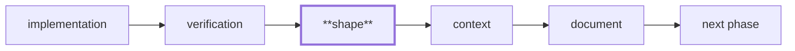

# The Shape check

Craft feedback in the phase that wrote the code, instead of at plan close.

## Why it exists

`/cleanup` runs once, at the end. That is right for **structural decomposition** — you cannot judge a module boundary before the modules exist. It is far too late for the ordinary case: *this inline block wanted to be a named function.*

The motivating example is real. In the `dawn-verify` plan, Phase 2 wrote report rendering as inline `console.error` calls. The cost surfaced in **Phase 7**, where the code had to be extracted into its own module *before the fix could be tested at all* — and until then, nothing asserted the report's shape. A check at Phase 2 costs seconds.

There is no "wait for the third occurrence" argument here. A unit that should have been extracted is wrong the moment it is written.

## Where it runs

Shape is **executor behavior**, not plan structure. There is no `#### Phase N Shape` heading and no validator rule — nothing to add to a plan, and nothing to retrofit into existing ones. `/work` performs it at the phase boundary, the same way it runs the test suite.



It runs **after verification is green** — the same ordering `/cleanup` obeys. Restructuring code whose correctness is unproven is how a refactor hides a bug, and a phase with failing tests has a more urgent problem than shape.

## Shape vs Cleanup

Both make code better. They answer different questions, and need different amounts of the system to exist:

| | Shape (per phase) | Cleanup (at close) |
|---|---|---|
| Question | Is this unit well-formed *as written*? | What should the finished output decompose into? |
| Scope | Within a file or unit | Across files |
| Examples | An inline block that wants a name; a component doing two jobs; a client island inlined into a server component | Duplicated logic across modules; a rule copied into two lanes; the settled module boundary |
| Needs | The code just written | The whole plan's output |

`dawn-verify` supplies one of each. The inline renderer was wrong at Phase 2 — Shape. `resolveImplPath` duplicated across two lanes **could not exist** until Phase 2 built the second copy — Cleanup.

## Where the rules come from

**The enabled domain extensions**, never from core. `react` says one component per file; `nextjs` says push `"use client"` boundaries as deep as they go; a library or CLI project with neither falls back to the general move — extract a function or module.

Turning an extension off changes what Shape flags. That is the point: a project sets its own craft standard by choosing extensions, exactly as `/cleanup` already delegates "what counts as a cohesive unit."

Those rules are **prose**, which is why Shape's judgment is performed by the executing agent rather than by a heuristic. A line-count threshold cannot read "minimize client boundaries" — and would have missed the motivating case entirely, since the inline renderer was about fifteen lines.

## What a finding does

It becomes an ordinary unchecked checklist item in the phase being worked, naming both the change and the rule it came from:

```markdown
- [ ] Extract the finding renderer into a named pure function —
      react/one-component-per-file: a unit with its own reason to change
      wants its own name
```

Not blocking — a craft judgment is fuzzier than the structural gates, and a false positive should not halt an unattended run. But not ignorable either: a phase cannot close with unchecked items.

## Three outcomes, never silence

| Outcome | Meaning |
|---|---|
| reviewed — findings | Items appended to the phase |
| reviewed — nothing found | Recorded, already checked; costs nothing |
| skipped — no code surface | Recorded with the reason (docs-only, schema-only) |

Plus a per-file "reviewed and left as-is" with its reasoning, distinct from a file never looked at.

The rule behind all of it, learned expensively elsewhere in this system: **a check that cannot distinguish "nothing to do" from "did not run" reports the shape of success without doing the work.** "Nothing to do" must be a common, cheap, *recorded* answer — otherwise Shape becomes a nag, and a nag gets ignored.

## Calibration — an open obligation

Whether Shape flags *the right things* has no test. There is no oracle for "should this have been extracted"; a fixture proves the mechanism fires, never that it fired wisely.

So it is calibrated by observation, and this is a standing obligation on whoever runs the next plan:

> **Every plan run with Shape records its finding count and false-positive count in the retrospective's Quality Ratchet section.** The first three plans after Shape ships are the calibration sample. **If two consecutive plans report findings a human judged wrong, calibration reopens as a falsification hypothesis.**

## See also

- [The cleanup ritual](./cleanup-ritual.md) — the inter-file half
- [The falsification ritual](./falsification-ritual.md) — the other close-out check, and why it needs the whole system
