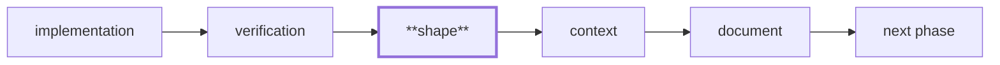

# The Shape check

Craft feedback in the phase that wrote the code, instead of at plan close.

## Why it exists

`/cleanup` runs once, at the end. That is right for **structural decomposition** — you cannot judge a module boundary before the modules exist. It is far too late for the ordinary case: *this inline block wanted to be a named function.*

The motivating example is real. In the `dawn-verify` plan, Phase 2 wrote report rendering as inline `console.error` calls. The cost surfaced in **Phase 7**, where the code had to be extracted into its own module *before the fix could be tested at all* — and until then, nothing asserted the report's shape. A check at Phase 2 costs seconds.

There is no "wait for the third occurrence" argument here. A unit that should have been extracted is wrong the moment it is written.

## Where it runs

Shape is **executor behavior**, not plan structure. There is no `#### Phase N Shape` heading and no validator rule — nothing to add to a plan, and nothing to retrofit into existing ones. `/work` performs it at the phase boundary, the same way it runs the test suite.



It runs **after verification is green** — the same ordering `/cleanup` obeys. Restructuring code whose correctness is unproven is how a refactor hides a bug, and a phase with failing tests has a more urgent problem than shape.

## Shape vs Cleanup

Both make code better. They answer different questions, and need different amounts of the system to exist:

| | Shape (per phase) | Cleanup (at close) |
|---|---|---|
| Question | Is this unit well-formed *as written*? | What should the finished output decompose into? |
| Scope | Within a file or unit | Across files |
| Examples | An inline block that wants a name; a component doing two jobs; a client island inlined into a server component | Duplicated logic across modules; a rule copied into two lanes; the settled module boundary |
| Needs | The code just written | The whole plan's output |

`dawn-verify` supplies one of each. The inline renderer was wrong at Phase 2 — Shape. `resolveImplPath` duplicated across two lanes **could not exist** until Phase 2 built the second copy — Cleanup.

### Worked example — Shape

Phase 2 of `dawn-verify` wrote its report rendering inline:

```ts
for (const finding of findings) {
  console.error(`  ${finding.kind}: ${finding.detail}`);
  if (finding.file) console.error(`    at ${finding.file}`);
}
```

About fifteen lines, in one file, no threshold crossed. It is still wrong the moment it is written: the formatting has its own reason to change, and nothing can assert what the report *says* without running the whole command. Shape's question — "should this have a name and a test?" — catches it in Phase 2. Without Shape it surfaced in **Phase 7**, where `formatFinding` had to be extracted before the fix could be tested at all.

Note what a heuristic would have done here: nothing. The file was not oversized and the function was not long. This is why the judgment is performed by a reader of prose rather than a line counter.

### Worked example — Cleanup

The same plan resolved an impl path in `run/` and, later, in `verify/`:

```ts
// lib/run/gates.ts        — Phase 2
const implPath = join(root, ".indusk", "planning", plan, "impl.md");
// lib/verify/baseline.ts  — Phase 3
const implPath = join(root, ".indusk", "planning", plan, "impl.md");
```

Shape cannot see this, and should not pretend to: reviewing Phase 3 it sees only `verify/`, where one path join is entirely reasonable. The duplication is a fact *about two files*, and it did not exist until the second copy was written. Cleanup at close sees both and extracts `resolveImplPath` — now a single-definition invariant with a test asserting exactly one definition exists.

The line is not a matter of taste. It follows from what each check can see.

## Where the rules come from

**The enabled domain extensions**, never from core. `react` says one component per file; `nextjs` says push `"use client"` boundaries as deep as they go; a library or CLI project with neither falls back to the general move — extract a function or module.

Turning an extension off changes what Shape flags. That is the point: a project sets its own craft standard by choosing extensions, exactly as `/cleanup` already delegates "what counts as a cohesive unit."

Those rules are **prose**, which is why Shape's judgment is performed by the executing agent rather than by a heuristic. A line-count threshold cannot read "minimize client boundaries" — and would have missed the motivating case entirely, since the inline renderer was about fifteen lines.

Every enabled extension that provides a skill contributes its prose, unparsed. There is deliberately **no domain-vs-tool filter**: extension manifests carry no such taxonomy, so a filter would mean core deciding which extensions count — the exact hardcoded judgment the extension-sourced design exists to avoid. The reviewing agent reads prose and can tell what bears on craft.

The rule set also carries its own **scope declaration**, so the boundary travels with the rules rather than living only in a skill file:

```
inScope     Does this unit have one reason to change?
            Should this inline block have been a named function or module?
            Does the name say what the code is for, rather than how it works?
            Is there a seam a test could reach?

outOfScope  Cross-file duplication and the rule of three  → /cleanup at close
            Module boundaries and package structure       → /cleanup at close
            Anything requiring files this phase did not change
```

The `inScope` entries are the fallback standard on their own — a library or CLI with no domain extension enabled still gets the general move.

## What a finding does

It becomes an ordinary unchecked checklist item in the phase being worked, naming both the change and the rule it came from:

```markdown
- [ ] Shape (`src/lib/verify/report.ts`) — Extract the finding renderer into a named pure function. Rule: react/one-component-per-file — a unit with its own reason to change wants its own name
```

One line, always: a checklist item that wrapped onto a second line would read as an item plus orphaned prose, so `appendFindingToPhase` refuses a finding whose fields carry a line separator rather than emitting a broken item.

It lands in the phase's **implementation** block, above the first `####` gate heading. That placement is load-bearing rather than cosmetic — an item written past that heading falls inside a gate block and gets classified as a verification or context item instead of work.

`appendFindingToPhase` returns the edited body and never writes it. The caller owns the write, so the edit passes through the same PreToolUse gate chain as any other impl edit. A library writing `impl.md` directly would be a hole in the gate by construction — which is precisely what `atdawn run`'s falsification found when `bash` was rewriting checkboxes the `edit` gate would have refused.

Not blocking — a craft judgment is fuzzier than the structural gates, and a false positive should not halt an unattended run. But not ignorable either: a phase cannot close with unchecked items.

## What counts as "this phase's files"

The review is only as good as its scope, and every way the scope can be wrong is silent — it under-reports, and an under-scoped review still says it succeeded. So the edges are worth stating.

| Situation | In scope? | Why |
|---|---|---|
| Committed since the phase opened | Yes | The ordinary case |
| Written but never staged | Yes | Unstaged work is still work |
| Untracked, but written *before* the phase opened | No | Scoped by mtime against the boundary record — otherwise a Phase 1 scratch file belongs to every later phase |
| Deleted during the phase | No | A path that is gone cannot be read, and a deletion-only phase must not claim a code surface |
| `.indusk/` machine state | No | The boundary record is written when a phase *opens*; counting it would make every phase look productive before doing anything |
| Changed by an earlier phase | No | That is what the boundary record is for |

**The boundary record is tracked, and that has obligations.** It is committed rather than gitignored so a phase resumed after a fresh clone still knows where it began. Being tracked means it appears in every later diff, which makes it evidence to anything reasoning about "what changed" — so a newly tracked InDusk artifact has to be registered with every such detector *and* given a merge strategy in the same commit that first writes it. Shape's record was committed doing neither: it silently switched off `verify`'s phantom detection (worse than the verify ledger did, because a boundary is written when a phase *opens*, so it lands in the diff of a phase that has not done anything yet), and it lacked the `merge=union` its sibling ledger carries, which matters because worktree-per-plan is the default and two branches opening phases is the expected case.

**A phase resumed in a later session keeps its original start.** `/work` records the phase start each time it reaches that instruction, so a phase spanning two sessions records twice. The earliest record wins and re-recording is a no-op — otherwise everything the first session committed would fall out of scope while the review still reported success.

Every ambiguous case resolves toward including the file: an unreadable timestamp, a stat that fails, a file whose age cannot be determined. Over-reporting costs a re-read. Under-reporting loses real work and says nothing.

**If an enabled extension's craft prose cannot be read**, its name comes back in `rules.unreadable` and the step surfaces it. An empty list means every enabled extension was readable — which is a different fact from "no extension had anything to say," and worth telling apart, because a project whose craft standard has quietly stopped applying otherwise looks exactly like one that never had extra rules.

## Three outcomes, never silence

| Outcome | Recorder | Meaning |
|---|---|---|
| reviewed — findings | `appendFindingToPhase` | Unchecked items appended to the phase |
| reviewed — nothing found | `recordReviewedNothingFound` | Recorded already-checked; costs nothing |
| skipped — verification not green | `recordSkipped` | Finish the Verification gate, then come back |
| skipped — no code surface | `recordSkipped` | The phase changed no code files (docs-only, planning-only) |

Plus a per-file "reviewed and left as-is" (`recordLeftAsIs`) with its reasoning, distinct from a file never looked at.

`recordSkipped` was missing at first — the design promised three outcomes and shipped recorders for two, leaving the skill to tell the agent to "record the reason" with nothing to record it with. The gap was found by running Shape rather than reading it, and it is the outcome most likely to go unwritten: "reviewed and found nothing" is a result someone is pleased to record; "did not run" is not.

The rule behind all of it, learned expensively elsewhere in this system: **a check that cannot distinguish "nothing to do" from "did not run" reports the shape of success without doing the work.** "Nothing to do" must be a common, cheap, *recorded* answer — otherwise Shape becomes a nag, and a nag gets ignored.

## Calibration — an open obligation

Whether Shape flags *the right things* has no test. There is no oracle for "should this have been extracted"; a fixture proves the mechanism fires, never that it fired wisely.

So it is calibrated by observation, and this is a standing obligation on whoever runs the next plan:

> **Every plan run with Shape records its finding count and false-positive count in the retrospective's Quality Ratchet section.** The first three plans after Shape ships are the calibration sample. **If two consecutive plans report findings a human judged wrong, calibration reopens as a falsification hypothesis.**

This is not left to memory. `/retrospective`'s Quality Audit step asks for both counts by name, and the retrospective template carries a slot for them, so the obligation arrives at the moment it has to be honored rather than sitting in this page hoping to be read.

Record both **even when they are zero.** "Shape raised nothing" is a real data point — it is how you would learn the check has gone quiet — and a missing number cannot be told apart from a plan that never ran Shape at all. That distinction is the same one Shape's own three outcomes exist to preserve, applied to Shape itself.

### The first data point

Recorded here so the sample starts honestly rather than flatteringly.

| Plan | Findings raised | Judged wrong | Notes |
|---|---|---|---|
| `lifecycle-rebalance` | 2 | 0 | Author, reviewer and judge were the same agent, on diffs written minutes earlier. Only one finding came from a live per-phase run; the other came from a whole-plan catch-up. |

A 0% false-positive rate from a reviewer grading their own morning's work is not evidence the judgment is calibrated — it is barely evidence the mechanism fires. **The first useful numbers come from the next two plans**, where the code under review will not be the reviewer's own from an hour ago.

### Why this can't be a test

The honest limit: whether a unit "should have been extracted" depends on the codebase, the domain, and taste the extensions encode only partially. Testing it would need a labelled corpus of craft violations and non-violations drawn from real plans — which does not exist and cannot be manufactured without inventing the very judgments under test.

So the mechanism is tested and the judgment is measured. A12 rows prove Shape fires, scopes correctly, and records outcomes; the counts above are the only evidence about whether it fires *wisely*. Treating the passing test suite as evidence of good judgment would be the mistake this section exists to prevent.

## Running it

Shape is a library the `/work` skill calls; there is no `indusk shape` command yet. Two invocations, both verified by running them:

**Consumer project** — the published subpaths (`shape/shape`, `shape/boundary`, `shape/findings`, `shape/rules`):

```bash
node -e 'import("@infinitedusky/indusk-mcp/shape/boundary").then(({ recordPhaseStart }) => …)'
```

**The dusk monorepo** — through the package that owns the source:

```bash
cd apps/indusk-mcp && pnpm exec tsx -e 'import { recordPhaseStart } from "./src/lib/shape/boundary.ts"; …'
```

Two things will bite you, and both did:

- **`tsx` is not on `PATH`.** It is a dependency of `indusk-mcp`, so it needs `pnpm exec` from inside that package. `pnpm exec tsx` at the repo root fails too.
- **Top-level `await` does not work in `tsx -e`.** Use `.then()`.

Shape shipped with neither of these known, because the first version of this section was written without being run. Nothing in the repo executes a command that lives in a skill — the only thing that closes that gap is pasting the command and running it.

### One ordering trap

Shape refuses until the phase's Verification gate is green. So a trajectory row that asserts *"Shape ran"* cannot live in that same phase's Verification gate: the row cannot pass until verification is green, and verification cannot be green until the row passes. **Dogfood evidence belongs in the next phase**, or outside the trajectory entirely.

## Which check answers which question

| Check | When | Question | Needs |
|---|---|---|---|
| **Shape** (this page) | Every phase, during `/work` | Is this unit well-formed *as written*? | The code that phase just wrote |
| [Falsification](/guide/falsification-ritual) | Once, after `/work` | What failure should be producible if this is not really done? | The whole system |
| [Cleanup](/guide/cleanup-ritual) | Once, after falsification | What should the finished output decompose into? | The whole plan's output |

One rule places all three: **a check belongs at the phase boundary when it can be answered from the phase's delta, and at close when it needs the finished whole.** Craft can. Falsification and structural decomposition cannot — and that is why only Shape moved.

## See also

- [The cleanup ritual](./cleanup-ritual.md) — the inter-file half
- [The falsification ritual](./falsification-ritual.md) — the other close-out check, and why it needs the whole system
