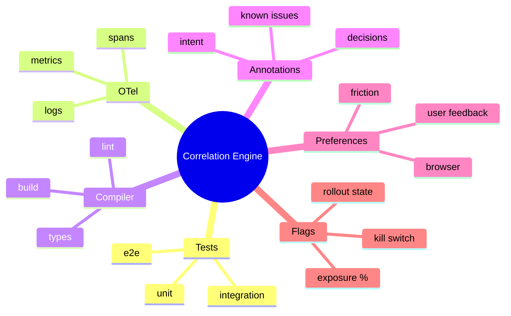
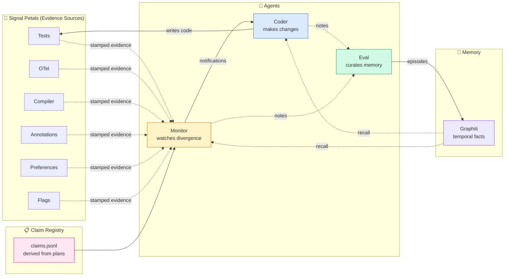
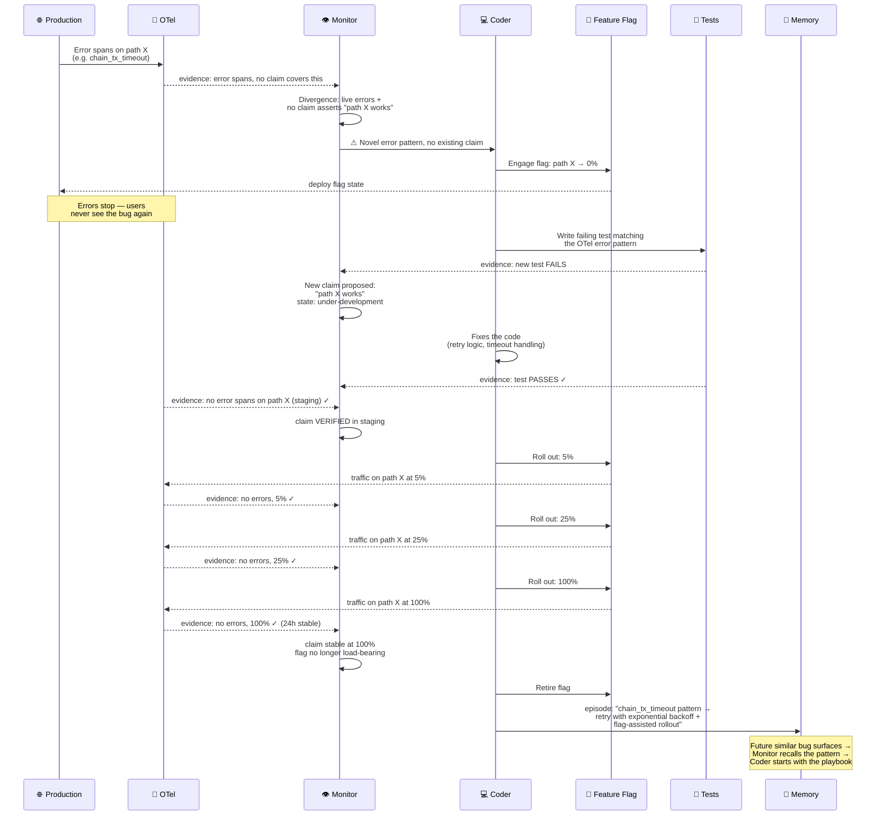

# Signal Correlation — the center of InDusk

InDusk is a project management system for agent-assisted software development that self-improves by correlating development and delivery across every signal.

The core insight: **edges are the product, not nodes**. Every signal source (tests, telemetry, types, annotations, user feedback, feature flags) produces observations about the same reality. When those observations agree, the system is behaving. When they disagree, something's wrong — and the system should notice, route a fix, and remember the pattern for next time.

This page shows the shape of the thing.

## Architecture at a glance

Six petals of signal feed one correlation engine. The center is where divergence gets detected and claims get verified.



Each petal emits **evidence** — observations stamped with a shared identifier protocol (project, service, file, commit, trace, session). The correlation engine doesn't care which petal produced which evidence. It cares whether the evidence across petals agrees about a **claim**.

## Claims, evidence, and the three agents

A **claim** is a commitment: "we claim that X works." Claims live in plans (trajectory rows) with verification criteria that name which evidence sources support them.

**Evidence** is what the petals emit — test results, spans, type checks, annotation matches, user reports, flag rollout stats. Evidence doesn't have a lifecycle; claims do (proposed → under-development → verified → contested → invalidated).

The system runs three agents with asymmetric roles:



**Monitor** reads claims and evidence, flags divergence. **Coder** reads notifications + memory, writes code, emits evidence. **Eval** watches both, curates structured memory. Memory feeds forward into future work.

The information flow is asymmetric:
- **Coder** writes code (only agent that does). Everything else reads or observes.
- **Monitor** writes notifications (only agent that does). Real-time divergence alerts.
- **Eval** writes memory (only agent that does). The durable learning layer.

---

## Example 1 — Test passes, OTel fails

A plan commits to "deposit credits balance." The trajectory row names the claim and its evidence criteria: unit test T passes **and** span S appears on the expected service. Developer ships. Evidence arrives. The two sources disagree.

```mermaid
sequenceDiagram
    participant P as 📋 Plan
    participant C as 💻 Coder
    participant T as 🧪 Tests
    participant O as 📡 OTel
    participant M as 👁 Monitor
    participant E as 🎓 Eval
    participant G as 🧠 Memory

    P->>C: Claim: "deposit credits balance"<br/>Criteria: test T AND span S on service
    C->>C: Writes code + test
    C->>T: Test T runs
    T-->>M: evidence: T passes ✓
    Note over O: Expected span S<br/>never appears
    O-->>M: evidence: no span S ✗
    M->>M: Claim CONTESTED<br/>(tests vs OTel disagree)
    M->>C: ⚠ Notification: test green but span absent
    C->>C: Investigates: test was mocking the outer layer<br/>so the real deposit path never ran
    C->>T: Rewrites test to hit real path
    T-->>M: evidence: T passes ✓ (now hitting real path)
    O-->>M: evidence: span S present ✓
    M->>M: Claim VERIFIED<br/>(all sources agree)
    C->>E: note: "mocked test hid real OTel gap"
    M->>E: note: "test-green + OTel-silent pattern observed"
    E->>G: episode: "tests that mock the outer layer<br/>pass without exercising real telemetry;<br/>always verify with at least one span assertion"
    Note over G: Available for future plans<br/>via trajectory recall
```

**What got learned:** tests that mock too aggressively produce confident green signals without evidence that the real path runs. The memory episode is now recalled automatically when a future plan authors a trajectory row with a test-only criterion — the agent proposes adding a span assertion to match.

**What the next plan experiences:** trajectory authoring pulls the lesson from memory. A criterion like `test.unit: deposit.test.ts passes` gets auto-suggested as `test.unit: deposit.test.ts passes AND telemetry: expected-span-on-real-path`. Same claim, stricter evidence. The system got a notch smarter without the developer having to remember.

---

## Example 2 — Live code bug, feature flag, test, fix, deploy, flag retired

A bug is observed in production via OTel before anyone files a ticket. The system engages a feature flag to cut off the bad path, authors a new test that reproduces the telemetry pattern, fixes the code, verifies across all signal streams, rolls out gradually, and retires the flag when evidence is clean.



**What got learned:** a specific class of bug (chain-tx timeout) has a known remediation pattern (retry with backoff) and a delivery pattern (flag-gated gradual rollout). Next time a similar error surfaces in telemetry, the monitor's notification to the coder includes the pattern recall from memory. The fix is proposed in minutes, not diagnosed from scratch.

**What the organization experiences:** the bug was caught at production-signal speed, not at user-report speed. The flag prevented user-facing impact during the diagnosis window. The fix rolled out with verification at every step. The memory captured the playbook for next time. None of this required a human to be on-call watching dashboards — the monitor correlated the signals and routed work to the coder, which escalated to the human only for decisions that required judgment (fix approach, rollout pace).

---

## What this gives you

**For developers:** you declare intent (claims) once, and the system continuously verifies whether reality agrees. When divergence happens, the agent brings you the notification and the memory context in one breath. No more "tests pass but the thing is still broken" — if the test passes and telemetry disagrees, the monitor sees it immediately.

**For product managers and stakeholders:** every plan's status becomes a legible claim-state report. "Here are the three claims this feature makes; two are verified across six signal sources, one is contested because the preference signal shows users find it slow." Audit-friendly without engineering translation.

**For the organization:** trust in AI-built software comes from verifiable artifacts, not AI testimony. The correlation engine enforces the contract between promised capability and observable reality. Claims are the durable contract; evidence is the mechanical substrate; memory is the learning that compounds across every closed plan.

The spiral iteration principle: all six petals grow together, the center grows with them, new petals sprout when correlation use cases demand them. No single petal needs to be best-in-class. The *combination* is the product.

## See also

- [Test Trajectory](/guide/test-trajectory) — how claims are declared in plan trajectory rows
- [Falsification Ritual](/guide/falsification-ritual) — the adversarial verification loop that runs before retrospective
- [Context Beam](/guide/context-beam) — file-scoped context queries across claim registry + memory
- [Local Telemetry](/reference/telemetry/overview) — the daemon providing runtime evidence
