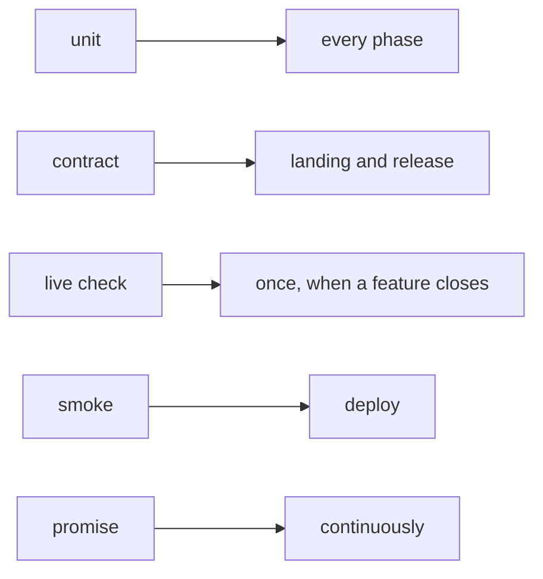

# Test kinds

A test answers one question, and its **kind** says when that question is worth
asking. Every assertion in a test plan names one of five kinds, and every row
of an impl's Test Trajectory carries it.

| Kind | The question it answers | When it runs |
|---|---|---|
| `unit` | Is this rule right? | In the phase that writes it; part of `pnpm test` |
| `contract` | Do we still fit something we do not own: Jaeger's API, npm, a browser, the OS, Claude Code? | `pnpm test:system`, at landing and on release |
| `live check` | Does the whole story work against the real system? | Once, recorded in the plan with its result |
| `smoke` | Is the deployed thing alive? | At deploy |
| `promise` | Is it still true in production? | Continuously, by the watcher |

## The smallest kind that can prove it

An assertion's wording is behavioural: what someone outside sees. Its kind is
usually `unit`, because the behaviour is decided by a rule, and a rule is tested
by feeding it inputs. "A violation that reaches Jaeger late still turns the
chip red" is a rule about what the store reads, so it is a `unit` test. "Jaeger
still answers our query the way we expect" is a question about Jaeger, so it is
a `contract`.

Name the smallest kind that can prove the assertion. Reach for `contract` only
when the question is about the thing you do not own.

## Code that decides takes its clock and its reads

A rule can only be a `unit` test if the test can give it its inputs. Code that
decides takes an optional last argument with its clock and its reads, with the
real ones by default. A test passes a fake that answers from a list, and a clock
it moves. The admin's mark store and health read work this way: nine rules that
took 216 seconds against `next dev` and real Jaeger servers now take under half
a second.

## Two tiers

Each package lists, in `vitest.tiers.ts`, the files that start a server, a
detached process or a packed tarball, or that wait on the wall clock. Those
files are its **system tier**.

- **`pnpm test`** is everything else: rules, in about a minute, with both
  packages in parallel. A phase runs only its own rows' tests and
  `vitest related` over the files it changed. That takes seconds.
- **`pnpm test:system`** runs both packages' system tiers, at landing and on
  release.

No test run is replayed from turbo's cache (`"cache": false` on the `test`
task). turbo keys a cache on a package's own files, and some tests read beyond
their package: the never-wait guard lives in mcp and reads the admin's tests.
A replayed green answers a question about an older tree.

## The suite's own promises

InDusk keeps this the way it keeps anything else, as promises:

- **`everyday-tests-never-wait`** (structure). A guard reads every everyday
  test file in both packages and fails, naming the file, line and call, if one
  starts a server or waits on the clock.
- **`everyday-suite-stays-fast`** (behaviour, watched). Each `pnpm test` run is
  marked held or broken with how long it took. A slow run fails nothing; it
  reads red on the Promises page. A run that overlapped another test run (an
  evaluator's, usually) is not judged, and neither is one that failed in under
  two minutes: a crash at startup measures nothing.

Why: the plan's ADR, `.indusk/planning/test-kinds/adr.md`.
