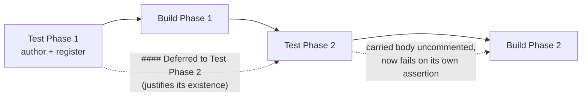

# Test Trajectory

The Test Trajectory is the canonical shape for the testing contract inside every InDusk impl document. It's a single table at the top of `impl.md` that lists every test the plan commits to, with explicit phase-by-phase `Writable at` and `Passes at` columns. Phase Verification sections reference test IDs from this table rather than restating the checks in prose.

This guide covers what the Trajectory is, how to author one, the rules the validator enforces, how untestable items are declared, and the anti-patterns to avoid.

## Why this exists

Across two consecutive plans in a real codebase (`room-state-persistence`, `chain-of-custody-2` in numero), roughly a third of verification items closed without any runnable automated check. Items deferred to "manual check later" or "typecheck passes" and were then forgotten. The most valuable test — restart recovery — was deferred to the end and never completed.

This was not a discipline problem. The old Verification gate was a loose checklist of informal statements that the implementer could satisfy without running anything. The Test Trajectory reshapes the artifact structurally: Verification items must reference named tests from a table, and the `check-gates` hook rejects phase advancement when those tests aren't passing.

The shape draws on:

- **Kent Beck's "Canon TDD" (2023)** — the test list is the artifact; red-green-refactor is mechanics
- **Gojko Adzic's *Specification by Example* (2011)** — "key examples" as a curated, minimal set that defines behavior
- **Google's *Software Engineering at Google* (2020)** — test size/scope/hermeticity vocabulary
- **Aerospace Verification Cross-Reference Matrix** — every requirement gets a verification method + phase, or an explicit deferral with justification

The `Writable at` vs `Passes at` distinction — making it explicit that a test can be authored at one phase and only flip to passing at a later phase — does not appear as a named pattern in mainstream practitioner writing. That's our synthesis.

## The test phase

The trajectory says *when* each test is authored. The **test phase** is where authoring actually happens.

That distinction took a measurement to notice. Across 52 impls, **260 of 444 trajectory rows say `Writable at: Phase 0`** — and the gate that enforces authoring compared `row.writableAt === advancingPhase`, where the advancing phase is never 0. The default path of the system's central discipline could not fire. Worse, "write the tests first" was the only discipline with no home in the document: verification, context, documentation, falsification and cleanup are all sections with checkboxes, while test-first lived as a column value. The deviation had machinery; the rule did not.

So an impl now has **two sequences of phases**, numbered independently and ordered by their position in the document:

```markdown
### Test Phase 1: Author every assertion, RED
### Build Phase 1: The first slice
### Build Phase 2: The second slice
```

`### Phase N` still means build phase N — every impl written before this existed keeps validating, untouched. New impls declare `test_phases: required` and open with `### Test Phase 1`.

### Test Phase 1 is the register

It authors every test that can honestly be authored, and **records every test that cannot**. Three subsections, all read structurally rather than as prose:

| Subsection | Records | Enforced |
|---|---|---|
| `#### Deferred to Test Phase N` | why a *later test phase* exists | required for every `### Test Phase N` where N > 1 |
| `#### Deferred to Build Phase N` | why one test is authored late | reviewed at the phase's close |
| `#### Regression Guards` | rows that pass the moment they are written | required, or the row is refused by name |

A deferral **may carry the deferred test's body** as a fenced code block, and should. It turns a promise into something a reader can check — does this compile at the phase it names, does it assert what it claims — and the artifact persists, unlike terminal output. Code fences are inert to every parser, so the body can contain checkbox- and heading-shaped lines freely.

Two rules about that fence, because the body is arbitrary text and the parsers now depend on it:

- **A fence closes only on its own marker** — same character, at least the same length, nothing after it (CommonMark's rule). So **nest by lengthening**: wrap a body containing ```` ``` ```` in four backticks. A `~~~` inside a ```` ``` ```` block is just text, not a closer.
- **An unterminated fence is refused.** The write is blocked, naming the line the block opened at. The mask deliberately fails *open* underneath — an unclosed fence masks nothing — because the alternative is that one missing backtick silently deletes every phase below it from every parser at once. A loud refusal beats a document that quietly stops meaning what it says.

A **regression guard** is a row whose `Writable at` and `Passes at` name the same test phase: it has no red window. That is legitimate for a guard against regression, or for an assertion about the runner rather than about your code. It is also exactly what a rubber stamp looks like, and nothing can tell the two apart mechanically — so the author says which.

**Every test phase must carry a `#### Test Phase N Verification` gate**, and an impl without one is refused. A test phase has one gate rather than the usual four — Context and Document on a phase that ships nothing would be `(none needed)` noise — but that one is not optional, because it is where the deferred bodies get reviewed. Omitting it would let the phase close having reviewed nothing.



### Real red and fake red

**A test that fails to load has not been authored.** Module resolution happens before test collection, so a file importing a symbol that does not exist yet fails to *load* — the assertion never runs. The exit code is identical to a genuine failure, which is exactly why this needs saying.

`.skip()` does not rescue it. A file whose import cannot resolve fails **even when every test in it is skipped** (asserted against the real runner, not reasoned about). `.skip()` is right when the *symbol exists and the behaviour does not*; it is not a deferral mechanism.

The boundary rule tells you which tests can be authored early:

| Reaches its subject via | Red on day one? |
|---|---|
| HTTP, a CLI, a query, the filesystem, a spawned process | **Yes** — 404, non-zero exit, missing table, no such file |
| `import` of a symbol the plan will create | **No** — the file cannot load |

Prefer the boundary when authoring early. When you cannot, defer into the register with the body carried — which is honest, checkable, and does not pretend.

::: tip Why this is a review and not a check
Distinguishing an assertion failure from a load failure requires reading and interpreting runner output, which this project refuses on principle — that refusal is what kept tool knowledge out of `atdawn verify`. So the compensating control is human: **Test Phase 1 cannot close until its deferred bodies have been reviewed.** Structure can require the field; it cannot require the honesty.
:::

## The shape

Every impl document that opts in (via `trajectory: required` in the frontmatter) has a `## Test Trajectory` section positioned after `## Boundary Map` and before `## Checklist`.

```markdown
## Test Trajectory

| ID | Asserts | Writable at | Passes at | State |
|----|---------|-------------|-----------|-------|
| T1 | `fold(deposit+withdraw)` returns expected derived map | Phase 1 | Phase 1 | planned |
| T2 | stale room row → `checkInvariant` reports delta | Phase 2 | Phase 3 | planned |
| T3 | full chaos scenario 6 produces an approved snapshot | Phase 4 | Phase 5 | planned |

### Deferred Verification

- **End-to-end Stripe production behavior**
  - reason: we cannot hit live Stripe in CI without cost
  - would require: Stripe test account with budget approval
  - mitigation: staging smoke run before each release; recorded fixtures replayed daily in CI
```

### Required columns

| Column | Purpose |
|--------|---------|
| `ID` | Stable handle — `T1`, `T2`, … (or `A1`, `A2`, … — the validator accepts both `T`-prefixed and `A`-prefixed IDs; `A` suits acceptance-style trajectories mirrored from a test plan). Used by phase Verification references |
| `Asserts` | One-sentence description of what the test claims is true |
| `Writable at` | Phase number at which the test can be authored (dependencies exist) |
| `Passes at` | Phase number at which the test flips to passing |
| `State` | `planned`, `writable`, `written`, `passing`, `skipped`, or `blocked` |

### Optional columns

Add when the plan benefits from the extra dimension; the template does not include them by default:

| Column | Values | When to add |
|--------|--------|-------------|
| `Kind` | `example`, `property`, `contract`, `approval`, `formal` | The plan mixes kinds and the distinction matters |
| `Scope` | `unit`, `integration`, `e2e` | Phase cost/runtime varies meaningfully by scope |
| `Test` | Test **file** paths, comma-separated | The plan may be verified with [`atdawn verify`](../reference/cli/verify.md) — which is any plan whose phases might be executed outside a lane Dawn controls |

### The `Test` column and what it unlocks

Until this column exists on a row, the row's `State` is an **unverified self-report**. `check-gates` reads the word `passing` and trusts it; the goalpost guard permits `planned → written → passing` as honest progress. Nothing has ever run the test.

`atdawn verify` closes that — but only for rows that say which files back them:

```markdown
| ID | Asserts                        | Test                     | Writable at | Passes at | State   |
|----|--------------------------------|--------------------------|-------------|-----------|---------|
| A4 | a red row is rejected          | `src/lib/verify/red-tests.test.ts` | Phase 1 | Phase 3 | passing |
```

Three rules worth knowing before you use it:

- **Paths are repo-root-relative.** The test command runs from the repository root, so in a monorepo a package-relative path resolves to nothing. Write `apps/pkg/src/foo.test.ts`, not `src/foo.test.ts`. A path that does not resolve reports the row **unverified** — never as a failing test.
- **A manually-verified row says so.** Prefix the reference with `manual:` (e.g. `manual: .indusk/planning/x/matrix.md`) when a human signed it off. Verify reports it unverified-by-design instead of shelling a record out to a test runner.
- **Files, not test names or line numbers.** Verify runs each file through the project's own test command and reads the **exit code**. That keeps attribution runner-agnostic — matching per-test tags would need runner-specific output parsing, which belongs in an extension, not in core. Line numbers were rejected outright: they move on every refactor, and false failures train you to ignore the tool.
- **A shared file's failure is attributed to every row referencing it.** Over-attribution, deliberately — conservative in the safe direction.
- **A row claiming `passing` with no `Test` reference is reported as _unverified_, never as passed.** The distinction is the point: "could not be checked" and "checked and passed" are different claims, and collapsing them would make the backward-compatible omission a silent hole.

Plans authored before this column existed parse and verify unchanged; their rows simply report as unverified.

## Authoring a Trajectory

When writing an impl (the planner skill does this automatically), walk the accepted ADR's Decision section and ask: "what would prove this decision works?" For each answer, add a row with specific `Asserts` text, phase placement, and initial state `planned`.

Sizing:

- **3–5 rows** for a bugfix or small feature
- **10–25 rows** for a multi-phase infrastructure plan
- **More rows than lines of new code** — over-specified; consolidate
- **Fewer than one row per phase** — likely untested phases; add rows or explicitly declare `(no tests flip at this phase — reason: {schema-only|delete|refactor|infra})`

Prefer one property test over five example tests when the same invariant applies to many inputs.

## Phase Verification references test IDs

Rather than restating the checks in prose, each phase's Verification block lists the test IDs whose `Passes at` equals that phase:

```markdown
#### Phase 3 Verification
- [ ] T1 passes (`pnpm turbo test --filter=reconciler`)
- [ ] T2 passes (`pnpm turbo test --filter=reconciler`)
```

If a phase has no tests flipping at it, declare so explicitly — NOT silently:

```markdown
#### Phase 2 Verification
- [ ] (no tests flip at this phase — reason: schema-only)
```

The allowed reasons are: `schema-only`, `delete`, `refactor`, `infra`. Any other reason fails the validator.

## The validator rules

The `validate-impl-structure.js` hook enforces four core rules when the impl has a Test Trajectory section or `trajectory: required` in frontmatter, plus a fifth rule that fires only when the impl opts in via `rationale: required`:

1. **Trajectory presence** — the `## Test Trajectory` section must exist.
2. **Cross-reference integrity** — every test ID referenced in a phase Verification block must exist in the Trajectory table. Orphaned IDs fail the validator. Phases without test-ID references must declare the `(no tests flip…)` form with an allowed reason.
3. **Temporal coherence** — `Writable at ≤ Passes at` (by phase number) for every row. A test cannot pass before its dependencies exist. Reordering phases that breaks this fails at write time — which is the feedback you want.
4. **Deferred Verification completeness** — every row in `### Deferred Verification` must have non-empty `reason:`, `would require:`, AND `mitigation:` fields.
5. **Rationale completeness** *(opt-in via `rationale: required` in frontmatter)* — every row whose `Writable at` is later than the configured baseline must have a `- **TN** \`Writable at: Phase N\` — {reason}` entry in a `### Trajectory Rationale` subsection. Stale entries (entries for IDs not in the trajectory) are always flagged. See the dedicated section below for the `rationale_baseline` frontmatter key.

## Trajectory Rationale and the `rationale_baseline` key

::: warning Superseded by the register
**A plan with a test phase does not author `### Trajectory Rationale` at all.** Test Phase 1's register is where justification lives now, and the validator skips this rule entirely when a test phase is present — two homes for one fact is a failure this codebase has three separate lessons about. Everything below describes the legacy shape, kept because it is what the existing 52 impls use and they validate unchanged.
:::

Plans that opt in via `rationale: required` in their frontmatter must justify, in a `### Trajectory Rationale` subsection, every row whose test cannot be authored at the writable baseline. The default baseline is **Phase 0** — "writable today against the current stack, before any plan code lands." A row at `Writable at: Phase 0` needs no rationale; a row at `Writable at: Phase 3` does.

Read the rationales as a set after authoring. Shared weak excuses across multiple rows ("waits on the fix landing", "endpoint doesn't exist yet") signal that the plan is over-sequenced — those tests should usually move earlier.

### When the default baseline is wrong

Some plans have **Phase 1 as their enabling work**: schema migrations, refactors that rename core types, scaffolding that has to land before any test can be authored. In those plans, "writable today against the current stack" is meaningless — the current stack is what's being replaced. Every test row would be `Writable at: Phase 1`, every row would need a rationale entry, and the rationale entries would all say the same thing ("can't write this until Phase 1 lands the new shape").

For these cases, the impl frontmatter declares its own baseline:

```yaml
---
title: "Table Lifecycle Unification"
trajectory: required
rationale: required
rationale_baseline: 1
---
```

With `rationale_baseline: 1`, rows at `Writable at: Phase 1` are exempt from the rationale rule (the same way Phase 0 rows are exempt at the default baseline). A row at `Writable at: Phase 3` still needs a rationale — that's a real deferral past the plan's natural starting point.

### Frontmatter key reference

| Key | Type | Default | Effect |
|-----|------|---------|--------|
| `rationale: required` | string | — (off) | Opts the impl into the rationale-completeness validator rule. |
| `rationale_baseline: N` | integer | `0` | Names the phase that counts as "writable at the plan's natural starting point." Rows with `Writable at <= N` are exempt from the rationale rule. Has no effect unless `rationale: required` is also set. |

### When to use a higher baseline

Use `rationale_baseline: 1` (or higher) when:
- Phase 1 IS the enabling work (rename / migrate / scaffold) and tests against the pre-Phase-1 state would require literally reverting production code
- The plan explicitly declares its own writable convention in prose ("Default: every test is authored at Phase 1") and the rationale subsection would otherwise be 40+ identical entries

Do **not** use a higher baseline as a workaround for a plan whose phases are mis-ordered. If most rows look like they could be Phase 0 (writable today) but were marked Phase 1 to avoid red tests during intermediate phases, the fix is to move them to Phase 0, not to raise the baseline.

The validator's error messages are baseline-aware — they read "later than Phase {baseline}" using the actual configured value, so the operator sees the rule the plan declared, not the global default.

## Phase close is structurally enforced

The `check-gates` hook blocks phase advancement when any trajectory row with `Passes at: Phase N` (for N ≤ the phase being advanced into, minus one) is still in state `planned`, `writable`, or `written`. Only `passing`, `skipped`, or `blocked` states allow phase close.

This is the structural guarantee that deferral is impossible by construction. The implementer cannot close Phase 3 and start Phase 4 while Phase-3-committed tests are still unwritten or failing.

## State lifecycle

The work skill maintains the `State` column as the implementation progresses.

```
planned → writable → written → passing
                              ↘ skipped (with reason)
                              ↘ blocked (needs investigation)
```

| State | Meaning |
|-------|---------|
| `planned` | Row exists in the trajectory, no file yet |
| `writable` | Dependencies exist; test can now be authored |
| `written` | Test file exists and runs (fails or `.skip()`) |
| `passing` | Test runs and passes |
| `skipped` | Intentionally `.skip()` with a documented reason |
| `blocked` | Was writable/written, now regressed; needs investigation |

At **phase start**, the work skill reads the Trajectory, commits `Writable at: Phase N` tests as failing (or `.skip()` with an unlock-phase comment), and transitions each row to `written`. At **phase close**, it runs the tests, transitions passing rows to `passing`, skipped rows to `skipped` with a reason, and blocked rows (regressions) to `blocked` for investigation.

## Deferred Verification — untestability as a declaration

Some items genuinely cannot be unit-tested within a plan's scope: LLM output quality, paid external integrations, UX judgment, multi-machine behavior. For these, add a `### Deferred Verification` subsection below the main table. Every row requires three fields:

- `reason:` — why this cannot be tested in this plan
- `would require:` — what would unlock a proper test
- `mitigation:` — the compensating control that keeps us from flying blind in the meantime

The `mitigation:` field is the most important of the three. It forces articulating how we'll notice if the deferred thing breaks. Acceptable mitigation shapes:

- **Telemetry alert** — OTel metric + threshold, Dash0 alert, Grafana trigger
- **Scheduled human review** — weekly/monthly/quarterly spot-check with a named owner
- **Downstream plan** — "a proper test lands in plan `graph-knowledge-architecture`; until then, manual check at release"
- **Canary / staging procedure** — documented smoke run in staging before each release
- **User feedback signal** — support channel routing, feedback widget, tracked ticket category

If you cannot name a mitigation, that is itself a signal — the plan is shipping a capability that cannot be observed. Either reshape the plan so the capability becomes testable, or scope it out. The validator rejecting a mitigation-less row forces this decision at plan time rather than at production-surprise time.

The retrospective skill audits every Deferred Verification row at plan close, classifying each mitigation (telemetry-alert / scheduled-review / downstream-plan / canary-or-staging / feedback-signal / unclassified) and flagging vague ones as retrospective findings that must be resolved or promoted before archive.

## Worked example: a small plan across three phases

Imagine a plan to add a `withdrawFor` function to a smart contract escrow module. Three phases: deploy the escrow, add the withdraw logic, add the admin-gated withdrawal flow.

```markdown
---
title: "withdrawFor — escrow withdrawal path"
trajectory: required
gate_policy: ask
---

## Test Trajectory

| ID | Asserts | Writable at | Passes at | State |
|----|---------|-------------|-----------|-------|
| T1 | Escrow deploys with correct owner + token address | Phase 1 | Phase 1 | planned |
| T2 | `withdrawFor(wallet, player, amount, historyHash)` transfers the tokens | Phase 2 | Phase 2 | planned |
| T3 | `withdrawFor` reverts when caller is not the admin | Phase 2 | Phase 2 | planned |
| T4 | Admin role can be granted and revoked by owner | Phase 3 | Phase 3 | planned |
| T5 | Non-admin attempting admin flow hits revert path T3 | Phase 2 | Phase 3 | planned |

### Deferred Verification

- **Mainnet gas costs**
  - reason: gas costs depend on mainnet state; cannot deterministically assert in CI
  - would require: mainnet fork environment with pinned state
  - mitigation: hardhat gas reporter logged on every PR with threshold alerts on regression >20 percent

## Checklist

### Phase 1: Deploy escrow
- [ ] Escrow contract compiles
- [ ] Deploy script with owner + token address
#### Phase 1 Verification
- [ ] T1 passes (`pnpm hardhat test --grep deploys`)

### Phase 2: Withdraw logic
- [ ] `withdrawFor` implementation
- [ ] Admin modifier
#### Phase 2 Verification
- [ ] T2 passes (`pnpm hardhat test --grep withdraws`)
- [ ] T3 passes (`pnpm hardhat test --grep reverts`)

### Phase 3: Admin flow
- [ ] Admin role storage
- [ ] Grant/revoke functions
#### Phase 3 Verification
- [ ] T4 passes (`pnpm hardhat test --grep admin`)
- [ ] T5 passes (`pnpm hardhat test --grep non-admin`)
```

Note T5's `Writable at: Phase 2` but `Passes at: Phase 3`. The test *can* be authored in Phase 2 (it just calls `withdrawFor` without admin privileges and expects a revert) but cannot pass until Phase 3 adds the admin role machinery. The work skill will commit T5 as failing in Phase 2 and flip it to `passing` in Phase 3.

## Anti-patterns

1. **"(none needed)" in phase Verification.** The old template allowed this. The new template does not. A phase with no tests flipping declares `(no tests flip at this phase — reason: {allowed-reason})` where the reason is one of `schema-only`, `delete`, `refactor`, `infra`. Anything else fails the validator.
2. **Test Trajectory as the compliance artifact nobody reads.** IEEE 829's fate. Mitigation: the Trajectory lives *at the top* of the impl, not in a separate document. Every phase's Verification re-reads it via test IDs.
3. **Over-specifying at plan time.** A 40-row trajectory for a 200-line-of-code plan is over-engineered. Prefer property tests to collapse many example tests into one row. Allow the trajectory to grow during implementation as new tests are discovered.
4. **Deferred Verification as a dumping ground.** Once an escape hatch exists, it gets abused. Mitigation: mitigation field is mandatory and audited by retrospective. Vague mitigations (too short, unclassifiable) must be sharpened before the plan archives.
5. **Tests calcify a bad design.** The classic critique. Mitigation: `Writable at` explicitly defers test authoring until the shape is known. A phase with `Writable at: "after phase 2"` for everything says "we don't know the shape yet, let's spike before writing tests."
6. **Phase boundaries drive false test granularity.** If phases are arbitrary, `Writable at` becomes arbitrary. Mitigation: phases in InDusk impls correspond to natural implementation checkpoints. A phase that exists only to house a test is a planning smell — fold the test into the phase that produces the thing being tested.

## See also

- [Planner skill reference](/reference/skills/plan) — how the Trajectory is authored when an impl is written
- [Work skill reference](/reference/skills/work) — phase-start and phase-close responsibilities
- [Trajectory parser reference](/reference/trajectory/parser) — the TypeScript types, parser, and four validator functions
- [Tests-first-within-each-phase lesson](/lessons/tests-first-within-each-phase) — the community lesson every project inherits
- `.indusk/planning/tests-first-planning/adr.md` in the repo — full design rationale with alternatives considered
