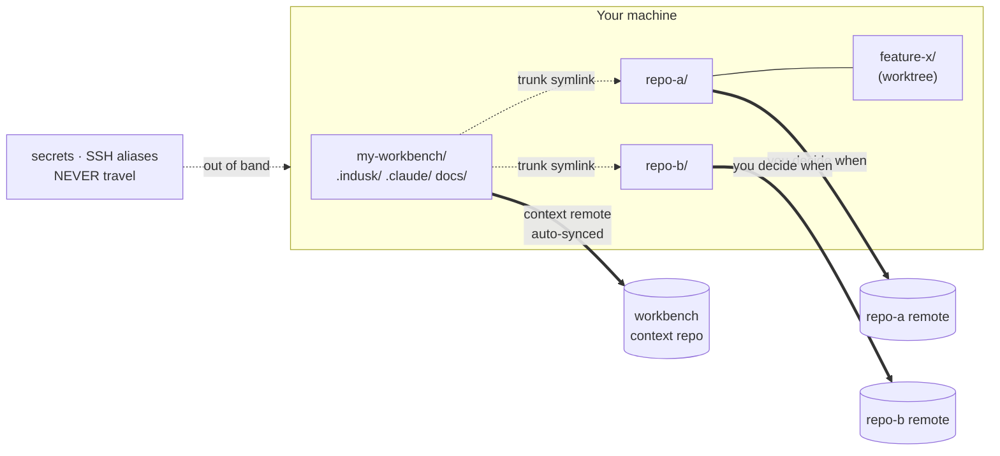

# Sharing a Workbench

A workbench is a directory that wraps one or more repos and holds the InDusk
context for work on them — plans, lessons, `current.md`, docs. This guide is how
that context reaches a teammate, or your other machine.

## What travels, and what does not



**Travels automatically:** `.indusk/` (plans, lessons, `current.md`), `.claude/`,
`docs/`, `env/`, `scripts/`.

**Never travels:** trunk symlinks, worktree directories, `node_modules/`,
`.indusk/eval/` (machine-local), and every secret — `env/*.env`,
`.indusk/extensions/*/.env`, repo-local config, SSH host aliases.

**Travels on your schedule, not automatically:** the wrapped repos. Product code
keeps its own remotes and its own cadence. The sync loop never commits there —
that is the commit-siloing contract, and it is tested.

## Onboarding a second developer (or your second machine)

```bash
git clone <workbench-remote> my-workbench
cd my-workbench
indusk workbench restore     # clones every declared repo, relinks the trunks
# supply the out-of-band files restore just listed
indusk update                # align skills/hooks for this machine
```

`restore` prints exactly what it could not supply. That list is the checklist —
if you needed something it did not name, that is a documentation bug worth
filing.

## How syncing works

One mechanism, `indusk workbench sync`:

1. **Commit** anything local, with a timestamp message.
2. **Pull**, resolved blindly.
3. **Push**, retrying once through a re-pull if rejected.

It runs automatically on a debounced `PostToolUse` hook while an agent is
working, and at `/catchup`. You can always run it by hand.

**Commit happens before pull**, which looks backwards next to "pull before
everything". The property that matters is *both sides are committed before any
merge* — that is what makes blind resolution safe, because nothing lost is
unreachable from `git log`. Pulling into a dirty tree would either refuse
(blocking you) or stash (a third state nobody can see).

**Conflicts are resolved without asking you.** `merge=union` on the
append-shaped files (`current.md`, `highlights.jsonl`) keeps *both* sides —
two machines appending different lines both meant it. Everything else takes the
incoming side. You will never be asked to resolve a workbench conflict.

**Offline is normal.** Commits always succeed locally. If the remote is
unreachable, sync says so calmly and exits 0; the backlog goes out on the next
sync. Someone else's outage never becomes your inability to work.

## The two-clock skew

Plan documents sync in seconds. The code they describe pushes when you decide.
So a teammate can pull a phase marked complete before the commits behind it
exist anywhere but your laptop.

Nothing corrupts — but "done" and "present" become two questions on two clocks,
and the plan is the faster one. `indusk workbench status` answers the second:

```
  repo-a: 3 commit(s) ahead of its remote — NOT PUSHED, so a teammate
          pulling this workbench cannot see that work yet
  repo-b: in sync with its remote
```

## Known limits

- **Branches must be pushed to be recreatable**, and uncommitted work never travels.
- **Secrets and SSH host aliases are permanently out of band.** Not a gap to close — a boundary.
- **`indusk verify` refuses inside a workbench.** Plan documents and code live in
  different repositories, and the verify ledger's baseline has no meaning in the
  code repo. It refuses rather than judging code by a diff that cannot contain
  it. Cross-repo verification is a named follow-on. See
  [`indusk verify`](../reference/cli/verify.md).
- **Editing outside a Claude Code session does not auto-sync yet.** The trigger is
  an agent-write hook plus `/catchup`; a watcher daemon that would catch IDE
  edits is deferred until the gap is felt. Run `indusk workbench sync` by hand.

## See also

- [`indusk workbench`](../reference/cli/workbench.md) — restore, sync, status
- `/decisions/versioned-workbench` — why the repo set lives in `config.json`, and
  why files rather than a shared database
