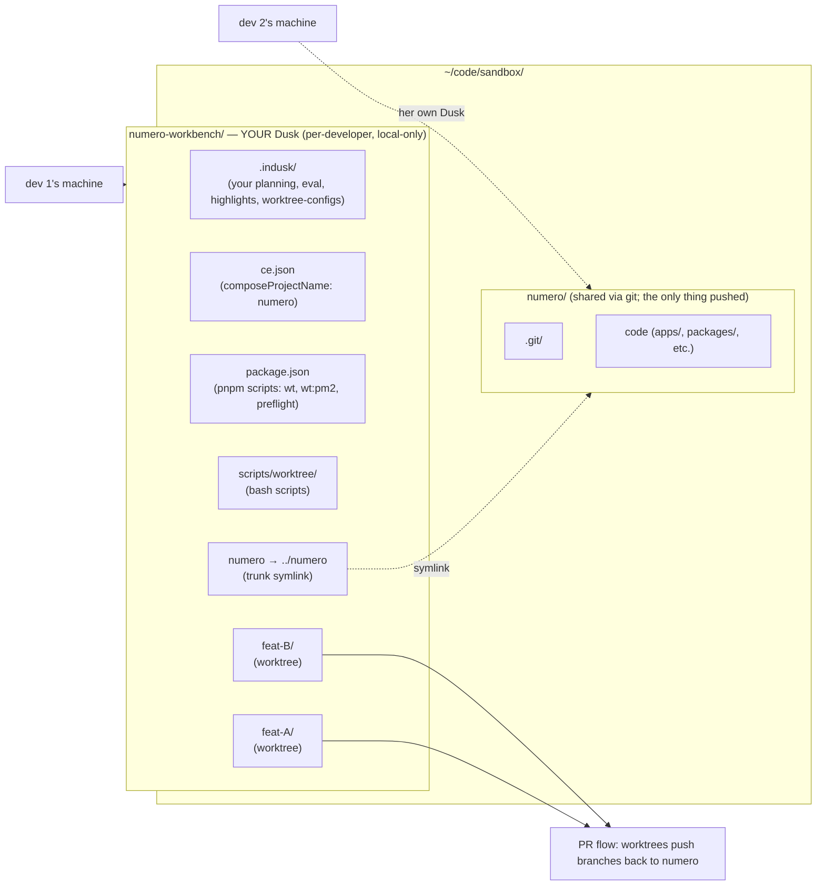

# Worktree extension — setup workflows

Two ways to land in a working workbench:

- **[Flow A — Fresh setup](#flow-a-fresh-setup-on-a-new-machine)** — new machine, new dev, or a project that's never had InDusk before. The standard path; everything you do every day.
- **[Flow B — Migration](#flow-b-migrate-an-existing-project-from-baked-in-indusk-state-to-workbench-mode)** — one-time-per-project conversion when you already have InDusk planning/eval/highlights state living inside the project's repo that you want to move out into a separate per-developer workbench.

Both flows assume you've installed `@infinitedusky/indusk-mcp` globally and have version ≥ 1.28.26 (the version that ships the `worktree` extension).

```sh
pnpm i -g @infinitedusky/indusk-mcp
indusk --version    # must be >= 1.28.26
```

---

## Flow A — Fresh setup on a new machine

The mental model: **the wrapped repo is the only versioned/shared thing. The workbench (Dusk) is per-developer scaffolding around it. Plans, scripts, and worktree configs live in your local workbench — not in the wrapped repo, not in a shared workbench repo.** Another dev on another machine does the same flow against the same wrapped repo and gets their own independent workbench.

### Topology



The diagram makes the asymmetry explicit: dev 1 and dev 2 each have their own private Dusk wrapping the same numero. Their planning and worktree-configs are independent. Only numero's branches/PRs cross the boundary.

### Layout you're building toward

```
~/code/sandbox/
├── numero/                          # the wrapped repo — versioned, shared via PRs
│   └── .git/
└── numero-workbench/                # YOUR personal Dusk — local-only, never pushed
    ├── .indusk/                     # your planning, eval, highlights, worktree-configs
    │   ├── config.json              # worktree.{shape, wrapped_repo, sibling_parent}
    │   └── worktree-configs/numero.json
    ├── numero -> ../numero          # symlink to the trunk
    ├── feat-cancel-polish/          # worktrees as siblings of the trunk
    ├── feat-another-thing/
    ├── ce.json                      # composable.env config (composeProjectName = "numero")
    ├── package.json                 # pnpm scripts: wt, wt:pm2, wt-setup, wt-refresh, preflight
    └── scripts/worktree/            # the bash scripts the extension scaffolded
```

### Step by step

#### 1. Choose locations + clone the wrapped repo

```sh
mkdir -p ~/code/sandbox
cd ~/code/sandbox
git clone <numero-repo-url> numero
```

Now you have `~/code/sandbox/numero/` with a `.git/` directory. **Don't add InDusk stuff to numero itself** — the wrapped repo stays clean. Your Dusk lives next to it.

#### 2. Create the workbench dir + minimal `package.json`

```sh
mkdir ~/code/sandbox/numero-workbench
cd ~/code/sandbox/numero-workbench

cat > package.json <<EOF
{
  "name": "numero-workbench",
  "version": "0.0.1",
  "private": true
}
EOF
```

The `package.json` is required because `indusk init --workbench` merges pnpm scripts into it. Minimal content is fine; no dependencies needed.

#### 3. Initialize the workbench

```sh
indusk init --workbench --wrapped-repo numero --sibling-parent ~/code/sandbox
```

What this does in order:
1. Validates that `~/code/sandbox/numero/.git` exists (the canonical clone you just made).
2. Creates the trunk symlink: `~/code/sandbox/numero-workbench/numero -> ../numero`.
3. Writes `.indusk/config.json` with `worktree.{shape: "workbench", wrapped_repo: "numero", sibling_parent: "~/code/sandbox"}`.
4. Scaffolds the standard InDusk project files (`CLAUDE.md`, `.claude/settings.json`, `.indusk/planning/`, etc.).
5. Enables the `worktree` extension, which scaffolds:
   - `scripts/worktree/` (setup, refresh, wt, wt-pm2, preflight scripts + lib helpers)
   - Five pnpm scripts in `package.json` (`wt`, `wt:pm2`, `wt-setup`, `wt-refresh`, `preflight`)
   - A starter `.indusk/worktree-configs/numero.json` with `compose_project_name: "numero"`

#### 4. Verify

```sh
indusk worktree list
```

Should print:

```
Workbench:    /Users/<you>/code/sandbox/numero-workbench
Wrapped repo: numero
Trunk:        numero → ../numero (resolves)
Config:       /Users/<you>/code/sandbox/numero-workbench/.indusk/worktree-configs/numero.json (config valid)

Worktrees:    (no worktrees) — `indusk worktree create <slug>` to add one
```

#### 5. Tune the worktree config (optional)

Open `.indusk/worktree-configs/numero.json` to:
- Add `copy_files[]` — files copied from the canonical clone to every new worktree (e.g., `.env.example` → `.env.local`)
- Add `apply_commits[]` — upstream-file-overlay entries for files pinned to a specific SHA (invisible to `git status` — see [the reference page](/reference/extensions/worktree#per-repo-config-indusk-worktree-configs-repo-json) for the upstream-file-overlay vs cherry-pick distinction)
- Add `preflight[]` entries — pre-push checks scoped to changed files (`pnpm biome check $CHANGED_FILES_BIOME` etc.)
- Add declarative `preflight_env{}` glob filters (e.g., `MIGRATIONS_RELEVANT: ["packages/db/migrations/**"]`)

#### 6. Set up `composeProjectName` (if you use docker)

In `~/code/sandbox/numero-workbench/ce.json`, add:

```json
{
  "envDir": "env",
  "defaultProfile": "local",
  "scaffold": "docker",
  "composeProjectName": "numero",
  "profiles": { "local": { /* ... */ } }
}
```

This pins docker-compose's project name to `"numero"` regardless of cwd. From any worktree you can `pnpm ce dc:up local`; from the workbench root you can `pnpm ce dc:logs` or `pnpm ce dc:down` and they address the same stack. **Tradeoff: only one stack per repo can run at a time** — see [the reference page](/reference/extensions/worktree#composeprojectname-cross-cwd-docker-compose-targeting) for the full discussion.

#### 7. Create your first worktree

```sh
indusk worktree create feat-cancel-polish
cd feat-cancel-polish
# or:
pnpm wt feat-cancel-polish dev
```

`pnpm wt <slug> <cmd>` cd's into the worktree dir and runs `pnpm <cmd>` there — so `pnpm wt feat-cancel-polish dev` runs the worktree's `dev` script in the worktree's env. `pnpm wt feat-cancel-polish ce dc:up local` runs ce composition inside the worktree (worktree's `.env.local` wins over trunk's).

#### 8. Standard work loop

```sh
# Make changes in the worktree
cd ~/code/sandbox/numero-workbench/feat-cancel-polish
git add -p && git commit -m "..."

# Run pre-push checks
indusk worktree preflight feat-cancel-polish

# Push + open PR
git push -u origin feat-cancel-polish
gh pr create
```

The worktree is just a git worktree of numero — `git push` pushes to numero's remote like any other branch.

### What another dev does

They run **the same Flow A on their machine.** They get their own `~/code/sandbox/numero-workbench/` with their own `.indusk/` containing their own planning history. Nothing about their workbench gets pushed to numero. The only shared thing is the wrapped repo and its branches/PRs.

---

## Flow B — Migrate an existing project from baked-in InDusk state to workbench mode

Use this once per project, when you already have a project that's been using InDusk in the project root (with `.indusk/planning/`, `.indusk/eval/`, etc.) and you want to convert it to the workbench pattern so worktrees stop duplicating state.

**The migration's job is to move InDusk state OUT of the wrapped repo and into a sibling workbench.** After the migration, the wrapped repo is "scrubbed" — no `.indusk/`, no `.claude/`, just pure code. Each developer (you first; teammates later) sets up their own workbench via [Flow A](#flow-a-fresh-setup-on-a-new-machine) against the scrubbed repo.

### Before you start

Snapshot the existing state — the migration is reversible but a backup makes the recovery path trivial:

```sh
cd ~/code/sandbox/numero
cp -r .indusk ~/numero-indusk-backup-$(date +%Y%m%d)
cp -r .claude ~/numero-claude-backup-$(date +%Y%m%d) 2>/dev/null || true
```

### Step by step

#### 1. Stop any running services

If you have docker-compose stacks, telemetry daemons, or admin-UI daemons running against numero, stop them before the migration so registry entries can be cleanly re-written:

```sh
cd ~/code/sandbox/numero
pnpm ce dc:down 2>/dev/null || true
indusk ui stop 2>/dev/null || true
# (telemetry daemon keeps running — we'll re-point it in step 6)
```

#### 2. Create the workbench dir alongside numero

```sh
mkdir ~/code/sandbox/numero-workbench
cd ~/code/sandbox/numero-workbench

cat > package.json <<EOF
{
  "name": "numero-workbench",
  "version": "0.0.1",
  "private": true
}
EOF
```

The wrapped repo (numero) stays at its current location. **Don't move numero.**

#### 3. Run `indusk init --workbench`

```sh
indusk init --workbench --wrapped-repo numero --sibling-parent ~/code/sandbox
```

Same as Flow A step 3 — this creates the trunk symlink, writes config.json, scaffolds the worktree extension. After this you have an empty workbench (no planning history yet).

#### 4. Move InDusk state into the workbench

```sh
# Move the directories you want to preserve from numero to the workbench
mv ~/code/sandbox/numero/.indusk/planning ~/code/sandbox/numero-workbench/.indusk/planning
mv ~/code/sandbox/numero/.indusk/eval ~/code/sandbox/numero-workbench/.indusk/eval     2>/dev/null || true
mv ~/code/sandbox/numero/.indusk/highlights.jsonl ~/code/sandbox/numero-workbench/.indusk/highlights.jsonl 2>/dev/null || true
mv ~/code/sandbox/numero/.indusk/highlights-processed.jsonl ~/code/sandbox/numero-workbench/.indusk/highlights-processed.jsonl 2>/dev/null || true
mv ~/code/sandbox/numero/.indusk/research ~/code/sandbox/numero-workbench/.indusk/research 2>/dev/null || true
mv ~/code/sandbox/numero/.indusk/lessons ~/code/sandbox/numero-workbench/.indusk/lessons 2>/dev/null || true
```

What you do NOT move:
- `.indusk/config.json` — the workbench has its own, written by step 3
- `.indusk/extensions/` — the workbench has its own extension scaffolding
- `.indusk/graph/` — semantic graph state; regenerable, drop it

#### 5. Verify the workbench has your planning state

```sh
cd ~/code/sandbox/numero-workbench
indusk worktree list
ls .indusk/planning/  # should show your existing plans
```

If `worktree list` reports `(config valid)` and `.indusk/planning/` contains your plans, the move worked.

#### 6. Re-register with the telemetry + admin UI registries

```sh
# Telemetry daemon registry
indusk telemetry deregister ~/code/sandbox/numero
indusk telemetry register ~/code/sandbox/numero-workbench
```

For the admin UI registry, hand-edit `~/.indusk/projects.json` — change the `numero` entry's `path` from `~/code/sandbox/numero` to `~/code/sandbox/numero-workbench` (and update `lastSeenAt` if you care).

#### 7. Scrub numero in a PR

The wrapped repo (numero) still has leftover InDusk plumbing files that you don't want shipped to teammates. Open a PR against numero that deletes:

```
.indusk/                  (the now-empty leftover after step 4)
.claude/                  (skills, hooks, settings — all per-dev concerns)
CLAUDE.md                 (if numero has one; the workbench owns project memory now)
.cgcignore                (extension scaffolding leftover)
.mcp.json                 (per-machine; should already be gitignored)
```

Plus any `*.md` files under the wrapped repo that were really InDusk planning artifacts.

Result: numero becomes a clean turbo repo. Anyone else who clones it via Flow A gets a pristine codebase + sets up their own workbench independently.

#### 8. Recreate any existing git worktrees inside the new workbench

If you had active git worktrees of numero somewhere (e.g., `~/code/sandbox/numero.worktrees/cancel-polish/`), recreate them inside the workbench:

```sh
cd ~/code/sandbox/numero-workbench

# For each old worktree:
indusk worktree create cancel-polish
# Then transplant your in-flight work via cherry-pick or branch checkout

# Remove the old worktree once you've migrated its work
cd ~/code/sandbox/numero
git worktree remove ~/code/sandbox/numero.worktrees/cancel-polish
```

#### 9. Verify end-to-end

```sh
cd ~/code/sandbox/numero-workbench
indusk worktree list                              # config valid + worktrees listed
indusk worktree create migration-smoke            # can create new worktrees
pnpm wt migration-smoke pwd                       # cd's to the worktree correctly
indusk worktree preflight migration-smoke main    # preflight works
git -C migration-smoke rev-parse --git-dir        # per-worktree gitdir points into numero's .git/worktrees/
```

If all four succeed, the migration is done.

---

## Decision tree

| Situation | Flow |
|---|---|
| Brand new machine; never used numero here before | A |
| Brand new dev joining the team | A |
| You're on a machine that has numero but no `.indusk/` state in it | A |
| You're on a machine where numero has `.indusk/` state you want to preserve | B (then anyone else uses A) |
| Numero's git repo has `.indusk/` committed to it | B + scrub PR |

## What survives, what doesn't

| Artifact | Per-developer (lives in workbench) | Shared (lives in wrapped repo) |
|---|---|---|
| Plans (`.indusk/planning/`) | ✓ |  |
| Eval results (`.indusk/eval/`) | ✓ |  |
| Highlights (`.indusk/highlights*.jsonl`) | ✓ |  |
| Worktree config (`.indusk/worktree-configs/numero.json`) | ✓ |  |
| `composeProjectName` in `ce.json` | ✓ |  |
| Code | | ✓ |
| Commits + branches | | ✓ |
| Tests | | ✓ |
| `package.json` (dependencies) | | ✓ |

The tradeoff is deliberate: shared knowledge artifacts (plans, lessons, eval history) don't sync between teammates. The benefit is that the wrapped repo stays clean, and nothing about your local InDusk usage forces convention on anyone else. The cost is that a new teammate sees an empty `.indusk/planning/` when they set up their workbench — they don't inherit your history.

If team-shared planning becomes important later, that's a follow-up plan (likely: a separate planning-history git repo, or a shared workbench convention). For solo work or async-collaborative work where each dev's planning is independently useful, this trade-off is the right one.
