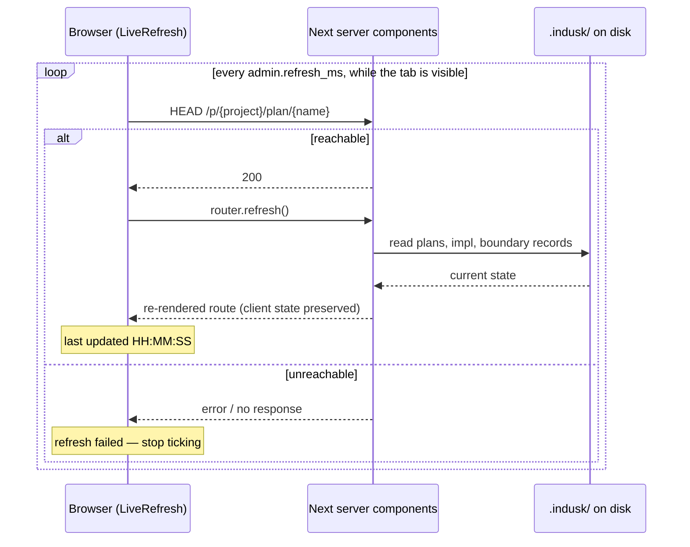

# Admin UI — Overview

The InDusk admin UI is a read-only viewer over every InDusk project's `.indusk/planning/` and `.indusk/eval/` directories. It's the first Arc 1 demo asset: a visible, demoable surface for the working agent's flow (plans, phases, trajectory rows, falsification logs, eval scorecards).

Since 1.27.0 it runs as a **single long-lived local daemon** — one Node process serves every InDusk project on your machine, not a new Next.js instance per project. You start it once with `indusk ui start`, close your terminal, and it keeps running in the background until you `indusk ui stop`.

## The daemon model

```mermaid
sequenceDiagram
    actor You
    participant CLI as indusk ui start
    participant Daemon as Admin UI daemon<br/>(detached Node)
    participant Registry as ~/.indusk/projects.json
    participant Browser
    participant FS as Project .indusk/

    You->>CLI: indusk ui start
    CLI->>CLI: check ~/.indusk/admin-ui.pid<br/>(already running? no-op)
    CLI->>Registry: read registered projects
    CLI->>Daemon: spawn detached: next start -p <port>
    Note over Daemon: writes pid, port, log<br/>to ~/.indusk/admin-ui.*
    CLI->>Browser: open http://localhost:<port><br/>(cwd-aware: /p/{project}/ or /)
    CLI-->>You: "Admin UI running at ..."<br/>(CLI exits; daemon persists)

    Browser->>Daemon: GET /p/{project}/plan/{name}
    Daemon->>Registry: resolve project name → path
    Daemon->>FS: read planning/{name}/*.md, eval/results.log
    Daemon-->>Browser: rendered plan page
```

The daemon reads `~/.indusk/projects.json` on every request, so newly `indusk init`'d projects appear without a restart. It does not watch the filesystem — each browser request re-reads from disk, which is fine at the scale of a single developer's local projects.

When you close your terminal, the daemon survives: it was spawned with `detached: true` and inherits no parent process handles. `indusk ui stop` finds it via the pid file and sends SIGTERM.

## The registry

`~/.indusk/projects.json` is the canonical list of projects the admin UI knows about. It's populated by two CLI commands:

- **`indusk init`** — appends a new entry for the project it's initializing (`addProject(projectRoot)`)
- **`indusk update`** — validates the entry exists and matches the current path, touching its `lastSeenAt` timestamp (`validateProject(name)` + `touchProject(name)`, or `addProject` if the entry is missing or diverged)

Registry entries look like:

```json
{
  "version": 1,
  "projects": {
    "dusk": {
      "path": "/Users/you/code/dusk",
      "registeredAt": "2026-04-19T...",
      "lastSeenAt": "2026-04-20T..."
    },
    "numero": { ... }
  }
}
```

No auto-pruning. If a registered project's path is deleted from disk, `indusk ui status` still lists it and `/p/{name}/` renders a **stale failure page** (HTTP 200 with a "needs reconfiguration" affordance — never 500 or 404). Recovery is user-action-only: `cd` to the project's current location and run `indusk update`, or hand-edit `~/.indusk/projects.json`. The registry is mutated only by CLI commands.

## Routing tree

```
/                                    # Project grid — one card per registered project
/p/{project}/                        # Per-project home (sidebar + empty state)
/p/{project}/scorecards              # Per-project eval scorecards (1.27.2+)
/p/{project}/plan/{name}             # Plan detail page
/p/{project}/research/{slug}         # Per-project standalone research (1.27.2+)
```

Everything is project-scoped under `/p/{project}/...`. The top-level home at `/` is the cross-project entry point (project grid); there is no other cross-project view. The grid shows every registered project whose path exists, each card labelled `workbench` (its config declares repos — the package's `isWorkbench`, never inferred from layout) or `normal-mode`; entries whose path is gone are not projects and are listed in a collapsed "not found (n)" note that points at [`indusk ui prune`](./cli#indusk-ui-prune-dry-run). 1.26.0/1.27.0 had a top-level `/scorecards` that walked every registered project — **removed in 1.27.2** in favor of per-project scorecards at `/p/{project}/scorecards`. The per-project layout at `app/p/[project]/layout.tsx` owns the sidebar, plan list, Scorecards link, Research group, and project switcher; the root layout (`app/layout.tsx`) is global-nav-only.

## What each page shows

**`/` (project grid)** — one card per registered project with name, path, last-seen-at, and active-plan count. Clicking a card navigates to `/p/{name}/`.

**`/p/{project}/` (per-project home)** — sidebar + empty-state main pane. Sidebar structure (top to bottom):

1. **Header** — project name + `<ProjectSwitcher>` to jump between registered projects.
2. **Scorecards and Promises links** — direct to `/p/{project}/scorecards` and `/p/{project}/promises` (always present).
3. **Plan list** — one root node (the root `master.md`'s title) with the declared parent groups and every unclaimed plan beneath it (admin-ui-phase-progress, 2026-09-16): active plans in the order declared by `.indusk/planning/master.md` pipeline tables, then "Unordered" for plans not in master. `Archived (N)` stays outside the root, collapsible at the bottom. Each plan link routes to `/p/{project}/plan/{name}`. No root master → no root node, the tree renders flat.
4. **Unassigned worktrees** — every worktree of the project's repository that holds no plan assignment, with its branch (admin-plan-worktrees, 2026-09-18). Omitted when there are none.
5. **Research group** — listed slugs from `.indusk/research/` when the directory exists and contains at least one entry; omitted entirely when empty.

Switching projects via the header does not restart the daemon — the registry resolves on every request.

**Which copy of a plan is shown.** Every plan is worked in its own worktree, so a project holds several copies of it. The admin reads each active plan from its **live copy**: from the worktree it is assigned to (by [`indusk worktree create` or `assign`](/reference/cli/worktree)), from the registered trunk otherwise. The documents, the progress lines and the active phase all come from that copy, including the phase-boundary record the worktree wrote. What the page says about it:

| Case | Plan row and header | Notice under the header |
|---|---|---|
| Read from its worktree | a `⎇ <worktree>` chip | "Read from the worktree … on `<branch>`" |
| Assigned worktree removed without release | no chip; trunk copy shown | "The assigned worktree `<path>` no longer exists — showing the trunk copy" |
| Two live worktrees assigned (a hand-edited record) | no chip; trunk copy shown | both worktrees by path |
| Archived on its branch, before the release (retrospective Step 9 → Step 10) | the chip; the worktree's archived copy shown | "archived in its worktree …, awaiting landing" |
| Plan folder gone from its worktree | no chip; trunk copy shown | "The plan folder missing in worktree `<path>` … — showing the trunk copy" |
| Not assigned | as before | none |
| Assignment record unreadable | name and `unknown` only | an error naming the record's file; no progress is drawn, because which copy is live is unknown. The sidebar carries the same error above the plan list. |

The resolver applies when the registered path is the top of a git checkout — the project is the repository. A project nested inside a larger repository reads the folder it was registered at, as before.

**`/p/{project}/plan/{name}` (plan detail)** — opens as the overview: three progress lines under the header, then every document section collapsed (admin-ui-phase-progress, 2026-09-16). The lines are a zoom, and each one's label names the level below it:

| Line | Segments | Active label |
|---|---|---|
| **Plan bar** | every lifecycle position, research → archived (→ monitor), from the package's `PLAN_POSITIONS` | what the position awaits — `brief draft, awaiting acceptance` — or, while executing, the phase: `executing: Phase 4` |
| **Phase line** | every phase of the impl in document order | the phase and its active stage: `Phase 4: Verification` |
| **Stage bar** | the active phase's stages — implementation items, then each gate it carries | the verb and the item being worked: `verifying: A6 green… (6 of 7)` |

The active segment always carries a message, and the message never claims a fact the reader does not hold (falsification A29, A33). Three plan-bar messages exist for the cases where the obvious one would have lied: a completed impl whose rituals are terminal but whose trajectory still has a non-terminal row reads `rows not terminal — retrospective blocked (A7)` rather than "cleaned, awaiting /retrospective", because the retrospective gate would refuse; a completed impl whose `impl.md` could not be read reads `impl complete — readiness unknown (impl unreadable)` and sits at `falsify`, the earliest position a completed impl can hold; an `in-progress` impl with every item checked has no active phase to speak for it and reads `every item checked — impl status is still in-progress`. A stage with nothing in it is not drawn (A32): the parser always emits an implementation gate, and a phase with only gate items — a falsification phase whose hypotheses all held — closes when its gates do rather than reading "implementing 0 of 0" forever.

Every segment is one of `done` / `active` / `pending` / `skipped` (a gate can also be `opted-out`): done full, pending empty, skipped drawn empty with a dashed border so a plan's bar keeps its shape, active partially filled by its own n of m. Segments are equal width and the plan bar says so — *steps, not time* — with one exception: **`monitor`** (day-monitor) fills with the share of the quiet window that has passed, and the caption says so. A closed plan holding a behaviour promise is in `monitor` until its promises have been quiet for `promises.quiet_window_days` (default 7), its active label reading `2 of 7 days quiet`, or `window restarted 2026-09-18 — 0 of 7 days quiet` after a violation. An archived plan reopened by an incident's Maintenance phase reads **executing** that phase. Both are derived from files by the package's `promises/after-close` subpath, the same function `list_plans` reads. A parent plan shows a **master bar** instead of a plan bar: one segment per declared subplan, closed ones full, in-flight ones partial, declared-but-missing ones empty, labelled `n of m closed, k executing`.

**The page is live.** A small client wrapper, `LiveRefresh`, ticks every `admin.refresh_ms` from the project's `.indusk/config.json` (default 5000 ms, floor 1000; absent means default, and `indusk update` never writes the key). Each tick sends a `HEAD` to the page itself as a reachability probe and then calls Next's `router.refresh()`, which re-runs the server components for the route and streams the new tree in — so a checkbox written to `impl.md` reaches an open page within one interval, and the viewer's open sections and scroll position stay where they were. It says what it is doing (`last updated 14:02:11`), pauses while the tab is hidden, and when a probe fails it stops and says `refresh failed — reload the page to resume` rather than showing a stale page as live. There is no route handler, no fetch of a second data shape and no socket: one render path, whole-route re-render, which is the trade the ADR accepted at the daemon's scale.

**The Promises page is live the same way** (day-always-on). A violation reaching a deployed system's server has to turn its chip red without anyone reloading, or the page is a snapshot pretending to be a status board. Same wrapper, same interval — which is also the health read's cache lifetime, so one tick is one Jaeger read. No other page polls.



**Which phase is active.** The phase with the most recent boundary record (`.indusk/phase-boundary.jsonl`) among phases that still have unchecked items. A phase with everything checked is closed whatever its record says. With no records at all, the first open phase in document order is shown with the hint *no boundary record*, never as a confident marker. A malformed record file renders an error block and marks nothing active.

Sections render conditionally on which documents are present, all closed by default:

| Section | Source | Behavior |
|---------|--------|----------|
| Header | `name` + computed `status` | Always visible — name, archived/active marker, status badge |
| Malformed banner | `plan.malformed` | Red banner when any document failed to parse |
| Raw documents | `plan.rawDocuments` | One CollapsibleSection per malformed file with raw markdown in a `<pre>` |
| Brief | `brief.md` | Collapsible (1.27.2+) Markdown render, defaulted to open — parity with Test Plan + ADR |
| Test Plan | `test-plan.md` | Collapsible Markdown render |
| ADR | `adr.md` | Collapsible Markdown render |
| Papers | any document declaring `kind: paper` | One CollapsibleSection per paper, its status badge beside the title. Status comes from the shared parser (`draft` / `accepted` / `published` / `malformed`); the `published (stale)` label is derived on every read from the content hash the publish recorded, never stored, so a paper edited after publishing shows stale with no write anywhere. A papers-only plan (no lifecycle document) renders this section, takes the parser's paper-stage status as its header status, and renders no Falsification section. Publishing is `indusk papers publish` — see [`indusk papers`](/reference/cli/papers) |
| Phases | `impl.md` | One CollapsibleSection per phase heading — `### Test Phase N`, `### Build Phase N` and the legacy `### Phase N` — in document order, EXCLUDING the falsification phase (see next row). Parsed by the package's own `parseImplString` (the `impl-parser` subpath), never a local regex, so the admin sees exactly the phases the hooks and `verify` see. The header carries a **stage strip**: the implementation items as `n of m`, then each gate the phase has (Verification, OTel where the project emits it, Context, Document), each `done` / `active` / `pending` / `opted-out` — an opted-out gate shows its conversation proof. The body holds the trajectory `<Table>` (rows whose `Passes at` names this phase by kind AND number, cells spelled `Test Phase 1` / `Build Phase 2`) followed by the phase's full markdown |
| Falsification (1.27.6+ phase path) | `impl.md` phase whose title starts with `Falsification` | Hypotheses table from the phase's trajectory rows (ID / Asserts / State) plus a Fix items list from the phase's `- [ ]` / `- [x]` checklist. Status badge reads `complete` when all rows are `passing`/`skipped` AND no unchecked items remain |
| Falsification (legacy) | `falsification.md` | Used only when impl.md has no falsification phase. One entry per hypothesis, outcome-color-coded (`fix-in-scope` → green, `spawn-plan` → blue, `accept-finding` → gray) |
| Follow-up Phases (1.27.6+) | `impl.md` phases AFTER the falsification phase | Same CollapsibleSection shape as regular Phases but in its own section below `Falsification`. Hidden when no post-falsification phases exist |
| Scorecards | `.indusk/eval/results.log` | Table of scorecards whose timestamp falls in the plan's date range (`brief.date` → `retrospective.date`/now). Most-recent first |

Missing optional documents are not errors — sections simply don't render.

**Falsification rendering (1.27.6+)** — when a plan uses the phase-authoring flow from `/falsify` (introduced in 1.27.4), the admin UI automatically detects the falsification phase by scanning for the FIRST phase whose title STARTS with `Falsification` (case-insensitive — the same title-prefix rule the retrospective readiness gate applies, read from the lifecycle's `RITUAL_ORDER`). That phase is hoisted out of the main Phases section and rendered with a dedicated layout: trajectory rows become the Hypotheses table, and checklist items become the Fix items list. Phases authored AFTER the falsification phase — fix-in-scope follow-ups derived from the ritual — render as a distinct "Follow-up Phases" section below. Legacy plans (authored before 1.27.4 with a `falsification.md` log file) continue to render via the log-based path; the two paths are mutually exclusive but both supported, so archives keep rendering correctly.

**`/p/{project}/scorecards` (per-project, 1.27.2+)** — flat table of `{project}`'s scorecards from its `.indusk/eval/results.log`, sorted most-recent-first. No project-name column (redundant inside the project namespace). Two empty states, told apart by whether `.indusk/eval/` exists: the directory is created by the evaluator's first append, so a project that has never had an evaluated commit has no directory at all and the page says "no evaluations recorded yet — the first evaluated commit creates `.indusk/eval/`"; a project with the directory but no scorecards gets the plain "no scorecards recorded yet" line.

**`/p/{project}/promises` (per-project, day-promises)** — the promise registry (`.indusk/promises/`, see [`indusk promises`](/reference/cli/promises)) as a table, one row per promise: chip, name, statement, kind, domain, owner plan (linked), sites, tests, incidents; grouped **by plan**, **by domain**, **by state** or **by kind** with a button row, every promise exactly once per grouping; retired promises hidden behind a `Show retired (N)` toggle; every incident in a second table below. Read through the package's `promises/registry` subpath on every request — the admin never parses the directory itself.

The first chip shows **declared state**. `enforced` is drawn **hollow** (border, white fill) and its accessible name is *declared, not yet observed*. `known-violated` is amber with its incident ids in the row, `declared` is outlined with a dashed border, `retired` is grey.

**Observed health** (day-monitor, Day 4b) is a second chip beside it, for behaviour promises, from the Jaeger [the project names](/reference/cli/promises#which-jaeger-answers) — its local daemon, or an always-on server — over the quiet window: **red** when violated in the window, **green** when seen upheld, hollow **unverified** when no run marked it. `known-violated` is **amber** and `retired` **grey** whatever telemetry says; a state or structure promise gets no health chip — the suite watches it, not telemetry. Under the chips, a behaviour row shows its violations in the window and when it was last seen (or *not seen*). A **violated** row also names the **environment** the newest violation's span carried — `staging`, `production` — or *environment unknown* when it carried none: one server holds both, and a red row that cannot say which is a red row nobody can act on. **Red sorts first** — within each group, and a group holding a red promise before one that holds none. The page reads Jaeger server-side through the package's one query (`promises/telemetry`) with a **two-second timeout**, cached for the project's `admin.refresh_ms` so the page and its sidebar share one read (`lib/promise-health.ts`). When Jaeger cannot be read, every behaviour chip is hollow and the page says **health unknown since** the last successful read — it never draws green it did not see. The health map sits in `bars/labels.ts` (`PROMISE_HEALTH_CHIP`, `satisfies Record<PromiseHealth, …>`) beside the state map.

A plan holding a red promise shows a **red dot in the sidebar** (`data-health="red"`), without being opened. The chip and kind maps live in `bars/labels.ts` as `satisfies Record<PromiseState, …>` / `Record<PromiseKind, …>` under the same render-parity test as the lifecycle's, so a state added without a chip fails the build naming the state.

Two honest failure states: a **malformed entry** renders a red error block naming the file and the field, with every well-formed entry still listed beneath it (the reader returns the partial registry beside the problems — a bad file is named, never skipped, and never hides its neighbours); **no registry** renders an empty state naming `.indusk/promises/` and the check to run. **"holding N"** — the promises a plan owns that are not retired — appears on an archived plan's sidebar item and in its header; a plan holding none shows no count. It is derived from the same read (`lib/promises-reader.ts`), no lifecycle position, and rendered by `components/HoldingBadge.tsx`, a server component of its own so the sidebar and the header never pull the Promises page's client module in for a span.

**`/p/{project}/research/{slug}` (per-project, 1.27.2+)** — renders a research markdown file via `<Markdown>`. Resolves `{slug}.md` first, then `{slug}/README.md` for nested-directory research. Path-traversal segments (`..`, `/`, leading `.`) are rejected. Missing slug returns 404.

**`/p/{deleted}/` (stale failure page)** — registered name whose path no longer exists on disk. Returns HTTP 200 with a `StaleProjectFailurePage` that shows the registered name, the old path, and the recovery command (`cd <current-path> && indusk update`). Never 500, never 404.

## How to run it

From anywhere on your machine (doesn't matter which directory):

```bash
indusk ui start
```

That spawns the detached daemon, writes pid/port/log to `~/.indusk/admin-ui.*`, and opens your default browser. If you're currently `cd`'d inside a registered project, the browser opens to `/p/{this-project}/`; otherwise it opens to `/`. Subsequent `indusk ui start` calls detect the running daemon and no-op (print the existing URL).

See [CLI reference](./cli) for `start`, `stop`, `status`, flags, exit codes, env vars, and port behavior.

## Upgrading from 1.26.0

1.26.0 shipped the broken per-project model (`indusk ui` in each project spawned its own `next dev`). 1.27.0 is a **breaking change**: run once per project to register, then start the daemon once globally.

```bash
# For each existing 1.26.0 project (already init'd with indusk)
cd ~/code/some-project
indusk update

# Then from anywhere on your machine
indusk ui start
```

New projects use `indusk init` as before — registry write happens automatically.

## What's in v1, what's in v2

**v1 (1.26.0 + 1.27.0):**
- Read-only viewer over plans + scorecards on disk
- Custom Tailwind primitives (no shadcn / no Radix)
- Server components for the data layer (no client-side fetching)
- Per-project routing under `/p/[project]/...` with cross-project `/scorecards`
- Color-coded trajectory states
- Falsification log with outcome badges
- Scorecards joined by date-range overlap (approximate — see [known gotchas in CLAUDE.md](https://github.com/infinite-dusky/dusk/blob/main/CLAUDE.md))
- Component-reuse audit (`pnpm vitest run src/__tests__/component-reuse-audit.test.ts`) catches inline JSX where a primitive exists
- Stale-entry failure page for `/p/{deleted}/` with recovery hint

**Deliberately deferred to v2 (Arc 2 / Arc 3):**
- Knowledge-graph viewer (waits for `graph-knowledge-architecture` to settle the schema)
- Test-run timeline (Arc 1 plan #2: `test-run-history`)
- Runtime telemetry (Arc 1 plan #3: `local-telemetry`)
- Cross-project polish (waits for `evaluator-structured-scorecard-output` to canonicalize scorecard schema across projects)
- Mutations (anything that writes — writes belong to the working agent)
- Auto-pruning of stale registry entries (explicit-user-action recovery is intentional in v1)
- LAN/remote access, auth, HTTPS (local-daemon-by-design)

## How it's organized

```
apps/indusk-admin/
├── src/
│   ├── app/
│   │   ├── layout.tsx                    # Global nav only (slimmed down in 1.27.0)
│   │   ├── page.tsx                      # Project grid (/)
│   │   ├── scorecards/page.tsx           # Cross-project scorecards
│   │   └── p/[project]/
│   │       ├── layout.tsx                # Per-project sidebar + switcher
│   │       ├── page.tsx                  # Per-project home (empty state)
│   │       └── plan/[name]/page.tsx      # Plan detail
│   ├── components/
│   │   ├── ui/                           # Primitives: Button, Badge, Table, CollapsibleSection, Sidebar
│   │   ├── ProjectGrid.tsx               # Homepage card grid
│   │   ├── ProjectSwitcher.tsx           # Header dropdown
│   │   ├── StaleProjectFailurePage.tsx   # 200-page for deleted registry entries
│   │   ├── Markdown.tsx                  # react-markdown wrapper (single swap surface)
│   │   ├── PlanList.tsx                  # Sidebar list (accepts planHrefPrefix prop)
│   │   ├── PapersSection.tsx             # Papers (kind: paper) with derived status badges
│   │   └── PlanDetail.tsx                # Main pane composition
│   ├── lib/
│   │   ├── registry-client.ts            # Reads ~/.indusk/projects.json
│   │   ├── planning-reader.ts            # Filesystem reader; reuses indusk-mcp parsers
│   │   └── phases.ts                     # Extracts Phase[] from impl markdown
│   └── __tests__/                        # vitest: node + @vitest/browser-playwright

apps/indusk-mcp/
├── src/
│   ├── bin/commands/ui.ts                # uiStart / uiStop / uiStatus
│   └── lib/admin/
│       ├── registry.ts                   # ~/.indusk/projects.json read/write/validate
│       └── daemon.ts                     # PID + port + log file management
├── scripts/bundle-admin.js               # Copies admin /.next into apps/indusk-mcp/admin/
└── admin/                                # Bundled pre-built admin (published in tarball)
```

See [Component conventions](./component-conventions) for the visual primitive discipline that `<PlanList>`, `<PlanDetail>`, and `<ProjectGrid>` consume.

## See also

- [CLI reference](./cli) — full `indusk ui start/stop/status` reference, exit codes, env vars, port behavior
- [Component conventions](./component-conventions) — the primitives, the no-shadcn rationale, the audit
- [`apps/indusk-docs/src/changelog.md`](/changelog) — the 1.26.0 and 1.27.0 entries
- [`apps/indusk-docs/src/lessons/`](/lessons) — retrospective lessons

## Grouped plan sidebar

Parent plans render as groups with their declared subplans indented beneath, in the order the parent's `master.md` declares (see [`plans`](/reference/cli/plans) for the frontmatter). Everything else renders exactly as before, at the top level.

A subplan the parent names but which has **no folder yet** renders as a greyed, non-navigable placeholder with a `queued` badge — there is no page to open. That is the normal state of a sequence, not an error: it lets the sidebar show work queued ahead as well as work underway. (`queued` deliberately isn't a lifecycle stage: a greyed entry means the name is declared and nothing more. A plan that exists at *any* stage — research, brief, impl — renders as a normal navigable item with its real status.)

Two behaviours worth knowing when reading the sidebar:

- **A plan directly under the root means no parent claims it.** It is the root's leftover bucket, not a bug in the reader. (Before admin-ui-phase-progress there was no root node, so unclaimed plans read as the parents' peers.)
- **Broken declarations degrade to the flat list.** A missing `master.md`, an absent key, or malformed YAML yields no grouping and no error. Structure can be lost; a plan never is.

Three more, from the falsification pass:

- **An archived subplan is not a placeholder.** A child whose folder lives in `archive/` renders as a navigable item with its real status — finished work never presents as queued. (It also stays in the Archived collapsible.)
- **With multiple parents, groups follow the roadmap's order** — not the order declarations happen to be read in.
- **Declaration names are sanitized at the parser** — non-segment names (`/`, `\`, `..`) and duplicates are dropped before they reach a path join or the render. See [name hygiene](/reference/cli/plans#name-hygiene).

Grouping is display-only — it does not change which plans the CLI or MCP report as active.

## Parent plan detail view

Opening a parent plan (one whose `master.md` declares `subplans:`) renders, before anything else:

- **The parent's own `master.md` prose** first — the sequence and its reasoning on one page.
- **A card per declared subplan**, in declared order. A real subplan's card shows its name, status badge, and stage (the furthest lifecycle document it carries), and links to its plan page.
- **A placeholder card** for each declared-but-uncreated subplan — dashed border, greyed, `queued` badge, non-navigable. Same semantics as the sidebar placeholder.

The parent view is **additive**: if the parent also carries standard documents (a brief, an impl), those sections render below the cards exactly as on any other plan — cards never suppress content. A typical parent carries only `master.md`, so usually the cards stand alone.

The same degrade rules apply: if the parent's declarations are missing or corrupt, the page falls back to the standard document view. A plan with no documents at all renders its header only — no empty sections (through 1.35.x a doc-less plan rendered a stray empty "Falsification" heading; that was a bug, fixed by this view).
