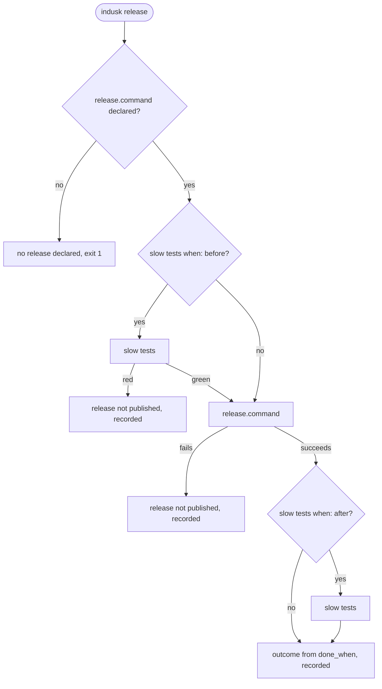

# `indusk release`

Run the release a project declares, in the order it declares, and record how it went.

```bash
indusk release
```

It reads `workflow.steps.release` in `.indusk/config.json` (see [`indusk checks`](/reference/cli/checks)) and runs the declared commands from the top of the checkout, with their own output. It never bumps a version and never runs a path of InDusk's own: `release.command` is whatever the project already runs (`pnpm release`, `fly deploy`, `just release`).

## The order



A slow run that a fully green run already covered is skipped, with the same rule as `indusk checks slow --unless-covered`: `slow tests skipped: covered by the green run at <time> (<checkout>)`. A green slow run the release makes over a clean tree is recorded as a green run, as `indusk checks slow` records one (with the commit it ran on), so the next release can skip it.

## Declaring it

```json
"release": {
  "command": "pnpm release",
  "slow_tests": {
    "command": "pnpm -w test:system",
    "report": "apps/*/test-results/system.junit.xml",
    "when": "after"
  },
  "done_when": "published"
}
```

`slow_tests.report` is a glob of JUnit files; `slow_tests.rerun` is optional and must contain `{files}`. A project that declares no `slow_tests` runs only its command.

## Outcome and exit

| Line printed | Meaning |
|---|---|
| `release published` / `release not published` | The release command exited 0, or did not run or failed. |
| `release done` / `release not done` | `done_when: published` is done once published. `done_when: green` is done only when the slow run is green (or was covered). |
| `the slow tests failed` | The slow command exited non-zero. Printed whether or not the report could be read; when it could not, no test is named. |
| `failing: <file>` | A test file the report marks failed, and still failing after its rerun (or with no rerun declared). |
| `flaky: <file>` | A file that failed, then did not fail on its rerun. |
| `the environment failed: <n> of <total> slow test files failed` | More than half the report's test files failed. |
| `open failures: ...` | The release is published and not done; what is open. Each failing file; the slow command when none could be named. |
| `recorded: releases.jsonl` | The release record was appended. |
| `no release declared` | No `release.command`; nothing ran. Exit 1. |

`indusk release` exits 0 when the release is done, non-zero otherwise.

## The record

Each release appends one line to `releases.jsonl` in the project's home (the folder [`indusk eval home`](/guide/eval) prints): `version` (from `release.version_file`), `commit`, `at`, `published`, `done`, `slow` (`green`, `red`, `skipped` or `not run`), `failed` and `flakes`. It is what "releases that published on their first run, against all releases" counts.

## The report, the rerun, the environment

Failures are read from the declared JUnit report, never from what the command printed. Every file matching `slow_tests.report` is read as one report (one per package is fine). A case counts as failed when it has a `failure` or `error` child; its test file is the case's `file`, else its `classname`, else its suite's `file` or `name`, made relative to the repo. A red run whose report is missing or cannot be parsed says `the slow tests failed` and names no test.

When more than half the report's test files failed, it is the environment, not the code: the release prints the `the environment failed` line, records `environment: {failed, total}`, and nothing else is opened. Exactly half is not.

Otherwise, with `slow_tests.rerun` declared, the failing files are substituted space-separated into `{files}` and run once. The report is read again: a file the rerun does not leave failing is a flake, listed under `flakes` on the record and opening nothing; a file still failing is recorded under `failed`. Routing a failure to an incident or a bugfix plan is described here as it lands.
