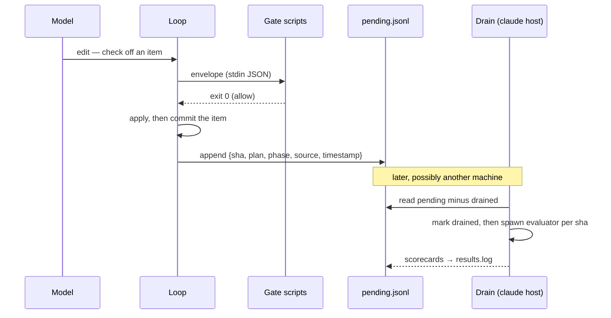

# `indusk run`

The external orchestrator: run a plan through a model-agnostic, gated agentic loop — InDusk's discipline lifted out of Claude Code so the same gates fire behind any model. Built by the [dawn-external-orchestrator](/decisions/dawn-external-orchestrator) plan as Dawn's first buildable piece: the agentic loop is rented (Vercel AI SDK), the gate scripts are reused as-is, and only a thin adapter plus the loop control ported from `/work --autopilot` is owned.

```bash
indusk run <plan> --model claude|gpt|gemini|grok
```

The CLI also installs as **`atdawn`** — the CLI command for the Dawn system (the system is named Dawn; `atdawn` is just the command). `atdawn run <plan>` and every other subcommand (e.g. `atdawn upgrade`) are byte-identical to the `indusk` invocation; help output brands itself by the name it was invoked as.

`<plan>` resolves to an `impl.md`: an explicit path, a directory containing one, or a plan name under `.indusk/planning/`. The run is bound to the current project tree — tools cannot touch paths outside it.

## The loop

The loop control is the `/work --autopilot` contract, ported:

- **Per-phase scope.** One driver run per remaining phase, under a tight phase-only contract: work test-first, check off only this phase's items, never touch the Test Trajectory's `Asserts` / `Writable at` / `Passes at` columns or other phases. Already-complete phases (every item checked or carrying a bare `(none needed)` / `skip-reason:` opt-out) are skipped.
- **Advance-on-green.** A phase closes only when `check-gates` says so — the loop feeds it a would-be next-phase checkoff envelope (a synthetic probe phase on a temp copy of the impl) and requires exit 0. The model's self-report never advances the loop.
- **Goalpost guard.** The trajectory table is snapshotted pre-phase. An `Asserts` change, a `Passes at` moved later, or a removed row STOPS the loop loud with the violations surfaced — a gamed gate, not a passed one. State-cell transitions and added rows are legal. Detection, not reversion: the drift stays visible on disk.
- **Pause-at-human-gate.** Derived from the plan's own declarations — a `Deferred Verification` reference, `U`-prefixed deferred rows, manual/browser-smoke phrasing — with no new marker. The loop pauses *before* spending a model step and reports exactly what a human must check instead of self-approving judgment.
- **Red never auto-retries.** One honest driver attempt per phase; a phase that cannot reach green halts the run for a human decision.
- **Hard stop at impl-complete.** The loop runs impl phases only — it never runs `/falsify`, `/cleanup`, or `/retrospective`. Those are human-gated by design.

Exit codes: `0` impl-complete · `3` paused for a human (a declared human gate, or an unanswered gate question — see below) · `1` stopped (red gate, moved goalposts, or bad invocation).

### Gate policy, headless

**`ask` is the default in both lanes.** When a plan's gates carry proof-less `(none needed)` / `skip-reason:` opt-outs under `ask`, `check-gates` refuses them — they require conversation proof, which a headless run cannot invent. The loop recognizes that specific refusal and **pauses (exit 3) with the question** instead of reporting a red:

```
Phase 2 needs a human decision: gate_policy is 'ask', and these gate items
can only be skipped with conversation proof —
  [context] (none needed)

Either complete them, or record the conversation in the impl:
  - [x] (none needed — asked: "your question" — user: "their answer")

Then re-run: completed phases are skipped, so the run resumes where it paused.
```

Answer it by editing the impl, then re-invoke — already-complete phases are skipped, so the run picks up where it stopped. For a deliberately unattended run, set `gate_policy: auto` in the impl frontmatter and bare opt-outs are accepted as before. (`strict` accepts nothing but real checkoffs.)

## Gate enforcement layers

The discipline lives in the shared gate scripts — `validate-impl-structure.js`, `check-gates.js`, and `claude-md-budget.js` (the CLAUDE.md byte-budget invariant, which self-filters to CLAUDE.md writes; added by the dawn-hook-parity plan) — resolved from the target project's `.claude/hooks/` (walking up from the tree root; a project missing any of the three fails loud — run `indusk init`/`update` first). The fourth installed hook, `gate-reminder.js`, is **deliberately not wired**: it is an advisory nudge for a watching human, not an invariant, and an unattended loop would spend scarce steps on advice the boundary gates already enforce — the shed is recorded in the dawn-hook-parity ADR as the first entry of the invariant/procedure keep-shed audit. Three layers invoke the chain, none contains rule content:

1. **Own-the-execute (primary, model-invariant).** The edit/write tools' `execute` adapts each call to the scripts' `{ tool_name, tool_input, cwd }` stdin envelope and spawns them: exit `2` refuses the edit and returns the block message as the tool result; exit `0` applies. Lives below the provider swap, so it cannot vary per model.
2. **`toolApproval` (secondary, SDK-native).** The same gate chain runs as an AI SDK approval callback above the provider swap, with `experimental_toolApprovalSecret` HMAC-signing approvals — defense in depth and PreToolUse parity.
3. **The deliberate phase-close probe (loop-level).** `check-gates` invoked at each phase boundary, as described above.
4. **Post-hoc `bash` gating.** Gate-relevant files (`impl.md`) are snapshotted before each shell command and re-checked after; a mutation is replayed through the same envelope, and a refusal reverts the file and returns the block message. A shell command is gated exactly like an edit — see the boundary section below for why this layer exists.

### What is and is not gated

The gate covers **tool surfaces, not intentions**. Any tool that can mutate files must be routed through the envelope, or it is a hole in Tier-1 by construction. The falsification round found exactly that hole: `bash` could rewrite a checkbox the `edit` tool would have refused, which is the first move a blocked model makes.

| Surface | Enforcement |
|---------|-------------|
| `edit` / `writeFile` | Gated before the write — refused edits never touch disk |
| `bash` mutations of gate-relevant files | Gated after the command — a refused change is reverted |
| `bash` reaching outside the worktree | **Best-effort refusal** — absolute paths outside the root are scanned for and rejected |
| Everything else `bash` can do | **Not confined** |

::: warning `bash` confinement is best-effort, not a sandbox
`cwd` is a starting directory, not a boundary. The escape scanner catches absolute paths written literally into the command; it cannot see a path built from a variable, or a tool writing to its own global location (`pnpm` and its store, for one). Real confinement requires running the loop in a sandboxed cell — an isolated container or a disposable remote box. Do not treat this guard as isolation, and prefer a throwaway worktree or a remote cell for untrusted runs.
:::

**Fail loud, not open.** The invoker blocks on exit `2` (the gate's own refusal), on any other non-zero exit (a crashed or confused script), and on a timeout kill (`null` exit code). Claude Code's PreToolUse treats non-2 as non-blocking because a human is watching; an unattended loop must never read silence as permission — a disarmed gate would void the discipline for the rest of the run without anyone noticing.

**Goalposts include the State column.** The guard rejects changed `Asserts` text, `Passes at` or `Writable at` moved later, removed rows, and a row flipped to `skipped`/`blocked` mid-phase. Terminality is a status a human documents with a reason, not one a run declares for itself when a test won't pass.

Headless runs need `gate_policy: auto` in the impl frontmatter — there is no user in the loop to give conversation-proof skips to (`ask`, the default, would refuse bare opt-outs).

## Commits

The loop — not the model — commits after each checklist-item checkoff survives the gate chain: one commit per item, message `item({plan} P{phase}): {item summary}`, staging everything changed since the previous commit (the item's work product). This restores the `/work` convention's granularity in the thin lane: bisectable history, per-item revert, and the eval rail's natural firing points.

Failure semantics, deliberately asymmetric to the gates: a failed commit (nothing staged, a rejecting hook, signing trouble) is **surfaced loudly on the run report and enqueues nothing — but never stops the run**. Commits are bookkeeping; gates are enforcement. A worktree that is not a git repository disables the cadence with a loud notice (fixture and staging dirs run gate-only).

**A commit's message accounts for everything the commit contains.** Two cases make that non-trivial. When a model checks several items in one edit, the subject counts them and the body lists each. And when a commit fails, its item's work is still in the working tree — unstaging cannot un-write it, and discarding it would destroy real work — so the item is *carried* and named by whichever commit next succeeds. History may batch, but it never contains an item its message doesn't mention.

A commit that lands but whose eval-queue record fails to write is reported as **landed**, with the queue problem on its own channel — the report never claims history that exists doesn't.

One boundary worth knowing: a checkoff performed through `bash` rather than the edit tool is still *gated* (the bash snapshot layer) but fires no commit — the phase contract instructs models to check off via the edit tool.

## The eval queue

The lane cannot evaluate its own work: the evaluator needs the `claude` CLI, and a run may be happening on a remote cell that has never heard of Claude Code. So each commit appends one record to `.indusk/eval/pending.jsonl`, and evaluation happens later, from wherever `claude` lives.



Draining is `/rail-check`'s job (or `node .claude/hooks/eval-trigger.js --drain-pending` directly). Each record is marked drained **before** its evaluator spawns, so a crashed spawn is a logged gap rather than a double-evaluation — re-running a drain is always safe. That ledger entry is **provisional**: if the evaluator exits non-zero (no `claude` on the machine, a broken runner), the record is un-drained and stays queued, and the drain reports how many failed. A machine that cannot evaluate never destroys the backlog — it just doesn't shrink it. `check_health` reports a standing backlog: the queue is durable, so nothing is lost, but un-drained records mean the lane's lessons have not reached the registry yet.

The queue and its ledger live under `.indusk/eval/` and are deliberately excluded from the run's own commits — run bookkeeping is not plan history.

## `--model`

Selects the driver. Accepts a friendly alias — `claude`, `gpt`, `gemini`, `grok` — or a bare provider name (`anthropic`, `openai`, `google`, `xai`), resolved through the provider registry into a driver config (`provider`, key env var, default model). Defaults to `claude`. Swapping models changes one provider factory line — gate behavior is structural, not per-model.

Two drivers are wired:

| Alias | Provider | Default model |
|-------|----------|---------------|
| `claude` | `anthropic` (`@ai-sdk/anthropic`) | `claude-sonnet-4-5` |
| `gemini` | `google` (`@ai-sdk/google`) | `gemini-3.6-flash` |

`gpt` / `grok` resolve in the registry but have no driver yet — selecting them fails with a clear error until their `@ai-sdk/*` factory line lands (the acceptance-matrix phase decides which comes next).

`--model` also accepts a **raw model id** with a known family prefix (`gemini-2.5-pro`, `claude-sonnet-4-5`, …) — the id passes through to the family's provider verbatim, so the matrix can compare models within a family without touching the registry default.

::: tip Thinking models need step room
Different models spend the per-phase step budget differently: `gemini-3.6-flash` explores read-heavy before writing (wire-logged, it even reads the gate scripts to learn the rules), while `gemini-2.5-flash` writes early. A budget that fits an eager model can *step-starve* a cautious one — the symptom is a red stop with few or zero edits after a normal-length run. The default budget is 48 steps per phase; tune per run with `--max-steps <n>`. (2026-07-27 falsified finding, kept for the record: this was first misdiagnosed as an SDK `thoughtSignature` incompatibility — wire-logged probes disproved that; the SDK round-trips Gemini 3.x thinking signatures fine.)
:::

## Provider keys

Direct per-provider API keys, no commercial gateway — each provider is hit with your own key so per-provider credit arbitrage is preserved:

| Provider | Key env (accepted names, first set wins) |
|----------|------------------------------------------|
| `anthropic` | `ANTHROPIC_API_KEY` |
| `openai` | `OPENAI_API_KEY` |
| `google` | `GOOGLE_GENERATIVE_AI_API_KEY`, `GOOGLE_API_KEY` |
| `xai` | `XAI_API_KEY` |

Where a provider's key conventionally lives under more than one env name, the registry lists the accepted names in order (the AI SDK default first) and the first non-empty one is passed to the provider factory explicitly — so a machine keeping its key under `GOOGLE_API_KEY` works without renaming. The command refuses to start when none of the selected driver's key envs is set.

Keys are read from the **process environment only** — the machine-global `~/.indusk/config.env` (where InDusk parks machine-wide secrets) is *not* loaded automatically. Until a loader is wired (a recorded close-out item), source it first: `set -a; source ~/.indusk/config.env; set +a`. Note the Claude driver is metered API usage — a Claude Max/Pro subscription cannot authenticate SDK calls; keep Claude Code (native, flat-rate) for judgment-heavy work and route mechanical runs here by cost-to-durably-done.

## Reporting

Each closed phase reports steps, tool calls, and aggregated token usage (input/output) — the raw data for the cost-to-durably-done comparison the acceptance matrix runs across models and environments.
