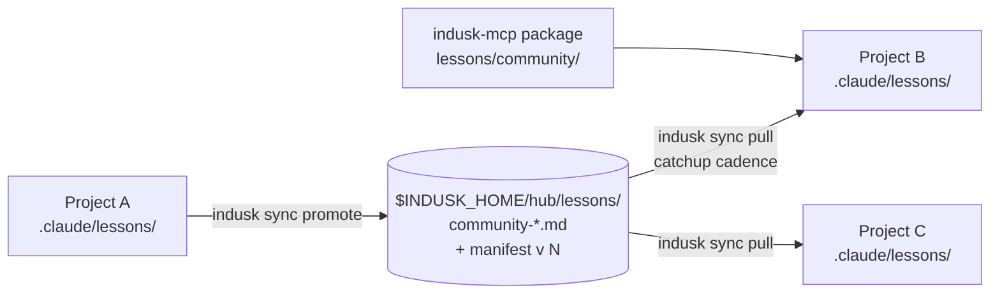

# `indusk sync`

Hub push/pull rule distribution, shipped by the [indusk-makeover decision](/decisions/indusk-makeover). InDusk is the hub; projects are the spokes: a rule proven general in one project gets **promoted** into the machine-global hub channel, and every project **pulls** the channel at catchup cadence. One fleet-wide brain, per-project working sets.



## Subcommands

### `sync promote <lesson>`

```bash
indusk sync promote always-pin-versions
```

Copies the named lesson from this project's `.claude/lessons/` into the hub channel at `$INDUSK_HOME/hub/lessons/`, stamped with provenance (source project + timestamp) that travels with the lesson into every pulling project. The hub copy is always `community-` prefixed; the manifest version bumps monotonically per promote.

Refusals: a non-existent lesson errors; an existing hub lesson with **different** content is never clobbered (conflict, resolve manually); identical content is an idempotent no-op.

### `sync pull`

```bash
indusk sync pull
```

Merges the hub channel **plus the package's bundled community lessons** into this project's `.claude/lessons/`. Three hard rules:

- **Additive only.** An existing local lesson file is never overwritten.
- **Idempotent.** Pulling twice changes nothing the second time.
- **Local wins.** A local file that differs from the channel copy is kept and reported — the pull can never clobber project knowledge.

`/catchup` runs the pull automatically and surfaces "N new rules" when non-zero.

## Scope

The hub is **machine-global** (`$INDUSK_HOME`, default `~/.indusk`). Promotion into the published indusk-mcp package (so *other machines* receive a rule via `indusk update`) remains a deliberate act: promote on the machine that hosts the dusk checkout, then move the hub lesson into `apps/indusk-mcp/lessons/community/` and publish. Cross-machine hub sync composes with the `versioned-workbench` plan's rapid-sync model.
