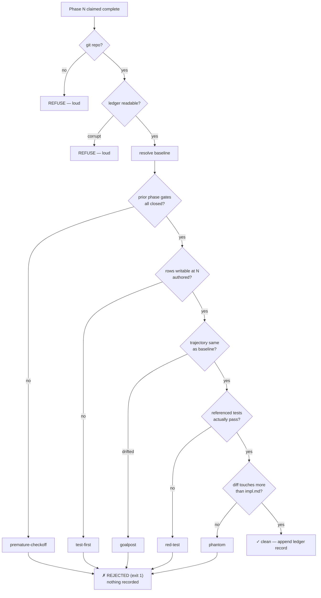
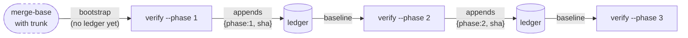

# `atdawn verify`

Phase-boundary verification for work Dawn **didn't** execute.

```bash
atdawn verify <plan> --phase <n> [--full-suite]
```

| Flag | Meaning |
|---|---|
| `--phase <n>` | **Required.** The phase boundary to judge; phases are numbered from 1. |
| `--full-suite` | Run the project's whole test command once instead of only the files the trajectory references. |

`<plan>` is a plan name under `.indusk/planning/`, a directory containing an `impl.md`, or a path to one — the same resolution [`atdawn run`](./run.md) uses, deliberately sharing one implementation so the two lanes cannot disagree about which plan they mean.

**On `--full-suite`:** by default verify runs only the test files the in-scope rows name, so its cost scales with the phase being verified rather than with the project. That is the deliberate trade-off, and it has a consequence worth knowing — **verify does not detect regressions in tests outside the referenced files.** "Did this phase break something unrelated" is a different question, and a different component's job. Pass `--full-suite` when you want the whole suite to be the verdict; on a runner with heavy startup it may also simply be faster than many per-file invocations.

## Why this exists

Every other enforcement in InDusk lives in the write path. `check-gates` is a `PreToolUse` hook: it sees an old string and a new string, decides, and refuses *before* the edit lands. That works in the two lanes Dawn controls — [`atdawn run`](./run.md), where Dawn owns the executor, and Claude Code, whose PreToolUse seam is verified deny-capable.

It does nothing for the third tier. Work done in Cursor, in a hookless `claude` session, or by hand arrives already applied, already checked off, with no before-state to diff against. `verify` is the enforcement for that tier: **detection at the phase boundary, reconstructed from git.**

It also closes a gap that was never tier-specific. Nothing in InDusk has ever executed a test as part of gate enforcement — `check-gates` reads the Test Trajectory's `State` column and trusts it, and the [goalpost guard](./run.md) deliberately permits `planned → written → passing` as honest progress. So the word `passing` has always been an unverified self-report, in **every** lane. `verify` is the first thing that checks it against a test run.

## What it detects

| Detection | Catches |
|---|---|
| **premature-checkoff** | A phase advanced while an earlier phase's gate item is still unchecked |
| **test-first** | A trajectory row still `planned` at the phase where it was writable |
| **goalpost** | Assertion text edited, `Passes at` deferred, or a row deleted since the baseline |
| **red-test** | A row marked `passing` whose referenced test does not pass |
| **phantom** | An item checked off with no corresponding change in the diff |



Detections are **not** short-circuited in practice — a run reports every violation it finds, not just the first. The flow above reads top-to-bottom for clarity.

### Test references: paths, and the difference between red and unchecked

The `red-test` detection reads the trajectory's optional [`Test` column](../../guide/test-trajectory.md), which names the test **files** backing a row.

**Paths are repo-root-relative.** The test command runs with its working directory at the repository root, so in a monorepo a package-relative path (`src/lib/…`) resolves to nothing. Write `apps/indusk-mcp/src/lib/…`.

**A reference that cannot be executed is `unverified`, never `red`.** Verify stats every path before running anything. Two cases report as unverified rather than as failures:

| Reference | Reported as | Why |
|---|---|---|
| `apps/x/foo.test.ts` (exists) | checked — red or green | It ran; the exit code is the verdict |
| `apps/x/gone.test.ts` (missing) | **unverified**, naming the path | Nothing was observed; asserting failure would be a lie |
| `manual: path/to/record.md` | **unverified** (by design) | A human verified it; shelling it to a test runner guarantees a false red |
| *(no `Test` column)* | **unverified** (by omission) | Nothing to run |

This distinction is the page's central promise pointed at itself. Reporting a failure you never observed is exactly as dishonest as reporting a pass you never observed — and the second kind is the one this whole command exists to catch. It was found the only way it could be: by running verify against its own plan, where 16 rows reported red while every test passed.

::: tip Derived commands are best-effort
`verify.testRunner` in `.indusk/config.json` derives a command for common runners. If your runner needs a different invocation, set **`verify.testCommand`** explicitly — it wins outright. An unknown runner with no explicit command is a refusal, not a guess.
:::

### Phantom work, and what it deliberately misses

`phantom` is the detection with the narrowest rule in the command, on purpose.

It fires only when **every** condition holds: the phase has newly-checked *implementation* items, and the diff since the baseline touches **nothing but the plan's own `impl.md`**. Any real change anywhere else silences it completely.

That means it catches the flipped-boxes-wrote-nothing case exactly, and **does not** catch a phase that wrote something trivial to satisfy the check. This is an accepted trade, not an oversight:

- Attributing a specific checklist item to a specific diff hunk is not reliably possible.
- Gate items are excluded because checking a Verification/Context/Document item legitimately changes only the plan file — counting them would fire on every honest phase close.
- A detector that cries wolf gets switched off, which costs more than the cases a broader rule would have caught.

## It never repairs

`verify` renders a verdict and exits. It performs no revert, no re-dispatch, no repair. The only write it ever makes is appending its own ledger record — and only on a clean verdict.

This is deliberate. Reverting belongs to Dawn's agent-integration component, and it inherits a constraint established the hard way during `dawn-hook-parity`'s falsification: `git reset` unstages, but it cannot un-write a working tree. **What has been written can only be accounted for, not unwritten.** A detector that reports is honest about that.

## What a report looks like

```
Plan:     dawn-verify
Phase:    5
Baseline: a2c95bd0 (ledger)

✗ PHASE 5 REJECTED (2 violations)

  red-test    A4 — Row A4 claims "passing", but its test does not pass:
              apps/indusk-mcp/src/lib/verify/red-tests.test.ts exited non-zero.
  phantom     "add the parser" was checked off in Phase 5, but nothing outside
              the plan file changed since a2c95bd0 — the checkbox moved and the
              work did not.

unverified: 1 row(s) could not be checked — A16
```

The subject prefix before the em-dash is always a **trajectory row id** (`A4`) or absent. A finding about a checklist item names that item inside its message instead — the item's full text is too long to serve as a prefix, and printing it in both places was a real defect this page's contract now pins.

## Exit codes

| Code | Meaning |
|---|---|
| `0` | Clean — the phase's claims hold; a ledger record was appended |
| `1` | Rejected — one or more findings, or a bad invocation |

A rejecting run is designed to fail a calling script or CI step.

## The baseline chain

`verify` needs a "before". Since Dawn wasn't running when the work happened, it reconstructs one from a chained ledger at `.indusk/verify/ledger.jsonl`:

```json
{"plan":"dawn-verify","phase":2,"sha":"a1b2c3d","trajectory":"sha256:…","timestamp":"2026-08-05T…"}
```

The baseline for phase N is the record for the **highest phase below N** of that plan. With no such record, `verify` bootstraps from the merge base with the trunk.



The chain is a **byproduct of verifying**, not a ceremony you have to remember before dispatching work. That matters: a pre-dispatch snapshot command would fail silently in exactly the case this exists for — the time you forgot to run it.

### Two failure-safety rules

**A rejecting verify records nothing.** Only a clean verdict appends. A rejected phase must never become the yardstick the next phase is measured against.

**A corrupt ledger refuses loudly.** A malformed line throws rather than being skipped. Skipping would shorten the chain, and a shortened chain degrades into bootstrap mode — producing a confident report against the wrong baseline. That failure is indistinguishable from success from the outside, so it has to be loud.

This is the deliberate **inverse** of the [pending-eval queue](./run.md), which writes its marker *before* the risky operation so a crash leaves a gap rather than a double-eval. Different danger, opposite rule.

## Requirements

`verify` refuses to run outside a git repository rather than reporting a clean phase — a workbench root is deliberately not a git repo, and silence there would mean verifying nothing while appearing to verify everything.

## See also

- [`atdawn run`](./run.md) — the controlled-lane counterpart, where gates enforce in the write path
- [Test Trajectory](../../guide/test-trajectory.md) — the table `verify` checks its claims against

## Two roots, and a maintained refusal

*(versioned-workbench, 2026-08)*

`verify` originally assumed one repository: the plan and the code it describes
shared a root. A **workbench** breaks that assumption — `impl.md` lives in the
workbench's `.indusk/planning/`, while the code sits across a trunk symlink in
a wrapped repo with its own history.

That was survivable only by accident. A workbench root was deliberately *not* a
git repo, so `assertGitRepo` refused and no detector ever ran there. The
refusal held because of a property nobody maintained.

`versioned-workbench` makes the workbench root a git repo, which removes the
accident. What is left is a repository whose diff **structurally cannot contain
the code being judged**: phantom detection fires when nothing outside `impl.md`
changed, which in a workbench is always true. Every honest checkoff would be
reported as phantom — and a detector that cries wolf gets switched off, taking
its real catches with it.

So `verify/roots.ts` now maintains the refusal on purpose:

| Project shape | Behavior |
|---|---|
| Normal mode (`.indusk/` inside the code repo) | Unchanged. Plan root and code root are the same directory. |
| Workbench, no repos declared | Refuses — there is no code root to judge against. |
| Workbench, several repos | Refuses, **naming every candidate**. A verdict against the wrong repository is indistinguishable from a correct one. |
| Workbench, one repo | Refuses, explaining that the ledger's baseline sha comes from the plan repo and has no meaning in the code repo. |

**It never falls back to the plan root.** A diff of plan documents is not
evidence about code, and reporting it as such is exactly the "could not check"
reported as "checked" failure this command exists to prevent.

### What is deliberately not done

Resolving the code root's *path* is easy; the missing piece is a **baseline**.
The verify ledger records a sha from the plan repo, and that sha does not exist
in the code repo's history — so there is nothing honest to diff against. Making
verification work across two repositories requires the ledger to carry a
per-repo baseline, and that is a **named follow-on**, together with the
equivalent split for Shape and cleanup.

Refusing costs nothing that previously worked: a workbench root was not a git
repo, so every run already refused. What changed is that the refusal now says
why.
