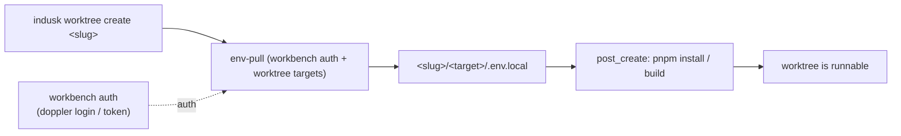

# Doppler extension

The `doppler` extension is the **default InDusk environment layer** (replaces
composable.env): env vars from [Doppler](https://www.doppler.com/) branched
configs + plain docker-compose, materialized per-target via an `env-pull` step,
and auto-provisioned into every worktree. No custom contract/component/profile
language — Doppler holds the values, `env-pull` writes ordinary `.env` files.

## Configuration

Two pieces — **structure** (committed) and **secret** (gitignored):

| Where | Holds |
|-------|-------|
| `.indusk/config.json` → `doppler` section | project, profile→prefix map, target list (**source of truth**) |
| `.indusk/extensions/doppler/.env` | an optional `DOPPLER_TOKEN` (gitignored) — only for CI/headless |

```jsonc
// .indusk/config.json
"doppler": {
  "project": "numero",                                     // Doppler project
  "profiles": { "local": "local", "production": "prd" },   // profile arg → Doppler config-root prefix
  "apps": [
    { "dir": "admin" },                          // → apps/admin/.env.<profile>   (config local_admin)
    { "dir": "auth-server" },
    { "path": "packages/db", "config": "db" },   // ANY path, not just apps/ → packages/db/.env.<profile>
    { "path": ".", "config": "root" }            // repo-root .env
  ]
}
```

- **`dir`** = the `apps/<dir>` shorthand. **`path`** = any dir relative to the
  project root (`.`, `packages/*`, `services/*`). Output is `<path>/.env.<profile>`.
- **`config`** = the Doppler leaf suffix (downloads `<prefix>_<config>`); defaults
  to the dir / path basename.
- **`profiles`** maps the profile arg to your Doppler env-root prefix
  (`local`→`local`). With no `doppler` section, env-pull falls back to globbing
  `apps/*` with default prefixes (`local`→`loc`, `staging`→`stg`, `production`→`prd`).

## Auth — login (devs) or token (CI)

Auth is **optional locally** and resolves in order:

1. **`DOPPLER_TOKEN` env var** — CI / deployment (set from a GitHub secret).
2. **`.indusk/extensions/doppler/.env`** — an optional service-token file (gitignored).
3. **The logged-in Doppler CLI session** — `doppler login`.

A dev who ran `doppler login` needs **no token file** — that's the recommended
path. `.indusk/` is at the workbench root, so whichever auth you use is shared by
the trunk and every worktree. The project lives in `config.json`, not the `.env`.

## Doppler is the source of truth (one-way)

`env-pull` only **pulls** (Doppler → files); it never pushes back. Manage env in
Doppler (UI or `doppler secrets set …`), then pull. The local `.env.*` files are
disposable, gitignored projections — hand edits are overwritten on the next pull.
One-time migration seed: `doppler secrets upload <file> --config <leaf>`.

## env-pull

```sh
indusk doppler env-pull local        # writes each target's .env.local
indusk doppler env-pull production   # … .env.production
```

For each configured target it runs
`doppler secrets download --project <project> --config <prefix>_<config> --format env`
and writes `<path>/.env.<profile>`. env-pull idempotently gitignores the provisioned
files + the token. `.env.test` is the exception — committed with safe defaults, not
pulled.

## Worktree auto-provisioning

`indusk worktree create <slug>` provisions the new worktree's env automatically,
then runs the worktree config's `post_create[]` commands — so a new worktree is
**runnable in one shot**, not a bare checkout.



If the doppler extension isn't configured, provisioning is skipped silently and
worktree creation proceeds normally.

## Docker across worktrees

`docker-compose.yml` lives in the repo with a pinned project `name:`. There's one
Docker daemon and one pinned-name stack, so `docker compose up` from **any** worktree
addresses the same stack — building *that* worktree's code with *that* worktree's
pulled `.env`. Tradeoff: **one stack per repo at a time** (two worktrees can't both
`up`). Env is per-worktree; docker is shared.

## Migrating off composable.env

The extension supersedes the hand-rolled `composable-env-removal` approach — use
`indusk doppler env-pull` instead of a custom `env-pull.sh`. Migration steps: enable
the extension (`indusk update`), set up the Doppler project, declare targets in
`.indusk/config.json`, seed configs (`doppler secrets upload`), pull, replace the
ce-generated compose with hand-written per-app fragments, then delete `env/` + `ce.json`.
See the [env guide](/guide/env) for the full how-env-works overview.
