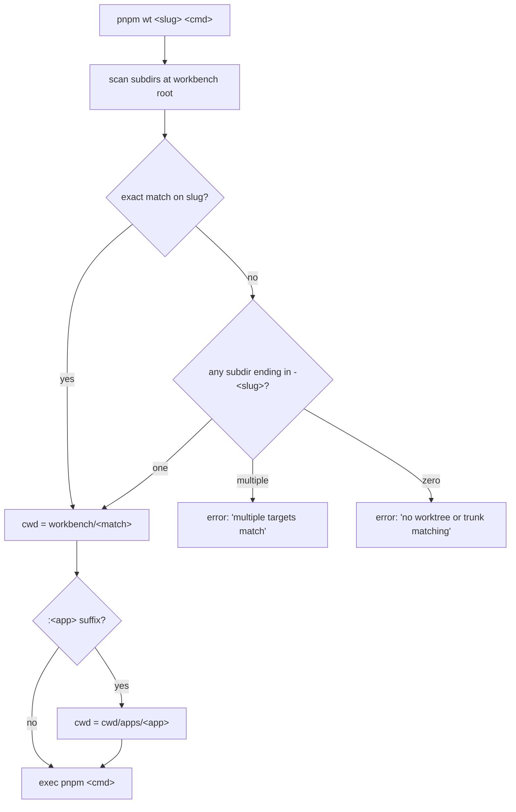
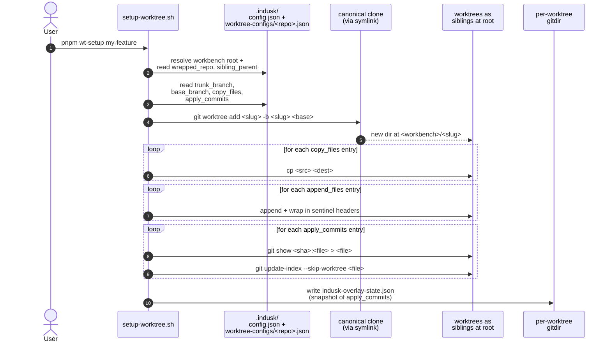

# Worktree Extension

> **Status**: under active development on the `indusk-worktree-extension` plan. Phase 1 = manifest + skill. Phase 2 = config schema + validator + starter template (this page). Phases 3–7 ship bash scripts, the TS CLI, the `indusk init --workbench` flag, and the numero migration dogfood.

The worktree extension manages multi-worktree work on a workbench-shaped indusk project. One `.indusk/` at the workbench root survives worktree create/destroy — no duplicated planning state across worktrees, no merge ceremony, no lost highlights/eval/config.

For the agent-facing reference (CLI commands, execution surface, layout, anti-patterns), see [the extension's `skill.md`](https://github.com/infinitedusky/indusk/blob/main/apps/indusk-mcp/extensions/worktree/skill.md). This page covers the per-repo config schema specifically.

## Per-repo config (`.indusk/worktree-configs/<repo>.json`)

Each workbench-wrapped repo has one JSON config governing how its worktrees are assembled and validated. Shape:

```json
{
  "$schema": "../../../node_modules/@infinitedusky/indusk-mcp/extensions/worktree/config.schema.json",
  "trunk_branch": "main",
  "base_branch": "main",
  "copy_files": [
    { "src": ".env.example", "dest": ".env.local" }
  ],
  "append_files": [
    { "src": ".gitignore.local", "dest": ".gitignore" }
  ],
  "apply_commits": [
    { "sha": "abc1234", "files": ["packages/types/index.ts"] }
  ],
  "preflight": [
    {
      "name": "biome",
      "command": "pnpm biome check $CHANGED_FILES_BIOME",
      "when": "CHANGED_FILES_BIOME"
    }
  ],
  "preflight_env": {
    "MIGRATIONS_RELEVANT": ["packages/db/migrations/**"]
  },
  "compose_project_name": "numero"
}
```

### Field reference

| Field | Required | Description |
|---|---|---|
| `$schema` | optional | JSON Schema reference for IDE/LSP support (validator ignores it) |
| `trunk_branch` | **yes** | Branch name the trunk symlink tracks (typically `main` or `master`) |
| `base_branch` | optional | Default base branch new worktrees branch off (typically same as `trunk_branch`) |
| `copy_files[]` | optional | Files copied from the canonical clone into a new worktree at create time. Each entry has `src` + `dest` (both relative to repo root) |
| `append_files[]` | optional | Files concatenated onto existing destination files under a sentinel header at create time. Each entry has `src` + `dest` |
| `apply_commits[]` | optional | Upstream-file-overlay entries. Each entry names a `sha` and a `files` list; file contents at `<sha>` are written into the worktree and marked `skip-worktree` (invisible to `git status`). NOT cherry-pick — see the extension skill for the distinction |
| `preflight[]` | optional | Preflight commands run by `indusk worktree preflight`. Each entry has `name`, `command`, and optional `when` (env var name that must be truthy to run) |
| `preflight_env{}` | optional | Declarative path filters. For each key, glob-match its patterns against `CHANGED_FILES` and export the key as a truthy env var on match. Used to gate `preflight[]` entries via `when` |
| `compose_project_name` | optional | Recommended value for the workbench's `ce.json` top-level `composeProjectName` field (composable.env ≥ 1.37.7). Pins docker-compose project name for cross-cwd targeting; one stack per repo at a time |

### Validation

Configs are validated at multiple boundaries:
- On `indusk worktree list` — surfaces `(config valid)` / `(config missing)` / `(no worktrees)` per wrapped repo
- On `indusk worktree create` / `refresh` — fails fast if the config is malformed
- Programmatically via `import { validateWorktreeConfig } from "@infinitedusky/indusk-mcp/worktree/validate-config"`

Malformed configs produce errors that name the offending field:

```
{ "valid": false, "errors": [
  { "field": "trunk_branch", "message": "required field 'trunk_branch' is missing" },
  { "field": "mystery_field", "message": "unknown top-level key 'mystery_field'" }
] }
```

Unknown top-level keys are rejected (`additionalProperties: false`) so config typos surface immediately rather than being silently dropped.

### Starter template

The extension's `on_enable` hook materializes a starter `.indusk/worktree-configs/<repo>.json` derived from `apps/indusk-mcp/extensions/worktree/templates/worktree-config.template.json`, substituting `<repo>` for the wrapped repo's name. Defaults: `trunk_branch: "main"`, an empty `copy_files`/`append_files`/`apply_commits`, a single biome `preflight` entry gated by `CHANGED_FILES_BIOME`, and a sample `preflight_env` block for migrations.

Adopters who don't want the default biome preflight or want a different shape edit the file. The starter is opinionated but not load-bearing.

## Execution surface — `pnpm wt`

After `indusk extensions enable worktree`, the workbench's `package.json` gets four scripts that delegate to bash:

```json
{
  "scripts": {
    "wt": "bash scripts/worktree/wt.sh",
    "wt:pm2": "bash scripts/worktree/wt-pm2.sh",
    "wt-setup": "bash scripts/worktree/setup-worktree.sh",
    "wt-refresh": "bash scripts/worktree/refresh-worktree.sh"
  }
}
```

`pnpm wt <slug>[:<app>] <command> [args...]` runs `pnpm <command>` from the resolved directory:



Reserved subdirs (`.indusk`, `node_modules`, `dist`, `build`, `.git`, `.next`, `scripts`, `env`) are skipped during resolution. Exact-match wins over suffix-match. The trunk (whose name matches `worktree.wrapped_repo`) is just another subdir from wt.sh's perspective — `pnpm wt <wrapped-repo-name> <cmd>` runs from the trunk symlink.

## Create + refresh lifecycle

The `setup-worktree.sh` and `refresh-worktree.sh` bash scripts (under `apps/indusk-mcp/extensions/worktree/scripts/`) implement the per-worktree state machine. The TS CLI in Phase 6 wraps them as `indusk worktree create` and `indusk worktree refresh`.

### `setup-worktree.sh <slug> [base-branch]`



### `refresh-worktree.sh <slug>` — idempotent re-apply with cleanup

When a slug already exists, refresh re-applies the config. The critical step is the ADR D7 fix-in-scope: for any file that was previously overlaid via `apply_commits[]` but is no longer in the current config, clear the skip-worktree flag AND restore the file from HEAD (otherwise the overlay content lingers invisibly).

```mermaid
sequenceDiagram
    autonumber
    actor User
    participant Refresh as refresh-worktree.sh
    participant Gitdir as per-worktree gitdir<br/>(state file)
    participant Config as worktree-configs/<repo>.json
    participant Worktree as <slug>/

    User->>Refresh: pnpm wt-refresh my-feature
    Refresh->>Gitdir: read prior apply_commits[] snapshot
    Refresh->>Config: read current apply_commits[]
    Note over Refresh: diff prior vs current
    alt entries removed since last run
        Refresh->>Worktree: git update-index --no-skip-worktree <file>
        Refresh->>Worktree: git checkout HEAD -- <file>
        Note over Refresh,Worktree: file restored to main's content;<br/>overlay erased
    end
    Refresh->>Worktree: re-apply copy_files (overwrite)
    Refresh->>Worktree: re-apply append_files (sentinel-bounded replace)
    Refresh->>Worktree: re-apply apply_commits (re-overlay + skip-worktree)
    Refresh->>Gitdir: write new snapshot
```

### Why state lives under the gitdir, not the worktree

Per-worktree `.git/info/exclude` is not a thing in git — the main worktree's exclude file is the only one git reads. So a state file inside the working tree would always appear as untracked. The state file lives at `<per-worktree-gitdir>/indusk-overlay-state.json` (typically `<canonical-clone>/.git/worktrees/<slug>/indusk-overlay-state.json`), where git ignores its own internals by definition.

## Related

- [Extension skill](https://github.com/infinitedusky/indusk/blob/main/apps/indusk-mcp/extensions/worktree/skill.md) — agent-facing reference (CLI commands, execution surface, layout, `composeProjectName`)
- [Plan: indusk-worktree-extension](https://github.com/infinitedusky/indusk/tree/main/.indusk/planning/indusk-worktree-extension) — ADR + impl + research
