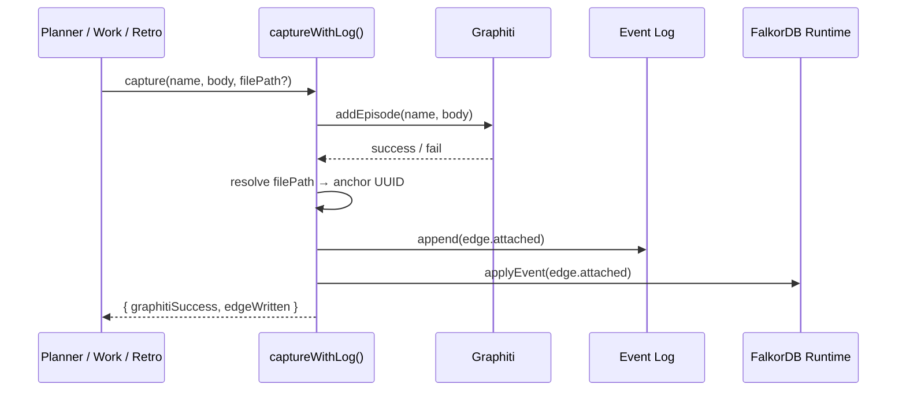

# Capture Flow

The semantic graph captures knowledge from two directions: **structural sync** (CGC adapter → anchors) and **semantic capture** (Graphiti → edges). This page covers the semantic capture side — how decisions, corrections, and lessons become edges in the graph.

## Dual-Write Pattern

When the agent captures knowledge (brief acceptance, ADR, correction, retrospective lesson), it writes to **two systems**:

1. **Graphiti** — extracts entities and facts for temporal knowledge search
2. **Semantic graph log** — appends an `edge.attached` event linking the knowledge to a file anchor



## Anchor Resolution

Each capture targets an anchor — a file the knowledge relates to. The wrapper resolves it:

1. If `filePath` is provided, look up the matching file anchor in the runtime graph
2. If no match (file doesn't have an anchor yet, or no path provided), fall back to a **project-root anchor** — a synthetic anchor at path `.` that collects project-wide knowledge
3. The project-root anchor is created on first use and reused for subsequent captures

## Capture Triggers

| Trigger | Skill | Relation | When |
|---------|-------|----------|------|
| Brief accepted | planner | `decision` | Brief status → `accepted` |
| ADR accepted | planner | `adr` | ADR status → `accepted` |
| User correction | work | `correction` | User confirms `context learn` |
| Retrospective lesson | retrospective | `lesson` | Each "What We Learned" item |
| Retrospective hindsight | retrospective | `hindsight` | Each "What We'd Do Differently" item |

## Graceful Degradation

- **Graphiti down:** The edge is still written to the log. The `payload.graphiti_success` field records `false` so you know Graphiti didn't process it.
- **Log write fails:** The function returns `{ edgeWritten: false }` but doesn't throw. Captures are best-effort.
- **No anchor match:** Falls back to the project-root anchor. Knowledge is never lost — it's just attached at the project level rather than a specific file.

## Edge Payload

Each `edge.attached` event carries a payload with capture metadata:

```json
{
  "name": "adr-cgc-graphiti-bridge",
  "source": "text",
  "source_description": "ADR acceptance",
  "graphiti_success": true
}
```

This lets the query layer distinguish structural edges (from sync) from semantic edges (from capture) and filter by source type.
