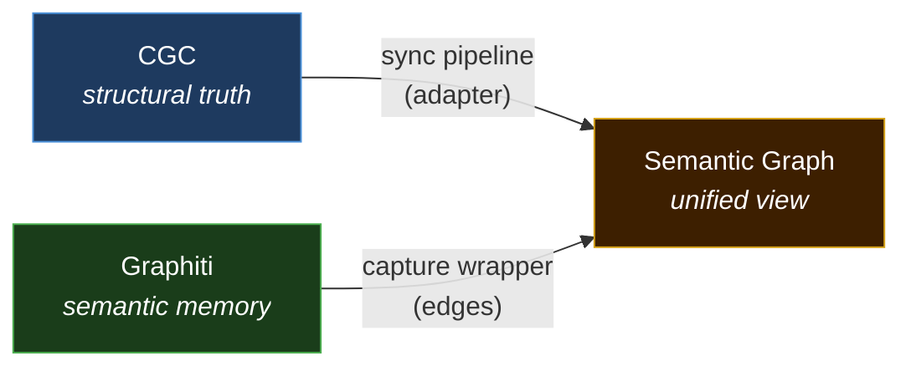
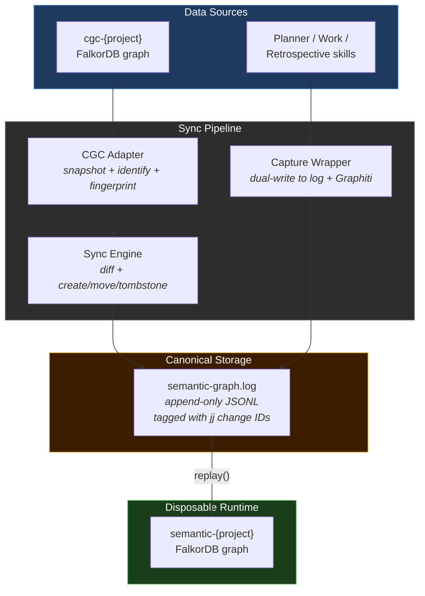
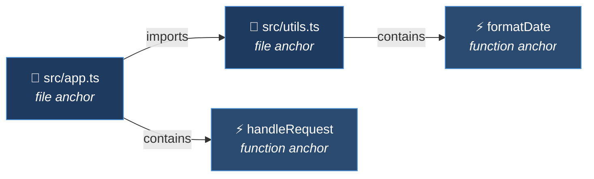
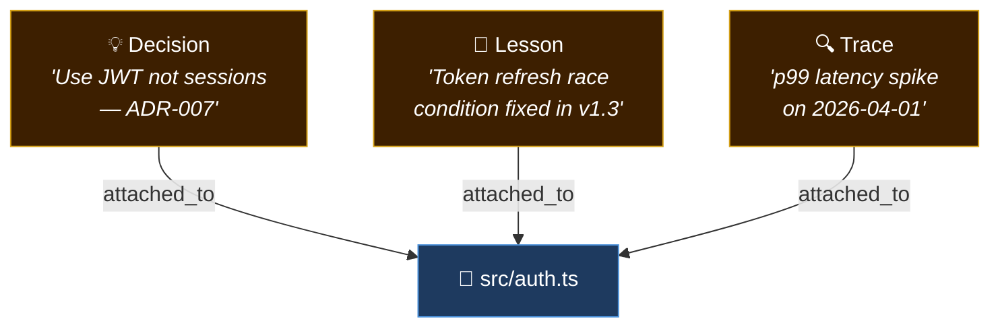
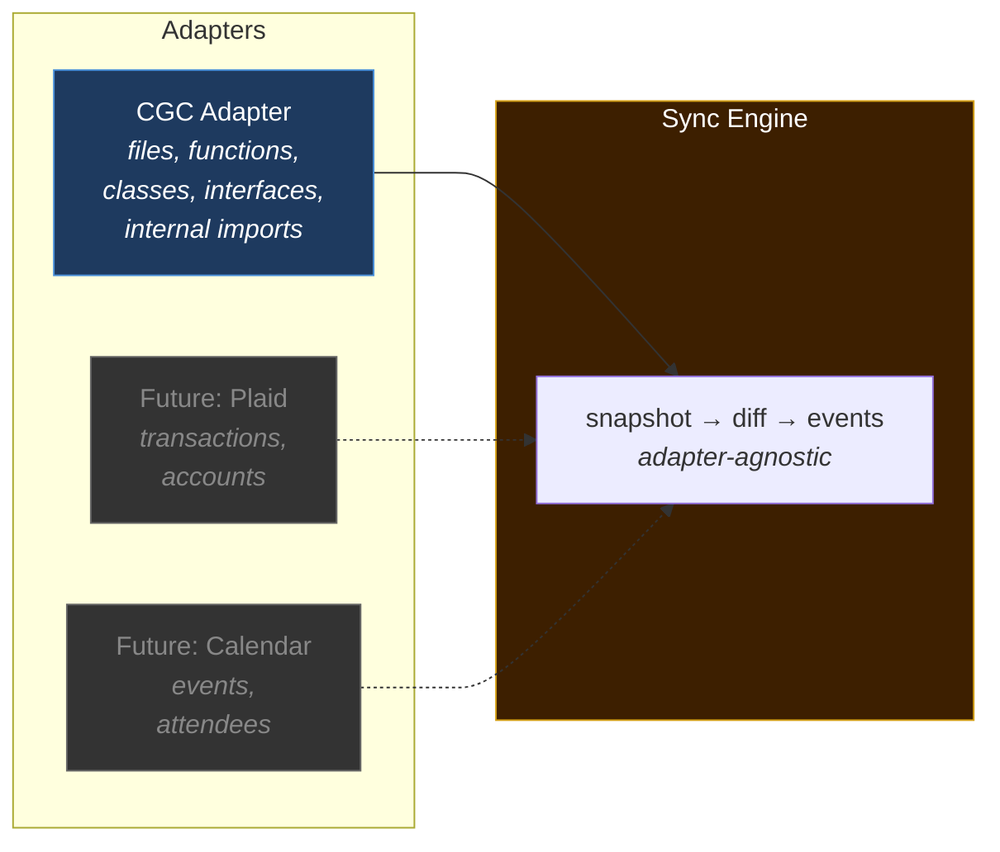
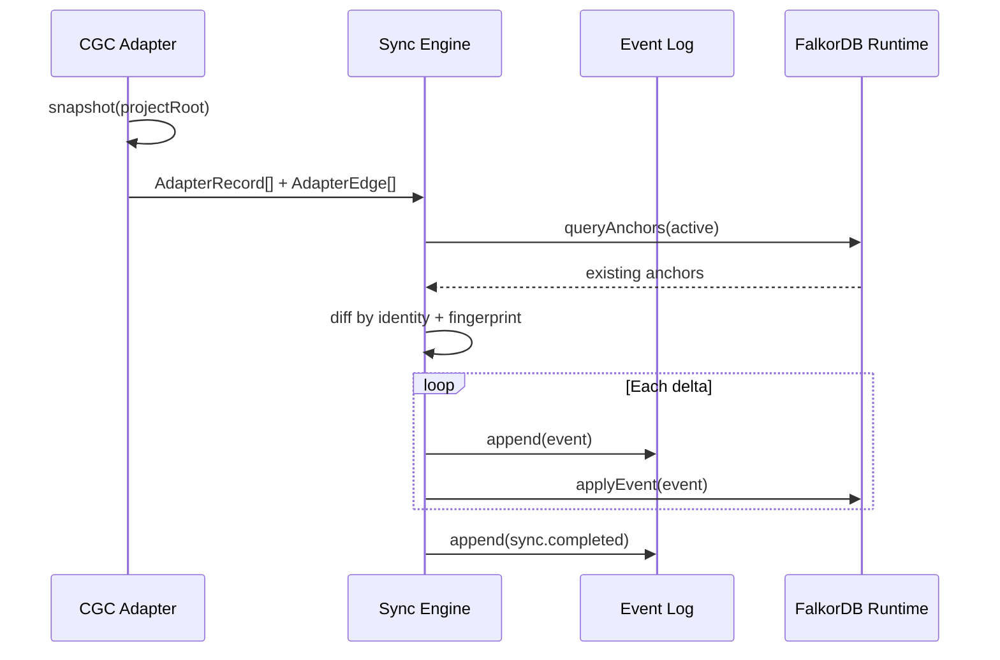
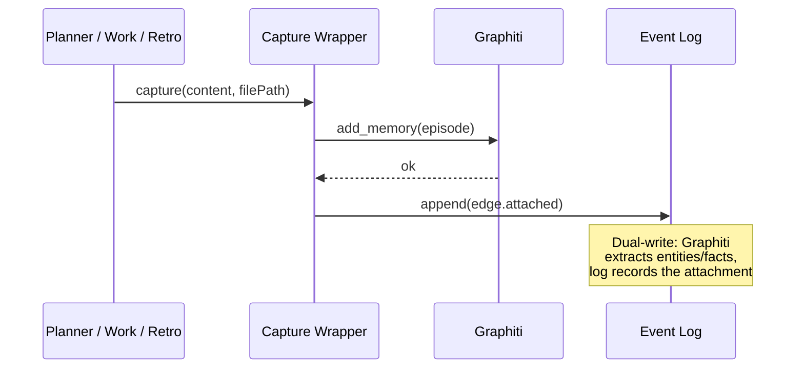
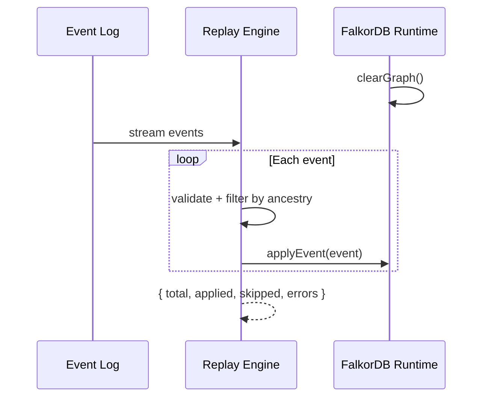

# InDusk Semantic Graph

The InDusk Semantic Graph bridges structural code intelligence (what exists) with semantic memory (what it means). It's an event-sourced system that projects code structure from CGC into a persistent graph, then attaches decisions, lessons, and context as edges on top.

## The Core Idea

Two systems already know things about your code:

- **CGC** (CodeGraphContext) knows the structure — files, functions, classes, imports
- **Graphiti** knows the narrative — decisions, corrections, lessons, ADRs

Neither talks to the other. The semantic graph connects them:

## Architecture

## Key Concepts

### Anchors

Anchors are graph nodes synced from an authoritative source. Each anchor represents a real structural record — a file, function, class, or interface. Anchors are **never hand-edited**; they're created, moved, and tombstoned by the sync pipeline.

### Edges (Semantic Overlay)

Edges are the "flesh" on the structural "skeleton." They carry meaning — decisions, lessons, facts — and attach to anchors. Edges survive renames (the anchor moves, edges follow) and deletions (the anchor tombstones, edges remain for historical context).

### Event Log

The event log is the **canonical source of truth**. Every mutation is one JSONL line tagged with a jj change ID. The FalkorDB runtime is a disposable projection — delete it and rebuild from the log at any time.

Six event types:

| Event | Purpose |
|-------|---------|
| `anchor.created` | New structural record appeared |
| `anchor.moved` | Record renamed/moved (UUID preserved) |
| `anchor.tombstoned` | Record deleted (edges preserved) |
| `edge.attached` | Semantic knowledge linked to an anchor |
| `edge.invalidated` | Knowledge superseded or retracted |
| `sync.completed` | Bookmark marking a completed sync cycle |

### Adapter Interface

The sync engine is **adapter-agnostic** — it doesn't know what data source it's syncing. CGC is the first adapter. The interface:

Each adapter implements three methods:
- **`snapshot()`** — return all current records from the source
- **`identify()`** — stable identity string for cross-sync matching
- **`contentFingerprint()`** — content hash for rename detection
- **`edges()`** *(optional)* — relationships discovered during snapshot

### Jj Change IDs

Every event is tagged with the jj change ID active when it was written. This enables:

- **Branch safety** — replay filters by ancestry, so events from abandoned branches don't pollute the graph
- **Rebase survival** — jj change IDs are stable across rebase/amend/split/abandon (unlike git commit SHAs)
- **Time travel** — the log records which change introduced each structural mutation

## Data Flow

### Sync (structural → graph)

### Capture (semantic → graph)

### Rebuild (log → runtime)

## What Gets Projected

### From CGC (via sync)

| CGC Source | Anchor Kind | Import Edges |
|------------|-------------|--------------|
| `File` nodes | `file` anchors with `git hash-object` fingerprint | Internal imports (`./`, `../`) projected as `imports` edges |
| `Function` nodes | `function` anchors (child of file) | — |
| `Class` nodes | `class` anchors (child of file) | — |
| `Interface` nodes | `interface` anchors (child of file) | — |

External dependencies (npm packages, `node:*` builtins) are **excluded** from import edges.

### From Graphiti (via capture)

| Trigger | What's Captured | Edge Relation |
|---------|----------------|---------------|
| Brief accepted | Decision episode | `decision` |
| ADR accepted | Y-statement | `adr` |
| User correction | Lesson episode | `correction` |
| Retrospective | What-we-learned items | `lesson` |

## Graph Namespaces

Three namespaces coexist in the same FalkorDB instance (indusk-infra container):

| Namespace | Owner | Purpose |
|-----------|-------|---------|
| `cgc-{project}` | CodeGraphContext | Structural index (read-only to the bridge) |
| `semantic-{project}` | Semantic Graph | Anchors + edges (disposable, rebuilt from log) |
| Graphiti groups | Graphiti | Episodic memory (independent, queried by catchup) |

## Reference Pages

- [Event Schema](./event-schema.md) — the six event types with field tables and JSON examples
- [Adapter Interface](./adapter-interface.md) — how to write an adapter
- [CGC Adapter](./cgc-adapter.md) — how CGC data maps to anchors and edges
- [Jj Dependency](./jj-dependency.md) — why jj change IDs are the versioning substrate
- [Runtime Graph](./runtime-graph.md) — FalkorDB schema and naming conventions
- [Rebuild & Replay](./rebuild-and-replay.md) — how to reconstruct the runtime from the log

## Design Whitepaper

The architecture is described in detail in the [Anchor-Overlay Pattern](../../../../.indusk/research/anchor-overlay-pattern.md) whitepaper, which argues the pattern generalizes beyond code to any domain with authoritative structural sources and evaporating semantic context.
