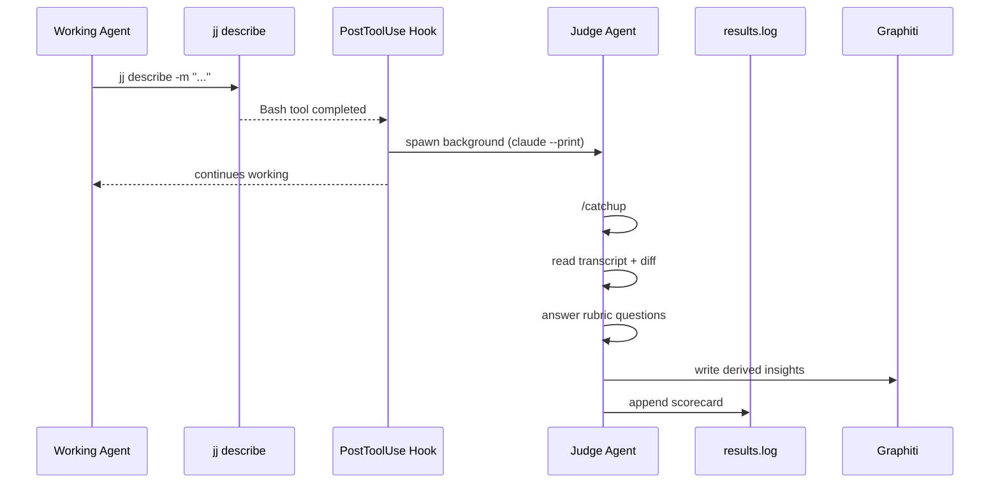

# Context System Evaluation

The eval system measures whether InDusk's context system makes agents better at real development tasks. It runs automatically on every commit and produces actionable findings.

## How It Works

A Claude Code PostToolUse hook fires after every `jj describe`. It spawns a background evaluator agent that:

1. Does a full `/catchup` (same as any new session)
2. Reads the session transcript
3. Reads the diff of what was just committed
4. Answers evaluation questions against the rubric
5. Writes derived insights to Graphiti
6. Logs a structured scorecard to `.indusk/eval/results.log`
7. Optionally POSTs the scorecard to a configured endpoint



## Two Modes

### Eval Mode (always on)

Every commit is scored. The evaluator writes findings to Graphiti so the next session picks them up. This is the learning loop — the context system gets smarter over time.

### Baseline Mode (controlled experiment)

A vanilla Claude Code agent (no MCP, no skills, no lessons) works on a stripped-down worktree. The smart evaluator scores its commits with the same rubric. This measures the delta the context system provides.

```bash
# Run a baseline evaluation
indusk eval baseline --task tasks/add-auth.md

# Keep the worktree for inspection
indusk eval baseline --task tasks/add-auth.md --keep
```

## Evaluation Questions (v1)

| ID | Question | What it catches |
|----|----------|----------------|
| `conventions` | Did the agent follow the project's conventions? | Naming violations, wrong tools, skipped patterns |
| `skipped-steps` | Did it skip instructed steps? | Missing gates, skipped verification, ignored skills |
| `better-approaches` | Were better approaches available? | Reinvented utilities, missed patterns |
| `missing-context` | Is context missing from the graph? | Gaps in Graphiti, lessons, CLAUDE.md |

### Adding Questions

The rubric lives in `apps/indusk-mcp/src/lib/eval/rubric.ts`. Adding a question is adding an object to the array:

```typescript
{
  id: "blast-radius",
  question: "Did the agent check blast radius before editing shared code?",
  guidance: "Check if the agent queried analyze_code_relationships before modifying shared modules.",
}
```

No infrastructure change needed. The evaluator prompt includes all questions automatically.

## Reading Results

```bash
# Show summary with pass rates and trends
indusk eval summary

# Filter by mode
indusk eval summary --mode baseline

# Show results since a date
indusk eval summary --since 2026-04-01

# JSON output for programmatic use
indusk eval summary --json
```

## Two Dimensions of Measurement

**Absolute quality (per commit):** Each scorecard answers "was this good work?" Findings go to Graphiti and improve future sessions.

**System improvement (over time):** Because the rubric is consistent, scores form a time series. `indusk eval summary` shows rolling averages and trends. The baseline gives the floor; the trend shows the trajectory.

## Configuration

In `.indusk/config.json`:

```json
{
  "eval": {
    "enabled": true,
    "endpoint": null
  }
}
```

- `enabled`: Set to `false` to disable the eval hook (default: `true`)
- `endpoint`: URL to POST scorecards to (optional, for centralized collection)

## Knowledge Distillation

The evaluator writes two kinds of output:

- **Scorecards** — logged to `.indusk/eval/results.log` (JSONL)
- **Graphiti facts** — derived insights written to the project's knowledge graph

The evaluator's Graphiti writes are selective — only facts that would have changed the outcome. Combined with user-side capture (corrections, brief acceptance, retro lessons), this creates a complete feedback loop.

## Findings Lifecycle

Eval findings persist until explicitly resolved. When the evaluator scores a commit, any question answered `no` or `partial` becomes an **unresolved finding** in `.indusk/eval/findings.json`.

On every subsequent `jj describe`, the hook surfaces unresolved findings to the agent:

```
📊 Unresolved eval findings (2):
  [warning] conventions: CLAUDE.md still references parties/ (change zpqywqzs)
  [info] missing-context: No graph data for webhook handler (change zpqywqzs)
Use `indusk eval fix <key>` or `indusk eval ignore <key>` to resolve.
```

Three states:
- **unresolved** — shows up on every commit until addressed
- **fixed** — agent resolved the issue
- **ignored** — agent saw it and chose to skip

```bash
# List unresolved findings
indusk eval findings

# List all findings including resolved
indusk eval findings --all

# Mark a finding as fixed
indusk eval fix "zpqywqzs:conventions"

# Mark a finding as ignored
indusk eval ignore "zpqywqzs:missing-context"
```

## Persistent Judge Sessions

The eval evaluator reuses sessions across commits to reduce cost. The first eval in a session does a full `/catchup` (~$2-4). Subsequent evals resume the same session via `claude --resume` with just the new change ID — much cheaper.

Session state is stored in `.indusk/eval/evaluator-session.json`. If the session expires or errors, the system clears it and starts fresh automatically.

## System Log

The eval system writes to `.indusk/eval/system.log` for full lifecycle visibility:

```
2026-04-11T21:48:12.700Z hook fired — tool: Bash, command: jj describe -m "..."
2026-04-11T21:48:12.701Z projectRoot: /path/to/project, eval.enabled: true
2026-04-11T21:48:12.744Z candidate: .../evaluator-runner.js — found
2026-04-11T21:48:12.746Z spawning evaluator — module: ..., changeId: abc123
2026-04-11T21:48:13.001Z evaluator process started — changeId: abc123
2026-04-11T21:50:45.123Z evaluator completed — scorecard written
```

Check this log when evals aren't appearing in `results.log`.

## Known Failure Modes

### Silent crash at parse — CJS `require()` in the spawned ESM script

**Symptom:** `system.log` shows `evaluator spawned — source: commit, pid: N` on every `jj describe`, but **never** logs `evaluator process started — changeId: ...` / `evaluator completed — ...` / `evaluator crashed — ...`. `results.log` receives no new scorecards. No error entry. No trace in Dash0. The subprocess seems to vanish.

**Cause:** the hook at `apps/indusk-mcp/hooks/eval-trigger.js` spawns the evaluator's lifecycle wrapper as `node --input-type=module -e <inline-script>` with `stdio: "ignore"`. If that inline script contains CJS module-resolution calls at top level (e.g., `const fs = require("fs")`), the subprocess throws `ReferenceError: require is not defined in ES module scope` at parse — line 2, before any user code runs. `stdio: "ignore"` swallows the stderr. The parent sees the spawn succeed and moves on.

**Fix in 1.19.1:** the inline script now uses ESM-native `import { mkdirSync, appendFileSync } from "node:fs"` and `import { dirname, join } from "node:path"`. A regression test (`apps/indusk-mcp/src/__tests__/falsification-hook-esm-require.test.ts`) grep-asserts the hook source contains no CJS module resolution.

### MCP tools unreachable from the spawned subprocess

**Symptom:** every scorecard in `.indusk/eval/results.log` records `graphitiWrites: 0` and `mcpToolCalls: 0`, even when `.indusk/highlights.jsonl` has unprocessed entries that the evaluator's prompt explicitly asks Claude to read and write to Graphiti. `.indusk/highlights-processed.jsonl` is never created. The evaluator runs to completion, writes a scorecard, but never invokes any `mcp__*` tool.

**Cause:** `claude --print` does NOT auto-discover the project's `.mcp.json` from cwd. Without `--mcp-config <path>`, only globally-configured MCP servers (typically `context7`, `tmux`, `playwright` — whatever's in the user's global Claude Code config) are loaded into the subprocess. The project's MCP servers — `indusk`, `graphiti`, `codegraphcontext`, etc. — are absent regardless of what `--allowed-tools` permits. `--allowed-tools` controls which tools the model may *call*; `--mcp-config` controls which tools *exist* in the subprocess at all.

A secondary trap: even with `--mcp-config` set, `claude --print` denies tool calls unless `--permission-mode acceptEdits` is also passed. The fresh-session evaluator path includes that flag; the resume-session path historically did not, so resumed sessions saw the tools but couldn't call them.

**Fix in 1.23.0:** the evaluator's spawn args at `apps/indusk-mcp/src/lib/eval/persistent-evaluator.ts` now include `--mcp-config .mcp.json` on both fresh and resume paths, plus `--permission-mode acceptEdits` on the resume path for symmetry with the fresh path. See `.indusk/planning/archive/eval-agent-mcp-access/diagnosis.md` for the full A/B test that confirmed the cause.

**Manual reproduction (works against any indusk project):**
```bash
# Fails — no MCP tools from .mcp.json visible:
echo "Call mcp__indusk__get_system_version and report the result." \
  | claude --print --output-format json \
    --allowed-tools "mcp__indusk__*"

# Succeeds — MCP tools loaded and callable:
echo "Call mcp__indusk__get_system_version and report the result." \
  | claude --print --output-format json \
    --mcp-config .mcp.json --permission-mode acceptEdits \
    --allowed-tools "mcp__indusk__*"
```

If the second invocation also returns "TOOL NOT AVAILABLE", check that `.mcp.json` is at cwd and that the `indusk` MCP server entry within it is reachable (`indusk serve` works on PATH).

### Debugging a broken evaluator

If `results.log` stops updating and you suspect a silent failure:

1. **Enable OTel first.** Add `eval.otel.enabled: true` to `.indusk/config.json` and set `OTEL_EXPORTER_OTLP_ENDPOINT` + auth headers (or rely on composable.env's wiring). Fire a trivial `jj describe`.
2. **Check `system.log` for lifecycle markers.** If you see `evaluator spawned` followed by nothing (no `evaluator process started`), the spawned subprocess is dying at parse. This is the failure mode above or a near relative.
3. **Check Dash0 for the `eval.run` span.** If OTel init logs `eval.otel initialized` to `system.log` but no `eval.run` span appears in the `agent` dataset, the process died between `initEvalOtel` and the first `withSpan`. Very unlikely — but the absence of the span narrows the search window considerably.
4. **Check `results.log` for `error: true` entries.** Since 1.19.1, any catch path writes an error entry. If there's no error entry AND no scorecard, the subprocess died before any user code ran (same failure class as above).
5. **Read `.indusk/planning/archive/bug-fix-eval-agent/diagnosis.md`** for the canonical example of how to diagnose this class of silent failure — the same method works for unrelated crashes at parse.

Silent failures in this pipeline are always diagnosable with the OTel + lifecycle-log + results.log triangle. If all three are silent, check what the subprocess was running (the hook's `evaluatorScript` template) for a parse-time error.
