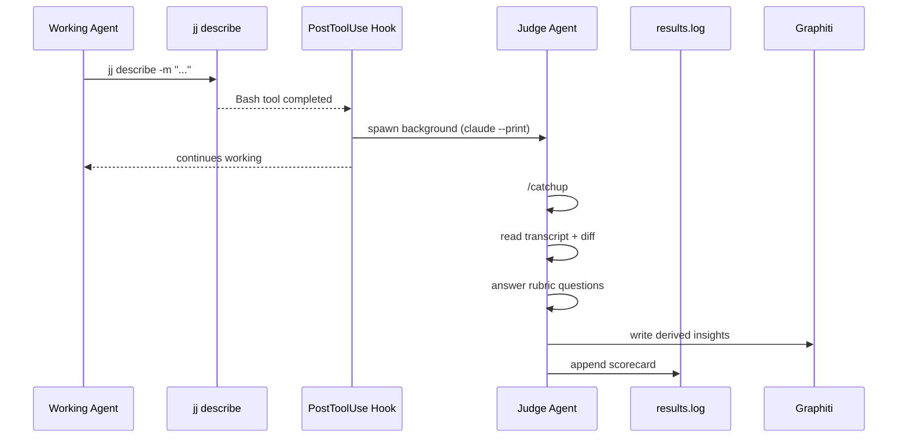

# Context System Evaluation

The eval system measures whether InDusk's context system makes agents better at real development tasks. It runs automatically on every commit and produces actionable findings.

## How It Works

A Claude Code PostToolUse hook fires after every `jj describe`. It spawns a background judge agent that:

1. Does a full `/catchup` (same as any new session)
2. Reads the session transcript
3. Reads the diff of what was just committed
4. Answers evaluation questions against the rubric
5. Writes derived insights to Graphiti
6. Logs a structured scorecard to `.indusk/eval/results.log`
7. Optionally POSTs the scorecard to a configured endpoint



## Two Modes

### Eval Mode (always on)

Every commit is scored. The evaluator writes findings to Graphiti so the next session picks them up. This is the learning loop — the context system gets smarter over time.

### Baseline Mode (controlled experiment)

A vanilla Claude Code agent (no MCP, no skills, no lessons) works on a stripped-down worktree. The smart evaluator scores its commits with the same rubric. This measures the delta the context system provides.

```bash
# Run a baseline evaluation
indusk eval baseline --task tasks/add-auth.md

# Keep the worktree for inspection
indusk eval baseline --task tasks/add-auth.md --keep
```

## Evaluation Questions (v1)

| ID | Question | What it catches |
|----|----------|----------------|
| `conventions` | Did the agent follow the project's conventions? | Naming violations, wrong tools, skipped patterns |
| `skipped-steps` | Did it skip instructed steps? | Missing gates, skipped verification, ignored skills |
| `better-approaches` | Were better approaches available? | Reinvented utilities, missed patterns |
| `missing-context` | Is context missing from the graph? | Gaps in Graphiti, lessons, CLAUDE.md |

### Adding Questions

The rubric lives in `apps/indusk-mcp/src/lib/eval/rubric.ts`. Adding a question is adding an object to the array:

```typescript
{
  id: "blast-radius",
  question: "Did the agent check blast radius before editing shared code?",
  guidance: "Check if the agent queried analyze_code_relationships before modifying shared modules.",
}
```

No infrastructure change needed. The judge prompt includes all questions automatically.

## Reading Results

```bash
# Show summary with pass rates and trends
indusk eval summary

# Filter by mode
indusk eval summary --mode baseline

# Show results since a date
indusk eval summary --since 2026-04-01

# JSON output for programmatic use
indusk eval summary --json
```

## Two Dimensions of Measurement

**Absolute quality (per commit):** Each scorecard answers "was this good work?" Findings go to Graphiti and improve future sessions.

**System improvement (over time):** Because the rubric is consistent, scores form a time series. `indusk eval summary` shows rolling averages and trends. The baseline gives the floor; the trend shows the trajectory.

## Configuration

In `.indusk/config.json`:

```json
{
  "eval": {
    "enabled": true,
    "endpoint": null
  }
}
```

- `enabled`: Set to `false` to disable the eval hook (default: `true`)
- `endpoint`: URL to POST scorecards to (optional, for centralized collection)

## Knowledge Distillation

The evaluator writes two kinds of output:

- **Scorecards** — logged to `.indusk/eval/results.log` (JSONL)
- **Graphiti facts** — derived insights written to the project's knowledge graph

The evaluator's Graphiti writes are selective — only facts that would have changed the outcome. Combined with user-side capture (corrections, brief acceptance, retro lessons), this creates a complete feedback loop.

## Findings Lifecycle

Eval findings persist until explicitly resolved. When the judge scores a commit, any question answered `no` or `partial` becomes an **unresolved finding** in `.indusk/eval/findings.json`.

On every subsequent `jj describe`, the hook surfaces unresolved findings to the agent:

```
📊 Unresolved eval findings (2):
  [warning] conventions: CLAUDE.md still references parties/ (change zpqywqzs)
  [info] missing-context: No graph data for webhook handler (change zpqywqzs)
Use `indusk eval fix <key>` or `indusk eval ignore <key>` to resolve.
```

Three states:
- **unresolved** — shows up on every commit until addressed
- **fixed** — agent resolved the issue
- **ignored** — agent saw it and chose to skip

```bash
# List unresolved findings
indusk eval findings

# List all findings including resolved
indusk eval findings --all

# Mark a finding as fixed
indusk eval fix "zpqywqzs:conventions"

# Mark a finding as ignored
indusk eval ignore "zpqywqzs:missing-context"
```

## Persistent Judge Sessions

The eval judge reuses sessions across commits to reduce cost. The first eval in a session does a full `/catchup` (~$2-4). Subsequent evals resume the same session via `claude --resume` with just the new change ID — much cheaper.

Session state is stored in `.indusk/eval/judge-session.json`. If the session expires or errors, the system clears it and starts fresh automatically.

## System Log

The eval system writes to `.indusk/eval/system.log` for full lifecycle visibility:

```
2026-04-11T21:48:12.700Z hook fired — tool: Bash, command: jj describe -m "..."
2026-04-11T21:48:12.701Z projectRoot: /path/to/project, eval.enabled: true
2026-04-11T21:48:12.744Z candidate: .../judge-runner.js — found
2026-04-11T21:48:12.746Z spawning judge — module: ..., changeId: abc123
2026-04-11T21:48:13.001Z judge process started — changeId: abc123
2026-04-11T21:50:45.123Z judge completed — scorecard written
```

Check this log when evals aren't appearing in `results.log`.
