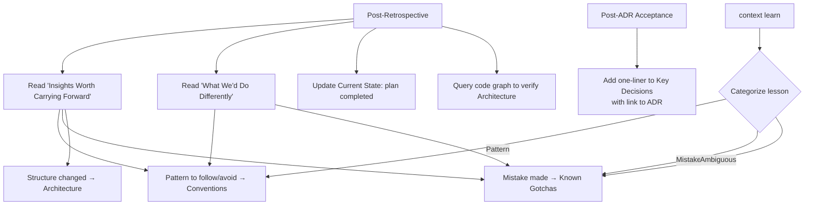

# Context

The context skill maintains CLAUDE.md as living project memory — a structured file that Claude Code reads at the start of every conversation. Instead of starting each session from scratch, the agent inherits accumulated knowledge about architecture, conventions, decisions, gotchas, and current state. Context ensures that project knowledge compounds across sessions rather than evaporating when a conversation ends.

## What It Does

Context operates in two modes:

1. **Maintains CLAUDE.md** — keeps the living project memory file accurate through three update triggers (post-retrospective, post-ADR, and `context learn`).
2. **Shapes impl documents** — when writing an impl via the [Plan](/reference/skills/plan) skill, every phase includes a Context section that specifies exactly what CLAUDE.md updates that phase produces.

The skill does not generate CLAUDE.md from scratch. It maintains one that already exists, keeping it in sync with reality as the project evolves.

## The Six Sections

CLAUDE.md has exactly six sections. This structure is fixed — never add, remove, or rename sections. Every section is always present, even if empty.

| Section | What Goes In | What Stays Out |
|---------|-------------|----------------|
| **What This Is** | 1-2 sentences: what the project is and who it is for. Rarely changes. | Marketing copy, roadmap aspirations, feature lists |
| **Architecture** | Directory tree, key technologies, how things connect. Apps, packages, skills, and their relationships. | Implementation details derivable from reading the code |
| **Conventions** | Patterns to follow, anti-patterns to avoid. Concise one-liners accumulated from corrections, retrospectives, and decisions. | Long explanations — link to the source document instead |
| **Key Decisions** | One-liner per decision with a link to the ADR. Only added via the post-ADR trigger. | Full rationale — that lives in the ADR itself |
| **Known Gotchas** | Mistakes and surprises. Things that went wrong before and should not go wrong again. | Debugging solutions — the fix is in the code, the commit message has the context |
| **Current State** | What is in progress, recently completed, or blocked. Active plans and their stages. | Ephemeral task state — use todos for the current conversation |

### Realistic Content Examples

**What This Is:**

```markdown
## What This Is

A pnpm + Turborepo monorepo containing Sandy's personal brand site and the
development system that powers it. The repo dogfoods its own skill system —
the same plan/work/verify/context skills used to build features are also
the product being showcased.
```

**Architecture** (abbreviated):

```markdown
## Architecture

infinitedusky/
├── apps/
│   ├── indusk-portfolio/   # Next.js 15 + Tailwind 4
│   ├── indusk-mcp/        # InDusk MCP server — dev system tooling
│   └── indusk-docs/       # VitePress documentation site
├── .claude/skills/        # Claude Code skills (installed via init)
├── planning/              # Plans following the plan skill lifecycle
└── CLAUDE.md              # This file — living project memory

**Apps:**
- **indusk-portfolio**: Next.js 15 + Tailwind 4. Dark theme. Runs in Docker.
- **indusk-mcp**: 13 MCP tools across plan, context, quality, document, and
  system categories. CLI for init/update.
- **indusk-docs**: VitePress 1.x with Mermaid diagrams and FullscreenDiagram.
```

**Conventions:**

```markdown
## Conventions

- pnpm workspaces, Turborepo for task orchestration
- **Biome for linting and formatting** — NOT ESLint. Run `biome check` not `eslint`
- Skills are markdown files in `.claude/skills/{name}/SKILL.md`
- `pnpm check` for lint/format check, `pnpm check:fix` to auto-fix
- Before touching shared code, query the code graph to understand blast radius
```

**Key Decisions:**

```markdown
## Key Decisions

- Context skill is pure markdown instructions, not MCP tools — see `planning/context-skill/adr.md`
- Biome over ESLint: single binary, no plugin config hell — see `planning/code-quality-system/adr.md`
- CodeGraphContext with global FalkorDB + local CGC via pipx — see `planning/codegraph-context/adr.md`
```

**Known Gotchas:**

```markdown
## Known Gotchas

- Tailwind 4 requires Node 22 — build fails on Node 18 with "Cannot find native binding" error
- Always use `pnpm ce`, not `npx ce` — the skill doc specifies pnpm
- Biome 2.x API differs from docs/examples: `noVar` doesn't exist, overrides use `includes` not `include`
- Skills in `.claude/skills/` are package-owned — edit in `apps/indusk-mcp/skills/`, then run `update`
```

**Current State:**

```markdown
## Current State

Repo scaffolded and building. InDusk Portfolio runs in Docker via composable.env.

**Active plans:**

| Plan | Stage | Next Step |
|------|-------|-----------|
| context-skill | impl (completed) | Ready for retrospective |
| verify-skill | impl (completed) | Ready for retrospective |
```

### Empty Section Convention

If a section has no content yet, use a placeholder rather than leaving it blank:

```markdown
## Known Gotchas

(None yet — will be populated as the agent makes mistakes)
```

## The Three Triggers

Context updates happen at three specific moments. These are the only times CLAUDE.md changes — there is no periodic "refresh" or ad-hoc editing.

<FullscreenDiagram>



</FullscreenDiagram>

### Trigger 1: Post-Retrospective

After the [Retrospective](/reference/skills/retrospective) skill completes, the context skill reads two retrospective sections and maps insights to CLAUDE.md sections:

| Retrospective Section | Maps To |
|----------------------|---------|
| Insights Worth Carrying Forward | **Conventions** (patterns) or **Known Gotchas** (mistakes) |
| What We'd Do Differently | **Known Gotchas** (mistakes) or **Conventions** (new patterns) |
| Quality Ratchet (new Biome rule) | **Conventions** (enforced pattern) |
| Plan completion | **Current State** (update stage) |

The trigger also requires querying the code graph (`query_dependencies` on key files that changed) to verify that the Architecture section still reflects reality. If the plan changed how modules connect, Architecture gets updated with the new relationships.

**Example:** After the `code-quality-system` retrospective, the following changes are made:

- **Conventions** gets: `After each retrospective, ask if mistakes could be caught by a Biome rule — if yes, add to biome.json and biome-rationale.md`
- **Known Gotchas** gets: `Biome 2.x API differs from docs/examples: noVar doesn't exist, overrides use "includes" not "include"`
- **Current State** updates the plan's row to show `impl (completed) | Ready for retrospective`

### Trigger 2: Post-ADR Acceptance

When an ADR's frontmatter status changes to `accepted`, add exactly one line to **Key Decisions**:

```markdown
- Biome config is a knowledge artifact with biome-rationale.md; quality ratchet only gets tighter — see `planning/code-quality-system/adr.md`
```

No rationale is duplicated. The link is the documentation. Key Decisions is never updated via any other trigger.

### Trigger 3: `context learn`

Invoked as `/context learn "lesson"`, or triggered when the agent detects it has been corrected mid-session:

> **User:** "No, use pnpm ce, not npx"
> **Agent:** *fixes the command* — "Should I capture this? `/context learn 'use pnpm ce, not npx — the skill doc specifies pnpm'`"

The lesson is categorized:

- **Conventions** — patterns to follow or avoid (`use Biome not ESLint`, `no default exports`)
- **Known Gotchas** — mistakes (`don't run npx ce, use pnpm ce`, `always env:build before docker compose`)
- If ambiguous, default to **Known Gotchas** — better to over-capture than miss a lesson

`context learn` never adds to Key Decisions (that is ADR-only) and never adds to Current State (that is updated by triggers or manually).

## What Stays Out

CLAUDE.md is an index, not an encyclopedia. The following do not belong:

- **Code patterns derivable from reading the source** — the code is the documentation
- **Git history or recent changes** — use `git log`
- **Debugging solutions** — the fix is in the code; the commit message has the context
- **Ephemeral task state** — use tasks/todos for the current conversation
- **Anything already fully documented in a planning document** — link to it instead of duplicating
- **Content longer than a few lines per entry** — if it needs a paragraph, it belongs in a planning doc with a link from CLAUDE.md

## Shaping Impl Documents

When the [Plan](/reference/skills/plan) skill writes an impl document, the context skill ensures every phase ends with a Context section specifying concrete CLAUDE.md edits. This is how knowledge transfer is built into the work itself, not bolted on after the fact.

Each phase follows this structure:

```markdown
### Phase N: {Name}
- [ ] {implementation items}

#### Phase N Verification
- [ ] {prove this phase works — tests, type checks, commands}

#### Phase N Context
- [ ] {concrete CLAUDE.md edits this phase produces}
```

### Bad vs. Good Context Items

Context items must be concrete, specific CLAUDE.md edits. The agent writing the impl must answer: "What does this phase change about how the project works, and what should future sessions know about it?"

**Bad — too vague:**

```markdown
#### Phase 2 Context
- [ ] Update CLAUDE.md
```

**Good — specifies the section and the content:**

```markdown
#### Phase 2 Context
- [ ] Add to Architecture: indusk-mcp now provides 20 tools across 7 categories
- [ ] Add to Known Gotchas: Biome 2.x overrides use "includes" not "include"
```

**Good — updates Current State with plan progress:**

```markdown
#### Phase 3 Context
- [ ] Update Current State: Phase 3 of payment-flow complete, all subscription endpoints verified
```

Not every phase produces context. If nothing about the project's structure, conventions, or state changed, no context items are needed. But the question must always be asked.

### Context Items Are Blocking

During execution via the [Work](/reference/skills/work) skill, context items are checked off alongside implementation and verification items. The per-phase completion order is:

```
implementation items --> verification items --> context items --> advance to next phase
```

A phase is not complete until its context items are done. The `advance_plan` tool will block advancement if context items remain unchecked.

## Forward Intelligence

At the end of each phase's context items, the impl document may include a **Forward Intelligence** block:

```markdown
#### Phase 2 Forward Intelligence
- **Fragile**: webhook signature verification depends on raw body — any middleware
  that parses JSON before the webhook route will break verification silently
- **Watch out**: Phase 3 proration logic assumes subscription status is already
  synced via webhooks — if webhook processing is slow, proration calculations
  will use stale data
- **Assumption**: parser assumes all phases have verification sections — if a
  phase has no verification, the parser may skip it or error
```

Forward intelligence is not a CLAUDE.md update. It lives in the impl doc itself, after the context items. The [Work](/reference/skills/work) skill reads it before starting the next phase so the agent knows what landmines exist.

The three block types:

| Block | Purpose |
|-------|---------|
| **Fragile** | A file or module that was tricky during this phase, and why |
| **Watch out** | A downstream risk the next phase should be aware of |
| **Assumption** | Something that is true now but could change |

Not every phase produces forward intelligence. Only write it when something is genuinely fragile, risky, or assumption-dependent. Skip the section entirely if there is nothing worth flagging.

## MCP Tools

Two MCP tools provide programmatic access to CLAUDE.md. These are called by the agent, not invoked directly by users.

### `get_context`

Returns CLAUDE.md parsed into its 6 canonical sections with validation status. Takes no input.

**Example call:**

```json
{ "tool": "get_context" }
```

**Example response:**

```json
{
  "title": "infinitedusky — Project Context",
  "sections": [
    {
      "name": "What This Is",
      "content": "A pnpm + Turborepo monorepo containing Sandy's personal brand site and the development system that powers it."
    },
    {
      "name": "Architecture",
      "content": "```\ninfinitedusky/\n├── apps/\n│   ├── indusk-portfolio/\n│   ├── indusk-mcp/\n│   └── indusk-docs/\n..."
    },
    {
      "name": "Conventions",
      "content": "- pnpm workspaces, Turborepo for task orchestration\n- **Biome for linting and formatting** — NOT ESLint\n..."
    },
    {
      "name": "Key Decisions",
      "content": "- Context skill is pure markdown instructions, not MCP tools — see `planning/context-skill/adr.md`\n..."
    },
    {
      "name": "Known Gotchas",
      "content": "- Tailwind 4 requires Node 22 — build fails on Node 18\n- Always use `pnpm ce`, not `npx ce`\n..."
    },
    {
      "name": "Current State",
      "content": "Repo scaffolded and building. InDusk Portfolio runs in Docker.\n\n**Active plans:**\n\n| Plan | Stage | Next Step |\n..."
    }
  ],
  "validation": {
    "valid": true,
    "missing": [],
    "extra": []
  }
}
```

The `validation` field reports structural integrity:

| Field | Meaning |
|-------|---------|
| `valid` | `true` if all 6 sections are present and no extra sections exist |
| `missing` | Array of section names that should exist but do not |
| `extra` | Array of section names that exist but should not (non-canonical `##` headings) |

If validation fails, the structure must be fixed manually before `update_context` will accept changes.

### `update_context`

Updates a specific section of CLAUDE.md. Validates structure before and after the write.

**Input:**

| Parameter | Type | Description |
|-----------|------|-------------|
| `section` | enum | One of: `What This Is`, `Architecture`, `Conventions`, `Key Decisions`, `Known Gotchas`, `Current State` |
| `content` | string | New content for the section (replaces existing content) |

**Example call:**

```json
{
  "tool": "update_context",
  "arguments": {
    "section": "Known Gotchas",
    "content": "- Tailwind 4 requires Node 22 — build fails on Node 18 with \"Cannot find native binding\" error\n- Always use `pnpm ce`, not `npx ce` — the skill doc specifies pnpm\n- Stripe webhook signatures require raw body — do not parse JSON before verification"
  }
}
```

**Success response:**

```json
{
  "success": true,
  "section": "Known Gotchas",
  "structureValid": true
}
```

**Failure response** (when CLAUDE.md structure is already invalid):

```json
{
  "success": false,
  "error": "CLAUDE.md structure is invalid — fix manually before updating via tool",
  "validation": {
    "valid": false,
    "missing": ["Current State"],
    "extra": []
  }
}
```

The tool replaces the entire section content. To append a new gotcha, the agent must first read the section via `get_context`, add the new entry, and then call `update_context` with the combined content.

## Walkthrough: Context Update After ADR

Here is the complete flow when an ADR is accepted, showing how the Key Decisions section changes.

### 1. ADR Status Changes

The `planning/codegraph-context/adr.md` frontmatter is updated:

```markdown
---
title: "CodeGraph Context"
date: 2026-02-15
status: accepted
---
```

### 2. Context Skill Triggers

The post-ADR trigger fires. The agent reads the ADR's Y-statement and extracts a one-liner summary.

### 3. Key Decisions Before

```markdown
## Key Decisions

- Context skill is pure markdown instructions, not MCP tools — see `planning/context-skill/adr.md`
- CLAUDE.md has a fixed 6-section structure maintained by the context skill — see `planning/context-skill/adr.md`
- Biome over ESLint: single binary, no plugin config hell, fast enough for per-item verification
```

### 4. Agent Calls `update_context`

```json
{
  "tool": "update_context",
  "arguments": {
    "section": "Key Decisions",
    "content": "- Context skill is pure markdown instructions, not MCP tools — see `planning/context-skill/adr.md`\n- CLAUDE.md has a fixed 6-section structure maintained by the context skill — see `planning/context-skill/adr.md`\n- Biome over ESLint: single binary, no plugin config hell, fast enough for per-item verification\n- CodeGraphContext with global FalkorDB + local CGC via pipx for structural code intelligence — see `planning/codegraph-context/adr.md`"
  }
}
```

### 5. Key Decisions After

```markdown
## Key Decisions

- Context skill is pure markdown instructions, not MCP tools — see `planning/context-skill/adr.md`
- CLAUDE.md has a fixed 6-section structure maintained by the context skill — see `planning/context-skill/adr.md`
- Biome over ESLint: single binary, no plugin config hell, fast enough for per-item verification
- CodeGraphContext with global FalkorDB + local CGC via pipx for structural code intelligence — see `planning/codegraph-context/adr.md`
```

One line added. No rationale duplicated. The ADR link is the documentation.

## Gotchas

- **Do not put ephemeral information in CLAUDE.md.** Current task progress, debugging notes, and "I'm working on X" belong in conversation todos, not in the living memory file. Current State tracks plan stages, not individual work items.

- **Do not add code patterns.** If the pattern is visible by reading the source code, it does not belong in CLAUDE.md. The code is the documentation for how code works. CLAUDE.md documents what is not visible in code — decisions, conventions, gotchas.

- **Keep sections concise.** Each entry should be a one-liner or at most a few lines. If an entry needs a paragraph of explanation, it belongs in a planning document. Add a link from CLAUDE.md to that document instead.

- **CLAUDE.md must have exactly 6 sections.** The parser validates structure by checking for exactly these six `##` headings: What This Is, Architecture, Conventions, Key Decisions, Known Gotchas, Current State. Extra headings or missing headings cause validation to fail, and `update_context` will refuse to write until the structure is fixed.

- **Trigger discipline matters.** If you skip a post-retrospective or post-ADR update, knowledge is lost. The context skill exists because session boundaries erase memory. Every skipped trigger is a lesson that a future agent will have to relearn the hard way.

- **Key Decisions only comes from ADRs.** Never add to Key Decisions via `context learn` or during a retrospective. The ADR acceptance trigger is the only path. This keeps the section authoritative — every entry links to a formal decision record.

- **When in doubt, use Known Gotchas.** If you are unsure whether something is a Convention or a Gotcha, default to Known Gotchas. Over-capturing in Gotchas is better than losing a lesson entirely.
