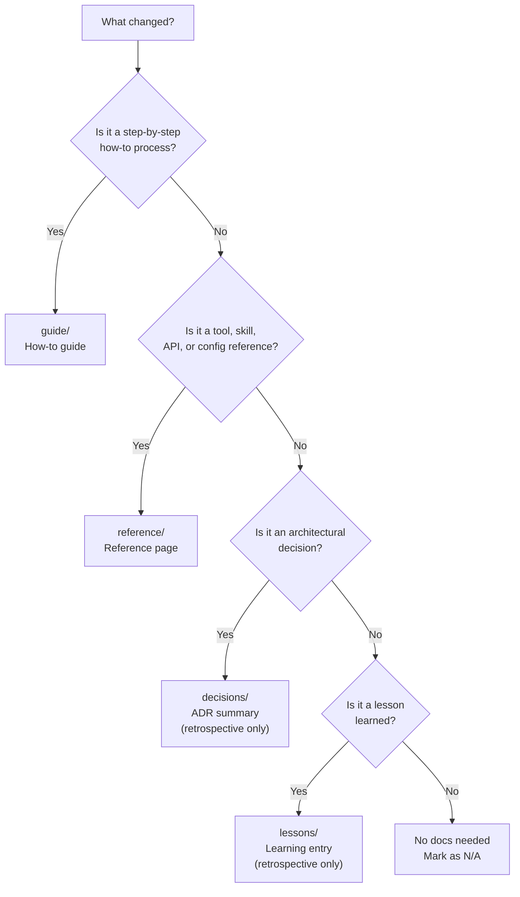

# Document

The document skill is a per-phase documentation gate during impl execution. It sits alongside [Verify](/reference/skills/verify) and [Context](/reference/skills/context) in the phase completion sequence, ensuring that user-facing and developer-facing documentation stays current as work progresses. Every phase asks one question: does this change need docs? If yes, write them. If no, move on.

## What It Does

Document enforces a documentation checkpoint at the end of every impl phase. The full phase completion order is:

```
implement --> verify --> context --> document --> advance
```

After context items are complete, the document gate activates. It does not always produce output — not every phase changes something a user or developer needs to know. But the question is always asked.

The skill also provides guidance on where documentation belongs, how to structure Mermaid diagrams, and how to shape impl documents so that documentation needs are identified upfront rather than forgotten at the end.

## Where Docs Live

Documentation lives in a VitePress site at `apps/indusk-docs/src/`:

```
apps/indusk-docs/src/
├── guide/           # How-to guides (task-oriented)
├── reference/       # Skills, tools, API, configuration (information-oriented)
│   ├── skills/      # One page per skill
│   └── tools/       # One page per tool (Biome, CGC, composable.env)
├── decisions/       # ADR summaries — populated during retrospective
└── lessons/         # Learning entries — populated during retrospective
```

| Directory | Audience | Content Type | Populated During |
|-----------|----------|-------------|------------------|
| `guide/` | Users and developers | Step-by-step how-to instructions | Normal impl work |
| `reference/` | Users and developers | Skills, tools, APIs, configuration | Normal impl work |
| `decisions/` | Developers | Distilled ADR summaries | [Retrospective](/reference/skills/retrospective) only |
| `lessons/` | Developers | Insights from retrospective audits | [Retrospective](/reference/skills/retrospective) only |

## The Document Gate

The core question at every phase:

**"Does this phase change something a user or developer needs to know?"**

To answer accurately, call `query_dependencies` on the key files changed in the phase. If the change affects files with many dependents, it likely needs documentation. If it is internal with no downstream consumers, it might not.

- **Yes** — write or update the relevant page in `apps/indusk-docs/src/`
- **No** — mark as N/A with a brief reason and advance

The gate is blocking. A phase is not complete until its document items are resolved — either by writing the docs or by explicitly deciding no docs are needed.

## What Goes Where

Use this decision tree to determine where a new doc page belongs:

<FullscreenDiagram>



</FullscreenDiagram>

Green nodes are written during normal [Work](/reference/skills/work) execution. Red nodes are populated only during [Retrospective](/reference/skills/retrospective).

## Mermaid Diagrams

Prefer diagrams over long prose for architecture, flows, and relationships. A well-labeled diagram communicates structure faster than paragraphs of text.

### When to Use Which Diagram Type

| Scenario | Diagram Type | Example |
|----------|-------------|---------|
| System architecture, data flow | `flowchart` | How services connect |
| API calls, request/response sequences | `sequenceDiagram` | Auth flow between client and server |
| Code structure, class relationships | `classDiagram` | Package dependencies |
| Lifecycle, state machines | `stateDiagram-v2` | [Plan](/reference/skills/plan) lifecycle stages |
| Data models, entity relationships | `erDiagram` | Database schema |
| Timelines, project phases | `timeline` | Release milestones |

### FullscreenDiagram Component

Every Mermaid diagram in the docs **must** be wrapped in the `<FullscreenDiagram>` component. This provides an expand-to-fullscreen overlay with pan, zoom, and reset controls — essential for diagrams that are too dense to read inline.

Complete usage example:

```markdown
<FullscreenDiagram>

` ``mermaid
flowchart TD
  P[Plan] --> W[Work]
  W --> V{Verify}
  V -->|pass| CX[Context]
  CX --> D[Document]
  D --> W
  W -->|complete| R[Retrospective]
  R --> A[Archive]
` ``

</FullscreenDiagram>
```

Note the blank lines before and after the fenced code block — VitePress requires them inside the component wrapper for correct parsing.

### Diagram Best Practices

- **One concept per diagram.** Do not cram the entire system into one chart. Break complex systems into focused diagrams.
- **Meaningful labels.** Use full words, not abbreviations. `Plan Skill` not `PS`.
- **No custom colors in diagrams.** The docs site supports both light and dark mode. The `vitepress-plugin-mermaid` auto-switches between Mermaid's `default` (light) and `dark` themes. Do not use `style`, `classDef`, or `themeVariables` with hardcoded colors — they persist across theme switches and become unreadable in the opposite mode. Use `subgraph` blocks for visual grouping instead of color-coding.
- **Keep diagrams small enough to read inline** but detailed enough to be useful when expanded to fullscreen.

## Shaping Impl Documents

When writing an impl via the [Plan](/reference/skills/plan) skill, every phase should include a `Document` section specifying what docs to write or update. The agent writing the impl must answer: "What does a user or developer need to know about what this phase built?"

Document items must be specific — name the page, describe the content, identify the directory.

**Bad:**

```markdown
#### Phase 1 Document
- [ ] Update docs
```

**Good:**

```markdown
#### Phase 1 Document
- [ ] Add reference/tools/codegraph.md documenting the 3 graph tools with setup instructions
```

```markdown
#### Phase 2 Document
- [ ] Update guide/getting-started.md to include the new webhook configuration step
```

If a phase builds nothing user-facing, no document items are needed. But the question must be asked — the absence of docs should be a deliberate decision, not an oversight.

## Decisions and Lessons

The `decisions/` and `lessons/` directories are **not** populated during normal impl work via [Work](/reference/skills/work). They are populated during the [Retrospective](/reference/skills/retrospective) skill's archival process.

| Section | When Populated | Source |
|---------|---------------|--------|
| `decisions/` | Retrospective archival | Distilled from `planning/{name}/adr.md` |
| `lessons/` | Retrospective archival | Distilled from `planning/{name}/retrospective.md` |

This separation exists because decisions and lessons require the full context of a completed plan — what was planned, what actually happened, and what was learned. That context is not available during mid-impl work phases.

## Running the Docs Site

```bash
# Local dev server
pnpm turbo dev --filter=indusk-docs

# Build static output
pnpm turbo build --filter=indusk-docs
```

The dev server supports hot reload. Changes to markdown files and the `FullscreenDiagram` component are reflected immediately.

## MCP Tools

Two MCP tools support the document skill:

### `list_docs`

Lists all markdown files in the VitePress docs directory (`apps/indusk-docs/src/`). No input required.

Example output:

```json
{
  "docsDir": "apps/indusk-docs/src",
  "files": [
    "index.md",
    "guide/index.md",
    "guide/getting-started.md",
    "reference/index.md",
    "reference/skills/plan.md",
    "reference/skills/work.md",
    "reference/skills/verify.md",
    "reference/skills/context.md",
    "reference/skills/document.md",
    "reference/skills/retrospective.md",
    "reference/tools/indusk-mcp.md",
    "reference/tools/composable-env.md",
    "reference/tools/codegraph.md",
    "reference/tools/biome.md",
    "decisions/index.md",
    "lessons/index.md"
  ]
}
```

Use this to check what pages already exist before creating new ones or to verify that a page you wrote actually landed in the right location.

### `check_docs_coverage`

Compares completed plans to existing decision and lesson pages in the docs site. Flags plans that completed their lifecycle but lack corresponding documentation.

Example output:

```json
{
  "completedPlans": 3,
  "documented": 1,
  "gaps": 2,
  "coverage": [
    {
      "plan": "context-skill",
      "stage": "impl",
      "stageStatus": "completed",
      "hasDecisionPage": true,
      "hasLessonPage": false,
      "gap": false
    },
    {
      "plan": "verify-skill",
      "stage": "impl",
      "stageStatus": "completed",
      "hasDecisionPage": false,
      "hasLessonPage": false,
      "gap": true
    }
  ]
}
```

A plan has a "gap" if it has no matching decision page. This tool is most useful during [Retrospective](/reference/skills/retrospective) to identify which completed plans still need their ADR distilled into `decisions/`.

## LLM-Readable Companion Files

Every documentation page must have a corresponding **llms.txt** companion file so AI agents can consume the docs directly without HTML parsing.

### File Mapping

For every page at `apps/indusk-docs/src/{path}.md`, create a matching file at `apps/indusk-docs/public/llms/{path}.txt`:

```
src/reference/skills/plan.md       → public/llms/reference/skills/plan.txt
src/guide/getting-started.md       → public/llms/guide/getting-started.txt
src/reference/tools/indusk-mcp.md  → public/llms/reference/tools/indusk-mcp.txt
```

### Content Rules

The `.txt` file contains the **same content** as the markdown page with these adjustments:

- Strip Mermaid diagram blocks and `<FullscreenDiagram>` wrappers (diagrams don't render as text)
- Keep all tables, code blocks, headings, and prose
- Keep all examples — these are the most valuable part for LLMs
- Add a header: `# {Page Title} — LLM-readable version`
- Add a source line: `Source: {relative path to the .md file}`

### Root Index

Maintain `apps/indusk-docs/public/llms.txt` as a root index listing all available LLM-readable pages with URLs and one-line descriptions. This follows the [llms.txt convention](https://llmstxt.org/).

### Why This Matters

When an external agent needs to understand this system, point it at `/llms/reference/skills/plan.txt` — it gets clean, structured text with no HTML, JavaScript, or SVG to decode.

## Sidebar Configuration

When adding a new page to the docs site, you must also add it to the sidebar in `.vitepress/config.ts`. The sidebar is organized by top-level directory:

```typescript
sidebar: {
  "/guide/": [
    {
      text: "Guide",
      items: [
        { text: "Overview", link: "/guide/" },
        { text: "Getting Started", link: "/guide/getting-started" },
        // Add new guide pages here
      ],
    },
  ],
  "/reference/": [
    {
      text: "Skills",
      items: [
        // One entry per skill
      ],
    },
    {
      text: "Tools",
      items: [
        // One entry per tool
      ],
    },
  ],
  // decisions/ and lessons/ follow the same pattern
}
```

Pages not listed in the sidebar will still be accessible by URL but will not appear in navigation. Always update the sidebar when adding a new page.

## Gotchas

- **Do not add decisions or lessons during `/work`.** The `decisions/` and `lessons/` directories are populated only during [Retrospective](/reference/skills/retrospective). Writing to them during normal impl phases breaks the lifecycle — the full context needed to distill decisions and lessons does not exist yet.

- **Always update the sidebar config.** Adding a markdown file without a sidebar entry makes it invisible in navigation. Edit `.vitepress/config.ts` alongside the new page.

- **Use `<FullscreenDiagram>` for all Mermaid diagrams.** Never use bare `` ```mermaid `` blocks. Diagrams are often too small to read inline, and the FullscreenDiagram component provides zoom and pan controls that make dense diagrams usable.

- **Documentation is human-facing, CLAUDE.md is agent-facing.** They serve different audiences. Do not duplicate content between them. The [Context](/reference/skills/context) skill maintains CLAUDE.md for the agent; the document skill maintains VitePress pages for humans.

- **Link, do not duplicate.** If something is fully documented in a skill file or ADR, link to the docs page rather than copying content. One source of truth.

- **Keep reference pages scannable.** Use tables and diagrams over prose paragraphs. If you are writing more than two paragraphs to explain a concept, consider whether a diagram or table would communicate it faster.