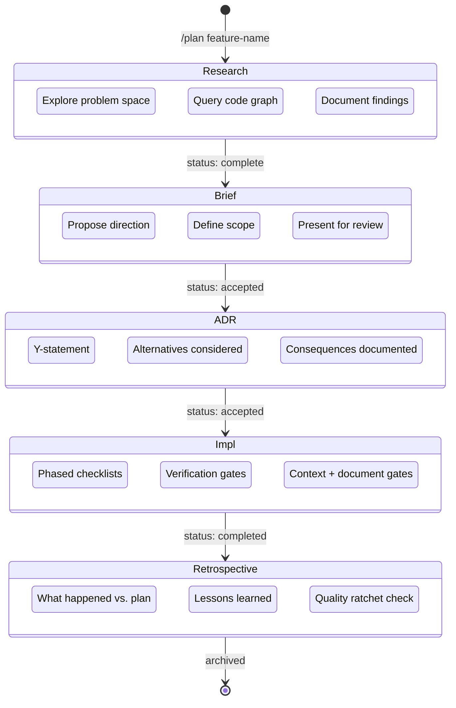
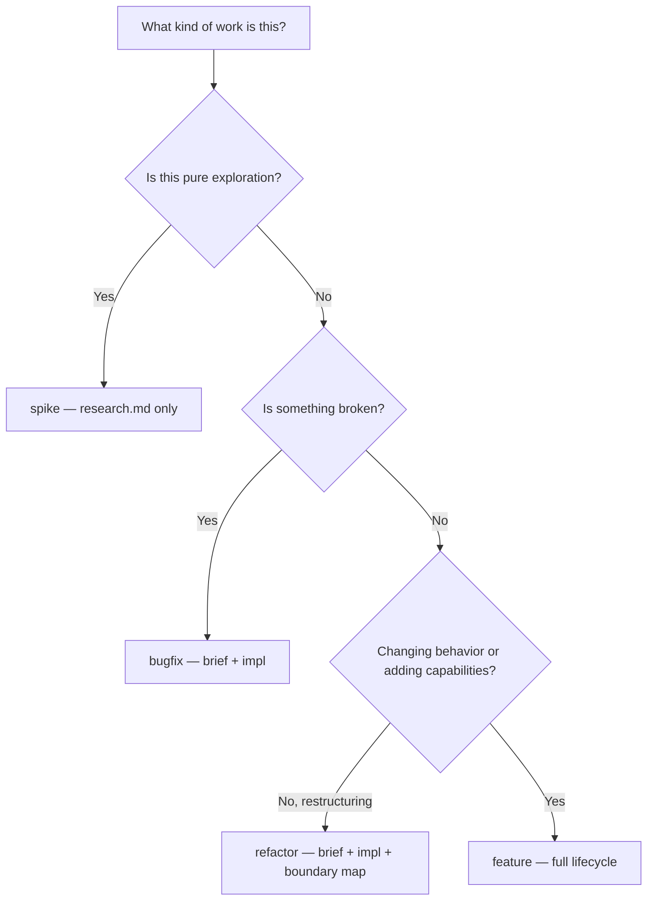

# Plan

The plan skill structures how work moves from idea to implementation. Every significant change starts with `/plan`, which creates a folder in `planning/` and walks through a document lifecycle — research, brief, ADR, impl, retrospective — where each document builds on the ones before it. The skill enforces ordering, knows where you left off, and adapts the lifecycle based on the type of work.

## What It Does

The plan skill manages the full lifecycle of a planned change. It determines which documents to create based on the workflow type, generates them from templates with correct frontmatter, and ensures you never skip a stage (no ADR before the brief is accepted, no impl before the ADR is accepted). When you invoke `/plan`, it either picks up an existing plan where it left off or creates a new one from scratch.

## The Planning Lifecycle

Every plan follows a linear progression through document stages. Each document must be reviewed and accepted before the next one begins.

<FullscreenDiagram>



</FullscreenDiagram>

Not every plan uses all five stages. The workflow type determines which documents are created — see the next section.

## Workflow Types

Four workflow types control the document set for each plan:

| Workflow | Documents Created | When to Use |
|----------|-------------------|-------------|
| **feature** | research, brief, ADR, impl, retrospective | New capabilities, large system changes, anything with design decisions |
| **bugfix** | brief, impl | Known problem with a straightforward fix |
| **refactor** | brief, impl (with boundary map) | Restructuring code without changing behavior |
| **spike** | research only | Pure exploration — no commitment to build anything |

The feature workflow is the default. If you run `/plan payment-flow` without specifying a type, it uses feature.

<FullscreenDiagram>



</FullscreenDiagram>

## Invocation

```
/plan [workflow] plan-name
```

The first word is optionally a workflow type (`feature`, `bugfix`, `refactor`, `spike`). Everything after becomes the plan name, kebab-cased. If no workflow type is given, it defaults to `feature`.

**Examples:**

```bash
# Full feature lifecycle (default)
/plan payment-flow
/plan feature payment-flow

# Bug fix — brief + impl only
/plan bugfix auth-token-expiry

# Refactor — brief + impl with boundary map
/plan refactor extract-auth-middleware

# Spike — research only, no commitment
/plan spike redis-session-options
```

If the plan folder already exists, the skill reads what's there, checks frontmatter statuses, and picks up at the next incomplete document.

## Walkthrough: Planning a Feature

Here is a realistic end-to-end example of planning a payment flow feature.

### 1. Start the plan

```
/plan payment-flow
```

The skill creates `planning/payment-flow/` and begins with research. Before writing anything, it queries the code graph to understand the existing codebase:

- `query_dependencies` on the billing module to map what depends on it
- `find_code` to locate existing payment-related implementations
- `get_repository_stats` to understand the scope of affected areas

### 2. Research (`research.md`)

The research document records findings without making recommendations:

```markdown
---
title: "Payment Flow"
date: 2026-03-21
status: complete
---

# Payment Flow — Research

## Question
How should we handle payment processing for the subscription tier?
What existing payment infrastructure do we have?

## Findings

### Existing Billing Module
The `src/billing/` module handles one-time charges via Stripe.
It exports `createCharge()` and `getChargeStatus()`. Code graph
shows 8 dependents across 2 apps (portfolio API, admin dashboard).

### Stripe Subscriptions API
Stripe's Subscription Billing supports tiered pricing, proration,
and webhook-driven lifecycle events. The existing Stripe SDK
(`stripe@14.x`) already includes subscription methods.

### Webhook Infrastructure
No webhook handler exists. The Express app has no POST routes
for external callbacks. This is a gap that any subscription
approach needs to fill.

## Open Questions
- Do we need to support annual billing from day one?
- How do we handle failed payment retries?

## Sources
- https://docs.stripe.com/billing/subscriptions
- Code graph: `billing` module has 8 dependents
```

### 3. Brief (`brief.md`)

The brief proposes a direction informed by the research:

```markdown
---
title: "Payment Flow"
date: 2026-03-21
status: accepted
---

# Payment Flow — Brief

## Problem
The platform only supports one-time charges. Users need recurring
subscriptions for the pro tier, and we have no webhook infrastructure
to handle subscription lifecycle events from Stripe.

## Proposed Direction
Extend the existing billing module with subscription support using
Stripe's Subscription Billing API. Add a webhook endpoint for
lifecycle events (created, updated, cancelled, payment_failed).

## Context
Research confirmed the existing Stripe SDK supports subscriptions
natively. The billing module has 8 dependents — changes need to be
additive, not breaking. See `planning/payment-flow/research.md`.

## Scope
### In Scope
- Subscription create/cancel/update
- Webhook endpoint for Stripe events
- Proration on plan changes
### Out of Scope
- Annual billing (follow-up plan)
- Invoice PDF generation
- Multiple payment methods per user

## Success Criteria
- Users can subscribe, upgrade, downgrade, and cancel
- Webhook processes events within 5 seconds
- All existing billing tests still pass

## Depends On
- (none)

## Blocks
- `planning/annual-billing/`
```

### 4. ADR (`adr.md`)

The ADR formalizes the decision using the Y-statement format. Every field must be filled in:

```markdown
---
title: "Payment Flow"
date: 2026-03-21
status: accepted
---

# Payment Flow

## Y-Statement
In the context of **adding recurring subscriptions to the platform**,
facing **an existing billing module with 8 dependents and no webhook
infrastructure**,
we decided for **extending the billing module with Stripe Subscription
Billing and a dedicated webhook endpoint**
and against **building a separate subscription microservice or using
a third-party subscription management platform like Recurly**,
to achieve **subscription lifecycle management with minimal disruption
to existing billing consumers**,
accepting **increased complexity in the billing module and a new
operational dependency on webhook delivery**,
because **the existing Stripe SDK already supports subscriptions, and
an additive approach avoids breaking the 8 existing dependents**.

## Context
See `planning/payment-flow/research.md` for technical findings and
`planning/payment-flow/brief.md` for the proposed direction.

## Decision
Extend `src/billing/` with subscription functions. Add a webhook
route at `/api/webhooks/stripe`. Use Stripe's event types to drive
subscription state transitions.

## Alternatives Considered
### Separate Subscription Microservice
Rejected. Adds operational overhead (deployment, networking, shared
state) for a module that naturally extends the existing billing code.

### Recurly
Rejected. Introduces a second payment vendor, doubles integration
surface, and the Stripe SDK already covers our needs.

## Consequences
### Positive
- Single billing module — one place to understand payments
- Existing Stripe SDK — no new dependencies
### Negative
- Billing module grows in complexity
- Webhook endpoint is a new attack surface requiring signature verification
### Risks
- Webhook delivery failures could leave subscription state stale.
  Mitigation: add a reconciliation job that polls Stripe every hour.

## References
- `planning/payment-flow/research.md`
- `planning/payment-flow/brief.md`
- https://docs.stripe.com/billing/subscriptions
```

After the ADR is accepted, a one-liner is added to CLAUDE.md's Key Decisions section:

```
- Stripe Subscription Billing via billing module extension — see planning/payment-flow/adr.md
```

### 5. Impl (`impl.md`)

The impl breaks work into phased checklists. Each phase has four gate types: implementation tasks, verification, context updates, and documentation. All gates must be completed before advancing to the next phase.

```markdown
---
title: "Payment Flow"
date: 2026-03-21
status: in-progress
---

# Payment Flow

## Goal
Add subscription billing and webhook processing to the existing
billing module.

## Scope
### In Scope
- Subscription CRUD via Stripe
- Webhook endpoint with signature verification
- Proration on plan changes
### Out of Scope
- Annual billing
- Invoice PDFs

## Boundary Map

| Phase | Produces | Consumes |
|-------|----------|----------|
| Phase 1 | `createSubscription()`, `cancelSubscription()`, Subscription types | Stripe SDK, existing billing config |
| Phase 2 | `/api/webhooks/stripe` endpoint, event handlers | Phase 1 subscription functions, Express app |
| Phase 3 | Proration logic, plan change handlers | Phase 1 + Phase 2 |

## Checklist
### Phase 1: Subscription Core
- [ ] Add subscription types to `src/billing/types.ts`
  ```typescript
  interface Subscription {
    id: string;
    userId: string;
    stripeSubscriptionId: string;
    plan: 'free' | 'pro';
    status: 'active' | 'past_due' | 'cancelled';
  }
  ```
- [ ] Implement `createSubscription(userId, plan)` in `src/billing/subscriptions.ts`
- [ ] Implement `cancelSubscription(subscriptionId)` with immediate vs. end-of-period option
- [ ] Add subscription database migrations

#### Phase 1 Verification
- [ ] `pnpm turbo test --filter=billing` — all existing + new subscription tests pass
- [ ] `pnpm check` — no lint or format errors

#### Phase 1 Context
- [ ] Add to Architecture: "billing module now includes subscription support via Stripe Subscription Billing"

#### Phase 1 Document
- [ ] Write API reference for subscription endpoints at `apps/indusk-docs/src/reference/api/subscriptions.md`

### Phase 2: Webhook Endpoint
- [ ] Create `/api/webhooks/stripe` POST route with signature verification
- [ ] Handle `customer.subscription.created` event
- [ ] Handle `customer.subscription.updated` event
- [ ] Handle `customer.subscription.deleted` event
- [ ] Handle `invoice.payment_failed` event

#### Phase 2 Verification
- [ ] `pnpm turbo test --filter=billing` — webhook handler tests pass
- [ ] `curl -X POST localhost:3000/api/webhooks/stripe` with invalid signature returns 400

#### Phase 2 Context
- [ ] Add to Known Gotchas: "Stripe webhook signatures require raw body — do not parse JSON before verification"

## Files Affected
| File | Change |
|------|--------|
| `src/billing/types.ts` | Add Subscription interface |
| `src/billing/subscriptions.ts` | New file — subscription CRUD |
| `src/api/webhooks/stripe.ts` | New file — webhook endpoint |
| `src/billing/index.ts` | Re-export subscription functions |

## Dependencies
- Stripe SDK already installed (`stripe@14.x`)

## Notes
- Phase 3 (proration) deferred until Phase 1 and 2 are validated in staging
```

## Document Templates

The plan skill uses five document templates, each with specific frontmatter fields.

### research.md

| Field | Values |
|-------|--------|
| `title` | Plan title |
| `date` | YYYY-MM-DD |
| `status` | `in-progress`, `complete` |

Sections: Question, Findings (with subsections), Open Questions, Sources.

### brief.md

| Field | Values |
|-------|--------|
| `title` | Plan title |
| `date` | YYYY-MM-DD |
| `status` | `draft`, `accepted` |

Sections: Problem, Proposed Direction, Context, Scope (In/Out), Success Criteria, Depends On, Blocks.

### adr.md

| Field | Values |
|-------|--------|
| `title` | Plan title |
| `date` | YYYY-MM-DD |
| `status` | `proposed`, `accepted`, `deprecated`, `superseded`, `abandoned` |

Sections: Y-Statement, Context, Decision, Alternatives Considered, Consequences (Positive/Negative/Risks), References.

### impl.md

| Field | Values |
|-------|--------|
| `title` | Plan title |
| `date` | YYYY-MM-DD |
| `status` | `draft`, `approved`, `in-progress`, `completed`, `abandoned` |

Sections: Goal, Scope (In/Out), Boundary Map (optional), Checklist with phases, Files Affected, Dependencies, Notes.

Each phase has up to four gate sections:

| Gate | Purpose |
|------|---------|
| **Phase N: Name** | Implementation tasks — the actual work items |
| **Phase N Verification** | Runnable commands that prove the phase works |
| **Phase N Context** | Concrete CLAUDE.md edits this phase produces |
| **Phase N Document** | Docs pages to write or update |

All gates must be completed before advancing to the next phase. The [Work](/reference/skills/work) skill executes items one at a time; the [Verify](/reference/skills/verify) skill runs the verification commands.

### retrospective.md

| Field | Values |
|-------|--------|
| `title` | Plan title |
| `date` | YYYY-MM-DD |

Sections: What We Set Out to Do, What Actually Happened, Getting to Done, What We Learned, What We'd Do Differently, Insights Worth Carrying Forward, Quality Ratchet, Metrics.

The retrospective is not written manually — invoke `/retrospective plan-name` to trigger the structured audit.

## Plan Dependencies

Plans can declare dependencies on other plans using two sections in `brief.md`:

```markdown
## Depends On
- `planning/auth-system/`
- `planning/database-migrations/`

## Blocks
- `planning/annual-billing/`
- `planning/usage-analytics/`
```

**Depends On** lists plans that must be completed before this one can start. **Blocks** lists plans that are waiting on this one. These are informational for humans and structural for the `order_plans` tool.

### Topological Sort with `order_plans`

The `order_plans` MCP tool reads all plan dependencies and returns them in execution order using Kahn's algorithm (topological sort). Plans with no dependencies come first; plans that depend on others come after their dependencies.

If plan A depends on plan B, `order_plans` guarantees B appears before A in the result. This is useful when you have a web of related plans and need to know what to work on next.

## MCP Tools

Four MCP tools provide programmatic access to plan state. These are called by the agent, not invoked directly.

| Tool | Input | Description |
|------|-------|-------------|
| `list_plans` | — | All plans with stage, status, next step, and dependencies |
| `get_plan_status` | `name` | Detailed status: phase progress, checked/unchecked items per gate type |
| `advance_plan` | `name` | Validates whether the plan can advance. Returns `{ allowed, missing }` |
| `order_plans` | — | Topological sort based on dependency graph |

### `list_plans`

Returns every plan in `planning/` with its current stage and status.

```json
[
  {
    "name": "payment-flow",
    "stage": "impl",
    "stageStatus": "in-progress",
    "nextStep": "Continue impl Phase 2",
    "dependencies": []
  },
  {
    "name": "annual-billing",
    "stage": "brief",
    "stageStatus": "draft",
    "nextStep": "Review and accept brief",
    "dependencies": ["payment-flow"]
  }
]
```

### `get_plan_status`

Returns detailed phase-level progress for a specific plan, including which items are checked and unchecked in each gate.

```json
{
  "name": "payment-flow",
  "stage": "impl",
  "stageStatus": "in-progress",
  "implStatus": "in-progress",
  "phases": [
    {
      "phase": 1,
      "name": "Subscription Core",
      "complete": true,
      "uncheckedByGate": {}
    },
    {
      "phase": 2,
      "name": "Webhook Endpoint",
      "complete": false,
      "uncheckedByGate": {
        "implementation": ["Handle invoice.payment_failed event"],
        "verification": ["curl -X POST localhost:3000/api/webhooks/stripe with invalid signature returns 400"]
      }
    }
  ]
}
```

### `advance_plan`

Checks whether a plan is ready to move to its next stage. Returns what is blocking if not.

When allowed:

```json
{
  "allowed": true,
  "transition": "impl -> retrospective",
  "nextStage": "Create retrospective"
}
```

When blocked:

```json
{
  "allowed": false,
  "transition": "phase 2 -> phase 3",
  "currentPhase": 2,
  "phaseName": "Webhook Endpoint",
  "missing": [
    "[implementation] Handle invoice.payment_failed event",
    "[verification] curl -X POST localhost:3000/api/webhooks/stripe with invalid signature returns 400"
  ]
}
```

The transition rules enforced by `advance_plan`:

| Transition | Requirement |
|------------|-------------|
| brief to ADR | Brief status = `accepted` |
| ADR to impl | ADR status = `accepted` |
| phase N to phase N+1 | All implementation, verification, context, and document items checked |
| impl to retrospective | All phases complete and impl status = `completed` |

### `order_plans`

Returns all plans sorted by dependency order. No input required.

```json
[
  { "name": "auth-system", "stage": "impl", "stageStatus": "completed", "dependencies": [] },
  { "name": "payment-flow", "stage": "impl", "stageStatus": "in-progress", "dependencies": [] },
  { "name": "annual-billing", "stage": "brief", "stageStatus": "draft", "dependencies": ["payment-flow"] }
]
```

Plans with no dependencies appear first. Plans whose dependencies are all satisfied appear next. This order is stable — plans at the same depth appear in the order they were discovered.

## Gotchas

- **Do not skip stages.** The skill enforces ordering — you cannot write an ADR before the brief is accepted, or start impl before the ADR is accepted. The `advance_plan` tool will tell you what is missing.

- **Verification items must be runnable commands.** "Verify it works" is not a verification item. Use specific commands with expected output: `pnpm turbo test --filter=billing` passes, `curl localhost:3000/health` returns 200.

- **Always query the code graph before scoping.** Before writing a brief or impl, call `query_dependencies` and `find_code` to understand what you are touching. "This module has 12 dependents" prevents underscoping.

- **Feature is the default workflow.** `/plan payment-flow` and `/plan feature payment-flow` are identical. You only need to specify the workflow type for `bugfix`, `refactor`, or `spike`.

- **Spike plans stop at research.** A spike produces `research.md` and nothing else. If the spike concludes with a recommendation to build something, start a new feature or refactor plan that references the spike's research.

- **Bugfix and refactor skip research and ADR.** They go straight to brief and impl. The assumption is the problem is well understood and does not need a formal decision record.

- **Refactor impls require a boundary map.** The boundary map table showing what each phase produces and consumes is required for refactors and recommended for multi-phase features.

- **Edit skills in the package, not in `.claude/skills/`.** Skills are owned by `apps/indusk-mcp/skills/`. Edit there, then run `npx indusk-mcp update` to sync. Changes to `.claude/skills/` are overwritten on the next update.

- **Present each document for review.** The plan skill expects human sign-off at each stage. Do not auto-advance through the entire lifecycle without review.

- **Retrospectives use the retrospective skill.** Do not write `retrospective.md` freehand. Invoke `/retrospective plan-name` which runs a structured audit covering docs, tests, quality, and context before generating the retrospective.
