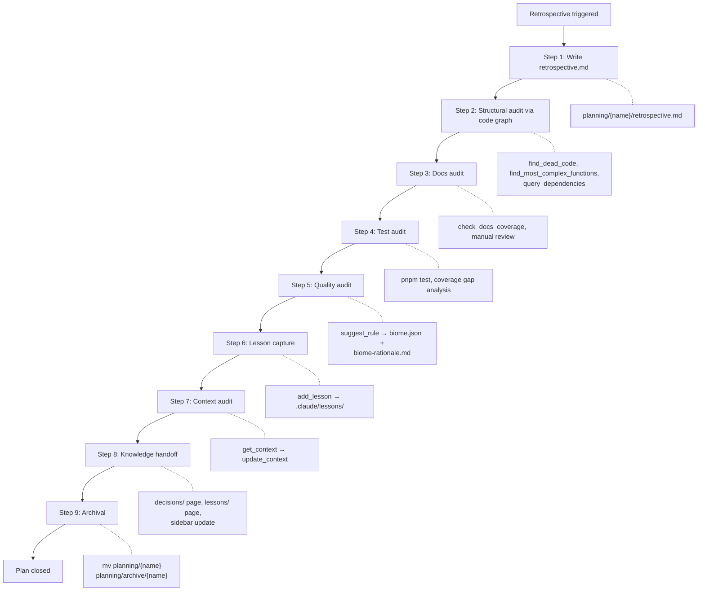

# Retrospective

The retrospective skill replaces freeform "write a retrospective" with a structured nine-step audit and knowledge handoff. It runs after all impl phases are complete, verifies that documentation, tests, quality, and context are accurate, captures lessons learned, publishes knowledge to the docs site, and archives the planning artifacts. Nothing is lost — the docs site holds the published knowledge, and the archive holds the process history.

## What It Does

The retrospective produces seven outputs from a single invocation:

1. A retrospective document — the written reflection on what happened
2. Verified documentation accuracy — docs match what was built, not what was planned
3. Test coverage assessment — gaps identified and flagged
4. Quality ratchet updates — new Biome rules to prevent recurring mistakes
5. Context accuracy confirmation — CLAUDE.md reflects the current state of the repo
6. Published knowledge in the docs site — decisions and lessons pages
7. Archived planning artifacts — plan moved to `planning/archive/`

## When to Run

Three triggers start a retrospective:

| Trigger | How It Happens |
|---------|----------------|
| [Work](/reference/skills/work) completes all phases | After the last phase's gates pass, the work skill signals that the plan is ready for retrospective |
| [Plan](/reference/skills/plan) detects completed impl | `/plan {name}` reads the impl status as `completed` and directs you to run the retrospective |
| Direct invocation | `/retrospective {plan-name}` starts the audit immediately |

All three paths lead to the same nine-step audit sequence.

## The Audit

The retrospective walks through nine steps in strict order. Each step is blocking — do not skip ahead.

<FullscreenDiagram>



</FullscreenDiagram>

### Step 1: Write the Retrospective Document

Create `planning/{plan-name}/retrospective.md` with frontmatter and six honest sections:

```markdown
---
title: "Plan Name"
date: 2026-03-21
---

# Plan Name — Retrospective

## What We Set Out to Do
Recap from the brief — the original problem and proposed direction.

## What Actually Happened
How reality differed from the plan. Include structural findings
from the code graph: files touched, dependency counts, complexity.

## Getting to Done
The unplanned work — debugging sessions, surprises, scope changes,
things that took longer than expected and why.

## What We Learned
Technical, process, or domain insights. These feed into Step 6.

## What We'd Do Differently
Hindsight decisions — what the plan would look like if we started over.

## Insights Worth Carrying Forward
Takeaways that apply beyond this specific plan.
```

This is reflective writing, not a status report. Be honest about what went wrong.

### Step 2: Structural Audit (Code Graph)

Before reviewing docs or tests, query the code graph to understand what actually changed:

1. **`query_dependencies`** on the key files from this plan — verify dependency relationships match the design
2. **`find_most_complex_functions`** — check if the plan introduced high-complexity code that should be refactored
3. **`find_dead_code`** — check if refactoring left behind unused functions

Include findings in the retrospective under "What Actually Happened." For example: "Plan touched 8 files with 23 downstream dependents. `find_dead_code` identified two unused helper functions from the old implementation."

### Step 3: Docs Audit

Call `check_docs_coverage` to verify all completed plans have corresponding documentation. Then manually review every page written or updated during the plan's impl phases:

- Does it describe what was **actually built**, not what was **planned**?
- Are code examples accurate and runnable?
- Are Mermaid diagrams up to date with the final architecture?
- Are links valid?

Fix any discrepancies. Plans often diverge from their impl during execution — the docs must reflect reality.

### Step 4: Test Audit

Review test files created or modified during the plan:

- Run `pnpm test` to confirm all tests pass
- Identify obvious coverage gaps (untested error paths, edge cases, integration points)
- Check for test files that were planned but never created

Flag gaps but do not necessarily fix them all now. Significant gaps become items in a follow-up plan.

### Step 5: Quality Audit

Review mistakes made during the plan's implementation:

- Were there recurring lint errors or type errors during [Work](/reference/skills/work)?
- Did any mistakes suggest a missing [Biome](/reference/tools/biome) rule?
- If yes: call `suggest_rule` with a description of the mistake, then add the rule to `biome.json` and document the rationale in `biome-rationale.md`

This is where the quality ratchet tightens. See the dedicated section below.

### Step 6: Lesson Capture

Review the plan's journey and ask: "Did we learn anything non-obvious that applies beyond this specific plan?"

If yes, call `add_lesson` for each insight. These become personal lesson files in `.claude/lessons/`, available to the agent in every future session across all projects.

If no lessons emerged, that is fine — not every plan produces new knowledge. Move on.

### Step 7: Context Audit

Re-read CLAUDE.md in full via `get_context`. After the entire impl is done, verify:

- **Architecture** — reflects the current state of the repo
- **Conventions** — captures all conventions that emerged during this plan
- **Key Decisions** — includes the ADR decision (post-ADR trigger)
- **Known Gotchas** — captures all surprises and corrections
- **Current State** — reflects what is actually in progress

Fix inaccuracies via `update_context`. The impl may have changed things that were not anticipated in the per-phase [Context](/reference/skills/context) updates.

### Step 8: Knowledge Handoff

Distill planning artifacts into the docs site so the knowledge survives archival.

**ADR to decisions page:** Create `apps/indusk-docs/src/decisions/{plan-name}.md` with a concise summary of what was decided and why, a link to the full ADR in the archive, and the key tradeoffs accepted.

**Retrospective insights to lessons page:** If the retrospective produced broadly useful insights, create `apps/indusk-docs/src/lessons/{plan-name}.md` with what was learned that applies beyond this plan and what would be done differently. Not every plan produces a lessons page — only create one if the insights are genuinely reusable.

**Update sidebar:** Add new decision and lesson pages to the VitePress sidebar config in `apps/indusk-docs/src/.vitepress/config.ts`.

### Step 9: Archival

Move the planning artifacts to the archive:

```bash
mkdir -p planning/archive
mv planning/{plan-name} planning/archive/{plan-name}
```

The docs site now holds the published knowledge. The archive holds the process history. Both are preserved, but the docs are the primary reference going forward.

Update CLAUDE.md's Current State section to remove the plan from the active plans table.

## The Quality Ratchet

The retrospective is where the quality ratchet tightens. The cycle works like this:

1. A mistake happens during implementation (recurring type error, unsafe pattern, formatting inconsistency)
2. The retrospective's quality audit (Step 5) identifies the pattern
3. `suggest_rule` searches the Biome rule catalog for rules that prevent it
4. The rule is added to `biome.json` and the rationale documented in `biome-rationale.md`
5. CI and `pnpm check` now catch the mistake automatically in all future work

The ratchet only gets tighter. Rules are never removed during a retrospective.

**Realistic example:** During the `mcp-dev-system` plan, several tool registration functions used `var` instead of `const` for local variables. The mistake was caught by hand each time during [Verify](/reference/skills/verify) runs, but it kept recurring.

In the retrospective quality audit:

```
suggest_rule("accidental use of var instead of const or let")
```

This surfaces Biome's `style.noVar` rule. The fix:

```json
// biome.json
{
  "linter": {
    "rules": {
      "style": {
        "noVar": "error"
      }
    }
  }
}
```

And in `biome-rationale.md`:

```markdown
### style.noVar — error
Caught during mcp-dev-system retrospective. Multiple tool files used `var`
for local variables. `const`/`let` is always preferable — block scoping
prevents accidental hoisting bugs. Set to error because there is no valid
use case for `var` in this codebase.
```

From this point forward, `pnpm check` catches every `var` declaration automatically. The mistake can never recur.

## Knowledge Handoff

The knowledge handoff (Step 8) publishes two kinds of content to the docs site:

### Decisions Pages

Decisions pages go to `apps/indusk-docs/src/decisions/`. They summarize ADRs for quick reference.

```markdown
# Context Skill

In the context of maintaining project memory across Claude Code sessions,
we decided for a pure markdown skill (instructions in SKILL.md) rather
than MCP tools, accepting that the agent must be trusted to follow
instructions without programmatic enforcement.

The full ADR is at `planning/archive/context-skill/adr.md`.

**Key tradeoffs:**
- No runtime enforcement — relies on agent compliance
- Simpler implementation — no tool registration or state management
- Portable — works in any project with a CLAUDE.md file
```

### Lessons Pages

Lessons pages go to `apps/indusk-docs/src/lessons/`. They capture reusable insights.

```markdown
# Document Skill

## What We Learned
Per-phase documentation gates catch drift early. Without them, docs
and implementation diverge silently until the retrospective, when the
gap is large and painful to close.

## What We'd Do Differently
Start with the Mermaid diagram, not the prose. The diagram forces you
to clarify the architecture before writing about it. Several docs pages
were rewritten because the prose was written first and the diagram
revealed inconsistencies.
```

Not every plan produces a lessons page. Only create one when the insights are genuinely reusable beyond the specific plan.

## Lesson Registry

The lesson registry contains two types of lessons, both stored in `.claude/lessons/`:

### Community Lessons (8 packaged)

Community lessons ship with InDusk MCP and are installed via `npx indusk-mcp init`. They encode proven patterns from real projects:

| Lesson | Core Insight |
|--------|-------------|
| `community-check-existing-packages` | Search for official packages before building custom integrations |
| `community-no-fallback-values` | Never use fallback values where a required value is expected — let it fail visibly |
| `community-verify-before-commit` | Run type checks, linting, and tests before every commit, not after |
| `community-read-before-edit` | Never edit a file you have not read in this session |
| `community-explicit-errors` | Make errors explicit rather than swallowing them silently |
| `community-no-mock-databases` | Test against real databases, not mocks that hide real behavior |
| `community-one-concern-per-change` | Each change should address one concern — do not bundle unrelated work |
| `community-index-after-setup` | Index the code graph after project setup so structural queries work |

Here is what a community lesson looks like in practice:

```markdown
# Never use fallback values where a value is expected

When a value should exist, don't provide a default. Let it fail visibly.

`process.env.DATABASE_URL ?? "localhost"` hides the fact that the env
var is missing. The app runs, connects to the wrong database, and you
debug for an hour.

If a value is required, assert its existence. If it's truly optional,
make that explicit in the type.
```

### Personal Lessons

Personal lessons are created via `add_lesson` during retrospectives (Step 6). They capture project-specific or cross-project insights discovered during real work:

```
add_lesson({
  name: "validate-env-vars",
  title: "Always validate environment variables at startup",
  content: "Check all required env vars exist before the app starts listening. A missing STRIPE_KEY that surfaces during the first payment attempt is much harder to debug than a clear startup error."
})
```

This creates `.claude/lessons/validate-env-vars.md`, which the agent reads at the start of every future session via `list_lessons`.

## Walkthrough: Running a Retrospective

Here is an end-to-end example for the completed `document-skill` plan.

### Trigger

The work skill has completed all impl phases. `get_plan_status` returns:

```json
{
  "name": "document-skill",
  "stage": "impl",
  "stageStatus": "completed",
  "implStatus": "completed",
  "phases": [
    { "phase": 1, "name": "Skill Definition", "complete": true },
    { "phase": 2, "name": "MCP Tool Integration", "complete": true },
    { "phase": 3, "name": "VitePress Templates", "complete": true }
  ]
}
```

Invocation: `/retrospective document-skill`

### Step 1 — Write retrospective.md

The skill creates `planning/document-skill/retrospective.md` with an honest account: the original scope was two phases, but a third phase was added mid-implementation when Mermaid diagram guidance proved necessary.

### Step 2 — Structural audit

```
query_dependencies("apps/indusk-mcp/src/tools/document-tools.ts")
→ 4 dependents: tool registry, MCP server, test file, skill definition

find_most_complex_functions()
→ checkDocsCoverage: cyclomatic complexity 12 (acceptable for a file-walking function)

find_dead_code()
→ formatDocTemplate() in document-tools.ts — unused after refactor to inline templates
```

Finding: one dead function from an earlier approach. Removed during the retrospective.

### Step 3 — Docs audit

```
check_docs_coverage()
→ document-skill: missing docs page at apps/indusk-docs/src/reference/skills/document.md
```

The [Document](/reference/skills/document) skill was built but never got its own docs page. Created during this step.

### Step 4 — Test audit

`pnpm test` passes. Review finds that `check_docs_coverage` has no test for plans with missing docs — a gap. Added to a follow-up plan rather than fixing inline.

### Step 5 — Quality audit

During implementation, two files used string concatenation for paths instead of `path.join()`. This worked on macOS but would break on Windows.

```
suggest_rule("string concatenation for file paths instead of path.join")
→ No exact Biome rule found — added as a Known Gotcha in CLAUDE.md instead
```

Not every mistake maps to a Biome rule. When it does not, capture it in CLAUDE.md's Known Gotchas.

### Step 6 — Lesson capture

```
add_lesson({
  name: "diagram-before-prose",
  title: "Start documentation with the diagram, not the prose",
  content: "The Mermaid diagram forces you to clarify architecture before writing about it. Several docs pages were rewritten because prose was written first and the diagram revealed inconsistencies. Draw the diagram, validate the structure, then write the prose around it."
})
```

### Step 7 — Context audit

`get_context` reveals CLAUDE.md still lists `document` skill as `in-progress` in the skills table. Updated to `stable` via `update_context`.

### Step 8 — Knowledge handoff

Created `apps/indusk-docs/src/decisions/document-skill.md` summarizing the ADR decision (per-phase execution gate vs. end-of-plan documentation pass). Created `apps/indusk-docs/src/lessons/document-skill.md` with the diagram-before-prose insight. Updated the sidebar config.

### Step 9 — Archival

```bash
mkdir -p planning/archive
mv planning/document-skill planning/archive/document-skill
```

Removed `document-skill` from the active plans table in CLAUDE.md. The plan is closed.

## MCP Tools Used

The retrospective draws on tools from across the InDusk MCP server:

| Tool | Step | Purpose |
|------|------|---------|
| `check_docs_coverage` | 3 | Verify all completed plans have corresponding documentation pages |
| `suggest_rule` | 5 | Search Biome rule catalog for rules that prevent a described mistake |
| `get_quality_config` | 5 | Read current `biome.json` and `biome-rationale.md` before adding rules |
| `add_lesson` | 6 | Create a personal lesson file in `.claude/lessons/` |
| `list_lessons` | 6 | Review existing lessons to avoid duplicates |
| `get_context` | 7 | Read current CLAUDE.md to check accuracy |
| `update_context` | 7 | Fix inaccuracies found during the context audit |
| `query_dependencies` | 2 | Map dependency relationships for files changed during the plan |
| `find_dead_code` | 2 | Identify unused functions left behind by refactoring |
| `find_most_complex_functions` | 2 | Flag high-complexity code introduced by the plan |

## Gotchas

- **Do not skip the retrospective.** It is not optional busywork. The retrospective is where documentation drift gets caught, the quality ratchet tightens, and knowledge gets published before archival buries the planning artifacts. Skipping it means the next person (or the next session) loses everything that was learned.

- **The quality ratchet only tightens.** Never remove a Biome rule during a retrospective. If a rule causes false positives, narrow its scope or adjust the configuration — do not delete it.

- **Lessons should be actionable, not observational.** "TypeScript is complex" is not a lesson. "Always run the full test suite after changing shared types, not just the tests in the changed package" is a lesson. The test: could someone read this lesson and change their behavior?

- **Always update the sidebar when adding pages.** New decisions and lessons pages in the docs site are invisible until added to the sidebar config in `apps/indusk-docs/src/.vitepress/config.ts`. This is easy to forget during the knowledge handoff step.

- **Not every plan produces a lessons page.** The knowledge handoff creates a decisions page for every plan (every plan has an ADR), but lessons pages are only for plans with genuinely reusable insights. Do not force it.

- **Run the retrospective in order.** The nine steps build on each other. The structural audit (Step 2) feeds into the retrospective document (Step 1 gets updated). The quality audit (Step 5) may surface issues that affect the context audit (Step 7). Sequential execution is intentional.
