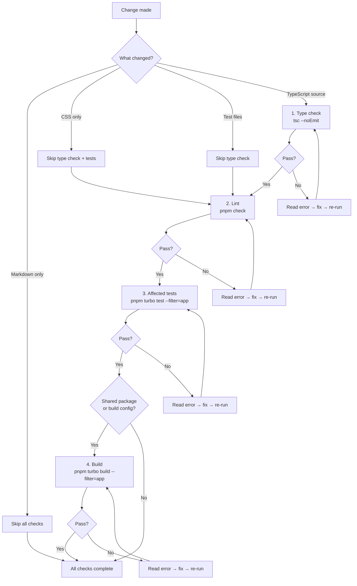
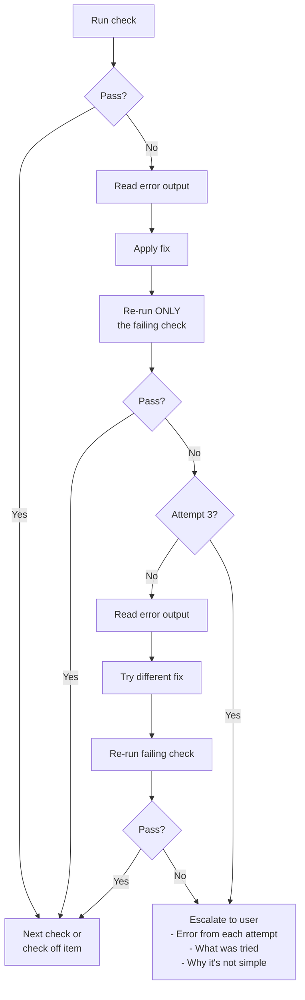

# Verify

The verify skill ensures code changes actually work before they are checked off. It has two roles: shaping impl documents so that verification sections contain specific runnable commands, and gating work execution with automated checks that run in a defined order. Every phase in an impl must pass verification before advancing — no exceptions, no "just trust me."

## What It Does

**Role 1: Shape impl documents.** When the [Plan](/reference/skills/plan) skill writes an impl, verify ensures every phase includes a Verification section with commands you can copy-paste into a terminal. Not "verify it works" — actual commands with expected output. If a verification section is vague, the impl is not ready.

**Role 2: Gate work execution.** When the [Work](/reference/skills/work) skill executes an impl item and reaches verification, verify defines which checks run, in what order, and what to do when they fail. Checks run fastest-first and stop on the first failure — no point linting code that does not type-check.

## Check Order

Checks run in this order, from fastest to slowest:

| Order | Check | Command | What It Catches | When to Run |
|-------|-------|---------|-----------------|-------------|
| 1 | Type check | `tsc --noEmit` | Structural errors, type mismatches, missing imports | Any TypeScript change |
| 2 | Lint | `pnpm check` ([Biome](/reference/tools/biome)) | Style violations, common bug patterns, unused imports | Any source file change |
| 3 | Affected tests | `pnpm turbo test --filter={app}` | Behavioral regressions, broken logic | Any logic change |
| 4 | Build | `pnpm turbo build --filter={app}` | Production build issues, missing exports | Shared package or build config changes |

The ordering is deliberate. Type checking is nearly instant and catches the most common errors. Lint runs next because it is fast and catches patterns that tests would miss. Tests take longer but prove behavior. Build only runs when it matters — shared packages and build config changes.

## Skip Logic

Not every change needs every check. Before running verification, evaluate what changed and skip checks that cannot possibly fail:

| Change Type | Type Check | Lint | Tests | Build |
|-------------|-----------|------|-------|-------|
| TypeScript source | Yes | Yes | Yes (affected) | Only if shared package |
| CSS / styles | Skip | Skip | Skip | Skip |
| Test files | Skip | Yes | Yes (the test itself) | Skip |
| Config files | Depends | Skip | Yes (smoke) | Yes |
| Markdown / docs | Skip | Skip | Skip | Skip |
| Package.json / deps | Yes | Skip | Yes (smoke) | Yes |
| Build config | Yes | Skip | Yes (smoke) | Yes |
| Generated files | Skip | Skip | Skip | Skip |

When skipping a check, note the reason in the verification report. When unsure whether to skip, run the check — slow verification beats missed bugs.

## How It Works

<FullscreenDiagram>



</FullscreenDiagram>

The key principle: stop on the first failure. If type checking fails, do not bother linting. Fix the type error, re-run the type check, and only then move on to lint. This prevents cascading noise from downstream checks reacting to the same root cause.

## Auto-Discovery

The `quality_check` MCP tool with mode `discover` detects what verification commands are available in the project without running them. It examines two sources:

**Package.json scripts.** The discovery engine reads `package.json` and looks for scripts matching known patterns:

| Script Name | Detected As |
|-------------|-------------|
| `typecheck` or `type-check` | Type check |
| `lint` | Lint |
| `test` | Test |
| `build` | Build |
| `check` | Quality check |
| `check:fix` | Quality fix |

**Config files.** When a script is not found, the engine falls back to config file detection:

| Config File | Inferred Command |
|-------------|-----------------|
| `biome.json` | `npx biome check` |
| `tsconfig.json` | `npx tsc --noEmit` |
| `vitest.config.*` | `npx vitest run` |
| `jest.config.*` | `npx jest` |

**Package manager detection.** The discovery engine reads lockfiles to determine the correct runner:

| Lockfile | Runner |
|----------|--------|
| `pnpm-lock.yaml` | `pnpm run <script>` |
| `yarn.lock` | `yarn run <script>` |
| Neither | `npm run <script>` |

Package.json scripts take priority — if a `check` script exists, the `biome.json` fallback is skipped. This prevents running the same check twice with different flags.

### Example Discover Output

```json
{
  "discovered": [
    {
      "name": "typecheck",
      "command": "pnpm run typecheck",
      "source": "package.json"
    },
    {
      "name": "check",
      "command": "pnpm run check",
      "source": "package.json"
    },
    {
      "name": "test",
      "command": "pnpm run test",
      "source": "package.json"
    },
    {
      "name": "build",
      "command": "pnpm run build",
      "source": "package.json"
    }
  ]
}
```

## Shaping Impl Documents

Verification items in impl documents must be specific runnable commands with expected output. The verify skill rejects vague assertions and pushes back with "what command proves this works?"

### What Not to Write

```markdown
#### Phase 1 Verification
- [ ] Verify it works
- [ ] Run tests
- [ ] Make sure nothing is broken
- [ ] Check the output looks right
```

None of these are verifiable. Which tests? What does "works" mean? What output?

### What to Write

```markdown
#### Phase 1 Verification
- [ ] Run `tsc --noEmit` — expect 0 errors
- [ ] Run `pnpm check` — expect no lint or format errors
- [ ] Run `pnpm turbo test --filter=indusk-mcp` — expect 12 tests passing
- [ ] Run `curl -s localhost:3000/health | jq .status` — expect "ok"
```

Every item names the command and what success looks like. Someone reading the impl six months later can run the exact same checks.

### Progressive Verification

Each phase proves itself, and later phases confirm earlier phases still work. Phase 2 verification should include Phase 1 regression checks:

```markdown
#### Phase 2 Verification
- [ ] Run `pnpm turbo test --filter=billing` — all Phase 1 + Phase 2 tests pass (expected: 14 total)
- [ ] Run `curl -X POST localhost:3000/api/webhooks/stripe` with invalid signature — expect 400
```

The test count grows across phases. If Phase 1 had 8 passing tests and Phase 2 adds 6, the Phase 2 verification should expect 14.

## The Failure Loop

When a verification check fails during [Work](/reference/skills/work) execution, the verify skill follows a bounded retry loop:

<FullscreenDiagram>



</FullscreenDiagram>

Key rules of the failure loop:

- Re-run only the failing check, not all checks from the beginning
- Three attempts maximum, then escalate — do not retry silently forever
- When escalating, include the error output from each attempt, what was tried, and why the fix is not straightforward

## Verification Report

After running checks, verify produces a summary report. Here is what a passing report looks like:

```
Verification Report:
  Type check: passed (tsc --noEmit, 0 errors)
  Lint: passed (pnpm check, 0 issues)
  Tests: passed (3 tests in indusk-mcp)
  Build: skipped (no shared package change)
  Result: ALL PASSED — safe to check off
```

And a failing report:

```
Verification Report:
  Type check: FAILED
    src/index.ts:42 — Property 'foo' does not exist on type 'Bar'
  Lint: not run (type check failed first)
  Tests: not run
  Build: not run
  Result: BLOCKED — fix type error before proceeding
```

Note that on failure, downstream checks show "not run" — verification stops at the first failure and does not continue.

## MCP Tool Integration

Two MCP tools support verification: `quality_check` for running or discovering checks, and `query_dependencies` for finding affected tests via the code graph.

### `quality_check`

The `quality_check` tool operates in two modes:

**Discover mode** — lists available checks without running them:

```json
// Input
{ "mode": "discover" }

// Output
{
  "discovered": [
    { "name": "check", "command": "pnpm run check", "source": "package.json" },
    { "name": "test", "command": "pnpm run test", "source": "package.json" },
    { "name": "typecheck", "command": "npx tsc --noEmit", "source": "config-file" }
  ]
}
```

**Run mode** — executes all discovered checks or a specific command:

```json
// Run all discovered checks
{ "mode": "run" }

// Run a specific command
{ "mode": "run", "command": "pnpm turbo test --filter=indusk-mcp" }
```

Run mode returns structured results for each check:

```json
{
  "passed": false,
  "results": [
    {
      "name": "check",
      "command": "pnpm run check",
      "source": "package.json",
      "passed": true,
      "exitCode": 0,
      "output": "..."
    },
    {
      "name": "test",
      "command": "pnpm run test",
      "source": "package.json",
      "passed": false,
      "exitCode": 1,
      "output": "FAIL src/tools/__tests__/plan-tools.test.ts\n  ..."
    }
  ]
}
```

Each command has a 60-second timeout. Output is truncated to the last 2000 characters to keep responses manageable.

### `query_dependencies`

Before running affected tests, verify uses `query_dependencies` from [CodeGraphContext](/reference/tools/codegraph) to find which test files depend on the changed code:

```json
// Input
{
  "path": "src/lib/verification-discovery.ts",
  "direction": "dependents"
}
```

This returns all files that import or depend on the changed file. Filter the results for test files (`*.test.ts`, `*.spec.ts`) and run those specifically rather than guessing which tests might be affected.

## Commands Reference

| Check | Command | When to Use |
|-------|---------|-------------|
| Type check | `tsc --noEmit` | Any TypeScript change |
| Lint / format | `pnpm check` | Any source file change |
| Lint auto-fix | `pnpm check:fix` | Fix lint and format issues automatically |
| Test (scoped) | `pnpm turbo test --filter={app}` | Logic changes in a specific app |
| Test (all) | `pnpm test` | Cross-package changes |
| Build (scoped) | `pnpm turbo build --filter={app}` | Shared package or build config changes |
| Auto-discover | `quality_check` with mode `discover` | See what checks are available in the project |
| Run all checks | `quality_check` with mode `run` | Execute all discovered checks at once |

## Gotchas

- **Do not skip verification for "just a small change."** Small changes break things too. A one-line type change can cascade through 12 dependents. Run the checks.

- **Affected tests require the code graph to be indexed.** The `query_dependencies` call only works if [CodeGraphContext](/reference/tools/codegraph) has indexed the project. If the graph is stale or missing, fall back to running the full test suite for the affected app.

- **Verification items are per-phase, not per-plan.** Each phase in an impl has its own verification section. Do not put all verification at the end of the impl — each phase must prove itself before the next begins.

- **Explicit commands override auto-discovery.** If an impl says "run `pnpm turbo test --filter=mcp`", use that exact command. Auto-discovery is a fallback for when the impl just says "run tests" without specifying how.

- **File length matters.** The verify skill watches for files growing past roughly 200 lines. If a file is getting long during implementation, consider extracting functions or splitting into modules. Use `find_code` to check for duplicate logic before adding new functions.

- **Three retries, then escalate.** Do not silently loop on a failing check. After three attempts, surface the error to the user with what was tried and why it is not a simple fix.
