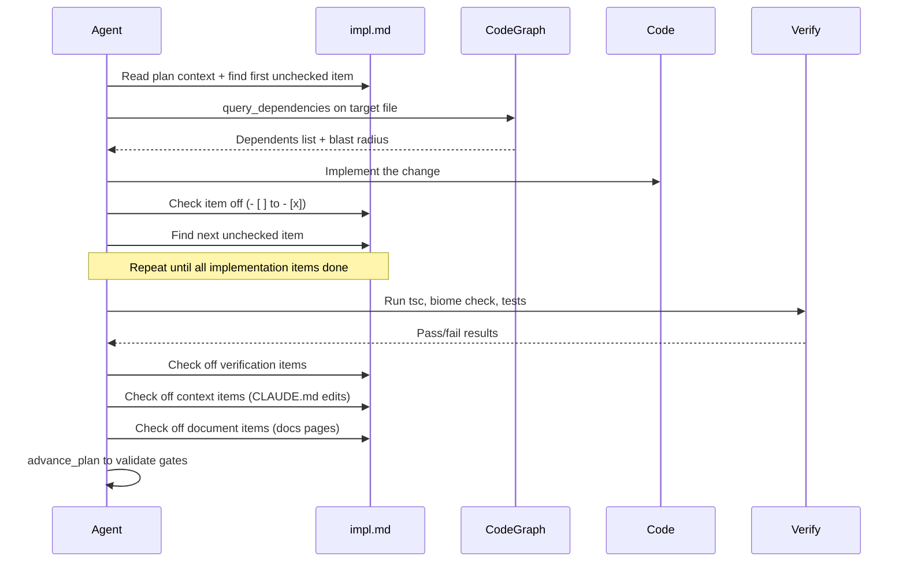
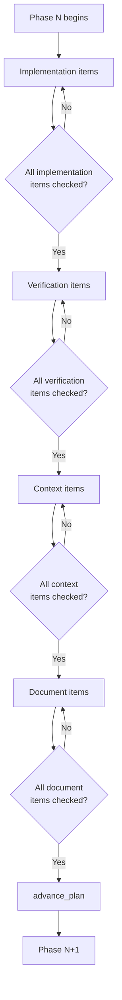

# Work

The work skill executes implementation plans. It reads an `impl.md` checklist produced by the [Plan](/reference/skills/plan) skill and works through it methodically — one item at a time, in order, checking each off immediately after completion. The skill enforces a strict per-phase gate system that prevents advancing until implementation, verification, context, and documentation are all done.

## What It Does

Given a plan with an approved or in-progress `impl.md`, the work skill:

1. Reads the full plan context (research, brief, ADR, impl) before touching any code
2. Finds the first unchecked item in the current phase
3. Queries the code graph to understand blast radius before modifying files
4. Implements the change
5. Checks the item off in `impl.md`
6. Repeats until the phase is complete, then moves through the four gates before advancing

The impl doc is the single source of truth for progress. Anyone should be able to read it and know exactly what is done and what remains.

## How It Works

The core loop reads plan context, works an item, records progress, and proves correctness before moving on.

<FullscreenDiagram>



</FullscreenDiagram>

Before modifying any file, the agent calls `query_dependencies` to check how many other files depend on it. If more than 3 dependents exist, the agent flags the blast radius to the user before proceeding. This is not optional — it prevents silent breakage in shared code.

## The Four Gates

Every phase in an impl has up to four gate sections. They must be completed in order. A phase is not done until all four are cleared.

<FullscreenDiagram>



</FullscreenDiagram>

| Gate | What Belongs Here | Example |
|------|-------------------|---------|
| **Implementation** | The actual work — code changes, new files, configuration | `Add subscription types to src/billing/types.ts` |
| **Verification** | Runnable commands that prove the phase works. Must be specific, not vague. | `pnpm turbo test --filter=billing` — all tests pass |
| **Context** | Concrete edits to CLAUDE.md that capture what changed | `Add to Architecture: "billing module includes subscription support"` |
| **Document** | Docs pages to write or update in the VitePress site | `Write API reference at apps/indusk-docs/src/reference/api/subscriptions.md` |

Not every phase needs all four gates. A phase with no context changes simply has no context section. But if the section exists, every item in it must be completed before advancing.

The impl parser recognizes these sections by their heading format:

```markdown
### Phase 1: Subscription Core        <!-- implementation items follow -->
#### Phase 1 Verification              <!-- verification gate -->
#### Phase 1 Context                   <!-- context gate -->
#### Phase 1 Document                  <!-- document gate -->
#### Phase 1 Forward Intelligence      <!-- notes for the next phase -->
```

## Invocation

```
/work [plan-name]
```

If no plan name is given, the skill lists all plans with `approved` or `in-progress` impl status and asks which one to work on.

**Examples:**

```bash
# Work on a specific plan
/work payment-flow

# Let the skill find available plans
/work

# Teach mode — pauses between edits for learning
/work teach payment-flow
```

## Walkthrough: Working Through a Phase

Here is a realistic end-to-end example of working through Phase 1 of a payment flow plan.

### 1. Read the plan context

The agent reads everything in `planning/payment-flow/` — research, brief, ADR, and impl. The research explains why Stripe Subscription Billing was chosen, the ADR records the decision and alternatives, and the impl breaks the work into phases.

The agent checks the impl frontmatter: `status: approved`. It changes it to `in-progress`.

### 2. Check for blockers and forward intelligence

Phase 1 has no `blocker:` line and no prior phase, so there is no forward intelligence to read. Work proceeds.

### 3. Pick the first unchecked implementation item

```markdown
- [ ] Add subscription types to `src/billing/types.ts`
```

### 4. Query the code graph

Before modifying `src/billing/types.ts`, the agent calls `query_dependencies` on it. The result shows 8 dependents across 2 apps. This is flagged to the user:

> "types.ts has 8 dependents. Changes need to be additive — I'll add the Subscription interface without modifying existing types."

The agent also calls `find_code` to check whether a Subscription type already exists somewhere. It does not.

### 5. Make the change and check it off

The agent adds the `Subscription` interface to `types.ts`, then immediately edits `impl.md`:

```markdown
- [x] Add subscription types to `src/billing/types.ts`
```

### 6. Repeat for remaining implementation items

The agent works through `createSubscription`, `cancelSubscription`, and the database migrations in order, checking each off after completion.

### 7. Move to the verification gate

All implementation items are checked. The agent moves to `#### Phase 1 Verification`:

```markdown
- [ ] `pnpm turbo test --filter=billing` — all existing + new subscription tests pass
- [ ] `pnpm check` — no lint or format errors
```

The agent runs each command, captures the output, confirms they pass, and checks the items off. If a check fails, it reads the error, fixes the code, and re-runs — up to 3 attempts before flagging as a blocker.

### 8. Move to the context gate

```markdown
- [ ] Add to Architecture: "billing module now includes subscription support via Stripe Subscription Billing"
```

The agent edits `CLAUDE.md`, adding the line to the Architecture section, then checks the item off.

### 9. Move to the document gate

```markdown
- [ ] Write API reference for subscription endpoints at `apps/indusk-docs/src/reference/api/subscriptions.md`
```

The agent writes the docs page following the [Document](/reference/skills/document) skill guidance, then checks the item off.

### 10. Advance

All four gates are complete. The agent calls `advance_plan`:

**Allowed response:**

```json
{
  "allowed": true,
  "transition": "phase 1 -> phase 2",
  "nextPhase": 2
}
```

Work continues to Phase 2.

**Blocked response** (if a verification item was missed):

```json
{
  "allowed": false,
  "transition": "phase 1 -> phase 2",
  "currentPhase": 1,
  "phaseName": "Subscription Core",
  "missing": [
    "[verification] pnpm check — no lint or format errors"
  ]
}
```

The agent must complete the missing item before advancing.

## Hook Enforcement

Two hooks enforce the gate system at the tool level, catching mistakes the skill instructions alone cannot prevent.

### check-gates.js (PreToolUse)

This hook runs before every `Edit` or `Write` call that targets an `impl.md` file. It detects when a checkbox is being transitioned from `- [ ]` to `- [x]` and checks whether earlier phases have incomplete gates.

**What it checks:** If the agent tries to check off a Phase N+1 implementation item while Phase N still has unchecked verification, context, or document items, the edit is blocked.

**What the block looks like:**

```
Phase 3 blocked: complete Phase 2 gates first:
  [verification] pnpm turbo test --filter=billing — webhook handler tests pass
  [context] Add to Known Gotchas: "Stripe webhook signatures require raw body"
```

The hook exits with code 2, which prevents the edit from being applied. The agent receives the stderr message as feedback and must complete the listed items before retrying.

**Escape hatch:** Adding `<!-- skip-gates -->` to the edit content bypasses the hook. This exists for manual corrections, not for routine use.

### gate-reminder.js (PostToolUse)

This hook runs after every `Edit` or `Write` call that modifies an `impl.md` file. It checks whether a phase just became fully complete (all items checked) and the next phase has not yet started.

**What the reminder looks like:**

```
Phase 1 (Subscription Core) is fully complete. Call advance_plan to validate gates before starting Phase 2.
```

This is advisory — it cannot block. It nudges the agent to call `advance_plan` for formal validation before moving on.

## Forward Intelligence

Between phases, the impl can include forward intelligence sections that warn the next phase about risks, fragile areas, and assumptions.

**Format:**

```markdown
#### Phase 1 Forward Intelligence
- **Fragile:** `src/billing/types.ts` — 8 dependents, any interface change cascades
- **Watch out:** The webhook endpoint in Phase 2 needs the Subscription type exported from the barrel file
- **Assumption:** Stripe SDK v14.x supports the `subscription.update` method — verify before relying on it
```

The work skill reads forward intelligence before starting each phase. The three annotation types signal different levels of concern:

| Annotation | Meaning |
|------------|---------|
| **Fragile** | This file or module has many dependents. Be extra careful with modifications. |
| **Watch out** | A known downstream risk. Something in this phase could break something later. |
| **Assumption** | Something the previous phase took for granted. Verify it is still true before building on it. |

Forward intelligence sections are not parsed as checklist items — they are informational. The impl parser stores them as free-form text attached to the phase.

## Blockers

A `blocker:` line in a phase signals that work cannot proceed without human intervention.

**Format:**

```markdown
### Phase 3: Proration
blocker: upstream Stripe API does not support mid-cycle proration for metered billing — Phase 3 scope needs revision
- [ ] Implement proration logic for plan upgrades
- [ ] Implement proration logic for plan downgrades
```

When the work skill encounters a blocker, it stops and presents it to the user:

> "Phase 3 has a blocker: *upstream Stripe API does not support mid-cycle proration for metered billing — Phase 3 scope needs revision*. Want to resolve this before proceeding?"

The agent does not attempt to work around a blocker silently. Blockers mean the plan needs revision — either the scope changes, the approach changes, or the blocker is resolved externally.

If a blocker is discovered during work (not pre-declared), the agent adds a `blocker:` line to the impl and flags it to the user.

## Teach Mode

Invoking `/work teach plan-name` switches to a mentoring pace. The goal is understanding, not speed.

**Before each edit**, the agent explains:
- What it is about to modify and why
- How the change connects to the plan, the architecture, and the reasoning

Then it **stops and waits** for the user to say "continue."

**After each edit**, the agent explains:
- What specific lines changed and the pattern used
- Why this approach over alternatives
- Any gotchas that were avoided or conventions being followed

Then it **stops and waits** again.

**Between checklist items**, the agent summarizes what was accomplished and previews the next item, explaining how they connect.

Teach mode rules:
- Never batch multiple edits between pauses
- Answer user questions fully before continuing
- Normal `/work` (without teach) remains fast execution with no pauses

## Commit Discipline

Commit at phase boundaries, not per-item and not at plan completion.

| Granularity | Verdict |
|-------------|---------|
| After every checklist item | Too granular — creates noise |
| After each phase | Correct — natural boundary, gates are cleared |
| After the entire plan | Too coarse — loses rollback granularity |

Follow the monorepo rule: commits should be siloed between different contexts (what would be separated repos). If a phase touches both `apps/indusk-mcp/` and `apps/indusk-docs/`, that is fine in a single commit — they are part of the same logical change. But unrelated changes to a different app should be a separate commit.

## Gotchas

- **Always query the code graph before modifying files.** `query_dependencies` is required, not optional. Skipping it risks silent breakage in shared code with many dependents.

- **Do not batch gate items.** Complete implementation items first, then verification, then context, then document. The hooks enforce this ordering — trying to skip ahead will be blocked.

- **Verification items must be runnable commands.** "Verify it works" is not a verification item. Write specific commands with expected output: `pnpm turbo test --filter=billing` passes, `pnpm check` returns no errors. See the [Verify](/reference/skills/verify) skill for full guidance.

- **Check items off one at a time, immediately.** Do not implement three things and then check all three off in a batch edit. The impl should always reflect current reality.

- **Edit skills in the package, not in `.claude/skills/`.** Skills are owned by `apps/indusk-mcp/skills/`. Edit there, then run `update` to sync. Changes to `.claude/skills/` are overwritten on the next update.

- **Read the full plan context before starting.** The research, brief, and ADR contain decisions and reasoning that guide implementation choices. Do not just read the checklist.

- **Do not skip forward intelligence.** If the previous phase has a forward intelligence section, read it before starting the current phase. Fragile annotations prevent avoidable breakage.

- **Discovered work gets added, not skipped.** If you find something that needs doing but is not in the checklist, add it as a new item in the appropriate phase, do it, and check it off.

- **Cross-plan impact requires updates.** If your work changes something referenced by another plan (a schema field, a function signature, a contract interface), update that plan's impl or notes to reflect the change.

- **Corrections are learning opportunities.** When the user corrects you mid-work, suggest capturing it with `/context learn`. Corrections are the most valuable source of project knowledge.
