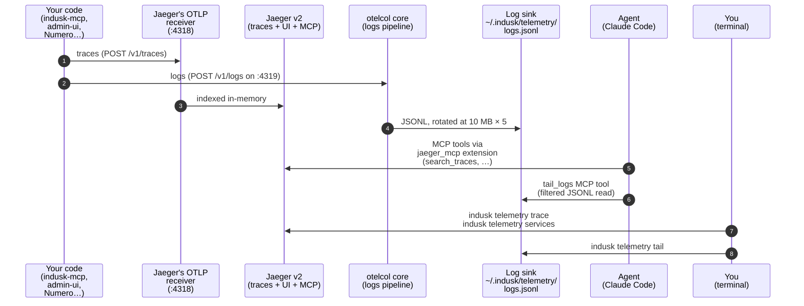

# Local Telemetry — Overview

Local telemetry is a **required-by-default** InDusk extension that turns your own machine into the dev-environment observability backend. While your code is running locally, OTel traces and logs emit to `localhost:4318` where a machine-global daemon (Jaeger v2 + OTel Collector core) absorbs them; the agent queries them through MCP tools; you query them through `indusk telemetry *` subcommands.

Available since indusk-mcp **1.28.0**.

This page is the architectural orientation. For the runnable surface, see the [CLI reference](./cli).

## Why local telemetry exists

Before 1.28, the only OTel destination scaffolded by `indusk init` was [Dash0](https://dash0.com). That's the right answer for staging + production — a hosted backend, durable storage, cross-team dashboards. But it's the wrong answer for the inner dev loop:

- **Cost**: every run emits spans that bill against your Dash0 quota.
- **Latency**: a span crossing the public internet + Dash0's ingest pipeline takes seconds to become queryable.
- **Trust boundary**: you're shipping dev traffic, including accidental PII in debug logs, to a third party.
- **Agent access**: the agent can't poll Dash0 cheaply enough to use it as a diagnostic substrate.

Local telemetry fills the gap. One daemon runs on your machine, every InDusk project on that machine emits into it, and both you and the agent query it directly. Staging + production OTel still route to Dash0 — only the `development` profile is redirected.

## The daemon model

One machine. One set of processes. Every registered project emits into them.



**Key structural facts:**

- **Machine-global**: one daemon process set serves every registered InDusk project. Projects register at extension-enable time; the daemon auto-starts on first register and auto-stops when the last project deregisters.
- **Native binaries, not containers**: Jaeger and otelcol ship as platform-specific npm packages (esbuild/swc pattern — see [Platform packages](#platform-packages)) and launch as detached child processes. The daemon metadata lives at `~/.indusk/telemetry.{pid,json,log}`.
- **Two children, one CLI**: `daemon.ts` supervises both Jaeger and otelcol. `start/stop/restart` act on both atomically; `status` reports both PIDs.
- **Trace storage is ephemeral**: Jaeger v2's in-memory backend, capped at 100k spans. Retention is "until the daemon restarts or the ring buffer wraps." Good enough for inner-loop debugging; not a substitute for Dash0.
- **Log storage is an append-only JSONL file**: otelcol writes OTLP-envelope logs to `~/.indusk/telemetry/logs.jsonl`, rotated at 10 MB × 5 backups = 50 MB buffer total. Reset by `indusk telemetry reset`.

## Jaeger v2 is an OTel Collector distribution

The load-bearing discovery from the Phase 1 spike: Jaeger v2 is **implemented as an OTel Collector distribution**. A single binary bundles:

- `otlp` receiver (OTLP HTTP/gRPC)
- `batch` / `memory_limiter` / `filter` / `tail_sampling` processors
- `jaeger_storage_exporter` (in-memory or Badger backend)
- `jaeger_query` extension (REST API + UI on :16686)
- `jaeger_mcp` extension (agent-facing MCP tools — see below)
- `healthcheckv2` extension (on :13133)

So the "Jaeger vs OTel Collector" framing is wrong. There's one binary that does both — it IS the Collector. That collapsed what Phase 1 thought would be a two-binary-per-trace-path setup into one child process for traces.

Where the second binary (`otelcol` core, 168 MB) still earns its spot: **logs**. Jaeger v2 doesn't ship a file/SQLite log exporter, so the logs pipeline runs through a plain otelcol instance that terminates in a `file` exporter writing JSONL to the sink. Queried via the custom `tail_logs` MCP tool + `indusk telemetry tail` CLI — see the [Agent + human surface](#agent-human-surface) section.

## Platform packages

Binaries ship as **platform-specific npm optional dependencies** — the pattern used by esbuild, swc, and Biome. Upstream Jaeger + otelcol release tarballs are fetched at build time, SHA-verified against the upstream checksum files, and packed into one npm package per `(os × arch)` combination:

| Package | Platforms | Size (uncompressed) |
|---------|-----------|--------------------|
| `@infinitedusky/telemetry-binaries-darwin-arm64` | macOS Apple Silicon | ~282 MB |
| `@infinitedusky/telemetry-binaries-darwin-x64` | macOS Intel | ~282 MB |
| `@infinitedusky/telemetry-binaries-linux-arm64` | Linux arm64 | ~282 MB |
| `@infinitedusky/telemetry-binaries-linux-x64` | Linux x64 | ~282 MB |

`apps/indusk-mcp/package.json` lists all four as `optionalDependencies` with matching `os`/`cpu` constraints. When a consumer runs `npm i -g @infinitedusky/indusk-mcp`, npm installs **exactly one** platform package — the one matching their machine. Other platforms' packages are skipped cleanly (not downloaded).

The daemon resolves binaries via `createRequire(import.meta.url).resolve("@infinitedusky/telemetry-binaries-{platform}/bin/jaeger")` at `start` time. If the platform package is missing (unsupported OS/arch, or `optionalDependencies` failed to install), `start` fails with a specific error message pointing at the missing package.

**Upstream pins**: `packages/telemetry-binaries-shared/UPSTREAM.json` names the upstream versions (Jaeger v2.17.0 + otelcol core v0.150.1 at 1.28.0 ship). Bumping binaries = edit `UPSTREAM.json`, re-run `scripts/build-telemetry-binaries.sh`, bump the platform packages' version, bump indusk-mcp's `optionalDependencies` pins, publish. Consumer upgrade path: `npm i -g @infinitedusky/indusk-mcp@<newer>` + `indusk telemetry restart`.

## Extension wiring

`local-telemetry` is a **required-by-default** extension (`required: true` in its `manifest.json`). Every `indusk init` scaffolds it; every `indusk update` on a pre-1.28 project adds it as a migration step.

**Enable-time** (`indusk extensions enable local-telemetry` or `indusk init` on a fresh project):

1. Writes the extension's `.env` component, routing `OTEL_EXPORTER_OTLP_ENDPOINT=http://localhost:4318` in the `development` profile only. Staging + production profiles stay on Dash0.
2. Calls `indusk telemetry register $(pwd)` — appends to `~/.indusk/telemetry/projects.json`, auto-starts the daemon if it's not running, and upserts a `jaeger` MCP server entry in the project's `.mcp.json` pointing at the daemon's current `mcpPort` (the port `jaeger_mcp` is listening on).
3. The `.mcp.json` entry follows the same shape as the `dash0` extension's — a plain `{ type: "http", url: "http://localhost:{mcpPort}/mcp" }` block. Claude Code loads it on the next session start.

**Disable-time** (`indusk extensions disable local-telemetry`):

1. Removes the `jaeger` MCP server entry from `.mcp.json`.
2. Calls `indusk telemetry deregister $(pwd)` — removes the project from the registry.
3. If the registry becomes empty, gracefully stops the daemon. Otherwise the daemon keeps running for the other registered projects.

**Escape hatch**: if you don't want local telemetry on a specific project, add `disabled_extensions: ["local-telemetry"]` to `.indusk/config.json`. The required-by-default logic respects explicit disables. No data lost, no weird coexistence — the project simply routes `development` OTel to whatever its `.env` component says (usually Dash0 as a fallback, or nowhere).

## Agent + human surface {#agent-human-surface}

Two tools, two audiences, same data.

**Agent-facing — trace side**: the `jaeger` MCP server (bundled by Jaeger v2's `jaeger_mcp` extension) exposes 8 pre-computed tools the agent can call directly:

- `search_traces` — query by service + operation + attribute filters
- `get_trace_topology` — service topology for a trace
- `get_span_details` — full attributes + events for one span
- `get_services` — service list
- `get_span_names` — operation names per service
- `get_trace_errors` — errors within a trace
- `get_critical_path` — blocking-path latency analysis
- `health` — liveness check

The agent doesn't know or care that this is a local daemon — it's just another MCP server wired into `.mcp.json`. The `jaeger_mcp` extension is the backend; `get_trace_topology` and `get_critical_path` are richer than what we'd have written custom in 1.28.

**Agent-facing — log side**: `tail_logs` is a custom MCP tool in indusk-mcp that filters the otelcol JSONL sink. Jaeger v2 doesn't handle logs, so logs take a separate path:

```ts
tail_logs({
  service: "indusk-mcp",           // optional — exact match on service.name
  level: "warn",                    // any | debug | info | warn | error
  since_minutes: 5,                 // 1–240, default 5
  limit: 50                         // 1–200, default 50
})
```

Returns OTLP log records within the window. The tool is gated on `isTelemetryActive()` — if the daemon isn't running or this project isn't registered, the tool is not surfaced.

**Human-facing — all four signals**: `indusk telemetry tail / trace / services / reset` provide terminal access mirroring the agent surface. See the [CLI reference — Query subcommands](./cli#query-subcommands) for full flags + sample output.

**Why the split**: traces are rich + structured + queryable by many dimensions — Jaeger's 8 pre-computed tools are the right abstraction and writing our own would be strictly worse. Logs are flat lines — a single filter/limit MCP tool beats forcing a Jaeger UI for the "grep my app's output" workflow. A later [unified-telemetry-query plan](#future-work) may eventually give any agent one interface across local + Dash0 as a user-facing convenience, but local-only consumers (like the watcher agent in §Future Work) talk to `jaeger_mcp` + `tail_logs` directly — no unified layer required.

## Environment routing

The extension writes its `.env` component such that the `development` profile points `OTEL_EXPORTER_OTLP_ENDPOINT` at `http://localhost:4318` while staging + production stay on Dash0. ce + composable.env do the profile selection, not the extension.

Expected effective environment values:

| Profile | `OTEL_EXPORTER_OTLP_ENDPOINT` | Where traces + logs land |
|---------|-------------------------------|--------------------------|
| `development` | `http://localhost:4318` | Local daemon (Jaeger + otelcol) |
| `staging` | Dash0 URL | Dash0 `staging` dataset |
| `production` | Dash0 URL | Dash0 `production` dataset |

If your service doesn't pick up the new `development` endpoint, check `ce doctor` + the order of `.env` component merging. The local-telemetry component must sort after any component that hardcodes a Dash0 URL in the `development` profile.

## Migration from Dash0-only

Projects initialized before 1.28 have only the `dash0` extension and route all OTel traffic to Dash0 regardless of profile. Migration happens automatically on `indusk update`:

1. `indusk update` detects that `local-telemetry` is not in the enabled extensions set and treats it as a migration step.
2. Writes the extension's `.env` component — redirects `development` profile to `http://localhost:4318`.
3. Registers the project with the daemon (auto-starts the daemon if needed).
4. Upserts the `jaeger` MCP server entry in `.mcp.json`.
5. Leaves `instrumentation.ts` unchanged — the OTel SDK reads the endpoint from env at boot, so no code changes are needed.
6. Leaves the `dash0` extension alone — both extensions coexist; the active profile (via ce) decides the endpoint.

After `indusk update`, the first `next dev` / `pnpm dev` / equivalent in the `development` profile emits to the local daemon. Staging + production runs still emit to Dash0 unchanged.

**Rollback**: `indusk extensions disable local-telemetry` removes the extension, restores `development` OTel to Dash0 (or wherever the `development` profile would otherwise resolve), and stops the daemon iff the registry is empty.

## Known gotchas

- **Port conflicts**: Jaeger wants `4318` (OTLP HTTP), `4317` (OTLP gRPC), `16686` (UI), `13133` (health), plus `mcpPort` (auto-assigned for `jaeger_mcp`). otelcol wants `4319` (logs OTLP HTTP). If any is taken, `start` auto-bumps to a free one and prints the chosen value. Passing `--otlp-port 0` or `--ui-port 0` forces auto-pick.
- **Jaeger self-metrics are disabled** via `service.telemetry.metrics.level: none` in the bundled config. This avoids a port 8888 Prometheus exporter collision on rapid spawn/stop cycles. If you want Jaeger's self-metrics, edit `~/.indusk/telemetry-jaeger.yaml` after `start` (it's regenerated every `start`, so the edit is per-start).
- **Storage is in-memory, capped at 100k spans**: the 100k-and-oldest-wins trace ring is a hard limit for the 1.28.x line. `indusk telemetry reset` is the right escape hatch when you want a clean slate before reproducing an issue.
- **Log sink is 50 MB max** (10 MB × 5 rotated backups). Old records are evicted oldest-first. `tail` is windowed (`--since <minutes>`) so you rarely hit the rotation boundary.
- **Registry is machine-wide, not repo-wide**: if you have two clones of the same repo, both register independently. The daemon sees them as separate projects.

## Future work {#future-work}

Two follow-up plans in the master plan build on this substrate — on independent tracks:

- **telemetry-watcher-agent** (near-term, depends on 1.28.0) — a periodic polling agent that scans `search_traces` + `tail_logs` **strictly against the local daemon** for anomaly signatures and surfaces findings via the highlight queue. The autonomy-arc motivation: the substrate is already there; the watcher is the next layer of agentic diagnosis. It calls `jaeger_mcp` + `tail_logs` directly, not through any unified layer.
- **unified-telemetry-query** (later, independent) — a user-facing translation layer so any agent sees ONE interface across local (Jaeger + `tail_logs`) + Dash0. Same tool names, same shapes, backend chosen by signal type + profile. Explicitly not a dependency of the watcher: the watcher is local-only by design, and unifying backends is a separate, later user-convenience concern.

## See also

- [CLI reference](./cli) — runnable surface for the `indusk telemetry` subcommand.
- [ADR](https://github.com/infinite-dusky/dusk) — `.indusk/planning/local-telemetry/adr.md` (source-of-truth architectural decision).
- [Phase 1 spike findings](https://github.com/infinite-dusky/dusk) — `.indusk/planning/local-telemetry/spike-findings.md` (measurements + binding decisions).
