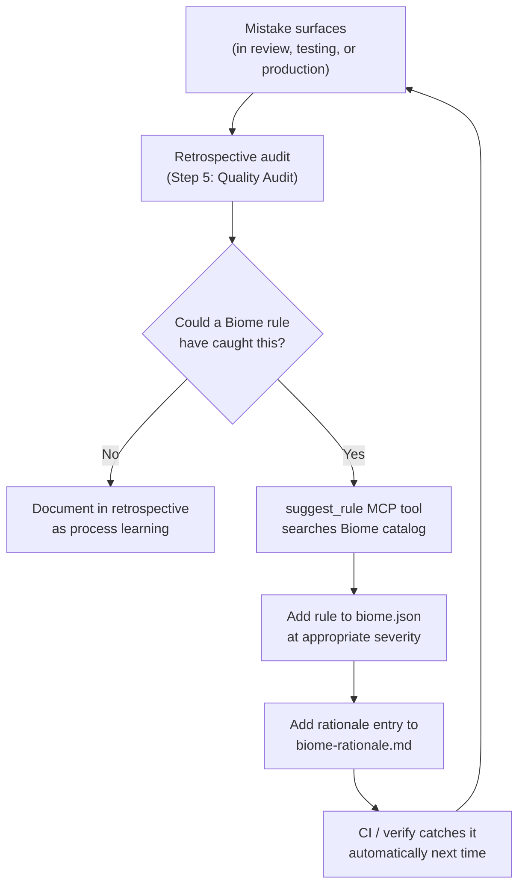

# Biome

Biome is the single tool handling both linting and formatting across the InDusk monorepo. It replaces the traditional ESLint + Prettier combination with one binary, one config file, and zero plugin dependencies.

## What It Does

Biome performs two jobs:

1. **Linting** — catches bugs, enforces style rules, flags suspicious patterns (unused variables, `any` types, leftover `debugger` statements)
2. **Formatting** — consistent code style (indentation, line width, trailing commas) with no configuration arguments between tools

Both run from a single `biome.json` config and a single CLI invocation. There is no Prettier config, no `.eslintrc`, no plugin resolution chain.

## Why Biome

| Concern | ESLint + Prettier | Biome |
|---------|-------------------|-------|
| Install | Multiple packages, plugin resolution | Single `@biomejs/biome` binary |
| Config | `.eslintrc` + `.prettierrc` + conflicts | One `biome.json`, schema-validated |
| Speed | Seconds on large codebases | Sub-second — written in Rust |
| Plugin hell | `eslint-config-*`, `eslint-plugin-*`, peer deps | No plugins. Rules are built in. |
| Schema validation | Manual, error-prone | JSON schema with IDE autocomplete |
| Formatter/linter conflicts | Requires `eslint-config-prettier` | Impossible — same tool handles both |

Biome is fast enough to run on every work item during implementation, which makes it practical as a per-phase verification gate rather than a CI-only check.

## Setup

Biome is installed automatically when you run `indusk init`. It places a `biome.json` at the project root based on the InDusk base template.

To install manually:

```bash
pnpm add -D @biomejs/biome
```

The base template that `init` installs looks like this:

```json
{
  "$schema": "https://biomejs.dev/schemas/2.4.8/schema.json",
  "vcs": {
    "enabled": true,
    "clientKind": "git",
    "useIgnoreFile": true
  },
  "formatter": {
    "enabled": true,
    "indentStyle": "tab",
    "lineWidth": 100
  },
  "linter": {
    "enabled": true,
    "rules": {
      "recommended": true,
      "correctness": {
        "noUnusedVariables": "error",
        "noUnusedImports": "error"
      },
      "suspicious": {
        "noExplicitAny": "error",
        "noDebugger": "error",
        "noConsole": {
          "level": "warn",
          "options": {
            "allow": ["warn", "error", "info"]
          }
        }
      },
      "style": {
        "useConst": "error"
      }
    }
  }
}
```

Projects then extend this with overrides as needed. The template provides a quality floor — individual projects ratchet it tighter, never looser.

## Configuration

This section walks through the actual `biome.json` used in the InDusk monorepo.

### VCS Integration

```json
"vcs": {
  "enabled": true,
  "clientKind": "git",
  "useIgnoreFile": true
}
```

Biome respects `.gitignore` — it will not lint or format files that git ignores. This means `node_modules/`, `dist/`, and build artifacts are automatically excluded without maintaining a separate ignore file.

### Formatter

```json
"formatter": {
  "enabled": true,
  "indentStyle": "tab",
  "lineWidth": 100
}
```

- **Tabs** — accessibility-friendly (users control visual width), smaller file sizes
- **100-char line width** — wider than the 80-char default, accommodating modern widescreen displays without excessive wrapping
- **Trailing commas** — Biome's default (all) is used; cleaner diffs when adding items to lists

### Linter Rules

The linter starts with `"recommended": true`, which enables Biome's curated set of safe, consensus rules. On top of that, specific rules are elevated to `error` level:

| Rule | Level | Category | Why |
|------|-------|----------|-----|
| `noUnusedVariables` | error | correctness | Dead variables obscure what code actually does |
| `noUnusedImports` | error | correctness | Agents leave dead imports after refactoring |
| `noExplicitAny` | error | suspicious | `any` causes silent runtime failures when type shapes change |
| `noDebugger` | error | suspicious | `debugger` statements should never be committed |
| `noConsole` | warn | suspicious | Catches leftover `console.log` while allowing `console.warn/error/info` |
| `useConst` | error | style | Default to `const` unless reassignment is needed |

Most of these target known AI agent patterns — agents tend to reach for `any` when types get complex and leave `console.log` and dead imports behind after refactoring.

### Overrides

The InDusk config defines three overrides, each relaxing a specific rule for files where that rule does not apply.

#### Test Files

```json
{
  "includes": ["**/*.test.ts", "**/*.test.tsx", "**/*.spec.ts"],
  "linter": {
    "rules": {
      "suspicious": {
        "noConsole": "off"
      }
    }
  }
}
```

Test files frequently use `console.log` for debugging test output. Enforcing `noConsole` in tests creates noise without preventing real problems.

#### MCP App

```json
{
  "includes": ["apps/indusk-mcp/**"],
  "linter": {
    "rules": {
      "suspicious": {
        "noConsole": "off"
      }
    }
  }
}
```

The MCP server is a CLI/server application where `console.log` is the primary output mechanism (not a bug). Disabling `noConsole` here avoids false positives on intentional logging.

#### Vue Files

```json
{
  "includes": ["**/*.vue"],
  "linter": {
    "rules": {
      "correctness": {
        "noUnusedVariables": "off"
      }
    }
  }
}
```

Vue single-file components define variables in `<script setup>` that are used in the `<template>` block. Biome only analyzes the script portion and cannot see template references, so it falsely reports these variables as unused.

## The Quality Ratchet

Biome rules in this project only get tighter — they are never removed. Every retrospective is an opportunity to prevent the same class of mistake from happening again.

<FullscreenDiagram>



</FullscreenDiagram>

The cycle works like this:

1. A mistake is discovered during review, testing, or in production
2. The [Retrospective](/reference/skills/retrospective) skill audits the plan and asks: "Could a Biome rule have prevented this?"
3. If yes, the `suggest_rule` MCP tool searches the installed Biome rule catalog for matching rules
4. The rule is added to `biome.json` and its rationale is documented in `biome-rationale.md`
5. The [Verify](/reference/skills/verify) skill catches the pattern automatically in all future work

This is a one-way ratchet. Rules accumulate. The quality floor only rises.

## MCP Quality Tools

The InDusk MCP server exposes three quality tools that integrate Biome into the skill system.

### get_quality_config

Returns the current `biome.json` and `biome-rationale.md` as structured data. Useful for understanding what rules are active and why.

**Example call:**

```
get_quality_config
```

**Representative output:**

```json
{
  "biomeConfig": {
    "$schema": "https://biomejs.dev/schemas/2.4.8/schema.json",
    "linter": {
      "enabled": true,
      "rules": {
        "recommended": true,
        "correctness": {
          "noUnusedVariables": "error",
          "noUnusedImports": "error"
        }
      }
    }
  },
  "rationale": "# Biome Rule Rationale\n\n## noExplicitAny (error)\nAdded: 2026-03-19\nSource: Initial setup — known AI agent pattern\nReason: Agents default to `any` when types get complex..."
}
```

### suggest_rule

Given a description of a mistake, searches the Biome rule catalog for rules that could prevent it. This is the tool used during retrospective quality audits.

**Example call:**

```
suggest_rule({ description: "accidentally used var instead of const" })
```

**Representative output:**

```json
{
  "query": "accidentally used var instead of const",
  "keywords": ["accidentally", "used", "instead", "const"],
  "suggestions": [
    "  style/useConst — Require const declarations for variables that are only assigned once.",
    "  style/noVar — Disallow the use of var."
  ]
}
```

The tool extracts keywords from your description and matches them against the rule list produced by `biome rage --linter`. It returns up to 20 matching rules. If no rules match, it suggests checking the Biome docs directly.

### quality_check

Runs verification checks against the project. Supports two modes:

**Discover mode** — lists available checks without running them:

```
quality_check({ mode: "discover" })
```

```json
{
  "discovered": [
    { "name": "typecheck", "command": "pnpm tsc --noEmit", "source": "tsconfig.json" },
    { "name": "lint", "command": "pnpm biome check .", "source": "biome.json" },
    { "name": "test", "command": "pnpm vitest run", "source": "vitest.config.ts" }
  ]
}
```

**Run mode** (default) — executes all discovered checks or a specific command:

```
quality_check({ mode: "run" })
```

```json
{
  "passed": true,
  "results": [
    {
      "name": "typecheck",
      "command": "pnpm tsc --noEmit",
      "source": "tsconfig.json",
      "passed": true,
      "exitCode": 0,
      "output": ""
    },
    {
      "name": "lint",
      "command": "pnpm biome check .",
      "source": "biome.json",
      "passed": true,
      "exitCode": 0,
      "output": "Checked 47 files in 12ms. No errors found."
    }
  ]
}
```

You can also pass a specific command to run only that check:

```
quality_check({ mode: "run", command: "pnpm biome check --write ." })
```

The tool auto-discovers checks from `package.json` scripts (`typecheck`, `lint`, `test`, `build`, `check`) and config files (`biome.json`, `tsconfig.json`, `vitest.config.*`). Explicit commands in impl verification sections override auto-discovery.

## Commands

| Command | What it does | When to use |
|---------|-------------|-------------|
| `pnpm check` | Lint + format check (no writes) | CI, pre-commit, verification gates |
| `pnpm check:fix` | Lint + format with auto-fix | After writing code, before committing |
| `pnpm format` | Format only (no lint) | When you only want formatting |

All three commands run Biome under the hood. The `check` variants include both linting and formatting; `format` skips linting entirely.

## biome-rationale.md

Every non-default rule in `biome.json` has a corresponding entry in `biome-rationale.md` that explains:

- **When** it was added
- **What prompted it** (initial setup, a retrospective finding, a recurring mistake)
- **Why** it exists (what class of bug or mess it prevents)

This file is a knowledge artifact, not just documentation. It ensures that future developers (and future agent sessions) understand the reasoning behind each rule and do not remove rules whose purpose they have forgotten.

Example entries from the current rationale file:

```markdown
## noExplicitAny (error)
Added: 2026-03-19
Source: Initial setup — known AI agent pattern
Reason: Agents default to `any` when types get complex, causing silent
runtime failures when type shapes change. Forces proper typing.

## noConsole (warn, allow: warn/error/info)
Added: 2026-03-19
Source: Initial setup — known AI agent pattern
Reason: Agents leave debug console.logs in production code. Warn instead
of error to allow intentional logging via console.warn/error/info. Test
files and MCP app are exempted via overrides.

## useConst (error)
Added: 2026-03-19
Source: Initial setup — immutability preference
Reason: Default to `const` unless reassignment is needed. Makes intent
clear and prevents accidental mutation.
```

When a retrospective adds a new rule, it adds a new entry here following the same format. The rationale file grows alongside `biome.json` — they are always in sync.

## Gotchas

Biome 2.x has some API differences from what you might find in older docs or examples:

| Issue | Detail |
|-------|--------|
| `noVar` does not exist as a standalone rule | It is part of the recommended set. Do not try to add it explicitly — Biome will reject the config. |
| `noUnusedVariables` has no `ignorePattern` option | Unlike ESLint's equivalent, you cannot configure a pattern like `^_` to ignore prefixed variables. The underscore prefix convention is handled by Biome automatically. |
| Overrides use `includes`, not `include` | The key is plural. Using `include` (singular) silently does nothing. |
| Always match schema version to installed version | The `$schema` URL (e.g., `schemas/2.4.8/schema.json`) must match your installed Biome version. Mismatches cause confusing validation errors in your editor. |
| Biome does not analyze Vue templates | Variables defined in `<script setup>` and used only in `<template>` appear unused to Biome. This is why the Vue override disables `noUnusedVariables`. |

When in doubt, check the JSON schema for your installed version at `https://biomejs.dev/schemas/{version}/schema.json` — it is the definitive reference for what keys and values are valid.
