# CodeGraphContext

Structural code intelligence for the InDusk dev system. CodeGraphContext (CGC) indexes your codebase into a FalkorDB graph database, making dependency relationships, complexity metrics, and dead code detection queryable via MCP tools and Cypher queries.

## What It Does

CGC parses your source code and builds a graph of relationships — which files import which modules, which functions call which functions, which types are used where. This graph lives in FalkorDB (a Redis-compatible graph database) and can be queried in real time.

The InDusk MCP server wraps CGC with three high-level tools (`index_project`, `query_dependencies`, `query_graph`) while CGC's own MCP server provides lower-level tools for code search, complexity analysis, dead code detection, and graph visualization.

Together they answer questions like:

- "What depends on this file?" (blast radius before editing)
- "What does this module import?" (understanding scope)
- "Are there unused functions after this refactor?" (dead code)
- "What are the most complex functions in this codebase?" (refactoring targets)

## Setup

### 1. Start FalkorDB

FalkorDB runs as a Docker container:

```bash
docker run -d --name falkordb -p 6379:6379 falkordb/falkordb
```

Verify it is running:

```bash
docker ps --filter name=falkordb
```

### 2. Install CGC

CGC is a Python CLI installed via pipx:

```bash
pipx install codegraphcontext
```

Verify the installation:

```bash
cgc --version
```

### 3. Configure `.mcp.json`

Add both the `codegraphcontext` and `indusk` servers to your `.mcp.json`. The codegraphcontext entry:

```json
{
  "mcpServers": {
    "codegraphcontext": {
      "command": "cgc",
      "args": ["mcp", "start"],
      "env": {
        "DATABASE_TYPE": "falkordb-remote",
        "FALKORDB_HOST": "localhost",
        "FALKORDB_PORT": "6379",
        "FALKORDB_GRAPH_NAME": "codegraph"
      }
    }
  }
}
```

The `FALKORDB_GRAPH_NAME` is the name of the graph in FalkorDB. Use the project name or a descriptive identifier. Multiple projects can share the same FalkorDB instance with different graph names.

### 4. Create `.cgcignore`

CGC indexes everything it finds unless told otherwise. Create a `.cgcignore` file at the project root to exclude build artifacts, dependencies, and non-code files:

```gitignore
# Build output
.next/
dist/
build/

# Dependencies
node_modules/

# Environment
.env
.env.*
*.local

# Generated
docker-compose.yml
docker-compose.persistent.yml
pnpm-lock.yaml

# IDE
.vscode/
.idea/

# Planning docs (not code)
planning/
research/

# Images
*.png
*.jpg
*.jpeg
*.svg
```

Without `.cgcignore`, the graph fills with noise from `node_modules`, build output, and generated files, making queries slow and results unreliable.

### 5. Index the project

Run the initial index via the InDusk MCP tool or the CGC CLI:

```bash
cgc index /path/to/project
```

Or call `index_project` through the MCP server.

## How InDusk Uses It

The code graph is integrated into every phase of the plan lifecycle. Each skill queries the graph at specific points to ground decisions in structural reality rather than assumptions.

```mermaid
flowchart LR
    subgraph Research["Research Phase"]
        R1["query_dependencies\n— scope understanding"]
        R2["get_repository_stats\n— codebase size"]
    end

    subgraph Work["Work Phase"]
        W1["query_dependencies\n— blast radius check\nbefore every file edit"]
        W2["find_code\n— reuse existing code"]
    end

    subgraph Verify["Verify Phase"]
        V1["query_dependencies\n— find affected tests\nvia dependents"]
    end

    subgraph Context["Context Phase"]
        C1["analyze_code_relationships\n— verify Architecture\nsection accuracy"]
    end

    subgraph Retro["Retrospective"]
        RT1["find_dead_code\n— unused functions"]
        RT2["find_most_complex_functions\n— complexity audit"]
        RT3["query_dependencies\n— structural audit"]
    end

    Research --> Work --> Verify --> Context --> Retro
```

<FullscreenDiagram>



</FullscreenDiagram>

**Research:** Before scoping a plan, call `query_dependencies` on the target area and `get_repository_stats` to understand how large the affected surface is. Include concrete numbers in research docs — "X has 12 dependents across 3 apps."

**[Work](/reference/skills/work):** Before modifying any file, call `query_dependencies` on that file. If it has more than 3 dependents, flag the blast radius to the user. Call `find_code` before writing new functions to avoid duplication.

**[Verify](/reference/skills/verify):** After changes, call `query_dependencies` with the `dependents` direction to find test files that import the changed module. Run those tests to confirm nothing broke.

**Context:** Use `analyze_code_relationships` to verify that the Architecture section in CLAUDE.md still reflects reality after structural changes.

**[Retrospective](/reference/skills/retrospective):** Run `find_dead_code` to catch unused functions left behind by refactoring. Run `find_most_complex_functions` to flag high-complexity code introduced by the plan. Include findings in the retrospective document.

## InDusk Graph Tools

The InDusk MCP server provides three graph tools that wrap CGC for common operations.

### `index_project`

Indexes the project codebase into the code graph. Run after initial setup or when the codebase has changed significantly.

**Parameters:** None

**Example call:**

```
index_project
```

**Example output:**

```json
{
  "success": true,
  "output": "Indexed into graph 'codegraph' (with .cgcignore). Processed 47 files, 312 nodes, 891 edges."
}
```

### `query_dependencies`

Queries what depends on a file or module, and what it depends on. The primary tool for blast radius checks.

**Parameters:**

| Parameter | Type | Default | Description |
|-----------|------|---------|-------------|
| `target` | string | — | File path, function name, or module to query |
| `direction` | `"dependents"` \| `"dependencies"` \| `"both"` | `"both"` | What to look for |

**Direction guide:**

| Direction | Query | Use case |
|-----------|-------|----------|
| `dependents` | What depends on this? | Blast radius, finding affected tests |
| `dependencies` | What does this depend on? | Understanding imports, scope |
| `both` | All relationships | Full picture of a module |

**Example call — blast radius check:**

```
query_dependencies target="src/tools/graph-tools.ts" direction="dependents"
```

**Example output:**

```
dependent                          | relationship | target
src/tools/index.ts                 | IMPORTS      | src/tools/graph-tools.ts
src/server.ts                      | IMPORTS      | src/tools/graph-tools.ts
```

**Example call — understanding imports:**

```
query_dependencies target="graph-tools" direction="dependencies"
```

**Example output:**

```
source                             | relationship | dependency
src/tools/graph-tools.ts           | IMPORTS      | node:child_process
src/tools/graph-tools.ts           | IMPORTS      | node:fs
src/tools/graph-tools.ts           | IMPORTS      | node:path
src/tools/graph-tools.ts           | IMPORTS      | @modelcontextprotocol/sdk
src/tools/graph-tools.ts           | IMPORTS      | zod
```

### `query_graph`

Runs a custom Cypher query against the code graph. Use for advanced structural queries not covered by `query_dependencies`.

**Parameters:**

| Parameter | Type | Description |
|-----------|------|-------------|
| `cypher` | string | Cypher query to execute (read-only) |

**Example — find all files that export more than 5 functions:**

```
query_graph cypher="MATCH (f:File)-[:EXPORTS]->(fn:Function) WITH f, count(fn) AS exports WHERE exports > 5 RETURN f.name, exports ORDER BY exports DESC"
```

**Example output:**

```
f.name                             | exports
src/tools/graph-tools.ts           | 3
src/lib/plan-parser.ts             | 7
src/lib/impl-parser.ts             | 6
```

## CGC MCP Tools

The codegraphcontext MCP server provides its own set of lower-level tools. These are available alongside the InDusk graph tools.

| Tool | Description |
|------|-------------|
| `find_code` | Search for code by name — functions, classes, files. Use before writing new code to find existing implementations to reuse. |
| `analyze_code_relationships` | Analyze imports, exports, and call relationships for a file or module. Richer than `query_dependencies` — shows the full relationship graph. |
| `find_most_complex_functions` | Rank functions by cyclomatic complexity. Use during retrospectives to identify refactoring targets. |
| `find_dead_code` | Find functions, classes, and exports that are never imported or called. Use after refactors to clean up. |
| `execute_cypher_query` | Run arbitrary Cypher queries. Similar to InDusk's `query_graph` but goes directly through CGC. |
| `visualize_graph_query` | Execute a Cypher query and return a URL to view the results as an interactive graph in the browser. |
| `get_repository_stats` | Summary statistics — file count, function count, class count, language breakdown. Use during research to understand scope. |

## Examples

### Before modifying a shared utility

Check blast radius before touching a utility file that other modules might depend on:

```
query_dependencies target="src/lib/plan-parser.ts" direction="dependents"
```

If the output shows more than 3 dependents, flag it to the user: "This file has 7 downstream consumers — changes here have a wide blast radius. Proceeding carefully."

### Finding affected tests

After modifying a module, find which test files need to be re-run:

```
query_dependencies target="src/lib/impl-parser.ts" direction="dependents"
```

Look for files matching `*.test.ts` or `*.spec.ts` in the results. Run those specific tests rather than the full suite.

### Checking for dead code after a refactor

After removing or renaming exports during a refactor:

```
find_dead_code
```

Review the results for functions that were part of the old API but are no longer imported anywhere. Remove them or mark them for follow-up.

### Understanding module structure

When scoping a plan that touches a subsystem:

```
analyze_code_relationships target="src/tools/"
```

This returns the full import/export graph for the directory, showing how tools relate to each other and to the core libraries.

### Custom Cypher query

Find all files that import from both `zod` and `@modelcontextprotocol/sdk`:

```
query_graph cypher="MATCH (f:File)-[:IMPORTS]->(a) WHERE a.name CONTAINS 'zod' WITH f MATCH (f)-[:IMPORTS]->(b) WHERE b.name CONTAINS 'modelcontextprotocol' RETURN f.name"
```

### Visualizing dependencies

Open an interactive graph view in the browser:

```
visualize_graph_query query="MATCH (n)-[r]->(m) WHERE n.name CONTAINS 'graph-tools' RETURN n, r, m"
```

This returns a URL you can open to explore the dependency graph visually.

## Configuration

### `.cgcignore` patterns

The `.cgcignore` file uses gitignore syntax. Common patterns:

| Pattern | Excludes |
|---------|----------|
| `node_modules/` | All dependency trees |
| `.next/` | Next.js build output |
| `dist/` | Compiled output |
| `*.svg` | Non-code assets |
| `planning/` | Markdown planning docs (not structural code) |
| `pnpm-lock.yaml` | Generated lockfile |

### FalkorDB graph naming

The graph name is set via `FALKORDB_GRAPH_NAME` in `.mcp.json`. The InDusk graph tools default to the project directory basename if not set explicitly. Multiple projects can coexist in the same FalkorDB instance with different graph names.

### Environment variables

| Variable | Default | Description |
|----------|---------|-------------|
| `DATABASE_TYPE` | — | Must be `falkordb-remote` for remote FalkorDB |
| `FALKORDB_HOST` | `localhost` | FalkorDB host address |
| `FALKORDB_PORT` | `6379` | FalkorDB port |
| `FALKORDB_GRAPH_NAME` | Project directory name | Name of the graph in FalkorDB |

## Gotchas

- **FalkorDB must be running.** All graph tools fail silently or return errors if the FalkorDB container is not up. Run `check_health` at session start to verify connectivity. Start it with `docker start falkordb` if stopped.

- **Re-index after structural changes.** The graph is a snapshot. After adding, removing, or renaming files, call `index_project` to update the graph. Queries against a stale graph return stale results.

- **`.cgcignore` is essential.** Without it, `node_modules` and build artifacts pollute the graph with thousands of irrelevant nodes. Queries become slow and results become noisy. Always create `.cgcignore` before the first index.

- **CGC must be installed via pipx.** The InDusk graph tools shell out to the `cgc` binary. If CGC is not installed, they return an error: `"CGC not installed — run: pipx install codegraphcontext"`.

- **Graph queries are read-only.** Both `query_graph` and `execute_cypher_query` execute read-only Cypher. Write operations go through `index_project` (or `cgc index` on the CLI).

- **Cypher syntax is FalkorDB's dialect.** FalkorDB implements a subset of OpenCypher. Some Neo4j-specific Cypher features may not be available. Check the [FalkorDB documentation](https://docs.falkordb.com/) for supported syntax.

- **Timeout on large codebases.** The `index_project` tool has a 120-second timeout. For very large repos, consider indexing specific subdirectories or adding more patterns to `.cgcignore`.
