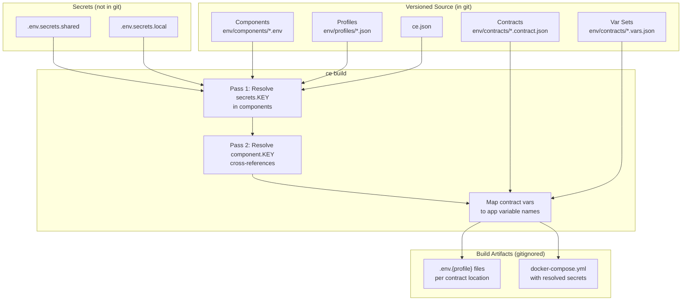

# Composable.env

## What It Does

Composable.env (`ce`) builds `.env` files and Docker Compose configurations from reusable components, profiles, and contracts. Instead of scattering environment variables across services with copy-pasted values and hardcoded secrets, ce separates **what values exist** (components) from **who needs them** (contracts) and **which environment** (profiles).

You version the contracts and components in git. ce generates `.env` files and `docker-compose.yml` as build artifacts — with secrets resolved at build time, never committed.

## Setup

### Prerequisites

- **Node.js 18+** with pnpm (recommended)
- **OrbStack** (recommended) or Docker Desktop for running containers. OrbStack provides automatic `.orb.local` DNS for containers, which ce leverages for local networking.

### Install

```bash
pnpm add -D composable.env
```

Add a convenience script to `package.json`:

```json
{
  "scripts": {
    "ce": "ce"
  }
}
```

### Initialize

```bash
pnpm ce init
```

This scaffolds the `env/` directory structure and `ce.json`. For Docker-based projects with Next.js and VitePress, use the Docker scaffold:

```bash
pnpm ce init --scaffold docker
```

The Docker scaffold creates profiles, networking component, Dockerfiles, example contracts with `profileOverrides`, and a VitePress docs site.

## Architecture

ce has four building blocks that compose into environment output:

- **ce.json** — Root config. Sets `envDir` (default `"env"`), `defaultProfile`, and per-profile settings like suffix and domain.
- **Components** (`env/components/*.env`) — INI files with `[default]`, `[local]`, `[production]` sections. Auto-discovered from the filesystem. This is where non-secret, shared values live.
- **Profiles** (`env/profiles/*.json`) — Define named environments. Support `"extends"` inheritance.
- **Contracts** (`env/contracts/*.contract.json`) — Declare what variables a service needs via `vars` with `${component.KEY}` references. Can output to `.env` files, Docker Compose, or both.
- **Var sets** (`env/contracts/*.vars.json`) — Reusable variable bundles. Contracts use `includeVars` to inherit shared vars.

<FullscreenDiagram>



</FullscreenDiagram>

## Value Layers

The file system is organized by **audience**, not by environment:

| File | Sensitive | In Git | Audience | Purpose |
|------|-----------|--------|----------|---------|
| `env/components/*.env` | No | Yes | Everyone | Non-secret shared values. Main source of truth. |
| `env/contracts/*.contract.json` | No | Yes | Everyone | Declares what each service needs. |
| `env/contracts/*.vars.json` | No | Yes | Everyone | Reusable variable bundles for contracts. |
| `env/profiles/*.json` | No | Yes | Everyone | Defines named environments. |
| `env/.env.secrets.shared` | Yes | No | All devs | Team secrets (DB passwords, API keys). Distributed manually or via vault. |
| `env/.env.secrets.local` | Yes | No | One dev | Personal secrets (individual staging credentials). |
| `env/.env.local` | No | No | One dev | Personal non-secret overrides. Rarely needed. |

The mental model:

- **Shared + non-secret** --> component files (versioned in git)
- **Shared + secret** --> `.env.secrets.shared` (distributed to team, not committed)
- **Personal + secret** --> `.env.secrets.local` (one developer only)
- **Personal + non-secret** --> `.env.local` (one developer only, rarely needed)

Secrets always flow through components. Contracts reference components, never secrets directly:

```
secrets --> components --> contracts --> .env files / docker-compose.yml
```

## CLI Reference

| Command | Purpose |
|---------|---------|
| `pnpm ce init` | Scaffold `env/` directory and `ce.json`. `--scaffold docker` adds Docker + Next.js + VitePress setup. |
| `pnpm ce build [--profile X]` | Build `.env` files and `docker-compose.yml`. Without `--profile`: all profiles. With: only `.env.X`. Compose always includes all profiles. |
| `pnpm ce run [--profile X] -- <cmd>` | Build then run a command with env loaded. |
| `pnpm ce start [profile]` | Build and launch PM2 dev environment. |
| `pnpm ce list` | Show all components, profiles, and contracts. |
| `pnpm ce script <name>` | Run a named script from `ce.json` scripts config. |
| `pnpm ce scripts` | List all available scripts. |
| `pnpm ce scripts:sync` | Generate `package.json` scripts from contracts. |
| `pnpm ce persistent up` | Start persistent Docker services (databases, caches) in detached mode. |
| `pnpm ce persistent down` | Stop persistent services (preserves volumes). |
| `pnpm ce persistent destroy` | Stop persistent services and remove volumes. |
| `pnpm ce persistent status` | Show running state of persistent services. |
| `pnpm ce vault init` | Initialize age-encrypted vault. |
| `pnpm ce vault set KEY=VALUE` | Encrypt a secret into the vault. |
| `pnpm ce vault get KEY` | Decrypt a secret from the vault. |
| `pnpm ce migrate` | Convert legacy format to vars format. |
| `pnpm ce add-skill` | Install the composable.env Claude Code skill. |
| `pnpm ce uninstall` | Remove all ce artifacts from the project. |

## Examples

### Creating a Component

Components are INI files with profile sections. Each file represents one logical service or concern:

```env
# env/components/database.env
[default]
HOST=localhost
PORT=5432
USER=${secrets.DB_USER}
PASSWORD=${secrets.DB_PASSWORD}
NAME=myapp_dev
URL=postgresql://${database.USER}:${database.PASSWORD}@${database.HOST}:${database.PORT}/${database.NAME}

[production]
HOST=db.prod.internal
NAME=myapp
```

The `[default]` section applies to all profiles. `[production]` overrides specific keys when building with `--profile production`. Keys not overridden inherit from `[default]`.

### Creating a Contract

Contracts declare what variables a service needs, mapping app-side names to component references:

```json
{
  "name": "api",
  "location": "apps/api",
  "vars": {
    "DATABASE_URL": "${database.URL}",
    "REDIS_URL": "${redis.URL}",
    "PORT": "${api.PORT}"
  },
  "defaults": {
    "LOG_LEVEL": "info"
  },
  "dev": {
    "command": "pnpm dev",
    "label": "API Server"
  }
}
```

- **Left side** = the variable name the app sees (`DATABASE_URL`)
- **Right side** = always a `${component.KEY}` reference
- **`defaults`** = the only place for hardcoded values — static fallbacks
- **`dev`** = how `ce start` runs this service via PM2

### Building Env Files

```bash
# Build .env files for the local profile
pnpm ce build --profile local
```

This produces `.env.local` in each contract's `location` directory. For a contract with `"location": "apps/api"`, the output goes to `apps/api/.env.local` with all `${component.KEY}` references resolved to their `[local]` or `[default]` values.

Building without `--profile` generates `.env.{profile}` for every defined profile.

### Docker Compose Target

Contracts can generate Docker Compose services using the `target` field:

```json
{
  "name": "indusk-portfolio",
  "location": "apps/indusk-portfolio",
  "target": {
    "type": "docker-compose",
    "file": "docker-compose.yml",
    "service": "indusk-portfolio",
    "config": {
      "build": { "context": ".", "dockerfile": "docker/Dockerfile.nextdev" },
      "ports": ["3000:3000"],
      "volumes": [
        "./apps/indusk-portfolio/src:/app/apps/indusk-portfolio/src",
        "./apps/indusk-portfolio/public:/app/apps/indusk-portfolio/public"
      ],
      "restart": "unless-stopped"
    }
  },
  "vars": {
    "PORT": "${indusk-portfolio.PORT}"
  }
}
```

The `config` block supports everything Docker Compose does: `image`, `build`, `ports`, `volumes`, `healthcheck`, `deploy`, `networks`, `depends_on`, etc.

A contract can have `location`, `target`, or both:

- **`location` only** --> writes `.env.{profile}` for local dev
- **`target` only** --> writes into `docker-compose.yml` for Docker only
- **Both** --> writes to both outputs from the same contract

### Multi-Profile Setup

Define profiles in `ce.json` with suffix and domain settings:

```json
{
  "defaultProfile": "local",
  "profiles": {
    "local": {
      "suffix": "-local",
      "domain": "infinitedusky.orb.local"
    },
    "staging": {
      "suffix": "-stg",
      "domain": "stg.agcorsillo.com"
    },
    "production": {
      "suffix": "",
      "domain": "agcorsillo.com"
    }
  }
}
```

When ce builds Docker Compose output, shared config goes into `x-` YAML anchors and per-profile variants use Docker Compose `profiles:` arrays:

```yaml
x-app: &app-base
  build: { context: ".", dockerfile: "docker/Dockerfile.nextdev" }
  ports: ["3000:3000"]
  restart: unless-stopped

services:
  app-local:
    <<: *app-base
    profiles: ["local"]
    environment:
      NODE_ENV: development
      PORT: "3000"

  app-production:
    <<: *app-base
    profiles: ["production"]
    environment:
      NODE_ENV: production
      PORT: "3000"
```

Switch environments without rebuilding: `docker compose --profile local up` vs `docker compose --profile production up`.

### profileOverrides

When local and production need different Docker config (different Dockerfile, no volume mounts), use `profileOverrides`:

```json
{
  "name": "indusk-portfolio",
  "target": {
    "type": "docker-compose",
    "service": "indusk-portfolio",
    "file": "docker-compose.yml",
    "config": {
      "build": { "context": ".", "dockerfile": "docker/Dockerfile.nextdev" },
      "ports": ["3000:3000"],
      "volumes": [
        "./apps/indusk-portfolio/src:/app/apps/indusk-portfolio/src",
        "./apps/indusk-portfolio/public:/app/apps/indusk-portfolio/public"
      ],
      "restart": "unless-stopped"
    },
    "profileOverrides": {
      "production": {
        "build": { "context": ".", "dockerfile": "docker/Dockerfile.nextprod" },
        "volumes": []
      }
    }
  }
}
```

- `config` is the base (goes into `x-` anchor)
- Override keys are profile names, values are partial config overrides
- Merge is **shallow per top-level key**: `"volumes": []` replaces the entire array
- Keys not in the override inherit from the base

### Var Sets

When multiple contracts need the same variables, extract them into a var set:

```json
// env/contracts/vars/platform-base.vars.json
{
  "vars": {
    "NODE_ENV": "${networking.NODE_ENV}",
    "NEXT_PUBLIC_PROFILE_SUFFIX": "${networking.PROFILE_SUFFIX}",
    "NEXT_PUBLIC_DOMAIN": "${networking.DOMAIN}"
  }
}
```

Contracts inherit with `includeVars`:

```json
{
  "name": "indusk-docs",
  "location": "apps/indusk-docs",
  "includeVars": ["vars/platform-base"],
  "vars": {
    "PORT": "${indusk-docs.PORT}"
  }
}
```

The docs contract gets all three `platform-base` vars plus its own `PORT`. One place to update when platform-wide vars change. Var sets can chain (include other var sets), with cycle detection. The contract's own `vars` win on conflict.

### Persistent Services

Services that should survive rebuild cycles (databases, caches) use `"persistent": true`:

```json
{
  "name": "postgres",
  "persistent": true,
  "onlyProfiles": ["local"],
  "target": {
    "type": "docker-compose",
    "file": "docker-compose.yml",
    "service": "postgres",
    "config": {
      "image": "postgres:16-alpine",
      "ports": ["5432:5432"],
      "volumes": ["pgdata:/var/lib/postgresql/data"],
      "restart": "unless-stopped"
    }
  },
  "vars": {
    "POSTGRES_PASSWORD": "${secrets.DB_PASSWORD}"
  }
}
```

Persistent contracts write to a separate `docker-compose.persistent.yml`. Manage them independently:

```bash
pnpm ce persistent up       # start detached
pnpm ce persistent status   # check state
pnpm ce persistent down     # stop, keep volumes
pnpm ce persistent destroy  # stop and wipe volumes
```

### Variable Interpolation

Components can reference secrets and other components using `${namespace.KEY}` syntax:

```env
# Secrets referenced via ${secrets.KEY}
PASSWORD=${secrets.DB_PASSWORD}

# Cross-component references via ${component.KEY}
URL=postgresql://${database.USER}:${database.PASSWORD}@${database.HOST}:${database.PORT}/${database.NAME}

# Auto-generated service vars (requires domain in ce.json profiles)
ENDPOINT=${service.indusk-portfolio.address}
```

Resolution happens in two passes: first `${secrets.KEY}` references, then `${component.KEY}` cross-references. Auto-generated `${service.<name>.<property>}` vars are available when `domain` is configured in `ce.json` profiles:

| Reference | Example (local profile) | Description |
|-----------|------------------------|-------------|
| `${service.app.host}` | `app-local` | Container name (service + suffix) |
| `${service.app.address}` | `app-local.myproject.orb.local` | Full reachable address |
| `${service.app.suffix}` | `-local` | Profile suffix |
| `${service.app.domain}` | `myproject.orb.local` | Domain for this profile |

## Anti-Patterns

| Anti-Pattern | Why It Fails | Do This Instead |
|-------------|-------------|-----------------|
| Hardcoded values in contract `vars` | Values won't vary by profile. `http://localhost:3000` stays the same in production. | Put the value in a component, reference it as `${component.KEY}`. Use `defaults` only for static fallbacks. |
| Duplicated vars across contracts | Multiple places to update when a value changes. | Extract to a `*.vars.json` file and use `includeVars`. |
| Contracts referencing secrets directly | Bypasses the component layer. A value might not always be secret. | Reference secrets in components (`${secrets.KEY}`), contracts reference components (`${component.KEY}`). |
| Underspecified profiles | Build silently uses `[default]` values for components missing a profile section. Production gets dev values. | Audit all components to ensure each built profile has appropriate overrides. |
| Vestigial components | Two files defining the same service creates confusion and conflicts. | One component per logical service. Merge duplicates. |
| Undocumented secrets | New developers cannot build without manual setup. | Every team secret belongs in `.env.secrets.shared` or the vault. |
| Hand-editing `docker-compose.yml` | `ce build` overwrites it. Your edits vanish. | Change the contract's `target.config` or `vars`. |
| Sourcing `.env` files inside Docker | Risks baking secrets into image layers. | Use `target` contracts to write vars into the `environment:` block at runtime. |

## How InDusk Uses It

The infinitedusky monorepo uses ce to manage two Docker-based apps: the Next.js portfolio site and the VitePress docs site.

### Project Structure

```
env/
├── .env.secrets.shared         # Team secrets (gitignored)
├── .env.secrets.local          # Personal secrets (gitignored)
├── .env.local                  # Personal overrides (gitignored)
├── components/
│   ├── networking.env          # NODE_ENV, PROFILE_SUFFIX, DOMAIN per profile
│   ├── indusk-portfolio.env    # PORT, ENDPOINT, URL for the portfolio app
│   └── indusk-docs.env         # PORT, ENDPOINT, URL for the docs site
├── contracts/
│   ├── indusk-portfolio.contract.json
│   ├── indusk-docs.contract.json
│   └── vars/
│       └── platform-base.vars.json   # NODE_ENV, PROFILE_SUFFIX, DOMAIN
└── profiles/
    └── local.json
```

### Networking Component

The `networking.env` component defines per-profile values that all apps share:

```env
[default]
NODE_ENV=development

[local]
PROFILE_SUFFIX=-local
DOMAIN=infinitedusky.orb.local

[staging]
PROFILE_SUFFIX=-stg
DOMAIN=stg.agcorsillo.com
NODE_ENV=production

[production]
PROFILE_SUFFIX=
DOMAIN=agcorsillo.com
NODE_ENV=production
```

### Platform Var Set

The `platform-base.vars.json` var set bundles the networking vars so both apps get them:

```json
{
  "vars": {
    "NODE_ENV": "${networking.NODE_ENV}",
    "NEXT_PUBLIC_PROFILE_SUFFIX": "${networking.PROFILE_SUFFIX}",
    "NEXT_PUBLIC_DOMAIN": "${networking.DOMAIN}"
  }
}
```

Both the portfolio and docs contracts include this with `"includeVars": ["vars/platform-base"]`.

### Build and Run

The `package.json` scripts wrap ce commands:

```json
{
  "scripts": {
    "ce": "ce",
    "env:build": "ce build --profile",
    "dev": "ce run -- turbo dev",
    "dev:indusk-portfolio": "ce run --profile -- turbo dev --filter=indusk-portfolio",
    "dev:indusk-docs": "ce run --profile -- turbo dev --filter=indusk-docs"
  }
}
```

To build and run locally with Docker:

```bash
# Build env files and docker-compose.yml for local profile
pnpm env:build local

# Start containers
docker compose --profile local up
```

The generated `docker-compose.yml` contains profiled services with resolved environment variables:

```yaml
services:
  indusk-portfolio-local:
    <<: *indusk-portfolio-base
    profiles: ["local"]
    environment:
      NODE_ENV: development
      NEXT_PUBLIC_PROFILE_SUFFIX: -local
      NEXT_PUBLIC_DOMAIN: infinitedusky.orb.local
      PORT: "3000"

  indusk-docs-local:
    <<: *indusk-docs-base
    profiles: ["local"]
    environment:
      NODE_ENV: development
      NEXT_PUBLIC_PROFILE_SUFFIX: -local
      NEXT_PUBLIC_DOMAIN: infinitedusky.orb.local
      PORT: "4173"
```

### ce.json Configuration

```json
{
  "envDir": "env",
  "defaultProfile": "local",
  "profiles": {
    "local": {
      "suffix": "-local",
      "domain": "infinitedusky.orb.local"
    },
    "staging": {
      "suffix": "-stg",
      "domain": "stg.agcorsillo.com"
    },
    "production": {
      "suffix": "",
      "domain": "agcorsillo.com"
    }
  }
}
```

Three profiles define three environments. The `suffix` controls Docker Compose service naming (`indusk-portfolio-local`, `indusk-portfolio-stg`, `indusk-portfolio`). The `domain` feeds auto-generated `${service.*}` vars for inter-service networking.

## Gotchas

- **Always use `pnpm ce`, not `npx ce`** — the monorepo resolves the binary through pnpm workspaces. `npx` may pick up a different version or fail entirely.
- **Run `pnpm env:build` before `docker compose`** — the compose file is a build artifact generated by ce. If you skip the build step, you get stale or missing configuration.
- **Never bare `docker compose up`** — every service is profiled. Always use `docker compose --profile local up` (or whichever profile you need).
- **Don't edit `docker-compose.yml` by hand** — it is fully generated and gitignored. Your changes will be overwritten on the next `ce build`. Edit the contract's `target.config` instead.
- **Profile resolution order** — `--profile` flag beats `CE_PROFILE` env var beats `ce.json defaultProfile` beats `"default"`.
- **profileOverrides merge is shallow** — `"volumes": []` replaces the entire volumes array, it does not append to it. Keys not mentioned in the override inherit from the base config.
- **Secrets flow through components** — never reference `${secrets.KEY}` in a contract. Put the secret reference in a component, then reference the component in the contract.
- **The `ce` binary is `ce`** — the package.json script should be `"ce": "ce"`, not `"ce": "composable.env"`.
