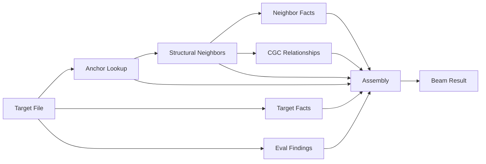

# Context Beam

The context beam delivers file-specific context from all available data sources. Instead of the flat dump of CLAUDE.md during catchup, beam answers "what do I need to know about *this* file?"

## How It Works

Given a file path, beam runs a pipeline of 6 discrete queries across different data sources, assembles the results with distance-based relevance decay, and returns targeted context.



## Query Pipeline

| # | Query | Source | Distance | What it finds |
|---|-------|--------|----------|---------------|
| 1 | Anchor lookup | Semantic graph | 0 | File's node in the graph |
| 2 | Structural neighbors | Semantic graph | 1 | Import/imported-by files (1 hop) |
| 3 | Target facts | Graphiti | 0 | Decisions, corrections, eval findings for this file |
| 4 | Neighbor facts | Graphiti | 1 | Facts about structural neighbors |
| 5 | Eval findings | Local (findings.json) | 0 | Unresolved eval findings for this file |
| 6 | CGC relationships | CGC graph | 1 | Module imports, callers, callees |

Queries 1, 3, and 5 run in parallel (independent). Query 2 runs next (populates neighbors). Then queries 4 and 6 run in parallel (use neighbors).

## Distance-Based Decay

- **Distance 0** — full detail. Every fact, finding, and attribute.
- **Distance 1** — summaries. File paths, relationship types, one-line fact descriptions.
- **Distance 2** — names only (future expansion).

Eval findings always rank highest regardless of distance — they're active, unresolved problems.

## Usage

### MCP Tool

```
context_beam({
  path: "src/lib/eval/judge-runner.ts",
  trace: true,
  format: "markdown"
})
```

Parameters:
- `path` — file path relative to project root
- `trace` — show each query's results (default: false)
- `format` — `"markdown"` (default), `"json"`, or `"trace"`

### CLI

```bash
# Markdown output
indusk beam src/lib/eval/judge-runner.ts

# Trace mode — see what each query found
indusk beam src/lib/eval/judge-runner.ts --trace

# JSON output
indusk beam src/lib/eval/judge-runner.ts --json
```

## Trace Mode

`--trace` shows every query step as it runs:

```
[beam] target: src/lib/eval/judge-runner.ts

[anchor-lookup] semantic-graph (55ms)
  → 1 results
    - Anchor: file at /full/path/to/judge-runner.ts

[structural-neighbors] semantic-graph (33ms)
  → 6 results
    - IMPORTS: prompt-builder.ts
    - IMPORTS: rubric.ts
    - IMPORTED_BY: persistent-judge.ts

[target-facts] graphiti (106ms)
  → 2 results
    - "detached+unref causes close handler to never fire"
    - "prompt too large with inline diff"

[eval-findings] eval (1ms)
  → 0 results

[cgc-relationships] cgc (18ms)
  → 3 results
    - imports: @opentelemetry/sdk-node
    - calls-into: filtering-exporter.ts

[assembly] 12 items total — 3 high-signal (d0), 9 awareness (d1)
[timing] 193ms total
```

Use trace to understand what the beam is finding and tune the pipeline.

## Weighted Graph (Future)

The beam reads optional weight properties if they exist on graph nodes and edges:

- `importance` on nodes — in-degree, fact density, complexity
- `weight` on edges — symbol usage count, co-change frequency

V1 treats all neighbors equally. When weights are computed by a future `graph sync` enhancement, beam automatically uses them — no code change needed.

## Configuration

Beam has no configuration in v1. It runs on demand via the MCP tool or CLI.

## Data Quality

Beam results are only as good as the underlying data:

- **Semantic graph** needs to be synced (`indusk graph sync`) to have current anchors and edges
- **Graphiti** needs facts written with file paths (the eval judge does this via `graph_capture`)
- **CGC** needs to be indexed (`indusk index_project`) for structural relationships
- **Eval findings** accumulate automatically as the eval judge runs

If beam returns sparse results, the fix is usually enriching the data — run a graph sync, re-index CGC, or let the eval judge run for a few more commits.
