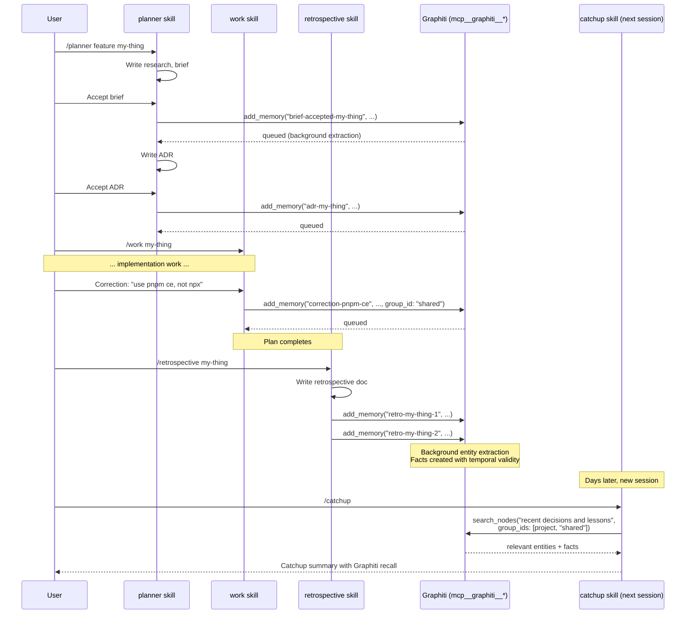

# Graphiti — Temporal Knowledge Graph

Graphiti is a temporal knowledge graph that captures decisions, contradictions, and lessons across sessions. It runs inside the [`indusk-infra` container](/reference/tools/infrastructure) on port 8100 and is registered as an MCP server in every project's `.mcp.json` (automatically by `indusk init` ≥ v1.10.0). The agent calls Graphiti tools directly via `mcp__graphiti__*` — there is no `indusk` wrapper layer.

This page documents the agent-facing surface. For the container itself (Docker, persistence, env vars), see [Infrastructure Container](/reference/tools/infrastructure).

## What Graphiti Stores

| Concept | What it is | Example |
|---------|------------|---------|
| **Episode** | A chunk of text — "something that happened" | "We chose JWT with refresh tokens because the API serves both web and mobile clients." |
| **Entity** | Named thing extracted from episodes | `JWT`, `refresh tokens`, `session cookies`, `React Native` |
| **Fact** | Relationship between entities, with temporal metadata | "JWT was chosen over session cookies." (with `valid_at`) |
| **Group** | Knowledge isolation boundary | `infinitedusky`, `numero`, `shared` |

Episodes are processed asynchronously — entities and facts appear in search results within a few seconds of writing the episode.

Facts have temporal validity. If a later episode contradicts an earlier one, the older fact gets `invalid_at` set and is excluded from search results by default. **This is one of Graphiti's most useful features**: the agent stops re-introducing decisions that were already overturned.

## Group IDs

| Group | Purpose | Example contents |
|-------|---------|------------------|
| `{project-name}` | Project-specific knowledge | "The bet matching engine is order-book based", "Phase 5.5 exposed Graphiti to the agent" |
| `shared` | Cross-project conventions | "Always use `pnpm ce`, never `npx ce`", "Never mock the database in integration tests" |

When searching, always include both the project group and `shared` to get the full picture. The `getProjectGroupId(projectRoot)` helper in `apps/indusk-mcp/src/lib/config.ts` resolves the project group from `.indusk/config.json` `graphiti.groupId` if set, falling back to the directory basename.

## Tools

The agent has 9 `mcp__graphiti__*` tools. The five used in normal flow:

| Tool | Purpose |
|------|---------|
| `add_memory` | Capture an episode (text/JSON/message) — entities and facts are extracted asynchronously |
| `search_nodes` | Find entities by natural-language query, optionally filtered by group |
| `search_memory_facts` | Find facts (relationships between entities) by query |
| `get_episodes` | List recent episodes by group |
| `get_status` | Check that Graphiti is reachable and the database is healthy |

The other four (`delete_episode`, `delete_entity_edge`, `get_entity_edge`, `clear_graph`) are for cleanup — use sparingly, never in normal flow.

## Capture Triggers

Graphiti is populated **automatically** by other skills at well-defined trigger points. The agent rarely calls `mcp__graphiti__add_memory` directly in normal flow — it trusts the skills to capture and lets `/catchup` recall.

| Trigger | Skill | Episode written |
|---------|-------|-----------------|
| Brief moves to `accepted` | `planner` (step 4) | `brief-accepted-{plan}` — body = Problem + Proposed Direction. Group = project. |
| ADR moves to `accepted` | `planner` (step 5) | `adr-{plan}` — body = full Y-statement. Group = project. |
| User confirms `context learn` | `work` (Corrections section) | `correction-{slug}` — body = lesson text. Group = `shared` if cross-project, project group otherwise. |
| Retrospective "What We Learned" | `retrospective` (Step 6) | `retro-{plan}-{n}` — body = the insight. Group = project. |
| Retrospective "What We'd Do Differently" | `retrospective` (Step 6) | `retro-{plan}-wdid-{n}` — body = the hindsight item. Group = project. |

If a capture call fails because Graphiti is unavailable, the trigger **skips silently** — Graphiti is best-effort, and the surrounding flow (brief acceptance, ADR acceptance, lesson recording) is never blocked by it.

## Recall

The `catchup` skill (Step 4.5) calls `mcp__graphiti__search_nodes` at the start of every session with a query like "recent decisions and lessons" across `[project-group, "shared"]`. Up to 5 of the most relevant nodes are surfaced in the catchup summary.

If Graphiti is unavailable at catchup time, the step skips silently and adds a note like `Graphiti: unavailable (run \`indusk infra start\` to recall episodic memory)` to the summary. **Catchup never fails because Graphiti is down** — the rest of the layers (CLAUDE.md, lessons, plans, code graph) are still valid.

## Capture and Recall Lifecycle



The capture/recall loop is what turns Graphiti from "passive memory the agent could use" into "active memory that's populated as decisions happen and surfaced when they matter."

## Manual Use (Rare)

In normal flow, the agent does not call `mcp__graphiti__*` tools directly — the trigger points above handle capture, and `/catchup` handles recall. Manual calls are for exceptional cases:

- **Cross-cutting insights mid-work** that don't fit a planner/retro/correction trigger
- **Cleanup** (`delete_episode`, `clear_graph`) when episodes accumulate test data or stale facts
- **Debugging** Graphiti itself (`get_status`, `get_episodes`)
- **Evaluating retrieval quality** during the CGC + Graphiti experiment

```typescript
// Capture an unusual insight that doesn't fit a trigger point
mcp__graphiti__add_memory({
  name: "unusual-finding-name",
  episode_body: "Detailed description of what was learned, with enough context that someone reading it cold can understand it.",
  group_id: "your-project-name",  // or "shared" for cross-project lessons
  source: "text",
  source_description: "manual capture — context that wasn't a brief/ADR/correction/retro"
})

// Search before assuming
mcp__graphiti__search_nodes({
  query: "natural language query",
  group_ids: ["your-project-name", "shared"],  // always both
  max_nodes: 10
})
```

## Health Check

```typescript
mcp__graphiti__get_status({})
// → { status: "ok", message: "Graphiti MCP server is running and connected to falkordb database" }
```

If this returns an error, run `indusk infra status` to check the container, then `indusk infra start` if needed.

## What NOT to Capture

- **Code structure** — CGC handles this. `function X calls function Y` is a graph relationship, not an episode.
- **Git history** — `git log` is authoritative.
- **Ephemeral state** — current task, in-progress work, todo lists. Use the `TodoWrite` tool.
- **Things already in CLAUDE.md or lessons** — those layers exist for stable, project-wide truths. Graphiti is for things that have temporal context and might be contradicted.

## See Also

- [Infrastructure Container](/reference/tools/infrastructure) — the Docker container that runs Graphiti
- [Planner Skill](/reference/skills/plan) — capture triggers in the planning lifecycle
- [Catchup Skill](/reference/skills/catchup) — recall at session start
- Graphiti project: [github.com/getzep/graphiti](https://github.com/getzep/graphiti)
