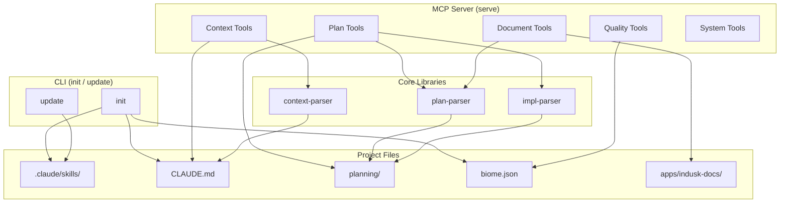

# InDusk MCP Server

The InDusk MCP server (`indusk-mcp`) provides 14 tools across 5 categories that make the skill system cohesive. Skills are markdown instructions the agent reads; MCP tools are structured APIs the agent calls.

## Setup

The server is configured in `.mcp.json`. For local development (dogfooding):

```json
{
  "indusk": {
    "command": "node",
    "args": ["apps/indusk-mcp/dist/bin/cli.js", "serve"],
    "env": { "PROJECT_ROOT": "." }
  }
}
```

For projects using the published package:

```json
{
  "indusk": {
    "command": "npx",
    "args": ["indusk-mcp", "serve"],
    "env": { "PROJECT_ROOT": "." }
  }
}
```

## CLI Commands

| Command | Purpose |
|---------|---------|
| `init` | Set up a project: installs skills, CLAUDE.md, biome.json, .mcp.json, .vscode/settings.json |
| `update` | Refresh skills from package (compares content hashes, never touches project files) |
| `serve` | Start the MCP server (called by `.mcp.json`, not run manually) |

## Tools

### Plan Management

| Tool | Input | Description |
|------|-------|-------------|
| `list_plans` | — | All plans with stage, status, next step, and dependencies |
| `get_plan_status` | `name` | Detailed status: phase progress, checked/unchecked items per gate |
| `advance_plan` | `name` | Validates prerequisites for the next transition. Returns `{ allowed, missing }` |
| `order_plans` | — | Topological sort of plans based on dependency graph |

#### Phase Enforcement (`advance_plan`)

| Transition | Requirement |
|------------|-------------|
| brief → adr | Brief status = `accepted` |
| adr → impl | ADR status = `accepted` |
| phase N → phase N+1 | All implementation, verification, context, and document items checked |
| impl → retrospective | All phases complete, impl status = `completed` |

### Context Management

| Tool | Input | Description |
|------|-------|-------------|
| `get_context` | — | CLAUDE.md parsed into 6 sections with validation status |
| `update_context` | `section`, `content` | Update one section. Validates structure before and after. |

The 6 canonical sections: What This Is, Architecture, Conventions, Key Decisions, Known Gotchas, Current State.

### Quality Tools

| Tool | Input | Description |
|------|-------|-------------|
| `get_quality_config` | — | Returns biome.json + biome-rationale.md as structured data |
| `suggest_rule` | `description` | Searches Biome rule catalog for rules matching a mistake description |
| `quality_check` | — | Runs `biome check`, returns parsed diagnostics with file, line, rule, severity |

### Document Tools

| Tool | Input | Description |
|------|-------|-------------|
| `list_docs` | — | All markdown files in the VitePress docs directory |
| `check_docs_coverage` | — | Compares completed plans to existing decision pages, flags gaps |

### System Tools

| Tool | Input | Description |
|------|-------|-------------|
| `get_system_version` | — | Package name and version |
| `get_skill_versions` | — | Compares installed skills to package skills: current, outdated, or missing |
| `check_health` | — | Checks FalkorDB connectivity, CGC installation, Docker container status |

## Architecture

<FullscreenDiagram>



</FullscreenDiagram>

## Ownership

Skills are owned by the package at `apps/indusk-mcp/skills/`. When editing a skill, edit the source there and run `update` to sync to `.claude/skills/`. Never edit `.claude/skills/` directly — changes will be overwritten on the next update.
