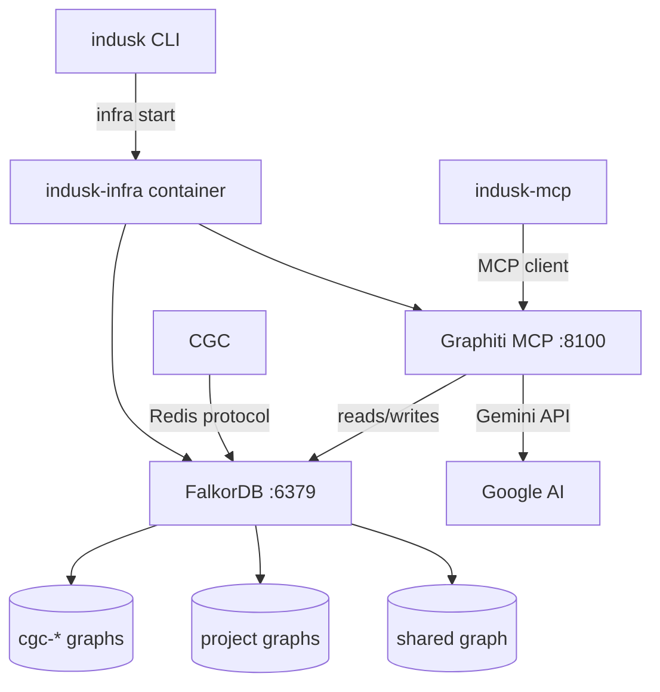

# Infrastructure Container

The `indusk-infra` container bundles FalkorDB and Graphiti MCP server into a single persistent Docker image. It provides the graph infrastructure that powers CodeGraphContext (structural code intelligence) and Graphiti (temporal knowledge graph / episodic memory).

## Architecture



## What's Inside

| Service | Port | Purpose |
|---------|------|---------|
| FalkorDB | 6379 | Redis-compatible graph database. Stores CGC structural graphs (`cgc-*`) and Graphiti semantic graphs (per-project + `shared`) |
| Graphiti MCP | 8100 | Temporal knowledge graph engine. Entity extraction, deduplication, contradiction detection. Accessed via MCP over HTTP |

## Quick Start

```bash
# Start infrastructure (creates ~/.indusk/config.env on first run)
indusk infra start

# Check status
indusk infra status
```

On first run, `indusk infra start` creates `~/.indusk/config.env` with a template. Add your `GOOGLE_API_KEY` there, then restart the container.

### Manual Setup (without CLI)

```bash
# Build the image
docker build -f docker/Dockerfile.infra -t indusk-infra .

# Start with API key
docker run -d --name indusk-infra \
  -p 6379:6379 -p 8100:8100 \
  -v indusk-data:/data \
  -e GOOGLE_API_KEY=$GOOGLE_API_KEY \
  indusk-infra

# Verify
redis-cli ping              # → PONG
curl localhost:8100/health   # → {"status":"healthy"}
```

## CLI Commands

| Command | Description |
|---------|-------------|
| `indusk infra start` | Start the infrastructure container. Creates it if missing, starts it if stopped, prints status if already running. Reads `GOOGLE_API_KEY` and OTel config from `~/.indusk/config.env`. |
| `indusk infra stop` | Stop the container. Preserves data in the `indusk-data` volume. |
| `indusk infra status` | Show container state, FalkorDB health, graph list, Graphiti health, API key and OTel configuration status. |

### Global Configuration

`~/.indusk/config.env` is created on first `indusk infra start`. It stores global secrets shared across all projects:

```bash
# Required for Graphiti
GOOGLE_API_KEY=your-key-here

# Optional: OTel export
OTEL_EXPORTER_OTLP_ENDPOINT=https://api.region.gcp.dash0.com
OTEL_EXPORTER_OTLP_HEADERS=Authorization=Bearer ...
OTEL_SERVICE_NAME=indusk-infra
```

## Configuration

### Required Environment Variables

| Variable | Purpose |
|----------|---------|
| `GOOGLE_API_KEY` | Gemini API key for LLM (entity extraction) and embeddings. Get one at [aistudio.google.com/apikey](https://aistudio.google.com/apikey) |

### Optional Environment Variables

| Variable | Purpose | Default |
|----------|---------|---------|
| `OTEL_EXPORTER_OTLP_ENDPOINT` | OTLP endpoint for trace export (e.g., Dash0) | Disabled |
| `OTEL_EXPORTER_OTLP_HEADERS` | Auth headers for OTLP export | — |
| `OTEL_SERVICE_NAME` | Service name for traces | `graphiti-mcp` |
| `FALKORDB_DATABASE` | Default FalkorDB graph name | `shared` |

### Graceful Degradation

Without `GOOGLE_API_KEY`:
- FalkorDB starts and works normally (CGC still functions)
- Graphiti logs errors and retries indefinitely
- Set the key later and restart the container to enable Graphiti

## Data Persistence

Graph data persists in the `indusk-data` Docker volume mounted at `/data`. Stopping and starting the container preserves all graphs. Only `docker volume rm indusk-data` destroys the data.

## Graph Layout

All graphs live in the single FalkorDB instance:

| Graph | Source | Purpose |
|-------|--------|---------|
| `cgc-{project}` | CodeGraphContext | Structural code intelligence (AST, dependencies, call graphs) |
| `{project}` | Graphiti | Project-specific semantic knowledge (decisions, gotchas, patterns) |
| `shared` | Graphiti | Universal knowledge (developer preferences, conventions, cross-project lessons) |

## Smoke Test

```bash
./docker/test-infra.sh $GOOGLE_API_KEY
```

Tests: image build, container start, FalkorDB health, Graphiti health, data persistence, graceful degradation. Runs with or without API key.

## Ports

- **6379** — FalkorDB (Redis protocol). Used by CGC and Graphiti internally.
- **8100** — Graphiti MCP server (HTTP). Used by indusk-mcp's MCP client. Port 8000 is taken by OrbStack.

## Future: Hosted Tier

The container architecture supports a hosted upgrade path. The indusk-mcp client connects via network (Redis protocol + HTTP/MCP) — swapping `localhost` for a cloud endpoint is a config change, not a rewrite.
