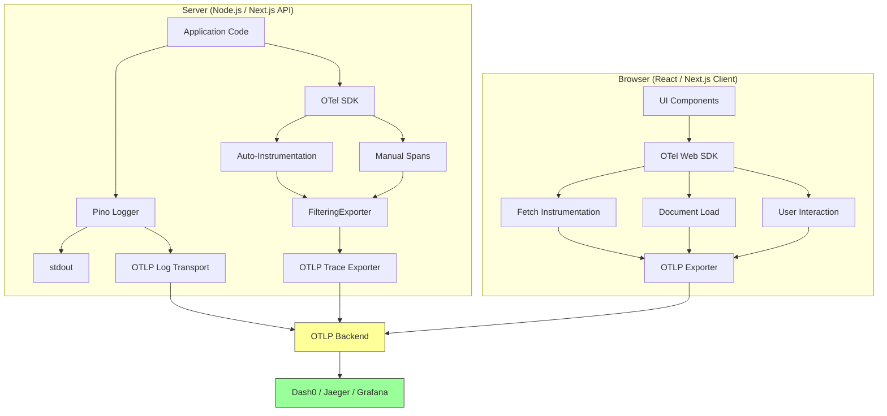

# OpenTelemetry

Auto-instrumentation, structured logging, and category-based filtering for every InDusk project. Backend-agnostic — works with Dash0, Jaeger, Grafana, or any OTLP-compatible backend.

## What `init` Creates

`indusk-mcp init` detects your runtime and scaffolds the right instrumentation:

### Node.js (Express, Fastify, plain HTTP)

| File | Purpose |
|------|---------|
| `src/instrumentation.ts` | OTel SDK with auto-instrumentation + FilteringExporter |
| `src/filtering-exporter.ts` | Category-based span filtering |
| `src/logger.ts` | Pino structured logger (stdout + OTLP) |

**Wire it**: `node --import ./src/instrumentation.ts src/index.ts`

**Install**: `pnpm add @opentelemetry/sdk-node @opentelemetry/auto-instrumentations-node @opentelemetry/exporter-trace-otlp-http @opentelemetry/sdk-trace-base @opentelemetry/resources @opentelemetry/semantic-conventions @opentelemetry/core pino pino-opentelemetry-transport`

### Next.js

| File | Purpose |
|------|---------|
| `instrumentation.ts` (root) | Server-side: `@vercel/otel` — API routes, server components, middleware |
| `src/instrumentation.web.ts` | Client-side: OTel Web SDK — page loads, fetch, user interactions |
| `src/logger.ts` | Pino structured logger (stdout + OTLP) |

**Wire it**: Server loads automatically. Client: `import './instrumentation.web'` in your root client component.

**Install**: `pnpm add @vercel/otel pino pino-opentelemetry-transport @opentelemetry/sdk-trace-web @opentelemetry/sdk-trace-base @opentelemetry/exporter-trace-otlp-http @opentelemetry/resources @opentelemetry/semantic-conventions @opentelemetry/instrumentation @opentelemetry/instrumentation-fetch @opentelemetry/instrumentation-document-load @opentelemetry/instrumentation-user-interaction`

### React SPA (Vite)

| File | Purpose |
|------|---------|
| `src/instrumentation.ts` | OTel Web SDK — page loads, fetch, user interactions |

**Wire it**: `import './instrumentation'` at the top of `main.tsx`

**Install**: `pnpm add @opentelemetry/sdk-trace-web @opentelemetry/sdk-trace-base @opentelemetry/exporter-trace-otlp-http @opentelemetry/resources @opentelemetry/semantic-conventions @opentelemetry/instrumentation @opentelemetry/instrumentation-fetch @opentelemetry/instrumentation-document-load @opentelemetry/instrumentation-user-interaction`

### Python

| File | Purpose |
|------|---------|
| `instrumentation.py` | OTel SDK with auto-instrumentation |

**Wire it**: `opentelemetry-instrument python your_app.py`

**Install**: `pip install opentelemetry-distro opentelemetry-instrumentation opentelemetry-exporter-otlp`

## How to Add Manual Traces

Auto-instrumentation covers HTTP requests and database queries. You need manual spans for business logic, state transitions, and inference calls.

### Node.js / Next.js Server

```typescript
import { trace, SpanStatusCode } from '@opentelemetry/api';

const tracer = trace.getTracer('my-service');

// Basic span
const span = tracer.startSpan('poker.hand.deal', {
  attributes: {
    'otel.category': 'business',
    'room.code': roomCode,
    'hand.number': handNumber,
    'player.count': players.length,
  },
});

try {
  await dealCards(players);
  span.end();
} catch (err) {
  span.recordException(err);
  span.setStatus({ code: SpanStatusCode.ERROR, message: err.message });
  span.end();
  throw err;
}
```

### Wrapping async operations

```typescript
// Use startActiveSpan for automatic context propagation
await tracer.startActiveSpan('settlement.process', async (span) => {
  span.setAttribute('otel.category', 'business');
  span.setAttribute('settlement.amount', amount);
  
  try {
    const result = await processSettlement(hand);
    span.setAttribute('settlement.tx_hash', result.txHash);
    return result;
  } catch (err) {
    span.recordException(err);
    span.setStatus({ code: SpanStatusCode.ERROR });
    throw err;
  } finally {
    span.end();
  }
});
```

### LLM / Inference calls

```typescript
const span = tracer.startSpan('inference.gemini.generate', {
  attributes: {
    'otel.category': 'inference',
    'inference.model': 'gemini-2.5-flash',
    'inference.prompt_tokens': prompt.length,
  },
});

const response = await gemini.generateContent(prompt);

span.setAttribute('inference.completion_tokens', response.text.length);
span.setAttribute('inference.duration_ms', elapsed);
span.end();
```

### React / Browser

```typescript
import { trace } from '@opentelemetry/api';

const tracer = trace.getTracer('my-app');

function handleCheckout() {
  const span = tracer.startSpan('checkout.submit', {
    attributes: {
      'otel.category': 'business',
      'cart.item_count': cart.items.length,
      'cart.total': cart.total,
    },
  });

  submitOrder(cart)
    .then(() => span.end())
    .catch((err) => {
      span.recordException(err);
      span.setStatus({ code: SpanStatusCode.ERROR });
      span.end();
    });
}
```

## Span Naming Convention

Use `{domain}.{entity}.{action}`:

| Good | Bad |
|------|-----|
| `poker.hand.deal` | `processRequest` |
| `auth.session.create` | `handle` |
| `settlement.receipt.sign` | `doThing` |
| `inference.gemini.generate` | `callAPI` |
| `checkout.order.submit` | `submit` |

## Category Taxonomy

Every manual span gets an `otel.category` attribute:

| Category | What it covers | Auto-instrumented? | Examples |
|----------|---------------|-------------------|----------|
| `http` | HTTP server/client requests | Yes | GET /api/users, POST /api/orders |
| `db` | Database queries | Yes | SELECT, INSERT, pg, redis |
| `business` | Domain events | No | hand dealt, user registered, payment processed |
| `inference` | LLM/AI calls | No | Gemini generate, embedding create |
| `state` | State transitions | No | game started, order status changed |
| `system` | Infrastructure | No | health checks, cron jobs, queue processing |

## Category Filtering

Control which categories get exported via `OTEL_ENABLED_CATEGORIES`:

```bash
# Only HTTP and business spans
OTEL_ENABLED_CATEGORIES=http,business node --import ./src/instrumentation.ts src/index.ts

# Everything (default when not set)
node --import ./src/instrumentation.ts src/index.ts
```

The `FilteringExporter` wraps the real exporter and drops spans from disabled categories before they leave your process. **Instrument everything — you only pay export cost for enabled categories.**

## Structured Logging with Pino

Use the project logger, not `console.log`:

```typescript
import { logger } from './logger';

// Good — structured, with context
logger.info({ roomCode, players: players.length }, 'hand started');
logger.error({ err, orderId }, 'payment failed');
logger.warn({ queueDepth: 150, threshold: 100 }, 'queue approaching limit');

// Bad — unstructured string
console.log('Hand started for room ' + roomCode);
```

### Log Levels

| Level | Meaning | When to use |
|-------|---------|------------|
| `error` | Something is broken | Unhandled errors, failed operations that should succeed |
| `warn` | Degraded but functional | Approaching limits, fallback behavior, retries |
| `info` | Business events | State transitions, user actions, completed operations |
| `debug` | Development details | Variable values, flow tracing — disable in production |

## Error Propagation

Errors must always include trace context. Never swallow silently:

```typescript
try {
  await processSettlement(hand);
} catch (err) {
  // Record on span
  span.recordException(err);
  span.setStatus({ code: SpanStatusCode.ERROR, message: err.message });
  
  // Log with context
  logger.error({ err, traceId: span.spanContext().traceId }, 'settlement failed');
  
  // Re-throw — don't swallow
  throw err;
}
```

## Trace Flow



## Environment Variables

### Server (Node.js / Python)

| Variable | Purpose | Default |
|----------|---------|---------|
| `OTEL_SERVICE_NAME` | Service name in traces | Set by init |
| `OTEL_EXPORTER_OTLP_ENDPOINT` | Backend URL | Not set (console exporter) |
| `OTEL_EXPORTER_OTLP_HEADERS` | Auth headers | Not set |
| `OTEL_ENABLED_CATEGORIES` | Active categories | All enabled |
| `LOG_LEVEL` | Pino log level | `info` |

### Browser (React / Next.js Client)

| Variable | Purpose | Prefix |
|----------|---------|--------|
| `VITE_OTEL_SERVICE_NAME` | Service name | Vite apps |
| `VITE_OTEL_EXPORTER_OTLP_ENDPOINT` | Backend URL | Vite apps |
| `VITE_OTEL_EXPORTER_OTLP_HEADERS` | Auth headers | Vite apps |
| `NEXT_PUBLIC_OTEL_EXPORTER_OTLP_ENDPOINT` | Backend URL | Next.js apps |
| `NEXT_PUBLIC_OTEL_EXPORTER_OTLP_HEADERS` | Auth headers | Next.js apps |

## Connecting to a Backend

### Dash0 (recommended)

1. Run `pnpm ce env:build` to generate `.indusk/extensions/dash0/.env` from the contract
2. Run `npx @infinitedusky/indusk-mcp extensions enable dash0` — auto-configures MCP server
3. Set the OTLP env vars in your app's composable.env contract:
   ```json
   {
     "OTEL_EXPORTER_OTLP_ENDPOINT": "${dash0.HTTP_ENDPOINT}",
     "OTEL_EXPORTER_OTLP_HEADERS": "${dash0.OTLP_HEADERS}"
   }
   ```

### Other OTLP backends

Set the env vars directly:
```bash
OTEL_EXPORTER_OTLP_ENDPOINT=http://localhost:4318  # Jaeger, Grafana, etc.
```

No code changes needed — all instrumentation uses standard OTLP.

## OTel Gate

Every implementation phase has an **OTel gate** — enforced by hooks alongside verification, context, and document gates. The five-gate order:

1. **Implementation** — build the thing
2. **OTel** — instrument it
3. **Verification** — prove it works (can include trace verification)
4. **Context** — capture what changed
5. **Document** — write/update docs

The OTel gate asks: "did this phase add code paths that need instrumentation?" Example items:

```markdown
#### Phase 2 OTel
- [ ] New API endpoints have manual spans with `otel.category` and domain attributes
- [ ] Errors recorded with `recordException` + `setStatus(ERROR)` + trace-correlated log
- [ ] Inference calls have `inference.*` spans with model, token count attributes
```

For phases that don't add endpoints or business logic (config changes, documentation, tooling), the gate can be opted out per the gate policy.

## Health Checks

The OTel extension verifies:
- `instrumentation.ts` (or `.py`) exists in the project
- OTel SDK packages are installed

Run `check_health` to see the status.
