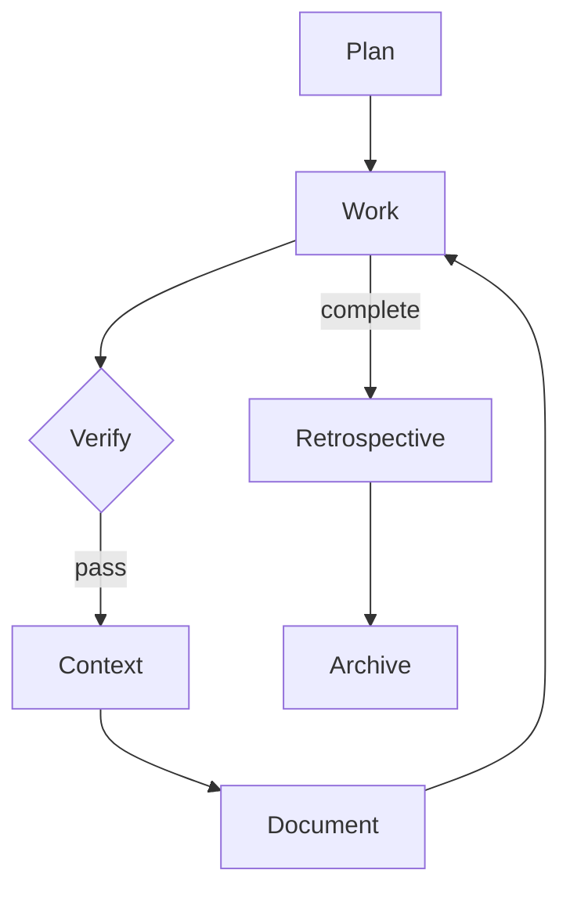

You know how to maintain documentation in this project.

## Why Documentation Exists

Documentation is **the project's encyclopedia**. It is a human-readable record that any developer — today or a year from now — can read and understand:

- **What** was built and how it works
- **Why** it was built this way and not another
- **How** to use it, configure it, extend it
- **What changed** over time (changelogs, decision records)

This is NOT the same as CLAUDE.md (which is agent-facing project memory) or code comments (which are implementation details). Documentation is for humans who need to understand the project without reading every source file.

**Documentation is never optional.** The question is not "does this need docs?" — the question is "what docs does this need?" Even a bugfix updates the changelog. Even a refactor updates architecture diagrams. Even an internal change may need a decision record explaining why.

The fact that information exists in CLAUDE.md, planning docs, or code does NOT eliminate the need for documentation. Those are working artifacts. Documentation is the polished, organized, permanent record.

## What Document Does

Document is a per-phase gate during impl execution, alongside verify and context. The full phase order is:

```
implement → verify → context → document → advance
```

After context items are done, the document gate asks:

**"What should a developer reading this project's docs learn from what this phase built?"**

To answer this accurately, **REQUIRED: call `query_dependencies`** on the key files changed in this phase to understand what was affected and how broadly.

For each phase, consider all of these:

| What happened | What to document |
|---|---|
| New feature or tool | Reference page + guide if complex |
| Architecture change | Update architecture page + diagrams |
| New decision (ADR accepted) | Decision page distilled from ADR |
| Bug fixed | Changelog entry + update affected reference pages |
| Refactor | Update architecture diagrams + any affected reference pages |
| New convention | Update conventions/reference page |
| API change | Update API reference |
| Configuration change | Update configuration reference |
| Lesson learned | Will go in lessons/ during retrospective |

## Where Docs Live

Documentation lives in a VitePress site at `apps/indusk-docs/`:

```
apps/indusk-docs/src/
├── guide/           # How-to guides (task-oriented)
├── reference/       # Skills, tools, API, configuration (information-oriented)
│   ├── skills/      # One page per skill
│   └── tools/       # One page per tool (Biome, CGC, composable.env)
├── decisions/       # Distilled from ADRs during retrospective/archival
└── lessons/         # Distilled from retrospective insights during archival
```

### What Goes Where

| What changed | Where to document | Doc type |
|---|---|---|
| New feature or tool | `reference/` | Reference page |
| New workflow or process | `guide/` | How-to guide |
| Configuration change | `reference/` (update existing page) | Reference update |
| Architecture change | `reference/` + diagram | Reference + diagram |
| Nothing user-facing | Skip | — |

### Decisions and Lessons

The `decisions/` and `lessons/` directories are **not** populated during normal impl work. They are populated during the retrospective/archival process by the retrospective skill. Don't write to them during `/work`.

## Mermaid Diagrams

**Prefer diagrams over long prose for architecture, flows, and relationships.** A well-labeled diagram communicates structure faster than paragraphs of text.

### When to Use Which Diagram Type

| Scenario | Diagram Type | Example |
|----------|-------------|---------|
| System architecture, data flow | `flowchart` | How services connect |
| API calls, request/response sequences | `sequenceDiagram` | Auth flow between client and server |
| Code structure, class relationships | `classDiagram` | Package dependencies |
| Lifecycle, state machines | `stateDiagram-v2` | Plan lifecycle stages |
| Data models, entity relationships | `erDiagram` | Database schema |
| Timelines, project phases | `timeline` | Release milestones |

### Diagram Best Practices

- **One concept per diagram.** Don't cram the entire system into one chart. Break complex systems into focused diagrams.
- **Meaningful labels.** Use full words, not abbreviations. `Plan Skill` not `PS`.
- **Do not use custom `style`, `classDef`, or `themeVariables` in diagrams.** The docs site supports both light and dark mode. The vitepress-plugin-mermaid auto-switches between Mermaid's `default` (light) and `dark` themes. Hardcoded colors (fills, text colors, borders) that work in one mode will be unreadable in the other. Let the built-in theme handle all colors. If you need visual grouping, use `subgraph` blocks instead of color-coding.
- **Keep diagrams small enough to read inline** but detailed enough to be useful when expanded.
- **Mermaid `securityLevel` must be `"strict"`.** Using `"loose"` causes Mermaid to scan the entire page DOM for diagram content, which produces "Syntax error in text" errors in the footer of every page. Always use `"strict"` in the VitePress mermaid config.

### Always Use FullscreenDiagram

Every Mermaid diagram in the docs **must** be wrapped in the `<FullscreenDiagram>` component. This provides expand-to-fullscreen with pan and zoom controls.

```markdown
<FullscreenDiagram>



</FullscreenDiagram>
```

**Never** use bare ` ```mermaid ` blocks without the wrapper. The diagrams are often too small to read inline, and the FullscreenDiagram gives users zoom and pan controls.

## Two Documentation Layers

### Standard Documentation (always)

What was built, how it works, why it's designed this way. This is the reference someone reads to understand the system. Exists regardless of mode.

### Learning Journal (teach mode only)

When running in teach mode (`/work teach`), documentation gains a second layer: **what we learned building it**. This captures:

- What surprised us during implementation
- Why we chose this approach over the alternatives we considered
- What was harder or easier than expected
- Conceptual connections — "this pattern is similar to X because..."
- What we'd do differently next time

Learning journal entries go in `apps/indusk-docs/src/lessons/` as standalone pages, or as `## What We Learned` sections within existing guide pages. They're written in first person and read like a developer's notebook — not formal reference docs.

In teach mode, every Document gate should produce both:
1. **Standard docs** — reference/guide updates (same as normal mode)
2. **Learning entry** — what the developer should take away from this phase

The learning journal is what makes teach mode more than just "go slow." It builds a permanent record of understanding alongside the permanent record of what was built.

## Documentation by Workflow Type

The depth varies by workflow type, but every workflow produces documentation.

### Feature (full documentation)

A feature is new functionality. It gets the full treatment:
- Write new reference pages for tools, APIs, or configuration added
- Write guide pages for workflows introduced
- Create Mermaid diagrams for architecture, flows, and relationships
- Update existing pages that reference the area you changed
- Add a changelog entry describing the feature
- If an ADR was accepted, create a decision page in `decisions/`

### Refactor (update existing docs)

A refactor restructures existing code. The docs must reflect the new reality:
- Update existing pages that reference moved/renamed code
- Update architecture diagrams to show the new structure
- Add a changelog entry explaining what was restructured and why
- If the refactor changes how developers interact with the code, update the relevant guide

### Bugfix (document the fix)

A bugfix solves a specific problem. Even small fixes leave a paper trail:
- Add a changelog entry describing the bug and the fix
- Update any docs that described the broken behavior
- If the bug revealed a gotcha, add it to the relevant reference page
- If the fix changes a public API or configuration, update that reference page

## Shaping Impl Documents

When writing an impl (via the plan skill), every phase gets a Document section:

```markdown
#### Phase N Document
- [ ] {Specific docs page to write or update}
- [ ] {Changelog entry}
```

The agent writing the impl must answer: **"What should a developer reading the docs learn from what this phase built?"**

Every phase should produce at minimum a changelog entry. Beyond that, consider: does this phase add, change, or remove something that appears in the docs? If yes, list the specific pages to create or update.

The `gate_policy` setting controls whether `(none needed)` is acceptable — in `strict` mode it is not. In `ask` mode, the agent must justify and get user approval before opting out. See the work skill for details.

### Document Items Are Blocking

During execution (via the work skill), document items are checked off alongside implementation, verification, and context items. The per-phase completion order is:

```
implementation items → verification items → context items → document items → advance
```

A phase is not complete until its document items are done.

## LLM-Readable Output (llms.txt)

The docs site auto-generates LLM-friendly content via `vitepress-plugin-llms`. No manual work needed.

At build time, the plugin produces:
- `/llms.txt` — index with links to all pages (for LLM navigation)
- `/llms-full.txt` — entire docs concatenated into one markdown file (for full ingestion)
- Per-page `.md` files accessible directly

This follows the [llms.txt convention](https://llmstxt.org/) used by Vite, Vue.js, Vitest, Stripe, and Cloudflare.

**Do not** manually create llms.txt files — the plugin handles everything.

## Running the Docs Site

```bash
# Local dev server
pnpm turbo dev --filter=indusk-docs

# Build static output
pnpm turbo build --filter=indusk-docs
```

## Important

- **Documentation is the project's permanent record.** It outlives conversations, planning docs, and even the code itself. Write it like someone will read it a year from now with no other context.
- **Documentation is human-facing. CLAUDE.md is agent-facing.** They serve different audiences. CLAUDE.md helps the agent work. Docs help humans understand.
- **The existence of information elsewhere does not replace documentation.** ADRs, CLAUDE.md, planning docs, and code comments are working artifacts. Documentation is the polished, organized, permanent version.
- **Every plan contributes to documentation.** Features add pages. Refactors update pages. Bugfixes add changelog entries. There is no plan that produces zero documentation.
- Keep reference pages focused and scannable. Use tables and diagrams over paragraphs.
- The `decisions/` and `lessons/` sections are populated during retrospective, but decision pages can also be created during impl when an ADR is accepted.
- When in doubt, document more, not less. Excess documentation can be trimmed. Missing documentation is invisible.
