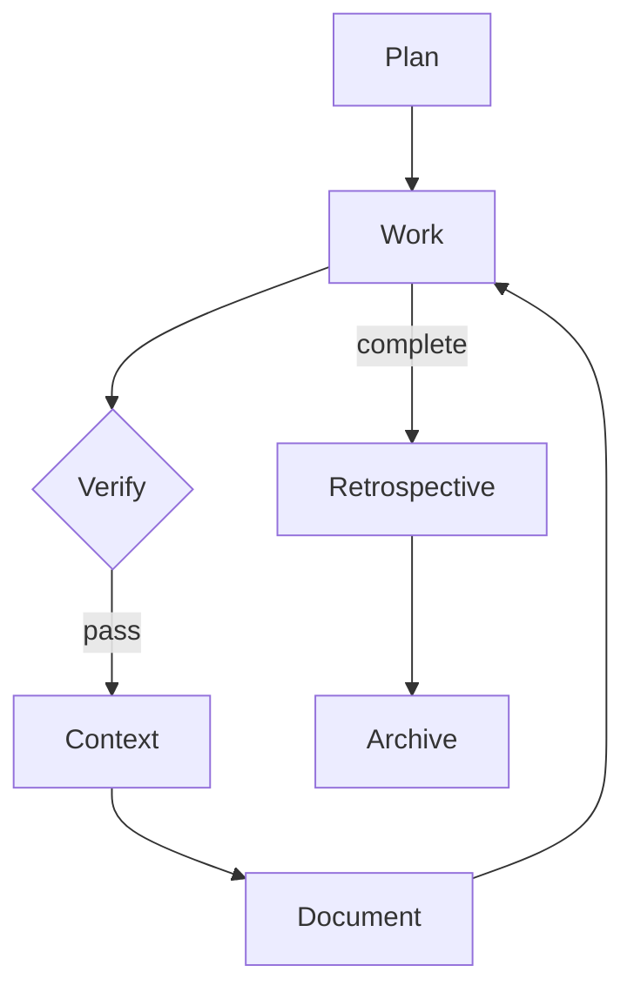

You know how to maintain documentation in this project.

## What Document Does

Document is a per-phase gate during impl execution, alongside verify and context. The full phase order is:

```
implement → verify → context → document → advance
```

After context items are done, the document gate asks one question:

**"Does this phase change something a user or developer needs to know?"**

To answer this accurately, **REQUIRED: call `query_dependencies`** on the key files changed in this phase. If the change affects files with many dependents, it likely needs documentation. If it's internal with no downstream consumers, it might not.

- If **yes**: write or update the relevant page in `apps/indusk-docs/src/`
- If **no**: skip — not every phase produces documentation. The gate asks the question but doesn't always produce output.

## Where Docs Live

Documentation lives in a VitePress site at `apps/indusk-docs/`:

```
apps/indusk-docs/src/
├── guide/           # How-to guides (task-oriented)
├── reference/       # Skills, tools, API, configuration (information-oriented)
│   ├── skills/      # One page per skill
│   └── tools/       # One page per tool (Biome, CGC, composable.env)
├── decisions/       # Distilled from ADRs during retrospective/archival
└── lessons/         # Distilled from retrospective insights during archival
```

### What Goes Where

| What changed | Where to document | Doc type |
|---|---|---|
| New feature or tool | `reference/` | Reference page |
| New workflow or process | `guide/` | How-to guide |
| Configuration change | `reference/` (update existing page) | Reference update |
| Architecture change | `reference/` + diagram | Reference + diagram |
| Nothing user-facing | Skip | — |

### Decisions and Lessons

The `decisions/` and `lessons/` directories are **not** populated during normal impl work. They are populated during the retrospective/archival process by the retrospective skill. Don't write to them during `/work`.

## Mermaid Diagrams

**Prefer diagrams over long prose for architecture, flows, and relationships.** A well-labeled diagram communicates structure faster than paragraphs of text.

### When to Use Which Diagram Type

| Scenario | Diagram Type | Example |
|----------|-------------|---------|
| System architecture, data flow | `flowchart` | How services connect |
| API calls, request/response sequences | `sequenceDiagram` | Auth flow between client and server |
| Code structure, class relationships | `classDiagram` | Package dependencies |
| Lifecycle, state machines | `stateDiagram-v2` | Plan lifecycle stages |
| Data models, entity relationships | `erDiagram` | Database schema |
| Timelines, project phases | `timeline` | Release milestones |

### Diagram Best Practices

- **One concept per diagram.** Don't cram the entire system into one chart. Break complex systems into focused diagrams.
- **Meaningful labels.** Use full words, not abbreviations. `Plan Skill` not `PS`.
- **Do not use custom `style`, `classDef`, or `themeVariables` in diagrams.** The docs site supports both light and dark mode. The vitepress-plugin-mermaid auto-switches between Mermaid's `default` (light) and `dark` themes. Hardcoded colors (fills, text colors, borders) that work in one mode will be unreadable in the other. Let the built-in theme handle all colors. If you need visual grouping, use `subgraph` blocks instead of color-coding.
- **Keep diagrams small enough to read inline** but detailed enough to be useful when expanded.

### Always Use FullscreenDiagram

Every Mermaid diagram in the docs **must** be wrapped in the `<FullscreenDiagram>` component. This provides expand-to-fullscreen with pan and zoom controls.

```markdown
<FullscreenDiagram>



</FullscreenDiagram>
```

**Never** use bare ` ```mermaid ` blocks without the wrapper. The diagrams are often too small to read inline, and the FullscreenDiagram gives users zoom and pan controls.

## Shaping Impl Documents

When writing an impl (via the plan skill), every phase should consider documentation:

```markdown
#### Phase N Document
- [ ] {Specific docs page to write or update}
```

The agent writing the impl must answer: **"What does a user or developer need to know about what this phase built?"** If the answer is "nothing user-facing" — no document items needed. Not every phase produces docs. But the question must be asked.

### Document Items Are Blocking

During execution (via the work skill), document items are checked off alongside implementation, verification, and context items. The per-phase completion order is:

```
implementation items → verification items → context items → document items → advance
```

A phase is not complete until its document items are done.

## LLM-Readable Companion Files

Every documentation page you create must have a corresponding **llms.txt** companion file. This makes the docs easy for AI agents to consume directly without HTML parsing.

### How It Works

For every page at `apps/indusk-docs/src/{path}.md`, create a matching file at `apps/indusk-docs/public/llms/{path}.txt`.

```
apps/indusk-docs/src/reference/skills/plan.md       → apps/indusk-docs/public/llms/reference/skills/plan.txt
apps/indusk-docs/src/guide/getting-started.md        → apps/indusk-docs/public/llms/guide/getting-started.txt
apps/indusk-docs/src/reference/tools/indusk-mcp.md   → apps/indusk-docs/public/llms/reference/tools/indusk-mcp.txt
```

### Content Rules

The llms.txt file should contain the **same content** as the markdown page, with these adjustments:

- Strip Mermaid diagram blocks and FullscreenDiagram wrappers (diagrams aren't useful as text)
- Keep all tables, code blocks, headings, and prose
- Keep all examples — these are the most valuable part for LLMs
- Add a header line: `# {Page Title} — LLM-readable version`
- Add a source line: `Source: {relative path to the .md file}`

### Why

When an external agent needs to understand this system, you can point it at `https://your-domain/llms/reference/skills/plan.txt` and it gets clean, structured text. No HTML parsing, no JavaScript rendering, no Mermaid SVGs to decode.

### Also Create an Index

Maintain `apps/indusk-docs/public/llms.txt` as a root index listing all available LLM-readable pages with their URLs and one-line descriptions. This follows the [llms.txt convention](https://llmstxt.org/).

## Running the Docs Site

```bash
# Local dev server
pnpm turbo dev --filter=indusk-docs

# Build static output
pnpm turbo build --filter=indusk-docs
```

## Important

- Documentation is human-facing. CLAUDE.md is agent-facing. They serve different audiences — don't duplicate between them.
- Link, don't duplicate. If something is fully documented in a skill file or ADR, link to the docs page for it rather than copying content.
- Keep reference pages focused and scannable. Use tables and diagrams over paragraphs.
- The `decisions/` and `lessons/` sections are populated during retrospective only, not during normal impl work.
